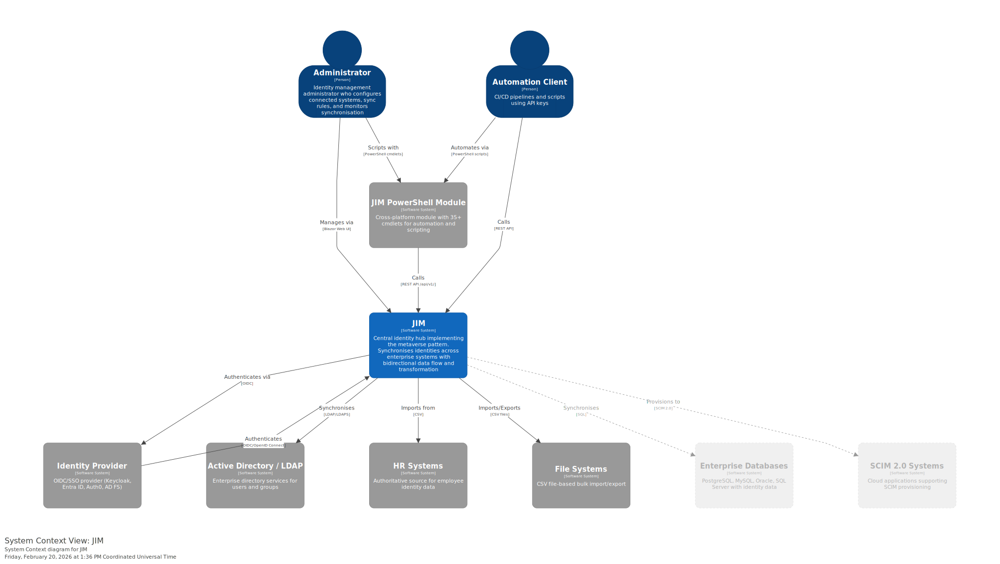
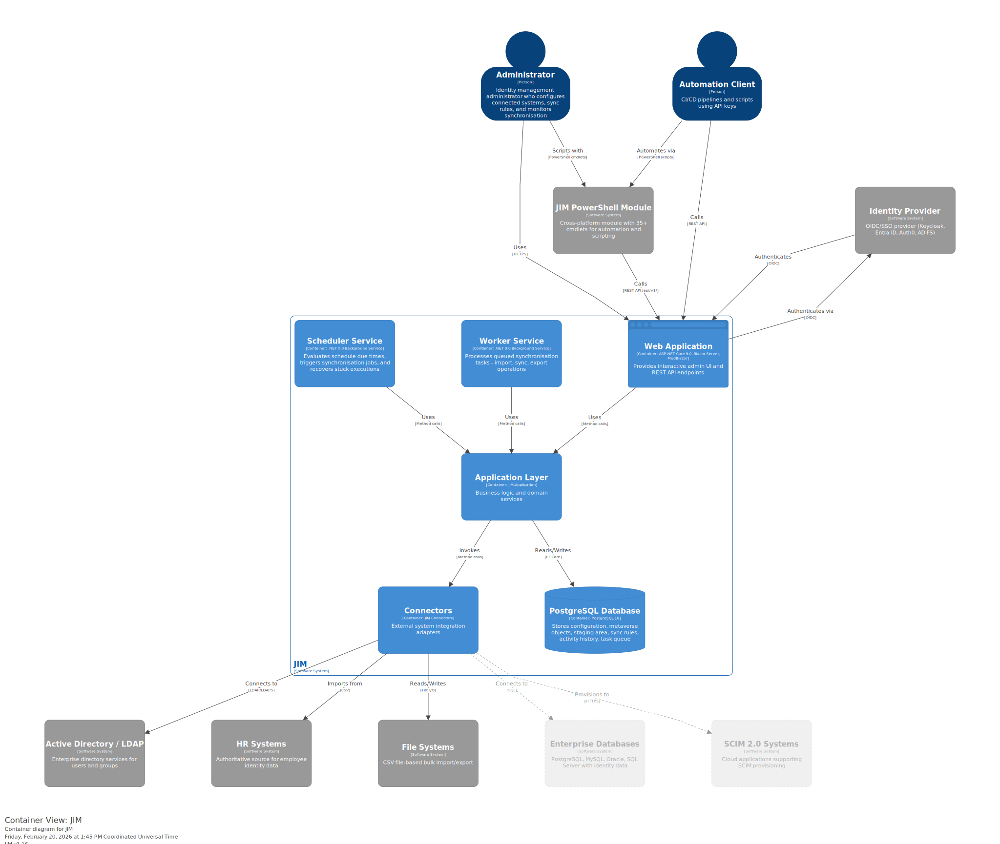

# Junctional Identity Manager (JIM)

[](https://github.com/TetronIO/JIM/actions/workflows/dotnet-build-and-test.yml)

JIM is a modern Identity Management system designed for organisations with non-trivial Identity Management and synchronisation requirements.
It's designed to be self-hosted, deployable on container platforms and is suitable for connected, or air-gapped networks. Features include:

- Synchronises objects between systems. Supports Users and Groups by default
- Supports custom object types, i.e. Departments, Qualifications, Courses, Licenses, Roles, Computers, etc.
- Transform data using a wide range of functions
- Extensible with custom functions
- Extensible with custom connectors (fully unit-testable)
- A modern Web Portal and API
- Single Sign-On (SSO) using OpenID Connect


## Scenarios
JIM is designed to support the following common Identity, Governance & Administration (IGA) scenarios:

- Automate JML by synchronising users from HR systems to directories, apps and systems
- Keep HR systems up to date by writing I.T related attributes back to HR systems, i.e. email address, telephone numbers, etc.
- Centrally manage user entitlements, i.e. group memberships in directories, apps and systems
- Facilitate domain consolidations, i.e. to prepare for migrating to the cloud, simplification, or for organisational mergers
- Facilitate domain migrations, i.e. divestitures
- Identity fusing - bring together user/entitlement data from various business apps and systems
## Benefits
Why choose JIM?

- It's modern. No legacy hosting requirements or janky old UIs
- Supports SSO to comply with modern security requirements
- Open Source. You can see exactly what it does and help improve it
- Flexible. We're developing it now, so you can suggest your must-have features
- Built by people with decades of experience of integrating IDAM systems into the real world
## Architecture
JIM is a container-based distributed application implementing the metaverse pattern for centralised identity governance.



**Components:**
- **JIM.Web** - A website with integrated REST API, built using [ASP.NET](https://asp.net/) Blazor Server. The API is available at `/api/` with Swagger documentation at `/api/swagger`.
- **JIM.Scheduler** - A console app, built using .NET
- **JIM.Worker** - A console app, built using .NET
- **JIM.PowerShell** - A PowerShell module for scripting and automation
- A database - PostgreSQL
- A database admin website - Adminer



For detailed architecture diagrams (Component level), see the [Architecture Diagrams](docs/diagrams/structurizr/README.md).

## Dependencies
- A container host, i.e. Docker
- An OpenID Connect (OIDC) identity provider, i.e. Entra ID, Keycloak, etc.

## Deployment
JIM runs in a Docker stack using containers and can be deployed to on-premises infrastructure or cloud container services. JIM is designed for air-gapped deployments - no internet connection is required.

**Database Options:**
- **Bundled PostgreSQL** - A PostgreSQL container is included for simple deployments. Start with `docker compose --profile with-db up -d`
- **External PostgreSQL** - Connect to your existing PostgreSQL server by configuring `JIM_DB_HOSTNAME` in `.env` and running `docker compose up -d` (without the profile)

Each release includes a downloadable bundle containing pre-built Docker images, compose files, the PowerShell module, and documentation. See [Release Process](docs/RELEASE_PROCESS.md) for details on air-gapped deployment.

## Connectors
JIM is currently targeting the following means of connecting to systems via it's built-in Connectors. More are anticipated, though people will also be able to develop their own custom Connectors for use with JIM to support bespoke scenarios.

- LDAP (incl. Active Directory & AD-LDS)
- Microsoft SQL Server Database
- PostgreSQL Database
- MySQL Database
- Oracle Database
- CSV/Text files
- PowerShell (Core)
- SCIM 2.0
- Web Services (REST APIs with OAuth2/API key authentication)

## Getting Started

JIM uses GitHub Codespaces to provide a fully configured development environment in the cloud with all dependencies pre-installed (.NET 9.0, Docker, PostgreSQL).

**Quick Start:**

1. Click the **Code** button on the GitHub repository
2. Select **Codespaces** > **Create codespace on main**
3. Wait for the environment to provision (includes automatic `.env` creation)
4. Update the `.env` file with your SSO settings (see below)
5. Use the pre-configured shell aliases:
   - `jim-db` - Start PostgreSQL database
   - `jim-web` - Run Web UI locally (press F5 in VS Code) - also serves the API at `/api/`
   - `jim-stack` - Start full Docker stack
   - `jim-migrate` - Apply database migrations

For local development instructions and advanced setup, see the [Developer Guide](docs/DEVELOPER_GUIDE.md).
   
### Setup SSO
JIM uses SSO to authenticate and authorise users. Create an OIDC SSO configuration in your IdP for JIM using the [Code Authorisation Grant](https://oauth.net/2/grant-types/authorization-code/) flow. Keep a note of the authority URL, client id and secret for use in the `.env` file below.

> **Note**: JIM uses PKCE for improved security. JIM is IDP-agnostic and works with any OIDC-compliant Identity Provider, including Microsoft Entra ID, Okta, Auth0, Keycloak, AD FS, and others.

For detailed step-by-step setup instructions, see the [SSO Setup Guide](docs/SSO_SETUP_GUIDE.md) which covers:
- Microsoft Entra ID (Azure AD)
- AD FS (Active Directory Federation Services)
- Keycloak

Currently there can only be a single administrator, the one you setup in your `.env` file below. Later releases will include a full RBAC model. All other users accessing JIM will be standard users with no privileges.

### `.env` Configuration Example:
Replace `<...>` elements with your real values. See `.env.example` for detailed documentation.

```
# Database
JIM_DB_NAME=jim
JIM_DB_USERNAME=jim
JIM_DB_PASSWORD=password
JIM_DB_LOG_SENSITIVE_INFO=true

# SSO/OIDC - works with any OIDC-compliant provider
JIM_SSO_AUTHORITY=<your IDP URL, e.g. https://login.microsoftonline.com/{tenant-id}/v2.0>
JIM_SSO_CLIENT_ID=<your client id>
JIM_SSO_SECRET=<your client secret>
JIM_SSO_API_SCOPE=<your API scope, e.g. api://{client-id}/access_as_user>

# User Identity Mapping
# JIM uses standard OIDC claims (sub, name, given_name, family_name, preferred_username)
JIM_SSO_CLAIM_TYPE=sub
JIM_SSO_MV_ATTRIBUTE=Subject Identifier
JIM_SSO_INITIAL_ADMIN=<your sub claim value>
```

**Finding Your `sub` Claim Value**:
1. Log into JIM with your admin account
2. Navigate to `/claims` to see your OIDC claims
3. Copy the value of the `sub` claim

The `sub` (subject identifier) claim is the standard OIDC claim for uniquely identifying users. It's guaranteed to be unique and stable per user per application across all OIDC-compliant providers.

## State of Development
JIM is approximately 88% complete towards MVP status with core identity synchronisation functionality complete. See [MVP Definition](docs/MVP_DEFINITION.md) for detailed progress tracking.

**Connectors (Complete):**
- **LDAP/Active Directory** - Full import and export, schema discovery, LDAPS support with certificate validation, auto-detection of default naming context
- **CSV Files** - Full import and export, configurable delimiters, timestamped outputs

**Import (Complete):**
- Full import from all connectors with object creation, update, and deletion detection
- Multi-valued attribute handling and all data types supported

**Inbound Synchronisation (Complete):**
- Join rules to match Connected System Objects to existing Metaverse Objects
- Projection to create new Metaverse Objects
- Attribute flow rules with multi-valued attribute support
- Metaverse Object lifecycle management with deletion rules and grace periods

**Outbound Synchronisation / Export (Complete):**
- Pending Export detection when Metaverse Objects change
- Export evaluation and execution via connectors
- Create, update, and delete operations in target systems
- Retry logic with exponential backoff
- Pending Export review UI with server-side sorting, filtering, and pagination

**Security (Complete):**
- SSO/OIDC authentication for Web UI
- JWT Bearer token authentication for API
- API Key authentication for automation and CI/CD
- Role-based authorisation (basic model)

**API (Complete):**
- Activity monitoring and run profile execution
- Connected Systems, Sync Rules, and Run Profiles CRUD
- Metaverse Object querying with filtering and pagination
- Data generation for testing
- Certificate management

**PowerShell Module (Complete):**
- 35 cmdlets covering all major JIM operations
- Connection management with API key support
- Full CRUD for Connected Systems, Sync Rules, Run Profiles
- Metaverse Object querying and inspection
- Run profile execution and activity monitoring
- Data generation for testing scenarios

**Web UI (Complete):**
- Operations view for manual run profile execution and task monitoring
- Activity history with server-side sorting, filtering, and pagination
- Connected Systems management and connector configuration
- Sync Rule configuration with attribute flow mapping
- Metaverse Object browsing and inspection
- Pending Export list and detail views
- Certificate management for secure connections

**Release & Deployment (Complete):**
- Automated release workflow with GitHub Actions
- Docker images published to GitHub Container Registry
- Air-gapped deployment bundles with SHA256 checksums
- PowerShell module auto-published to PSGallery

**In Progress:**
- Scheduler service for automated run profile execution (critical path for MVP)
- Full RBAC model with additional roles

> **Note:** Integration testing is currently underway. As a pre-MVP release, bugs may exist. Please report any issues on [GitHub](https://github.com/TetronIO/JIM/issues).

If you don't have any connected systems available, you can use the Example Data feature to populate JIM with sample users and groups for testing.

## Licensing
JIM uses a Source-Available model where it is free to use in non-production scenarios, but requires a commercial license for use in production scenarios. [Full details can be found here](https://tetron.io/jim/#licensing).

## More Information
Please go to [https://tetron.io/jim](https://tetron.io/jim) for more information.
