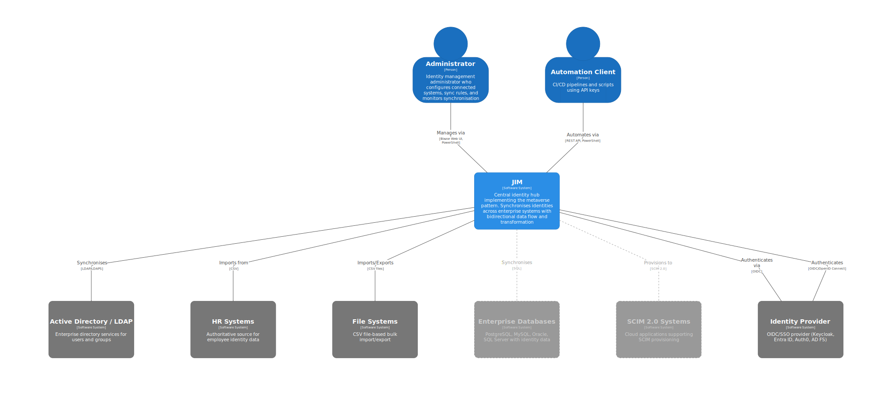
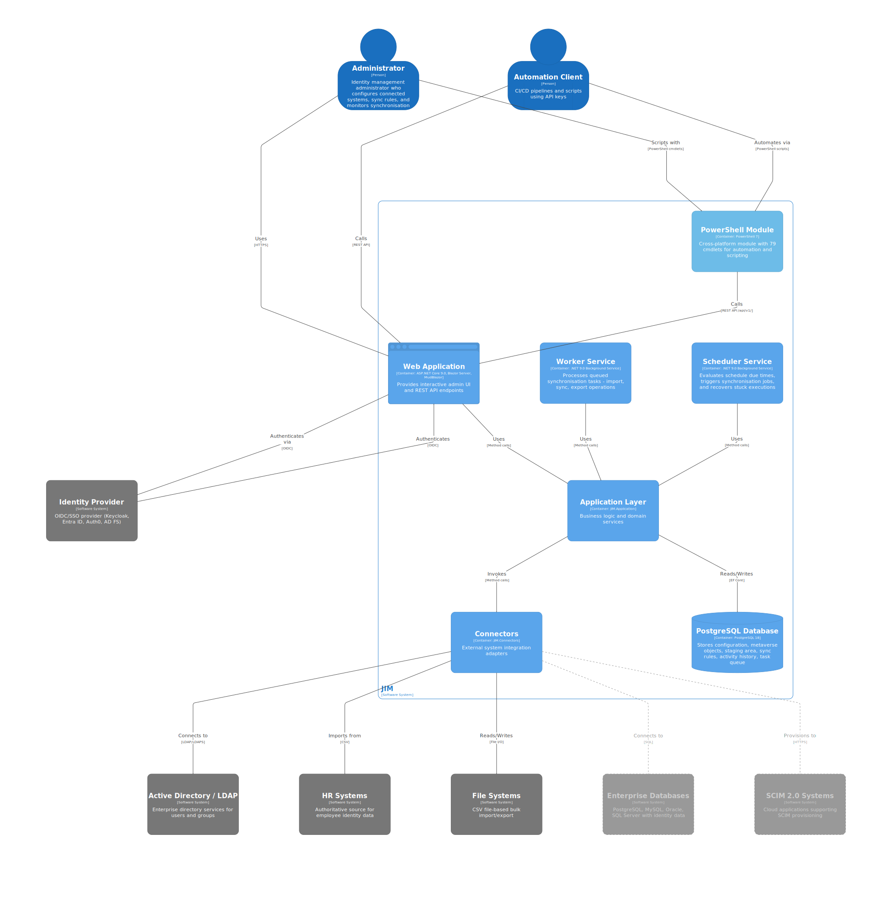

# Junctional Identity Manager (JIM)

  

&nbsp;

&nbsp;

&nbsp;

&nbsp;

&nbsp;

JIM is a modern Identity Management system designed for organisations with complex identity synchronisation requirements. It is self-hosted, container-deployable, and works in both connected and air-gapped networks. Features include:

- Hub-and-spoke architecture using a central metaverse for identity correlation
- Bidirectional synchronisation of Users, Groups, and custom object types (e.g., Departments, Roles, Computers)
- Transform data using expressions with built-in functions for common identity operations
- Extensible with custom connectors (fully unit-testable)
- Modern Web Portal and REST API with OpenAPI documentation
- Single Sign-On (SSO) using OpenID Connect

## Scenarios
JIM supports common Identity Governance & Administration (IGA) scenarios:

- **Joiner/Mover/Leaver (JML) Automation** - Synchronise users from HR systems to directories, applications, and downstream systems
- **Attribute Writeback** - Keep HR systems current by writing IT-managed attributes back (e.g., email addresses, phone numbers)
- **Entitlement Management** - Centrally manage group memberships across directories, applications, and systems
- **Domain Consolidation** - Prepare for cloud migration, simplification, or organisational mergers
- **Domain Migration** - Support divestitures and system decommissioning
- **Identity Correlation** - Bring together user and entitlement data from disparate business applications

## Benefits
Why choose JIM?

- **Modern Architecture** - Container-native design with no legacy infrastructure requirements
- **Secure by Default** - SSO via OpenID Connect, no shared service accounts needed
- **Air-Gapped Ready** - Fully functional without internet connectivity for sensitive environments
- **Source Available** - Transparent, auditable code you can inspect and verify
- **Actively Developed** - Built by identity management practitioners with decades of real-world experience

## Architecture
JIM is a container-based distributed application implementing the metaverse pattern for centralised identity governance.

<a href="docs/diagrams/images/dark/jim-structurizr-1-SystemContext.svg">
  <picture>
    <source media="(prefers-color-scheme: dark)" srcset="docs/diagrams/images/dark/jim-structurizr-1-SystemContext.svg">
    
  </picture>
</a>

**Components:**
- **JIM.Web** - A website with integrated REST API, built using [ASP.NET](https://asp.net/) Blazor Server. The API is available at `/api/` with Swagger documentation at `/api/swagger`.
- **JIM.Scheduler** - A background service that triggers synchronisation runs using cron or interval-based schedules, with multi-step sequential and parallel execution
- **JIM.Worker** - A background service that processes import, sync, and export tasks with crash recovery and parallel execution support
- **JIM.PowerShell** - A cross-platform PowerShell module (Windows, macOS, Linux) for full configuration and automation of JIM, enabling Identity as Code (IDaC)
- A database - PostgreSQL

<a href="docs/diagrams/images/dark/jim-structurizr-1-Containers.svg">
  <picture>
    <source media="(prefers-color-scheme: dark)" srcset="docs/diagrams/images/dark/jim-structurizr-1-Containers.svg">
    
  </picture>
</a>

For detailed architecture diagrams (Component level), see the [Architecture Diagrams](docs/diagrams/structurizr/README.md).

## Dependencies
- A container host, i.e. Docker
- An OpenID Connect (OIDC) identity provider, i.e. Entra ID, Keycloak, etc.

## Deployment
JIM runs in a Docker stack using containers and can be deployed to on-premises infrastructure or cloud container services. JIM is designed for air-gapped deployments - no internet connection is required.

**Database Options:**
- **Bundled PostgreSQL** - A PostgreSQL container is included for simple deployments. Start with `docker compose --profile with-db up -d`
- **External PostgreSQL** - Connect to your existing PostgreSQL server by configuring `JIM_DB_HOSTNAME` in `.env` and running `docker compose up -d` (without the profile)

Each release includes a downloadable bundle containing pre-built Docker images, compose files, the PowerShell module, and documentation. See [Release Process](docs/RELEASE_PROCESS.md) for details on air-gapped deployment.

## Connectors

**Available Now:**
- LDAP (incl. Active Directory, AD-LDS & Samba AD)
- CSV/Text files

**Planned:**
- Microsoft SQL Server Database
- PostgreSQL Database
- MySQL Database
- Oracle Database
- PowerShell (Core)
- SCIM 2.0
- Web Services (REST APIs with OAuth2/API key authentication)

Custom connectors can be developed for bespoke scenarios.

## Authentication
JIM uses OpenID Connect (OIDC) for Single Sign-On authentication. It is IdP-agnostic and works with any OIDC-compliant Identity Provider, including Microsoft Entra ID, Okta, Auth0, Keycloak, and AD FS. PKCE is used for enhanced security.

For API access, JIM supports both JWT Bearer tokens and API keys for automation and CI/CD scenarios.

## Getting Started
For development setup using GitHub Codespaces or local installation, see the [Developer Guide](docs/DEVELOPER_GUIDE.md).

For SSO configuration with your Identity Provider, see the [SSO Setup Guide](docs/SSO_SETUP_GUIDE.md).

If you don't have any connected systems available, you can use the Example Data feature to populate JIM with sample users and groups for testing.

## State of Development
JIM has reached MVP completion (100%). The core identity lifecycle is fully functional:

- **Import** identities from source systems (LDAP, CSV)
- **Sync** to reconcile identities in the central metaverse
- **Export** changes to target systems with pending export management
- **Schedule** automated synchronisation using cron or interval-based triggers

For detailed feature checklists and post-MVP roadmap, see the [MVP Definition](docs/MVP_DEFINITION.md).

## Licensing
JIM uses a Source-Available model where it is free to use in non-production scenarios, but requires a commercial license for use in production scenarios. [Full details can be found here](https://tetron.io/jim/#licensing).

## More Information
Please go to [https://tetron.io/jim](https://tetron.io/jim) for more information.
