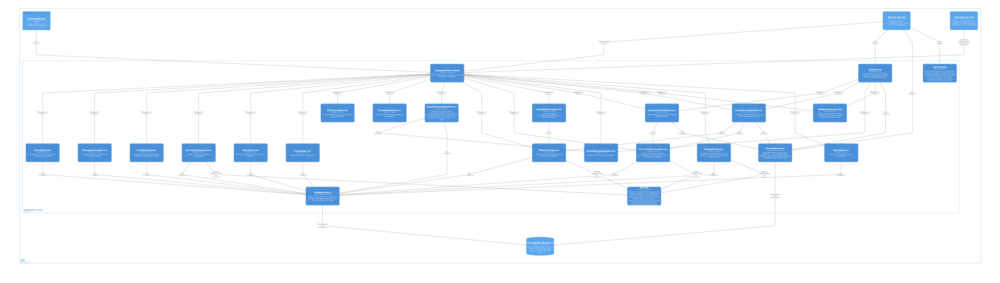

# Architecture

JIM is built around the **metaverse pattern** -- a hub-and-spoke architecture where all identity data flows through a central authoritative repository. This page describes the pattern, the system components, and the layered software architecture.

## The Metaverse Pattern

At the heart of JIM is the **metaverse**: a centralised repository of identity objects. Rather than synchronising data directly between connected systems, every change flows through the metaverse. This provides:

- **Single source of truth** -- one authoritative record for each identity, assembled from multiple sources
- **Centralised governance** -- all data transformations, scoping decisions, and lifecycle rules are applied in one place
- **Decoupled systems** -- connected systems do not need to know about each other; they only interact with the metaverse
- **Auditability** -- every change is tracked as it passes through the hub

```
+-------------------+       +----------------+       +-------------------+
|   Source Systems   | ----> |   Metaverse    | ----> |  Target Systems   |
|                    |       |                |       |                   |
|  - HR Database     |       |  - Identity    |       |  - Active Dir.    |
|  - Badge System    |       |    Objects     |       |  - Email System   |
+-------------------+       +----------------+       +-------------------+
         |                          |                          |
         v                          v                          v
       IMPORT                      SYNC                      EXPORT
```

**Key principle**: All identity data flows through the metaverse. JIM never synchronises directly between connected systems.

## System Context

The following diagram shows JIM in the context of the systems and users it interacts with:


## Containers

JIM is deployed as a set of Docker containers, each with a distinct responsibility:


### JIM.Web

The web application provides both the **administrative user interface** (built with Blazor Server and MudBlazor) and the **REST API** (at `/api/`). Administrators use the UI to configure connected systems, define sync rules, monitor operations, and browse identity data. The API enables automation and integration with external tools.

### JIM.Worker

The background processor that executes all identity operations -- imports, synchronisation, and exports. When an operation is triggered (manually, via the API, or by the scheduler), the Worker picks it up and processes it asynchronously. It handles batch processing, error reporting, and activity logging.

### JIM.Scheduler

A lightweight scheduling service that triggers operations on a cron or interval basis. Schedules can include multiple steps (e.g., import from HR, synchronise, export to Active Directory) that execute in sequence. The Scheduler submits work to the Worker for processing.

### JIM.PowerShell

A PowerShell module for automation and scripting. It wraps the REST API and provides cmdlets for querying, configuring, and executing operations. Supports both interactive (browser-based SSO) and non-interactive (API key) authentication.

### PostgreSQL Database

JIM uses PostgreSQL as its sole data store. The database holds all configuration, identity data (metaverse objects, connected system objects), sync rules, activity history, and credentials (encrypted at rest with AES-256-GCM).

## Layered Architecture

JIM follows a strict layered architecture. Each layer depends only on the layer directly below it -- higher layers never bypass intermediate layers.

```
+------------------------------------------+
|  Presentation: JIM.Web (Blazor + API)    |
+------------------------------------------+
|  Application: JIM.Application (Servers)  |
+------------------------------------------+
|  Domain: JIM.Models (Entities, DTOs)     |
+------------------------------------------+
|  Data: JIM.PostgresData (EF Core)        |
+------------------------------------------+
|  Integration: JIM.Connectors             |
+------------------------------------------+
```

### Presentation Layer

**JIM.Web** -- the Blazor Server UI and REST API controllers. This layer handles user interaction, request validation, and response formatting. It calls into the Application layer for all business logic.

### Application Layer

**JIM.Application** -- contains the core business logic ("Servers") that orchestrate operations. This includes the sync engine, import/export processing, run profile execution, and all domain workflows. The UI and API never access the database directly; they always go through the Application layer.



### Domain Layer

**JIM.Models** -- defines the domain entities (MetaverseObject, ConnectedSystemObject, SyncRule, etc.), DTOs, and enumerations. This layer has no dependencies on infrastructure or data access.

### Data Layer

**JIM.PostgresData** -- implements the repository interfaces using Entity Framework Core with PostgreSQL. Handles all database interactions, migrations, and query optimisation.

### Integration Layer

**JIM.Connectors** -- contains the connector implementations that communicate with external systems (LDAP directories, file systems, etc.). Each connector implements standardised interfaces for import and export operations.

## Deployment

JIM is deployed as Docker containers and is designed to work in **air-gapped environments** with no internet connectivity. There are no cloud service dependencies -- all features work with on-premises infrastructure only.

A typical deployment consists of:

- **JIM.Web** container (UI and API)
- **JIM.Worker** container (background processing)
- **JIM.Scheduler** container (scheduled operations)
- **PostgreSQL** container (database)
- An **OIDC identity provider** for authentication (e.g., Keycloak, or any OIDC-compliant provider)
