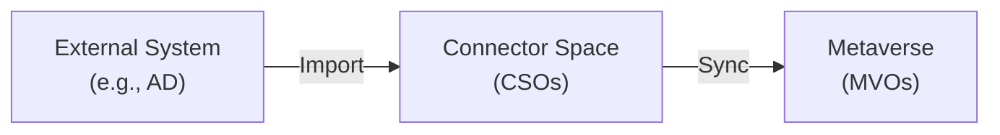

# Connected Systems

A **connected system** is any external directory, database, or file that JIM synchronises identity data with. Connected systems are the endpoints of the hub-and-spoke architecture -- they provide source data (e.g., an HR system) and receive provisioned data (e.g., Active Directory).

## What is a Connected System?

A connected system in JIM represents the configuration and state for a single external data source or target. It includes:

- **Connection details** -- how to reach the external system (server address, credentials, file path, etc.)
- **Schema** -- the object types and attributes available in the external system
- **Connector space** -- a staging area that holds a local copy of the external system's data
- **Run profiles** -- configured operations (import, export) that can be executed against the system
- **Synchronisation rules** -- the rules that govern how data flows between this system and the metaverse

## Connector Space

The **connector space** is a critical concept in JIM's architecture. It acts as a staging area between the external system and the metaverse.

When JIM imports data from a connected system, it does not write directly to the metaverse. Instead, it creates or updates **Connected System Objects (CSOs)** in the connector space. These CSOs are local representations of the objects in the external system.

This two-stage approach provides several benefits:

- **Isolation** -- problems during import do not corrupt the metaverse
- **Visibility** -- administrators can inspect imported data before synchronisation
- **Comparison** -- JIM can detect what has changed between imports
- **Rollback potential** -- the metaverse is only updated during the explicit sync phase

### Connected System Objects (CSOs)

A **CSO** is JIM's local representation of an object in an external system. Each CSO holds:

- **Distinguished name or anchor** -- a unique identifier that maps to the external object
- **Attributes** -- the attribute values as imported from the external system
- **Link to metaverse** -- if the CSO has been joined or projected, it links to a MetaverseObject (MVO)
- **Pending exports** -- changes queued to be sent back to the external system

CSOs have a lifecycle:

1. **Created** during import when a new object is discovered in the external system
2. **Updated** during subsequent imports when attribute values change
3. **Joined** or **projected** during synchronisation to link with an MVO
4. **Obsoleted** when the object no longer exists in the external system

## Partitions

A **partition** is a top-level logical division of a connector space that mirrors a boundary defined by the external system. Partitions exist in JIM primarily to service **LDAP directories** and their **naming contexts** (NCs): the discrete directory trees that an LDAP server hosts. For example, the separate domain partitions within an Active Directory forest, or the distinct naming contexts exposed by an OpenLDAP server, each surface as a partition in JIM.

Most connected systems do not support partitions. A flat file, a SQL table, or a SCIM endpoint has no concept of multiple naming contexts, so its connector space has no partitions. Partitions are primarily a feature of LDAP-style directory connectors, where the directory itself is divided into separate trees.

Where they do apply, partitions let JIM scope imports, exports, and synchronisation rules to a specific naming context. Multi-domain directories are a common example; each partition can be targeted by its own run profile or synchronisation rules.

!!! note "Partitions and OUs are different concepts"
    Partitions and organisational units (OUs) are distinct. A partition is a top-level boundary on the external system; an OU is a sub-tree *within* a partition and is modelled in JIM as a [container](#containers).

### Containers

Inside a partition, or directly inside the connector space of a connector that does not support partitions, you can have **containers**. Containers are a separate, lower-order logical construct that sits beneath partitions. They exist mainly to support LDAP **organisational units (OUs)** and similar hierarchical groupings.

Containers are what you use to narrow imports and exports to a subset of data. For example, you might configure JIM to import only from `OU=Users,DC=company,DC=local` rather than the entire domain partition.

### Partitions vs. containers at a glance

| Construct | Scope | Example | Available on |
|-----------|-------|---------|--------------|
| **Partition** | Top-level boundary defined by the external system; discovered, not invented, by JIM | An Active Directory domain naming context (`DC=company,DC=local`) | LDAP-style connectors only |
| **Container** | Sub-tree within a partition, or within the connector space of a non-partitioned system | An OU (`OU=Users,DC=company,DC=local`) | Most connectors that expose hierarchy |

In practice, selecting a partition brings an entire naming context into scope, while selecting containers narrows what is imported within that partition (or within the connector space for connectors that have no partitions).

## Available Connectors

JIM ships with the following connectors:

### JIM File Connector

The File Connector imports from and exports to **CSV and delimited text files**. It supports:

- Configurable delimiters (comma, tab, pipe, semicolon, or custom)
- Header row detection
- Auto-confirm export (changes are written directly to the output file)
- Suitable for integrating with systems that produce flat-file extracts (HR exports, batch feeds, etc.)

### JIM LDAP Connector

The LDAP Connector is a single, unified connector for **LDAP-compliant directories**. Supported directory servers include:

- **Microsoft Active Directory**
- **Samba AD**
- **OpenLDAP**
- **389 Directory Server** and other RFC 4512-compliant directories

The connector adapts its behaviour to the target directory type (for example, using Active Directory-specific features where available, or RFC-standard behaviour for generic directories). Key capabilities:

- Full and delta import
- Full export (create, update, delete)
- SSL/TLS and StartTLS support
- Partition and container discovery
- Container creation during provisioning
- Schema discovery for **both structural and auxiliary object classes**, so objects whose primary class is auxiliary are first-class citizens
- Parallel imports for large directories
- Delta import via the accesslog overlay (OpenLDAP and compatible directories)
- Active Directory-specific features (`userAccountControl`, FILETIME dates, etc.)

!!! tip "Auxiliary classes are fully supported"
    Some traditional ILM solutions only discover **structural** object classes, which forces customers whose directories rely on **auxiliary** classes as primary classes to build and maintain their own connectors at significant cost. JIM handles this out of the box: enable **Include Auxiliary Classes** on the LDAP connector and auxiliary classes, along with any attributes they contribute, are brought into schema discovery alongside structural classes.

## Planned Connectors

The connector framework is extensible, and additional connectors are planned for future releases:

| Connector | Description |
|-----------|-------------|
| **SCIM 2.0** | Standard protocol for cross-domain identity management |
| **SQL** | Database connector for SQL Server, PostgreSQL, MySQL, and Oracle |
| **PowerShell** | Custom script-based connector for bespoke integrations |
| **Web Services / REST** | Generic REST API connector with OAuth2 and API key authentication |

See the [GitHub Milestones](https://github.com/TetronIO/JIM/milestones) for the current roadmap and planned delivery timelines.
