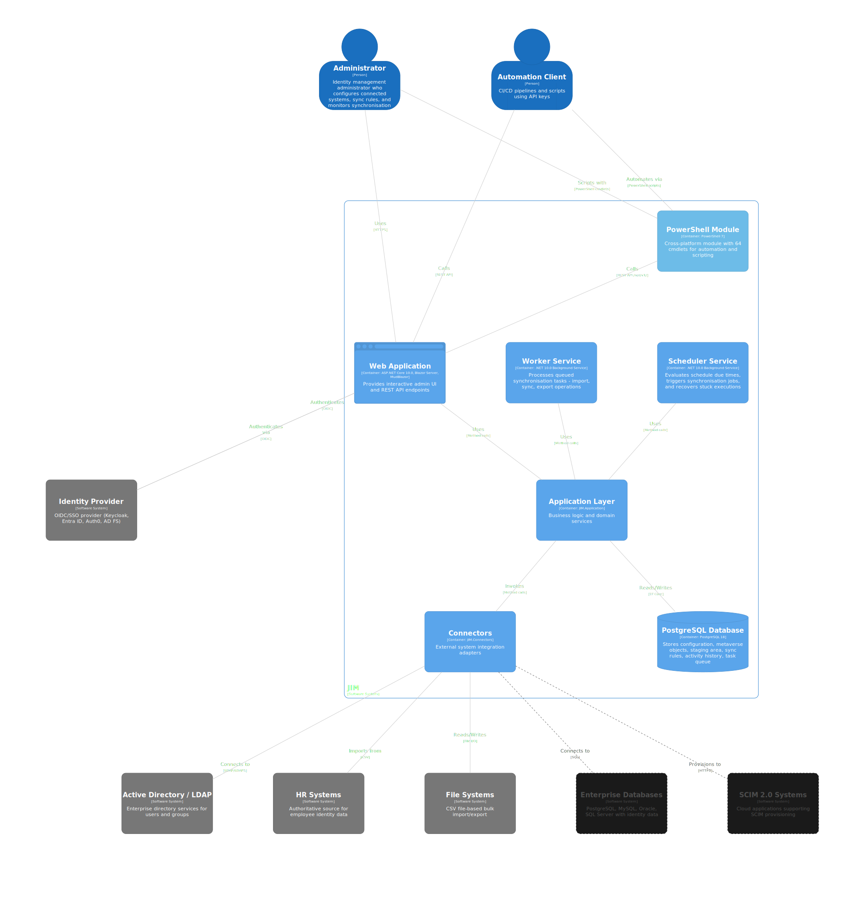

# Core Concepts

JIM (Junctional Identity Manager) is a self-hosted identity lifecycle management platform that synchronises identity data between connected systems through a centralised metaverse hub. This section introduces the foundational concepts you need to understand how JIM works.

## 🏗️ Architecture

JIM follows a hub-and-spoke **metaverse pattern** where all identity data flows through a central authoritative repository. No data moves directly between connected systems -- every change passes through the metaverse, giving you a single point of governance and control. Learn about JIM's components, layers, and deployment model in the [Architecture](architecture.md) guide.

## 🔌 Connected Systems

A **connected system** represents any external directory, database, or file that JIM synchronises with. Each connected system has a connector space that stages data before it enters the metaverse. Read about connectors, connector spaces, and partitions in [Connected Systems](connected-systems.md).

## ⚙️ Sync Pipeline

JIM processes identity data in three distinct phases: **Import**, **Sync**, and **Export**. This pipeline ensures data is validated, transformed, and reconciled at each stage before reaching its destination. The [Sync Pipeline](sync-pipeline.md) page explains each phase in detail.

## 📋 Sync Rules

**Sync rules** define the relationship between connected systems and the metaverse. They control which objects are in scope, how objects are matched (joined), when new metaverse objects are created (projected), and how attributes flow between systems. See [Sync Rules](sync-rules.md) for the full breakdown.

## 🔄 JML Lifecycle

The **Joiner/Mover/Leaver** lifecycle is the core automation model for identity management. JIM handles new starters, role changes, and leavers through configurable rules that provision, update, and deprovision accounts across your estate. The [JML Lifecycle](jml-lifecycle.md) page covers each phase.

## 🧮 Expressions

JIM includes a built-in **expression language** for transforming and mapping identity attributes. Expressions let you build email addresses, control account states, handle missing values, and much more -- all without writing code. See the [Expression Language Guide](expressions.md) for syntax, functions, and examples.
