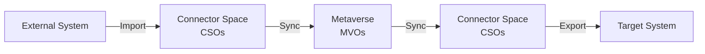
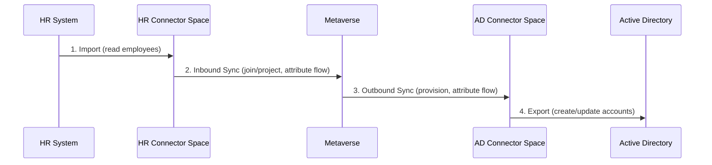

# Sync Pipeline

JIM processes identity data in a three-phase pipeline: **Import**, **Sync**, and **Export**. Each phase has a distinct responsibility, and data must pass through them in order. This separation ensures that data is validated, transformed, and reconciled at each stage before reaching its destination.

## Phase 1: Import

Import pulls data from a connected system into JIM's **connector space**. The result is a set of Connected System Objects (CSOs) that represent the current state of the external system.

### Full Import

A **full import** reads every object from the connected system and compares it against the existing connector space. JIM determines which objects are new, which have changed, and which have been deleted (obsoleted).

Full imports are used for:

- Initial setup of a connected system
- Periodic reconciliation to ensure the connector space is accurate
- Recovery after errors or data issues

### Delta Import

A **delta import** reads only the objects that have changed since the last import. This is significantly faster than a full import for large directories, but requires the connected system to support change tracking.

For example, the OpenLDAP connector supports delta imports via the accesslog overlay, which records changes to the directory.

### What Happens During Import

1. JIM connects to the external system using the configured connector
2. Objects are read (all objects for full import, changed objects for delta import)
3. For each imported object, JIM either:
   - **Creates** a new CSO if the object is not already in the connector space
   - **Updates** the existing CSO if the object has changed
   - **Obsoletes** the CSO if the object no longer exists in the source (full import only)
4. Import statistics are recorded in the activity log (objects added, updated, obsoleted, unchanged)

Import does **not** modify the metaverse. The connector space acts as a staging area, isolating the metaverse from any issues during import.

## Phase 2: Sync (Synchronisation)

Sync is the core phase where JIM reconciles connector space data with the metaverse. It applies **sync rules** to determine how CSOs relate to MetaverseObjects (MVOs) and how attributes flow between them.

### Inbound Sync (Source to Metaverse)

Inbound sync processes CSOs from source systems and updates the metaverse. For each CSO in scope:

1. **Scoping** -- JIM evaluates the sync rule's scoping filter to determine whether this CSO should be processed. Objects that fall out of scope are disconnected from the metaverse.

2. **Join resolution** -- JIM checks the sync rule's join rules to find a matching MVO. Join rules define how to correlate a CSO with an existing metaverse object (e.g., match on employee ID, email address, or a combination of attributes).

3. **Projection** -- If no matching MVO is found and the sync rule allows projection, JIM creates a new MVO. The projected MVO is linked to the CSO.

4. **Attribute flow** -- Once a CSO is joined or projected to an MVO, JIM applies the attribute flow rules. Inbound attribute flows copy values from the CSO to the MVO, optionally transforming them using [expressions](expressions.md).

### Outbound Sync (Metaverse to Target)

Outbound sync evaluates MVOs against outbound sync rules and determines what changes need to be exported to target systems. For each MVO in scope:

1. **Scoping** -- JIM evaluates which MVOs are in scope for the outbound sync rule.

2. **Provisioning** -- If an MVO is in scope but does not have a corresponding CSO in the target connected system, JIM provisions (creates) a new CSO.

3. **Attribute flow** -- Outbound attribute flows copy values from the MVO to the CSO, optionally transforming them using expressions.

4. **Pending exports** -- Changes to CSOs are recorded as **pending exports** rather than being sent to the target system immediately. This allows administrators to review queued changes before they are applied.

### Full Sync vs Delta Sync

- **Full Sync** re-evaluates every CSO against the sync rules. Use this after changing sync rule configuration or for periodic reconciliation.
- **Delta Sync** processes only CSOs that have changed since the last sync. This is faster and is the normal operational mode.

## Phase 3: Export

Export sends pending changes from the connector space to the target connected system. Each pending export represents a create, update, or delete operation.

### What Happens During Export

1. JIM reads the pending exports for the connected system
2. For each pending export, the connector sends the change to the external system
3. Successful exports are confirmed and the pending export is cleared
4. Failed exports are logged with error details for troubleshooting
5. Export statistics are recorded in the activity log

### Batching and Parallelism

For performance, exports can be processed in batches. Connectors that support parallel export can process multiple batches concurrently. LDAP connectors additionally support configurable export concurrency for asynchronous LDAP operation pipelining.

### Pre-Export Reconciliation

JIM performs intelligent reconciliation before export. For example, if an object is created and then deleted before the export runs, the redundant pending exports are automatically cancelled -- avoiding unnecessary operations on the target system.

## Putting It Together

A typical synchronisation cycle follows this pattern:

1. **Import** from the HR system brings employee records into the HR connector space
2. **Inbound sync** joins or projects those records to metaverse objects and flows attributes inward
3. **Outbound sync** evaluates the metaverse objects against Active Directory sync rules and creates pending exports
4. **Export** sends the pending changes to Active Directory (creating accounts, updating attributes, etc.)

This cycle can be automated using the **Scheduler** service, which supports cron expressions and interval-based triggers with multi-step execution.

## Run Profiles

Each phase is executed through a **run profile** -- a configured operation on a connected system. Common run profiles include:

| Run Profile | Phase | Description |
|-------------|-------|-------------|
| Full Import | Import | Read all objects from the connected system |
| Delta Import | Import | Read only changed objects |
| Full Sync | Sync | Re-evaluate all objects against sync rules |
| Delta Sync | Sync | Process only changed objects |
| Export | Export | Send pending changes to the connected system |

Run profiles can be executed manually from the UI, triggered via the API, invoked from PowerShell, or scheduled to run automatically.
