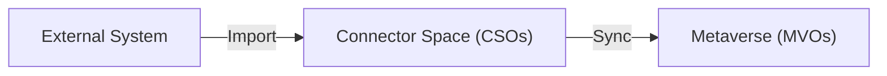

# Connected Systems

A **connected system** is any external directory, database, or file that JIM synchronises identity data with. Connected systems are the endpoints of JIM's hub-and-spoke architecture: they provide source data (e.g. an HR system) and receive provisioned data (e.g. an LDAP directory).

Every connected system is associated with a [connector](../connectors/index.md) that knows how to talk to its kind of external store, and holds a connector space of imported objects, a discovered schema, and (where applicable) a partition and container hierarchy.

## What a connected system contains

- **Connection details**  How to reach the external system: server address, credentials, file path, and other connector-specific settings.
- **Discovered schema**  The object types and attributes available in the external system, populated on first contact.
- **Connector space**  A staging area that holds JIM's local copy of the external system's data.
- **Run profiles**  Configured operations (import, sync, export) that can be executed against the system.
- **Synchronisation rules**  The rules that govern how data flows between this system and the metaverse.

## The connector space

The connector space is a critical concept. It is a staging area between the external system and the metaverse: when JIM imports data from a connected system, it does not write directly to the metaverse. Instead, it creates or updates **Connected System Objects (CSOs)** in the connector space; the metaverse is only updated during the explicit synchronisation phase.

This two-stage approach gives you:

- **Isolation**  Problems during import do not corrupt the metaverse.
- **Visibility**  Administrators can inspect imported data before it affects identities.
- **Comparison**  JIM can detect what has changed between imports.
- **Rollback potential**  The metaverse is only updated in the sync phase.

### Connected System Objects (CSOs)

A **CSO** is JIM's local representation of an object in an external system. Each CSO holds:

- **Distinguished name or anchor**  A unique identifier that maps to the external object.
- **Attributes**  The attribute values as imported from the external system.
- **Link to metaverse**  If the CSO has been joined or projected, it links to a Metaverse Object (MVO).
- **Pending exports**  Changes queued to be sent back to the external system.

CSOs have a lifecycle:

1. **Created** during import when a new object is discovered in the external system
2. **Updated** during subsequent imports when attribute values change
3. **Joined** or **projected** during synchronisation, to link with an MVO
4. **Obsoleted** when the object no longer exists in the external system

## Partitions and containers

A **partition** is a top-level logical division of a connector space that mirrors a boundary defined by the external system. Partitions exist in JIM primarily to service LDAP-style directories and their naming contexts (NCs): the discrete directory trees that an LDAP server hosts. The separate domain partitions within an Active Directory forest, or the distinct naming contexts exposed by an OpenLDAP server, each surface as a partition in JIM.

Most connected systems do not support partitions. A flat file, a SQL table, or a SCIM endpoint has no concept of multiple naming contexts, so its connector space has no partitions.

Inside a partition, or directly inside the connector space of a connector that does not support partitions, you can have **containers**. Containers are a separate, lower-order logical construct that sits beneath partitions; they exist mainly to support LDAP organisational units (OUs) and similar hierarchical groupings. Containers can be nested arbitrarily deep, and JIM loads the full hierarchy so administrators can select nested containers (for example `OU=Contractors,OU=Users,DC=company,DC=local`) for import or export.

!!! note "Partitions and OUs are different concepts"
    Partitions and organisational units (OUs) are distinct. A partition is a top-level boundary on the external system; an OU is a sub-tree within a partition and is modelled in JIM as a container.

| Construct | Scope | Example | Available on |
|-----------|-------|---------|--------------|
| **Partition** | Top-level boundary defined by the external system; discovered, not invented, by JIM | An Active Directory domain naming context (`DC=company,DC=local`) | LDAP-style connectors only |
| **Container** | Sub-tree within a partition, or within the connector space of a non-partitioned system | An OU (`OU=Users,DC=company,DC=local`) | Most connectors that expose hierarchy |

In practice, selecting a partition brings an entire naming context into scope, while selecting containers narrows what is imported within that partition (or within the connector space for connectors that have no partitions).

## Pending exports

Changes destined for the connected system that have been computed by synchronisation but not yet written back. Run an export run profile to flush them. Inspecting pending exports is the right place to look when you want to know "what is JIM about to change in this system?"

## Common workflows

**Setting up a new connected system:**

1. Choose the connector type (the connector defines how JIM talks to the external store)
2. Create the connected system with the chosen connector
3. Configure connector settings (credentials, base DN, file paths, etc.)
4. Import the schema to discover object types and attributes
5. Select the object types and attributes you care about
6. Configure partitions and containers if the connector exposes hierarchy
7. Create [run profiles](run-profiles.md) for import, sync, and export operations
8. Add [synchronisation rules](synchronisation-rules.md) to define how data flows between this system and the metaverse

**Removing a connected system:**

1. Run a deletion preview to understand the impact (which metaverse objects become disconnected, which sync rules become invalid)
2. Delete the connected system. The operation is asynchronous and runs as a background activity.

## Manage Connected Systems

- **JIM portal**  Connected Systems area of the admin UI
- **PowerShell**  [Connected Systems cmdlets](../powershell/connected-systems.md) (`Get-JIMConnectedSystem`, `New-JIMConnectedSystem`, `Set-JIMConnectedSystem`, etc.)
- **REST API**  Connected Systems endpoints in the [interactive API reference](../api/index.md)

## See also

- [Connectors](../connectors/index.md) -- the connector types JIM ships with, and what each one does
- [Concepts: Architecture](../concepts/architecture.md) -- how connected systems fit into JIM's hub-and-spoke model
- [Run Profiles](run-profiles.md) -- the operations executed against a connected system
- [Synchronisation Rules](synchronisation-rules.md) -- how data flows between a connected system and the metaverse
