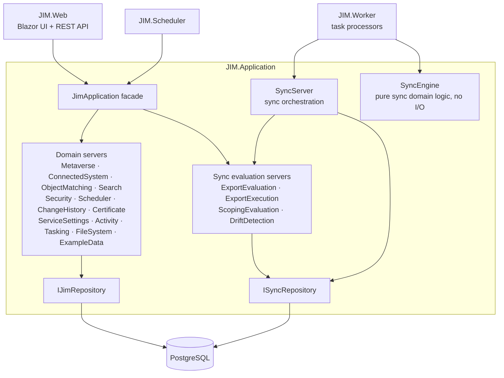
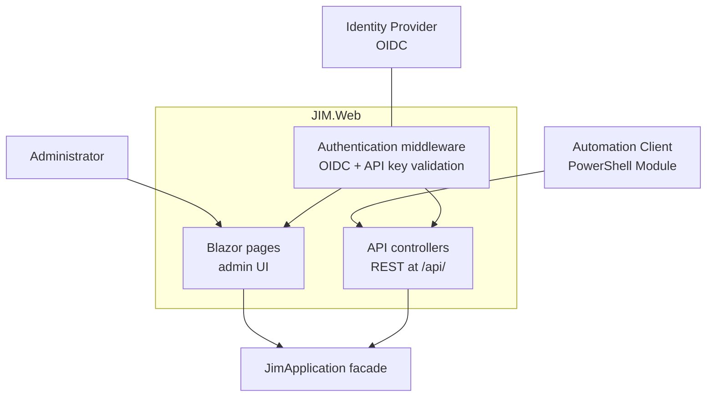
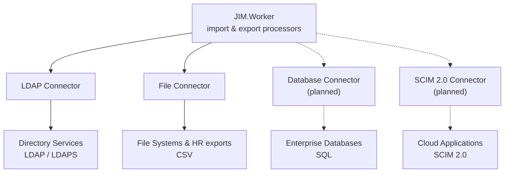
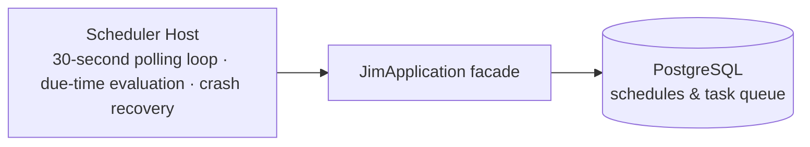

# Architecture

JIM implements an enterprise identity management system using the metaverse pattern. This page describes the layered architecture, the metaverse model, the service topology, and the key design decisions.

## System Context

--8<-- "assets/diagrams/system-context.svg"

<p class="jim-diagram-caption">Administrators and automation clients work through JIM's UI and API; JIM synchronises with the surrounding systems. Dashed elements indicate planned connectivity.<span class="jimdg-caption-motion"> Moving dots trace identity data in flight.</span></p>

## Layered Architecture

JIM follows a strict N-tier layered architecture. Upper layers depend on lower layers, never the reverse.

| Layer | Project | Responsibility |
|-------|---------|---------------|
| **Presentation** | `JIM.Web` | Blazor Server UI with integrated REST API at `/api/` |
| **Application** | `JIM.Application` | Business logic, domain servers, `JimApplication` facade |
| **Domain** | `JIM.Models` | Entities, DTOs, interfaces |
| **Data** | `JIM.Data` / `JIM.PostgresData` | Data access abstractions and PostgreSQL implementation |
| **Integration** | `JIM.Connectors` | External system connectors |

**Rules:**

- Respect layer boundaries: the UI/API layer must only call `JimApplication`, never repository classes directly
- The application layer depends on `IRepository`, not concrete implementations
- All models and POCOs live in `JIM.Models`, never inline in service files

## Container Diagram

--8<-- "assets/diagrams/containers.svg"

<p class="jim-diagram-caption">JIM's deployable containers. PostgreSQL doubles as the task queue: the Scheduler queues work and the Worker polls it, so the services coordinate through the database rather than calling each other.<span class="jimdg-caption-motion"> Moving dots trace identity data in flight.</span></p>

## Metaverse Pattern

The metaverse is the authoritative identity repository at the centre of JIM's architecture. All identity operations flow through the metaverse; there is never a direct sync between Connected Systems.

- **MetaverseObject**<br /> Central identity entity (users, groups, custom types)
- **ConnectedSystem**<br /> External system synchronised with the metaverse
- **SyncRule**<br /> Bidirectional mappings between Connected Systems and the metaverse
- **Staging Areas**<br /> Import/export staging for transactional integrity

--8<-- "assets/diagrams/metaverse-pattern.svg"

<p class="jim-diagram-caption">Sources project identities into the Metaverse; targets receive them from it. The same Connected System can be both source and target (writeback).<span class="jimdg-caption-motion"> Moving dots trace import and export flows.</span></p>

## Component Diagrams

Component-level views are maintained as Mermaid diagrams so they can evolve alongside the code (the Worker view is shared with the [customer architecture page](../concepts/architecture.md)).

### Application Layer

`JIM.Application` exposes a single entry point, the `JimApplication` facade, which delegates to the domain servers. The Worker's processors bypass the facade and use `SyncServer` and `SyncEngine` directly for performance-critical synchronisation work.



### Web Application



### Worker Service

--8<-- "assets/diagrams/worker-components.svg"

<p class="jim-diagram-caption">Inside the Worker Service: the host dispatches import, synchronise and export processors, and the Sync Engine makes the synchronisation decisions. The host polls the task queue in PostgreSQL, where the whole service reads and writes staged and Metaverse data; the Connectors carry data to and from Connected Systems.<span class="jimdg-caption-motion"> Moving dots trace data arriving through, and leaving via, the Connectors.</span></p>

### Connectors



### Scheduler Service



## Technology Stack

| Category | Technology |
|----------|-----------|
| Runtime | .NET 10.0, C# 14 |
| Database | PostgreSQL 18 via Npgsql and EF Core 10.0 |
| Web UI | Blazor Server with MudBlazor 9.x |
| Authentication | OpenID Connect (OIDC) with PKCE |
| Logging | Serilog (structured logging) |
| Containers | Docker and Docker Compose |
| CI/CD | GitHub Actions |
| Testing | NUnit, Moq, coverlet |

## Project Structure

```text
src/
  JIM.Application/       -- Business logic, domain servers
  JIM.Connectors/        -- External system connectors
  JIM.Data/              -- Data access abstractions (interfaces)
  JIM.InMemoryData/      -- In-memory data layer (for testing)
  JIM.Models/            -- Domain models, DTOs, interfaces
  JIM.PostgresData/      -- PostgreSQL EF Core implementation
  JIM.Scheduler/         -- Schedule management service
  JIM.Utilities/         -- Shared utilities
  JIM.Web/               -- Blazor Server UI + REST API
  JIM.Worker/            -- Background task processor

test/
  JIM.Models.Tests/      -- Model and DTO tests
  JIM.Web.Api.Tests/     -- API controller tests
  JIM.Worker.Tests/      -- Worker and sync processor tests
  JIM.Workflow.Tests/    -- Multi-step workflow tests
```

## Service Architecture

JIM runs as a set of Docker services:

| Service | Description |
|---------|-------------|
| **jim.web** | Blazor Server UI with integrated REST API at `/api/`. Listens on port 80 in-container; reached at `http://localhost:5200` in the development Docker stack (HTTPS is terminated by a reverse proxy in production). Interactive [Scalar](https://scalar.com/) API reference available at `/api/reference` in every environment, backed by a build-time OpenAPI document for instant loading. |
| **jim.worker** | Background task processor. Polls the task queue, processes sync/import/export operations. Uses `ISyncEngine`/`ISyncRepository` separation for testability. |
| **jim.scheduler** | Schedule management with a 30-second polling cycle. Detects parallel step groups and queues them for concurrent worker dispatch. |
| **jim.database** | PostgreSQL 18 database. |
| **jim.keycloak** | Bundled Keycloak IdP for development SSO (port 8181). Not included in production deployments. |

## Worker Architecture

The Worker is the engine that processes all synchronisation operations. Its design separates pure domain logic from I/O for testability and performance.

### Core Interfaces

- **`ISyncEngine`**<br /> Stateless domain engine with methods for join resolution, projection, Attribute Flow, scoping, and more. Zero I/O dependencies; receives all data as parameters and returns results. Fully unit-testable without mocks.
- **`ISyncRepository`**<br /> Data access boundary with approximately 80 methods. Production implementation: `JIM.PostgresData.Repositories.SyncRepository`. Test implementation: `JIM.InMemoryData.SyncRepository`.

### Dependency Injection

The Worker and Scheduler use `IJimApplicationFactory` and `IConnectorFactory` for per-task context isolation. Each dispatched task gets its own DI scope with independent `DbContext` and connector instances.

### Bulk Write Performance

- **`ParallelBatchWriter`**<br /> Splits bulk writes across N concurrent PostgreSQL connections
- **COPY binary protocol**<br /> Used for high-volume inserts (CSO creates, MVO creates, RPEIs, sync outcomes) via Npgsql's binary COPY API

### Export Parallelism

Export parallelism operates on two independent axes:

1. **LDAP Connector Pipelining:** Multiple LDAP operations execute concurrently within a single export batch using `SemaphoreSlim`-based throttling
2. **Parallel Batch Processing:** Multiple export batches process concurrently with separate `IRepository` and `IConnector` instances per batch, gated by the `SupportsParallelExport` connector capability

## Process Diagrams

Detailed Mermaid diagrams document the runtime behaviour of JIM's synchronisation engine, worker, and scheduler. These are viewable directly in GitHub, VS Code, or any Mermaid-compatible markdown renderer.

### Synchronisation

- [Full Sync CSO Processing](diagrams/FULL_SYNC_CSO_PROCESSING.md): Core per-CSO decision tree (scoping, join, projection, Attribute Flow, drift detection)
- [Delta Sync Flow](diagrams/DELTA_SYNC_FLOW.md): How delta sync differs from full sync (watermark, early exit, CSO selection)
- [Full Import Flow](diagrams/FULL_IMPORT_FLOW.md): Object import, duplicate detection, deletion detection, Pending Export reconciliation

### Export

- [Export Execution Flow](diagrams/EXPORT_EXECUTION_FLOW.md): Batching, parallelism, deferred reference resolution, retry with backoff
- [Pending Export Lifecycle](diagrams/PENDING_EXPORT_LIFECYCLE.md): Full lifecycle from creation through execution to confirmation

### Worker and Scheduling

- [Worker Task Lifecycle](diagrams/WORKER_TASK_LIFECYCLE.md): Polling, dispatch, heartbeat, cancellation, SafeFailActivityAsync fallback
- [Schedule Execution Lifecycle](diagrams/SCHEDULE_EXECUTION_LIFECYCLE.md): Step groups, worker-driven advancement, recovery mechanisms

### Supporting Concepts

- [Connector Lifecycle](diagrams/CONNECTOR_LIFECYCLE.md): Interface hierarchy, resolution, import/export open/close lifecycles
- [Activity and RPEI Flow](diagrams/ACTIVITY_AND_RPEI_FLOW.md): Activity creation, RPEI accumulation, status determination
- [MVO Deletion and Grace Period](diagrams/MVO_DELETION_AND_GRACE_PERIOD.md): Deletion rules, grace periods, housekeeping cleanup
