# Architecture

JIM implements an enterprise identity management system using the metaverse pattern. This page describes the layered architecture, the metaverse model, the service topology, and the key design decisions.

## System Context

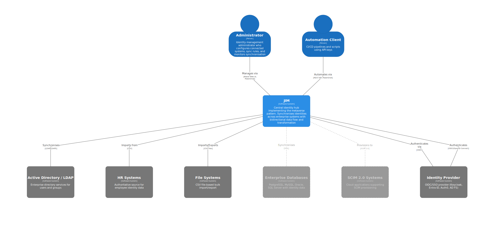


## Layered Architecture

JIM follows a strict N-tier layered architecture. Upper layers depend on lower layers, never the reverse.

| Layer | Project | Responsibility |
|-------|---------|---------------|
| **Presentation** | `JIM.Web` | Blazor Server UI with integrated REST API at `/api/` |
| **Application** | `JIM.Application` | Business logic, domain servers, `JimApplication` facade |
| **Domain** | `JIM.Models` | Entities, DTOs, interfaces |
| **Data** | `JIM.Data` / `JIM.PostgresData` | Data access abstractions and PostgreSQL implementation |
| **Integration** | `JIM.Connectors` | External system connectors |

**Rules:**

- Respect layer boundaries: the UI/API layer must only call `JimApplication`, never repository classes directly
- The application layer depends on `IRepository`, not concrete implementations
- All models and POCOs live in `JIM.Models`, never inline in service files

## Container Diagram

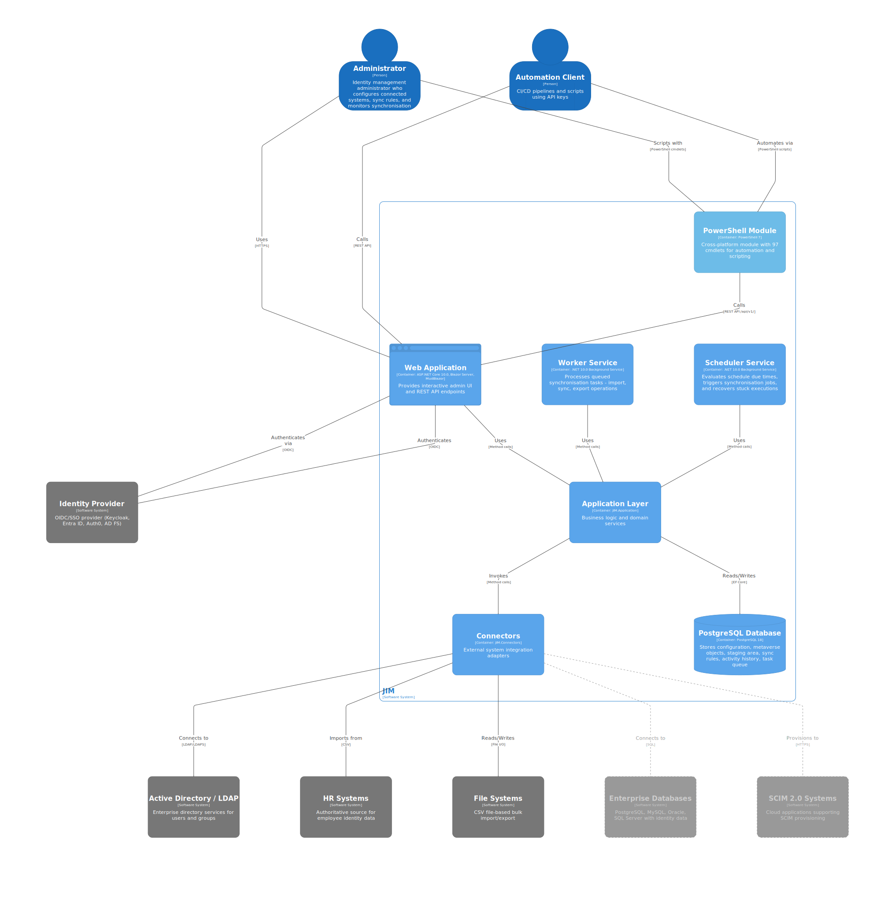
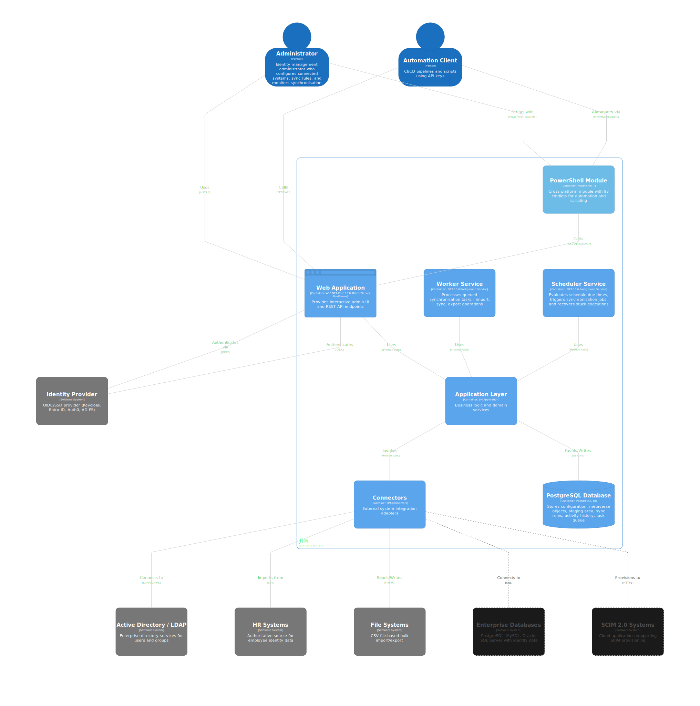

## Metaverse Pattern

The metaverse is the authoritative identity repository at the centre of JIM's architecture. All identity operations flow through the metaverse; there is never a direct sync between connected systems.

- **MetaverseObject:** Central identity entity (users, groups, custom types)
- **ConnectedSystem:** External system synchronised with the metaverse
- **SyncRule:** Bidirectional mappings between connected systems and the metaverse
- **Staging Areas:** Import/export staging for transactional integrity

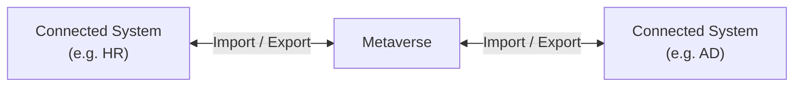

## Component Diagrams

### Application Layer

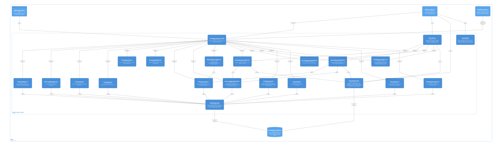
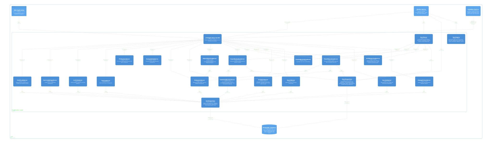

### Connectors

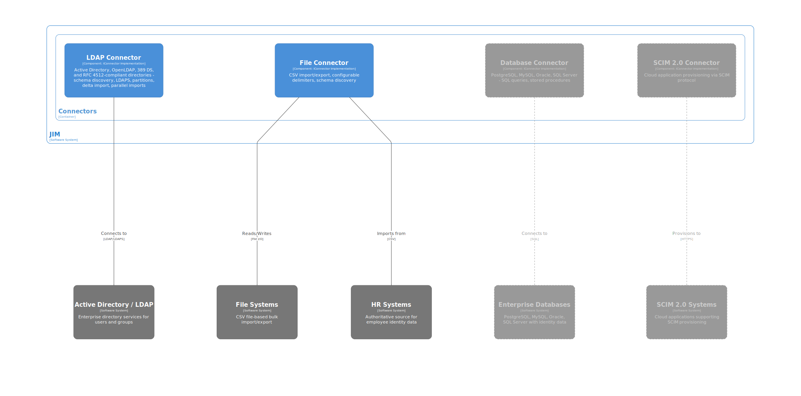
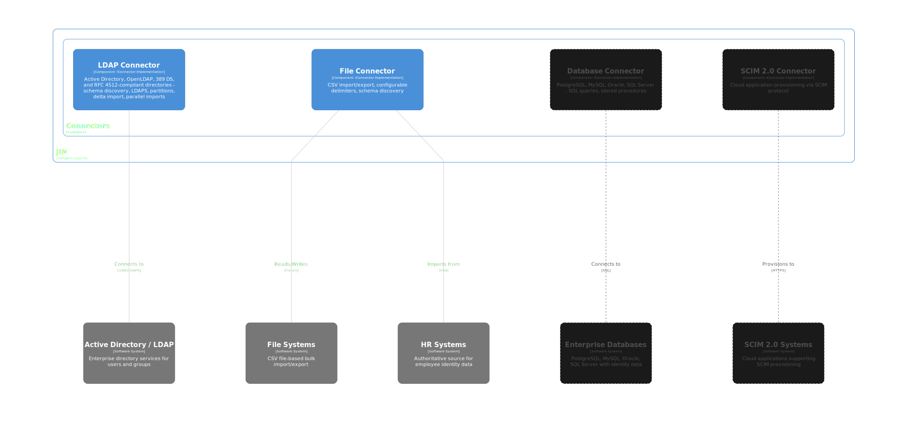

### Web Application

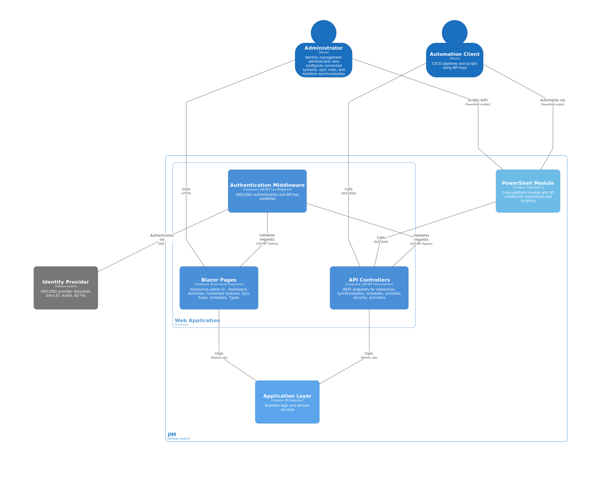
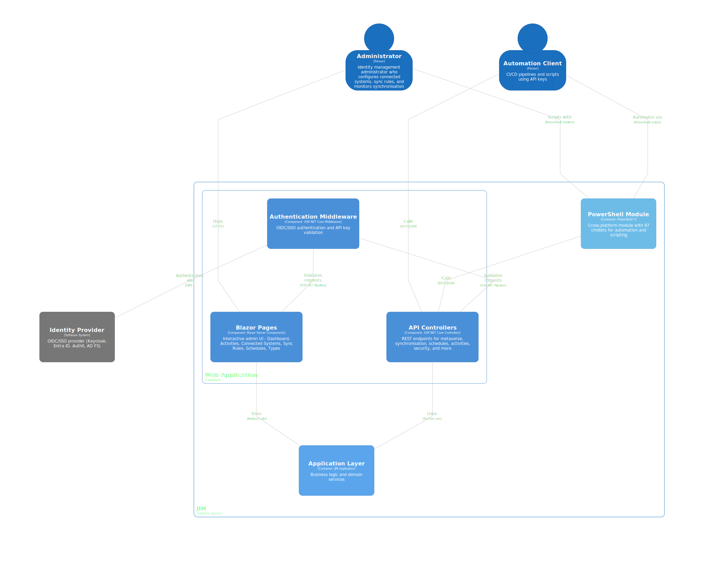

### Worker Service

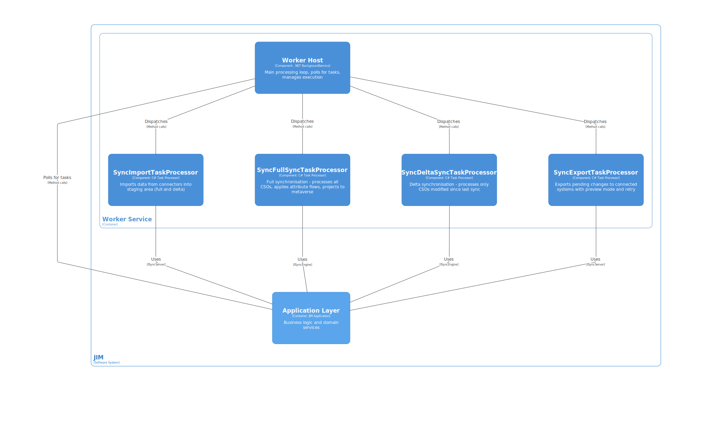
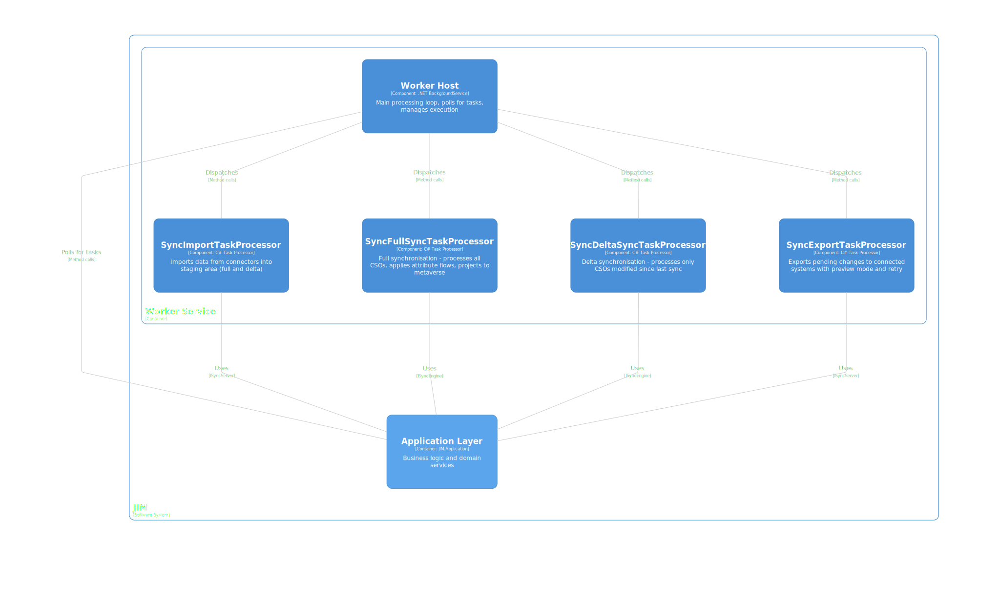

### Scheduler Service

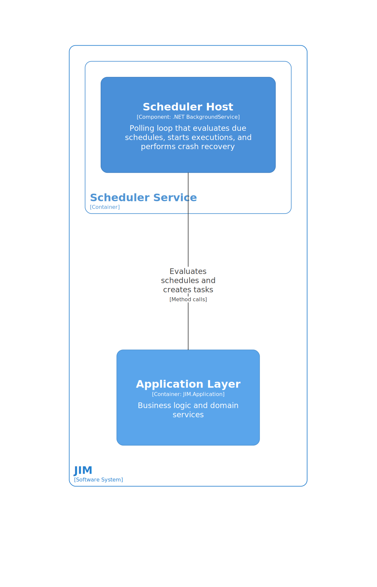
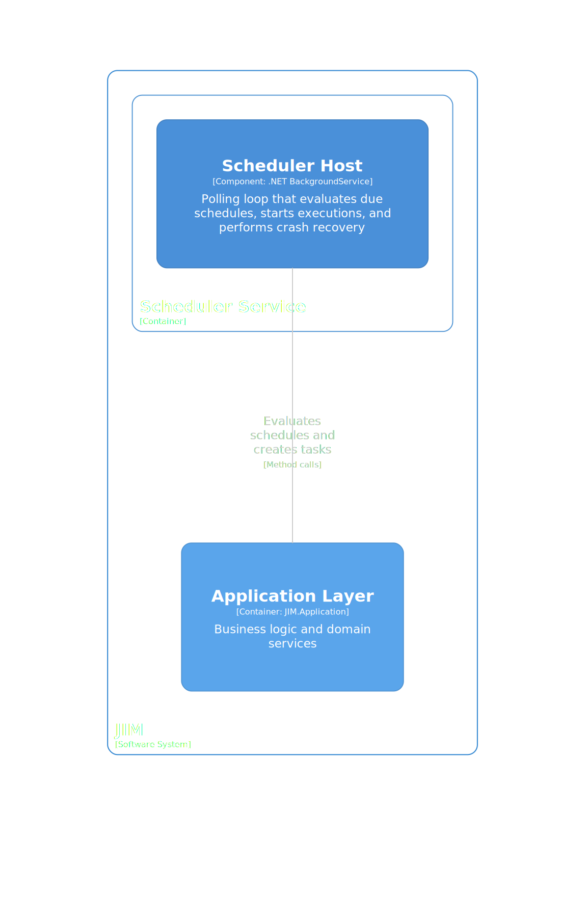

## Technology Stack

| Category | Technology |
|----------|-----------|
| Runtime | .NET 9.0, C# 13 |
| Database | PostgreSQL 18 via Npgsql and EF Core 9.0 |
| Web UI | Blazor Server with MudBlazor 8.x |
| Authentication | OpenID Connect (OIDC) with PKCE |
| Logging | Serilog (structured logging) |
| Containers | Docker and Docker Compose |
| CI/CD | GitHub Actions |
| Testing | NUnit, Moq, coverlet |

## Project Structure

```text
src/
  JIM.Application/       -- Business logic, domain servers
  JIM.Connectors/        -- External system connectors
  JIM.Data/              -- Data access abstractions (interfaces)
  JIM.InMemoryData/      -- In-memory data layer (for testing)
  JIM.Models/            -- Domain models, DTOs, interfaces
  JIM.PostgresData/      -- PostgreSQL EF Core implementation
  JIM.Scheduler/         -- Schedule management service
  JIM.Utilities/         -- Shared utilities
  JIM.Web/               -- Blazor Server UI + REST API
  JIM.Worker/            -- Background task processor

test/
  JIM.Models.Tests/      -- Model and DTO tests
  JIM.Web.Api.Tests/     -- API controller tests
  JIM.Worker.Tests/      -- Worker and sync processor tests
  JIM.Workflow.Tests/    -- Multi-step workflow tests
```

## Service Architecture

JIM runs as a set of Docker services:

| Service | Description |
|---------|-------------|
| **jim.web** | Blazor Server UI with integrated REST API at `/api/`. Port 5200 (HTTP) / 5201 (HTTPS). Swagger available at `/api/swagger` in development. |
| **jim.worker** | Background task processor. Polls the task queue, processes sync/import/export operations. Uses `ISyncEngine`/`ISyncRepository` separation for testability. |
| **jim.scheduler** | Schedule management with a 30-second polling cycle. Detects parallel step groups and queues them for concurrent worker dispatch. |
| **jim.database** | PostgreSQL 18 database. |
| **jim.keycloak** | Bundled Keycloak IdP for development SSO (port 8181). Not included in production deployments. |

## Worker Architecture

The Worker is the engine that processes all synchronisation operations. Its design separates pure domain logic from I/O for testability and performance.

### Core Interfaces

- **`ISyncEngine`:** Stateless domain engine with methods for join resolution, projection, attribute flow, scoping, and more. Zero I/O dependencies; receives all data as parameters and returns results. Fully unit-testable without mocks.
- **`ISyncRepository`:** Data access boundary with approximately 80 methods. Production implementation: `JIM.PostgresData.Repositories.SyncRepository`. Test implementation: `JIM.InMemoryData.SyncRepository`.

### Dependency Injection

The Worker and Scheduler use `IJimApplicationFactory` and `IConnectorFactory` for per-task context isolation. Each dispatched task gets its own DI scope with independent `DbContext` and connector instances.

### Bulk Write Performance

- **`ParallelBatchWriter`:** Splits bulk writes across N concurrent PostgreSQL connections
- **COPY binary protocol:** Used for high-volume inserts (CSO creates, MVO creates, RPEIs, sync outcomes) via Npgsql's binary COPY API

### Export Parallelism

Export parallelism operates on two independent axes:

1. **LDAP Connector Pipelining:** Multiple LDAP operations execute concurrently within a single export batch using `SemaphoreSlim`-based throttling
2. **Parallel Batch Processing:** Multiple export batches process concurrently with separate `IRepository` and `IConnector` instances per batch, gated by the `SupportsParallelExport` connector capability

## Process Diagrams

Detailed Mermaid diagrams document the runtime behaviour of JIM's synchronisation engine, worker, and scheduler. These are viewable directly in GitHub, VS Code, or any Mermaid-compatible markdown renderer.

### Synchronisation

- [Full Sync CSO Processing](diagrams/FULL_SYNC_CSO_PROCESSING.md): Core per-CSO decision tree (scoping, join, projection, attribute flow, drift detection)
- [Delta Sync Flow](diagrams/DELTA_SYNC_FLOW.md): How delta sync differs from full sync (watermark, early exit, CSO selection)
- [Full Import Flow](diagrams/FULL_IMPORT_FLOW.md): Object import, duplicate detection, deletion detection, pending export reconciliation

### Export

- [Export Execution Flow](diagrams/EXPORT_EXECUTION_FLOW.md): Batching, parallelism, deferred reference resolution, retry with backoff
- [Pending Export Lifecycle](diagrams/PENDING_EXPORT_LIFECYCLE.md): Full lifecycle from creation through execution to confirmation

### Worker and Scheduling

- [Worker Task Lifecycle](diagrams/WORKER_TASK_LIFECYCLE.md): Polling, dispatch, heartbeat, cancellation, SafeFailActivityAsync fallback
- [Schedule Execution Lifecycle](diagrams/SCHEDULE_EXECUTION_LIFECYCLE.md): Step groups, worker-driven advancement, recovery mechanisms

### Supporting Concepts

- [Connector Lifecycle](diagrams/CONNECTOR_LIFECYCLE.md): Interface hierarchy, resolution, import/export open/close lifecycles
- [Activity and RPEI Flow](diagrams/ACTIVITY_AND_RPEI_FLOW.md): Activity creation, RPEI accumulation, status determination
- [MVO Deletion and Grace Period](diagrams/MVO_DELETION_AND_GRACE_PERIOD.md): Deletion rules, grace periods, housekeeping cleanup
