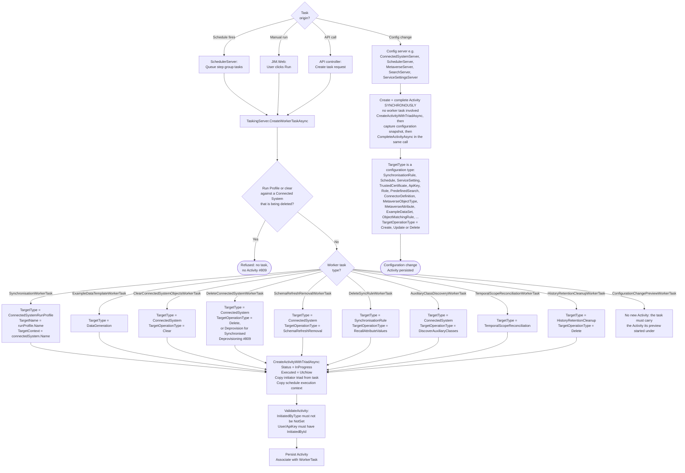
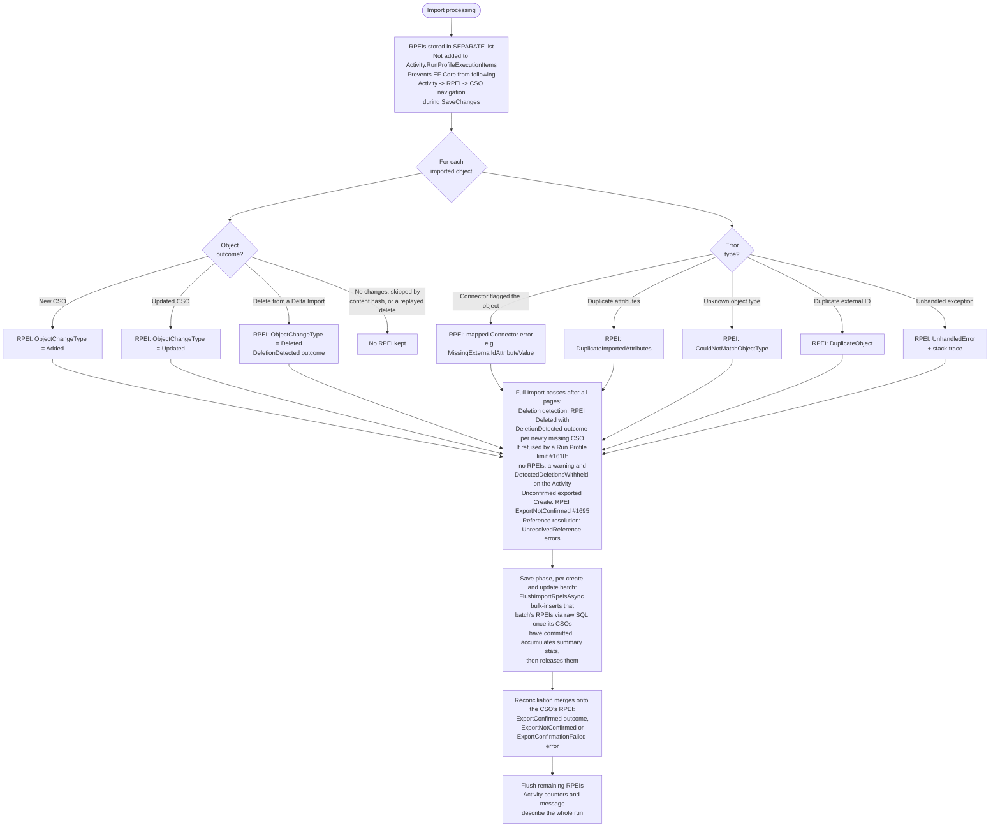
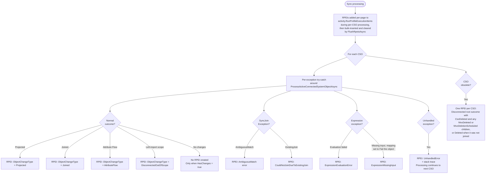
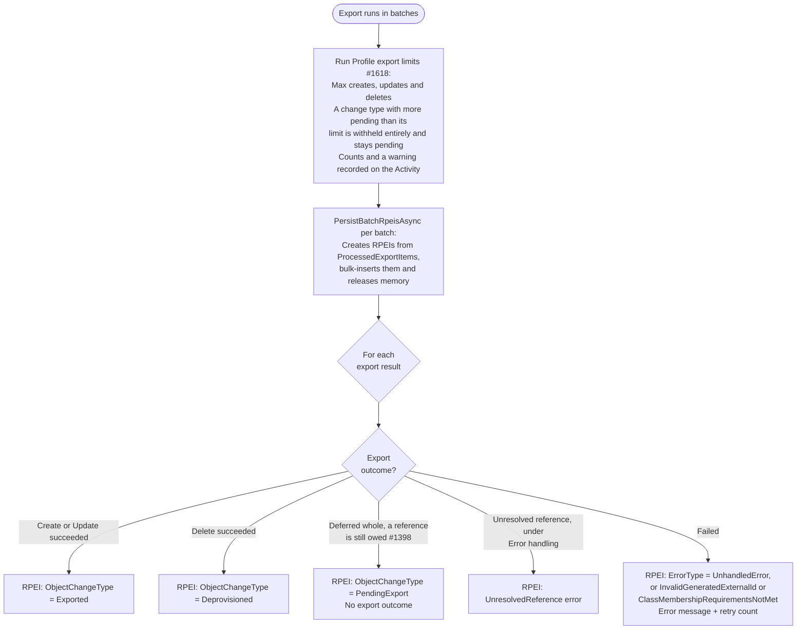
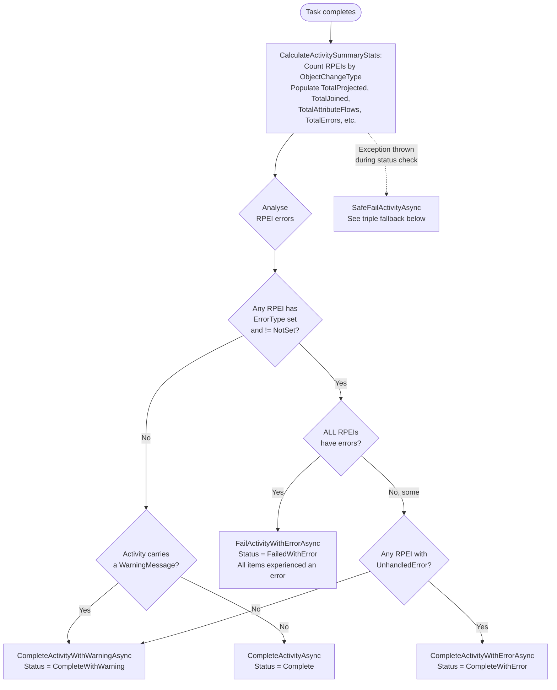
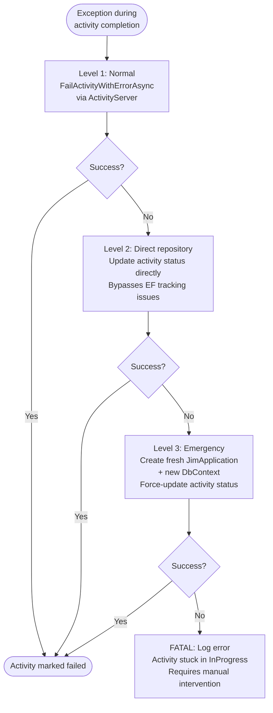

# Activity and RPEI Flow

> Last updated: 2026-09-23, JIM v0.15.0

This diagram shows how Activities are created, how Run Profile Execution Items (RPEIs) are accumulated during operations, and how the final activity status is determined. Activities are the immutable audit record for every operation in JIM.

Activities arise from two distinct paths. Operational work (synchronisation, data generation, clearing, deleting or deprovisioning a Connected System, removing data after a schema refresh, recalling a deleted Synchronisation Rule's contributed values, auxiliary class discovery, Temporal Scope Reconciliation, history retention cleanup) runs on a Worker Task, so its Activity is created when the task is queued and stays `InProgress` until the task completes. Configuration changes (issue #14) take no Worker Task: the config server that mutates the entity creates and completes the Activity synchronously, in the same call, alongside a versioned configuration snapshot.

Since v0.10.0, sync RPEIs are bulk-inserted per page via raw SQL (`FlushRpeisAsync`) rather than held in-memory for the full run, to keep memory bounded at 100K+ object scale. Summary statistics are accumulated incrementally during each flush. Cross-page reference resolution merges new attribute-flow rows under the existing MvoChange parent rather than creating a duplicate RPEI, resolving the previous ~2x RPEI duplication when references spanned multiple pages.

## Activity Status Values

| Status | Value | Meaning |
|--------|-------|---------|
| NotSet | 0 | Default, should not appear in practice |
| InProgress | 1 | Set at creation, operation is running |
| Complete | 2 | All RPEIs succeeded, no errors |
| CompleteWithWarning | 3 | Some RPEIs have errors, but not all; or no RPEI errors but the Activity carries a warning |
| CompleteWithError | 4 | Some RPEIs recorded an `UnhandledError` (a JIM defect rather than a data issue), but not all RPEIs errored |
| FailedWithError | 5 | All RPEIs errored, or unhandled exception |
| Cancelled | 6 | User cancelled the operation |

## Activity Creation

## RPEI Accumulation During Import

## RPEI Accumulation During Sync

## RPEI Accumulation During Export

## Activity Status Determination

Error counts come from one database query (`GetActivityRpeiErrorCountsAsync`) rather than from RPEIs held in memory. An Activity-level `WarningMessage` (a Connector warning such as a Delta Import falling back to a Full Import, withheld deletions or exports under a Run Profile limit) completes the Activity with a warning even when no RPEI has an error.

After a Full Import completes, the Worker stamps `LastSuccessfulFullImportCompletedAt` on the Connected System only when `FullImportSuccessEvaluator` agrees the run genuinely succeeded: `Complete`, or `CompleteWithWarning` with no object-level errors, and no deletions withheld (#1605). The stranded-value sweep's gate reads that timestamp.

## SafeFailActivityAsync - Triple Fallback

When activity completion fails (e.g., EF tracking corruption, disposed DbContext), this three-level fallback ensures activities are never left stuck in InProgress.

## Key Design Decisions

- **RPEI list separation during import**  RPEIs are maintained in a separate list during import to prevent EF Core from following the `Activity -> RPEI -> CSO` navigation chain during `SaveChanges`. This avoids accidentally persisting CSOs before they're ready. Each save batch's RPEIs are bulk-inserted via raw SQL once that batch's CSOs have committed, and summary statistics accumulate per flush, so an import never holds every RPEI until the end.

- **Direct attachment during sync**  During sync, RPEIs are added directly to `activity.RunProfileExecutionItems` since CSOs already exist in the database (they were created during a prior import).

- **Conditional RPEI creation**  RPEIs are only created when `HasChanges = true` during sync. This is an optimisation to avoid unnecessary allocations for objects that haven't changed.

- **Error isolation**  Each CSO is processed within its own try-catch during sync. Errors create RPEIs but do not halt processing of remaining CSOs. This ensures a single bad object doesn't prevent the entire sync from completing.

- **Status model**  `Complete` (no errors, no Activity warning), `CompleteWithWarning` (some errors, or an Activity-level warning), `CompleteWithError` (some `UnhandledError` items, escalated because they indicate a defect), `FailedWithError` (all errors or unhandled exception). This gives operators clear visibility into the severity of issues.

- **Triple fallback for failure**  `SafeFailActivityAsync` ensures activities are never left stuck in `InProgress`, even when the DbContext is corrupted or disposed. This is critical for system reliability; stuck activities would block future schedule executions.

- **Initiator triad audit**  Every activity records who initiated it (`InitiatedByType`, `InitiatedById`, `InitiatedByName`). For scheduled tasks, this preserves the schedule context. For deferred MVO deletions, the original initiator is captured at mark time and replayed during housekeeping.

- **Synchronous configuration-change Activities (#14)**  Configuration changes do not go through a Worker Task. The owning config server creates the Activity, mutates the entity, captures a configuration snapshot, and completes the Activity all in the same synchronous call. `ActivityTargetType` now spans the full configuration surface, including `SynchronisationRule`, `Schedule`, `ServiceSetting`, `TrustedCertificate`, `ApiKey`, `Role`, `PredefinedSearch`, `ConnectorDefinition`, `MetaverseObjectType`, `MetaverseAttribute`, `ObjectMatchingRule` and `ExampleDataSet`, in addition to the operational target types created by Worker Tasks.

- **Incremental stat counters (#1078)**  `GetActivityRunProfileExecutionStatsAsync` no longer aggregates over the RPEI and outcome tables on every read. The persistence paths maintain advisory per-Activity counter rows as the run executes, so an in-progress Activity's stats (served repeatedly while an administrator watches a run) are an O(counter rows) lookup. On completion, `FinaliseActivityRunProfileExecutionStatsAsync` replaces the counters with an exact aggregation and sets `Activity.RunProfileExecutionStatsFinalised`. Activities that completed before the counter table existed keep the legacy aggregation path and are finalised lazily the first time their stats are read. Non-relational providers (the EF in-memory test provider) always use the aggregation path, since counter maintenance is raw SQL.

- **Run Profile steps on the Activity (#1161)**  Before a Run Profile execution starts, `ActivityPhaseReporter.StartAsync` records every step the run can perform, so the Activity shows the whole journey rather than only the step it has reached; processors enter each step as they reach it, a Connector can narrate sub-steps and object counts inside the fetching step, and `FinishAsync` closes the steps out whatever happens, marking the step a failed run stopped in.

- **Outcome tree additions (v0.15.0)**  Outcomes now carry more of the story: `MvoDeletionCancelled` beneath a `Joined` outcome when a rejoin cancels a scheduled deletion (#1627), `ProvisioningCancelled` when never-exported provisioning is withdrawn rather than deleted (#1682), `ValuesPreserved` when a disconnecting system's values are kept because no import source remains (#1570), and an `ExportFailed` outcome on the RPEI of an exported Create that a Full Import did not report back (#1695). Pending Export outcomes record the change type they staged (`StagedChangeType`, #1573).

- **Scope-exit and no-contributor sync outcomes (Attribute Priority, #91)**  Beyond the `ObjectChangeType` recorded on each RPEI, sync builds a finer-grained outcome tree. A CSO leaving scope (rather than being deleted at source) records a `DisconnectedOutOfScope` outcome, or an `OutOfScopeRetainJoin` outcome when the scoping rule's Inbound Out-of-Scope Action is RemainJoined (#1649; before that it was recorded as a stray `AttributeFlow` root), both attributed to the scoping rule; and when a recalled attribute has no surviving contributor and is genuinely cleared (not re-elected to a survivor, not frozen under a deletion grace period), a `NoContributor` child outcome is surfaced so an administrator can see the blank was an event, not merely an uncontributed attribute.
