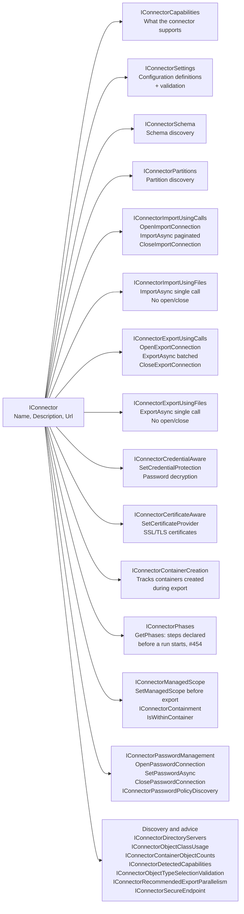
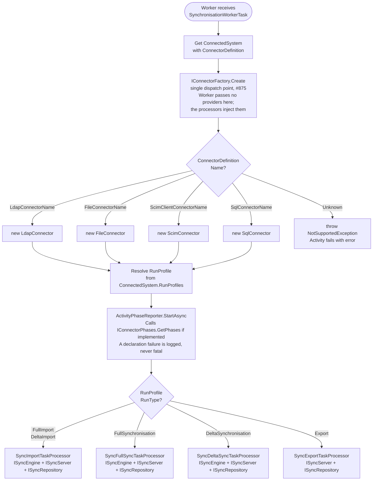
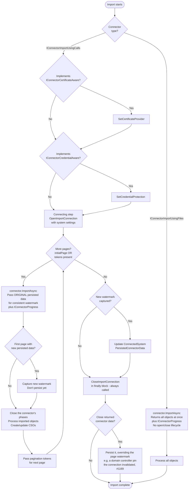
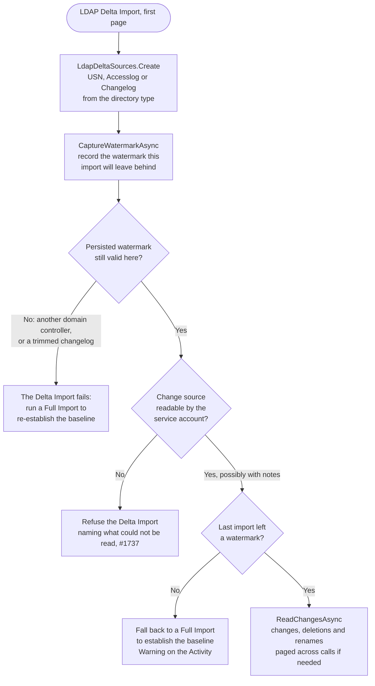
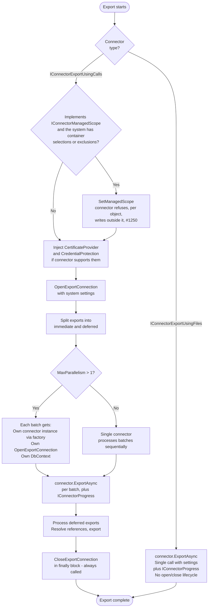
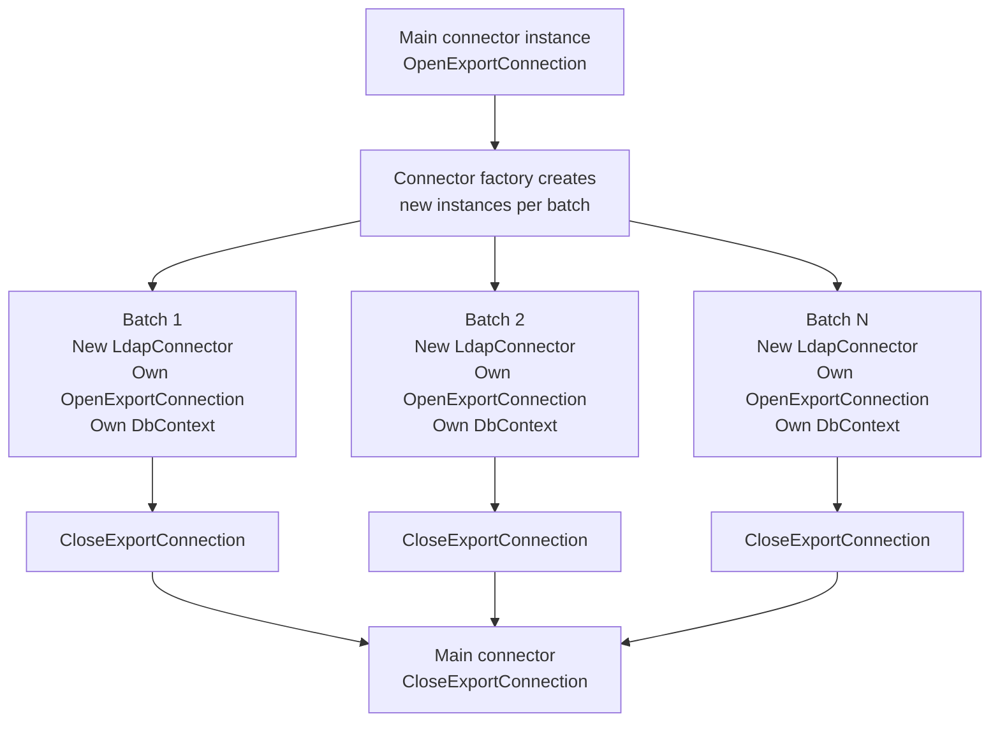
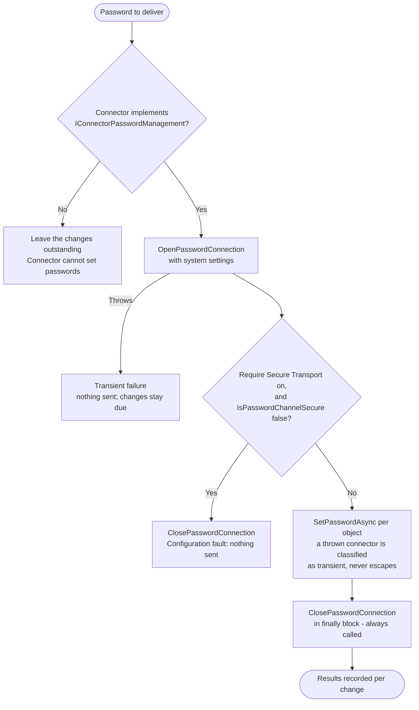

# Connector Lifecycle

> Last updated: 2026-09-23, JIM v0.15.0

This diagram shows how connectors are resolved, configured, opened, used, and closed across import, export and password operations. Connectors implement capability interfaces that determine their lifecycle shape. The built-in connectors are the LDAP, File, SCIM 2.0 Client and SQL Connectors; the File Connector is the only file-based one.

## Connector Interface Hierarchy

Every `ImportAsync` and `ExportAsync` call is handed an `IConnectorProgress` (never null), through which a connector narrates what it is doing, enters the phases it declared via `IConnectorPhases`, and states how many objects it expects and has read (#1148). A connector that declares no phases still works: its messages appear under the JIM step that hosts the call.

## Connector Resolution

## Import Lifecycle

## LDAP Delta Import Change Sources

The LDAP Connector reads a Delta Import's changes through one change source per directory family (#1736), chosen once from the directory type the rootDSE reports: `uSNChanged` plus the Deleted Objects container for Active Directory and Samba AD, `cn=accesslog` for OpenLDAP, and `cn=changelog` for everything else (389 Directory Server among them).

A Full Import calls only `CaptureWatermarkAsync`, so it leaves the baseline the first Delta Import reads from; later Delta Import pages call only `HasBaseline` and `ReadChangesAsync`.

## Export Lifecycle

## Parallel Export - Connector Isolation

## Password Channel Lifecycle

Connectors that implement `IConnectorPasswordManagement` (the LDAP Connector) are driven through one sequence, `PasswordDeliveryCore`, whenever JIM writes a password: an initial password for an object it provisioned, a password an administrator sets, or a synchronised password change (#1635, #1639). The queued paths run in the Worker process's Password Delivery Service, not in a Worker Task, and open the channel once per Connected System for a batch of changes.

## Key Design Decisions

- **Two connector families**  Call-based connectors (`IConnectorImportUsingCalls`/`IConnectorExportUsingCalls`) have an explicit open/close lifecycle with connection management. File-based connectors (`IConnectorImportUsingFiles`/`IConnectorExportUsingFiles`) handle everything in a single call with no connection state.

- **Service injection before open**  Certificate and credential providers are injected before `OpenImportConnection`/`OpenExportConnection` is called. This allows connectors to decrypt passwords and load certificates during connection setup.

- **Watermark consistency**  During paginated delta imports, the *original* persisted connector data is passed to every page. The new watermark from the first page is only saved after all pages complete, ensuring the connector sees a consistent view across pages.

- **Parallel connector isolation**  Each parallel export batch gets its own connector instance created via factory. This avoids shared connection state between concurrent batches, which is critical for connectors like LDAP that maintain stateful connections.

- **Close in finally, on every channel**  The export connection is always closed, even if an exception occurs during export. The import connection is too, so an import that fails part-way still releases its connection and any temporary trust directory prepared for it, and the password channel likewise. This prevents connection leaks in long-running worker processes.

- **Connector state returned at close wins**  `CloseImportConnection` may return persisted connector data, persisted after the page watermark so it overrides it; the LDAP Connector uses this when using the connection invalidated a previously persisted domain controller pin (#1169). Null, the usual case, means nothing to override.

- **Managed scope is the connector's knowledge (#1250)**  Container selection means the scope JIM manages, not merely what it reads. Before an export JIM states the Connected System's scope-deciding containers (selections and exclusions) to a connector implementing `IConnectorManagedScope`, and the connector refuses per object to write outside them, so the rest of the run proceeds. A Connected System with no container selections states nothing and permits everything. The scope is currently stated only on the connector instance the run was resolved with: the per-batch instances a parallel export creates through the factory do not receive it.

- **Declared phases (#454, #1148)**  A connector that implements `IConnectorPhases` declares its internal steps before the run starts, and enters them through `IConnectorProgress`, so an administrator sees what the connector still has to do rather than only what it is doing now. A declaration that throws is logged and the run continues with JIM's own steps only.

- **Single dispatch point (#875)**  Every connector instance comes from `IConnectorFactory.Create`, used by both the application layer and the Worker; previously each call site ran its own `new LdapConnector()`-style name switch. The factory matches `ConnectorDefinition.Name` against the built-in connectors and throws `NotSupportedException` for an unknown name. `Create` optionally takes a credential-protection and a certificate provider and applies them when the connector implements the matching capability interface: `ConnectedSystemServer` uses that overload, while the Worker creates a bare connector and its import/export processors inject the providers themselves immediately before opening the connection. User-supplied connector lookup will extend this factory rather than adding another switch.
