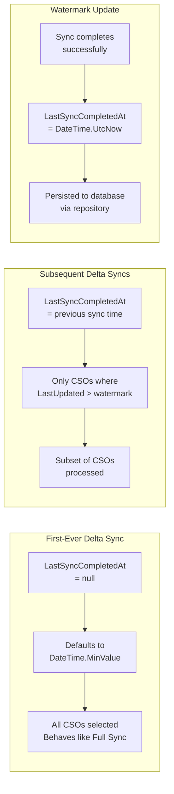

# Delta Sync Flow

> Last updated: 2026-04-22, JIM v0.10.0

This diagram shows how Delta Synchronisation differs from Full Synchronisation. Both use identical per-CSO processing logic; the only difference is CSO selection and a few lifecycle steps.

## Full Sync vs Delta Sync Comparison

| Aspect | Full Sync | Delta Sync |
|--------|-----------|------------|
| CSO Selection | ALL CSOs (or partition-scoped) | Only CSOs with `LastUpdated > watermark` (partition-scoped filtering supported since v0.8.0) |
| Early Exit | Never | Yes, if 0 modified CSOs |
| Per-page pipeline | Identical | Identical |
| Watermark Update | No | Yes (even when 0 changes) |
| Use Case | Initial sync, periodic reconciliation | Incremental updates |

## Delta Sync Flow

```mermaid
flowchart TD
    Start([PerformDeltaSyncAsync]) --> Watermark[Determine watermark:<br/>LastSyncCompletedAt<br/>or DateTime.MinValue if first run]

    Watermark --> CountModified[Count CSOs modified<br/>since watermark]
    CountModified --> HasChanges{Modified<br/>CSOs > 0?}

    HasChanges -->|No| EarlyWatermark[Update watermark<br/>to UtcNow]
    EarlyWatermark --> EarlyDone([Return - no work needed])

    HasChanges -->|Yes| CountPE[Count pending exports<br/>Total = modified CSOs + PEs]
    CountPE --> LoadCaches[Load sync rules, object types<br/>Drift detection cache<br/>Pending exports dictionary<br/>Export evaluation cache]

    LoadCaches --> PageLoop{More CSO<br/>pages?}

    PageLoop -->|Yes| LoadPage[Load page of modified CSOs<br/>WHERE LastUpdated > watermark]
    LoadPage --> CsoLoop{More CSOs<br/>in page?}

    %% Partition-scoped filtering supported since v0.8.0: CSO selection respects TargetPartitionId

    CsoLoop -->|Yes| CheckCancel{Cancellation<br/>requested?}
    CheckCancel -->|Yes| Return([Return])
    CheckCancel -->|No| Pass1[Pass 1: every CSO in page<br/>ProcessObsoleteAndExportConfirmationAsync<br/>- Confirm pending exports<br/>- Tear down obsolete CSOs<br/>- Populate _pendingDisconnectedMvoIds]
    Pass1 --> Pass2[Pass 2: non-obsolete CSOs<br/>ProcessActiveConnectedSystemObjectAsync<br/>Identical to Full Sync:<br/>join, project, attribute flow, drift]
    Pass2 --> CsoLoop

    CsoLoop -->|No| PageFlush[Page flush pipeline:<br/>1. Deferred reference attributes<br/>2. PersistPendingMetaverseObjectsAsync<br/>3. CreatePendingMvoChangeObjectsAsync<br/>4. EvaluatePendingExportsAsync<br/>5. FlushPendingExportOperationsAsync<br/>6. ResolvePendingExportReferenceSnapshotsAsync<br/>7. FlushObsoleteCsoOperationsAsync<br/>8. FlushPendingMvoDeletionsAsync<br/>9. FlushRpeisAsync (bulk-insert via raw SQL)<br/>10. FlushPendingMvoChangesAsync<br/>11. Clear change tracker, update progress]
    PageFlush --> PageLoop

    PageLoop -->|No| CrossPage[Cross-page reference resolution<br/>Reload CSOs with unresolved references<br/>Merge reference-attribute changes under<br/>the existing MvoChange parent RPEI<br/>Re-run persist/flush pipeline]
    CrossPage --> UpdateWatermark[Update watermark<br/>LastSyncCompletedAt = UtcNow]
    UpdateWatermark --> Done([Sync Complete])
```

## Watermark Mechanism



## Key Design Decisions

- **Identical per-CSO logic**<br /> Both full and delta sync share the exact same `ProcessConnectedSystemObjectAsync()` from `SyncTaskProcessorBase`, using `ISyncEngine` for pure domain decisions and `ISyncServer`/`ISyncRepository` for orchestration and data access. The only difference is which CSOs are selected for processing.

- **Early exit optimisation**<br /> Delta sync checks if any CSOs have been modified before loading caches and entering the page loop. If nothing has changed, it updates the watermark and returns immediately.

- **Watermark always advances**<br /> Even when zero CSOs are modified, the watermark is updated. This prevents the watermark from becoming stale if no changes occur for an extended period.

- **First delta sync processes everything**<br /> If `LastSyncCompletedAt` is null (no previous sync), the watermark defaults to `DateTime.MinValue`, effectively selecting all CSOs, the same set as a full sync.

- **Cross-page reference resolution (v0.10.0)**<br /> Both full and delta sync perform cross-page reference resolution after all pages are processed. CSOs with reference attributes that couldn't be resolved during page processing (because the referenced CSO was on a different page) are reloaded and resolved once all MVOs exist. New reference-attribute changes are merged under the existing MvoChange parent RPEI (rather than creating a second standalone RPEI for the same MVO), honouring the `IX_MetaverseObjectChanges_ActivityRunProfileExecutionItemId` unique index. The standard persist/flush pipeline runs again for the resolved references.

- **Partition-scoped filtering (v0.8.0, #353)**<br /> Both full and delta sync support partition-scoped CSO selection via `TargetPartitionId` on the run profile. When set, CSO counting and page loading are filtered to only that partition's scope.

- **Two-pass per-CSO processing (v0.10.0)**<br /> Each page iterates over its CSOs twice. Pass 1 handles pending-export confirmation and obsolete CSO teardown across all CSOs, populating `_pendingDisconnectedMvoIds`. Pass 2 runs join/projection/attribute flow only on non-obsolete CSOs. This ordering guarantees Pass 2 join attempts see the complete set of disconnected MVOs from Pass 1.
