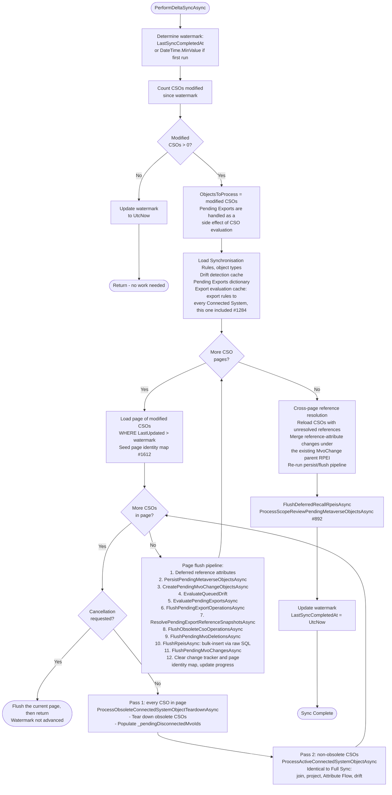
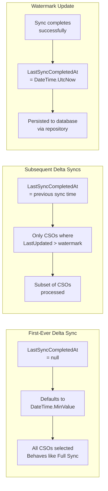

# Delta Sync Flow

> Last updated: 2026-09-23, JIM v0.15.0

This diagram shows how Delta Synchronisation differs from Full Synchronisation. Both use identical per-CSO processing logic; the only difference is CSO selection and a few lifecycle steps.

## Full Sync vs Delta Sync Comparison

| Aspect | Full Sync | Delta Sync |
|--------|-----------|------------|
| CSO Selection | ALL CSOs (unchanged CSOs skip Attribute Flow unless Synchronisation Rule configuration changed since it was last fully applied) | Only CSOs with `LastUpdated > watermark` |
| Early Exit | Never | Yes, if 0 modified CSOs |
| Per-page pipeline | Identical | Identical |
| Watermark Update | Yes (establishes the baseline for the next Delta Sync) | Yes (even when 0 changes) |
| Configuration baseline (`ConfigurationLastFullyAppliedAt`) | Recorded at the end of the run | Never advanced |
| Stranded-value sweep after a Connector Space clear (#1549, #1605) | Runs if armed and gated open | Never |
| Use Case | Initial sync, periodic reconciliation, applying configuration changes | Incremental updates |

Neither run type filters by partition: a Run Profile's partition (#353) scopes imports only.

## Delta Sync Flow

```mermaid
flowchart TD
    Start([PerformDeltaSyncAsync]) --> Watermark[Determine watermark:<br/>LastSyncCompletedAt<br/>or DateTime.MinValue if first run]

    Watermark --> CountModified[Count CSOs modified<br/>since watermark]
    CountModified --> HasChanges{Modified<br/>CSOs > 0?}

    HasChanges -->|No| EarlyWatermark[Update watermark<br/>to UtcNow]
    EarlyWatermark --> EarlyDone([Return - no work needed])

    HasChanges -->|Yes| CountPE[ObjectsToProcess = modified CSOs<br/>Pending Exports are handled as a<br/>side effect of CSO evaluation]
    CountPE --> LoadCaches[Load Synchronisation Rules, object types<br/>Drift detection cache<br/>Pending Exports dictionary<br/>Export evaluation cache: export rules to<br/>every Connected System, this one included #1284]

    LoadCaches --> PageLoop{More CSO<br/>pages?}

    PageLoop -->|Yes| LoadPage[Load page of modified CSOs<br/>WHERE LastUpdated > watermark<br/>Seed page identity map #1612]
    LoadPage --> CsoLoop{More CSOs<br/>in page?}

    CsoLoop -->|Yes| CheckCancel{Cancellation<br/>requested?}
    CheckCancel -->|Yes| Return([Flush the current page, then return<br/>Watermark not advanced])
    CheckCancel -->|No| Pass1[Pass 1: every CSO in page<br/>ProcessObsoleteConnectedSystemObjectTeardownAsync<br/>- Tear down obsolete CSOs<br/>- Populate _pendingDisconnectedMvoIds]
    Pass1 --> Pass2[Pass 2: non-obsolete CSOs<br/>ProcessActiveConnectedSystemObjectAsync<br/>Identical to Full Sync:<br/>join, project, Attribute Flow, drift]
    Pass2 --> CsoLoop

    CsoLoop -->|No| PageFlush[Page flush pipeline:<br/>1. Deferred reference attributes<br/>2. PersistPendingMetaverseObjectsAsync<br/>3. CreatePendingMvoChangeObjectsAsync<br/>4. EvaluateQueuedDrift<br/>5. EvaluatePendingExportsAsync<br/>6. FlushPendingExportOperationsAsync<br/>7. ResolvePendingExportReferenceSnapshotsAsync<br/>8. FlushObsoleteCsoOperationsAsync<br/>9. FlushPendingMvoDeletionsAsync<br/>10. FlushRpeisAsync: bulk-insert via raw SQL<br/>11. FlushPendingMvoChangesAsync<br/>12. Clear change tracker and page<br/>identity map, update progress]
    PageFlush --> PageLoop

    PageLoop -->|No| CrossPage[Cross-page reference resolution<br/>Reload CSOs with unresolved references<br/>Merge reference-attribute changes under<br/>the existing MvoChange parent RPEI<br/>Re-run persist/flush pipeline]
    CrossPage --> PostPasses[FlushDeferredRecallRpeisAsync<br/>ProcessScopeReviewPendingMetaverseObjectsAsync #892]
    PostPasses --> UpdateWatermark[Update watermark<br/>LastSyncCompletedAt = UtcNow]
    UpdateWatermark --> Done([Sync Complete])
```

## Watermark Mechanism

```mermaid
flowchart LR
    subgraph "First-Ever Delta Sync"
        NullWatermark[LastSyncCompletedAt<br/>= null] --> DefaultMin[Defaults to<br/>DateTime.MinValue]
        DefaultMin --> AllCSOs[All CSOs selected<br/>Behaves like Full Sync]
    end

    subgraph "Subsequent Delta Syncs"
        PrevWatermark[LastSyncCompletedAt<br/>= previous sync time] --> FilterCSOs[Only CSOs where<br/>LastUpdated > watermark]
        FilterCSOs --> SubsetCSOs[Subset of CSOs<br/>processed]
    end

    subgraph "Watermark Update"
        SyncCompletes[Sync completes<br/>successfully] --> SetWatermark[LastSyncCompletedAt<br/>= DateTime.UtcNow]
        SetWatermark --> Persisted[Persisted to database<br/>via repository]
    end
```

## Key Design Decisions

- **Identical per-CSO logic**  Both full and delta sync share the exact same two-pass per-CSO methods (`ProcessObsoleteConnectedSystemObjectTeardownAsync()` and `ProcessActiveConnectedSystemObjectAsync()`) and page flush pipeline from `SyncTaskProcessorBase`, using `ISyncEngine` for pure domain decisions and `ISyncServer`/`ISyncRepository` for orchestration and data access. The only difference is which CSOs are selected for processing.

- **Early exit optimisation**  Delta sync checks if any CSOs have been modified before loading caches and entering the page loop. If nothing has changed, it updates the watermark and returns immediately.

- **Watermark always advances**  Even when zero CSOs are modified, the watermark is updated. This prevents the watermark from becoming stale if no changes occur for an extended period.

- **First delta sync processes everything**  If `LastSyncCompletedAt` is null (no previous sync), the watermark defaults to `DateTime.MinValue`, effectively selecting all CSOs, the same set as a full sync.

- **Cross-page reference resolution (v0.10.0)**  Both full and delta sync perform cross-page reference resolution after all pages are processed. CSOs with reference attributes that couldn't be resolved during page processing (because the referenced CSO was on a different page) are reloaded and resolved once all MVOs exist. New reference-attribute changes are merged under the existing MvoChange parent RPEI (rather than creating a second standalone RPEI for the same MVO), honouring the `IX_MetaverseObjectChanges_ActivityRunProfileExecutionItemId` unique index. The standard persist/flush pipeline runs again for the resolved references.

- **No partition filtering**  Neither full nor delta sync filters CSOs by partition. A Run Profile's partition (#353) scopes the import that reads the Connected System and its deletion detection; synchronisation then processes whatever changed across the whole Connector Space.

- **No stranded-value sweep**  The sweep that recalls values stranded by a Connector Space clear runs only after a Full Synchronisation (see [Full Synchronisation - CSO Processing Flow](FULL_SYNC_CSO_PROCESSING.md)). A Delta Synchronisation leaves the arming in place for the next Full Synchronisation.

- **Two-pass per-CSO processing (v0.10.0)**  Each page iterates over its CSOs twice. Pass 1 handles pending-export confirmation and obsolete CSO teardown across all CSOs, populating `_pendingDisconnectedMvoIds`. Pass 2 runs join/projection/Attribute Flow only on non-obsolete CSOs. This ordering guarantees Pass 2 join attempts see the complete set of disconnected MVOs from Pass 1.
