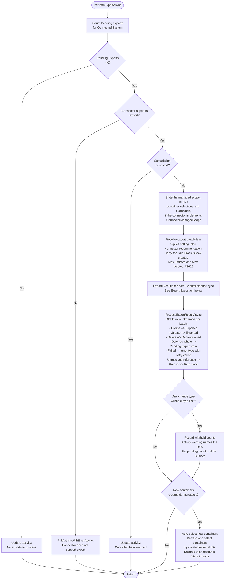
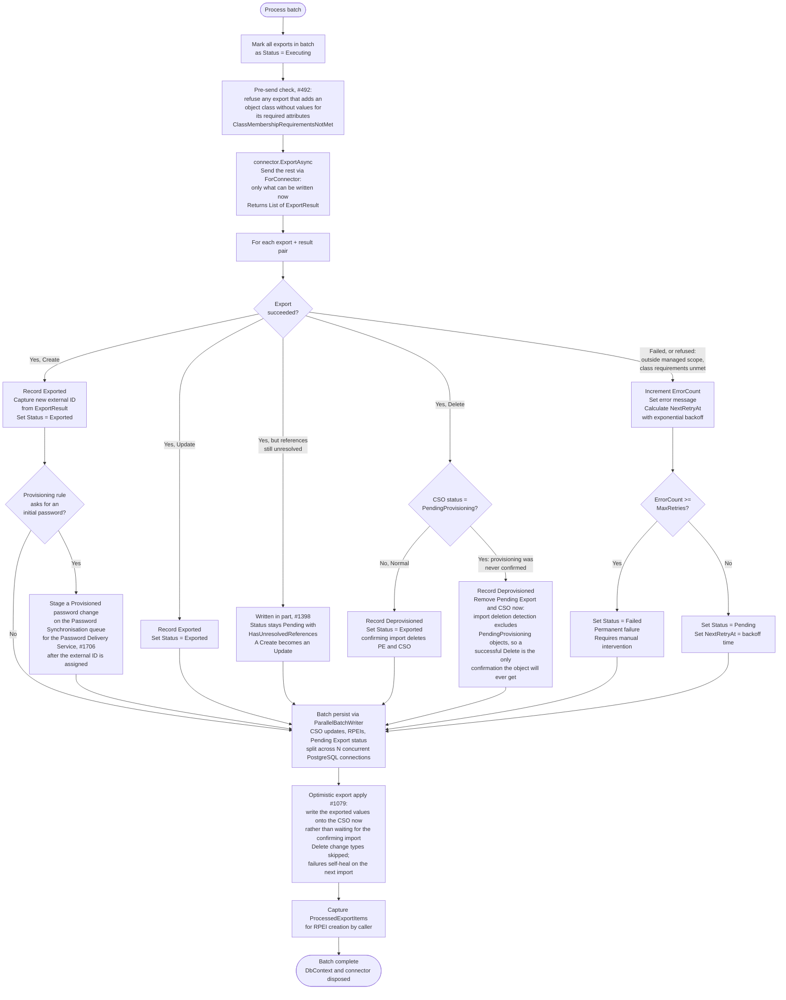
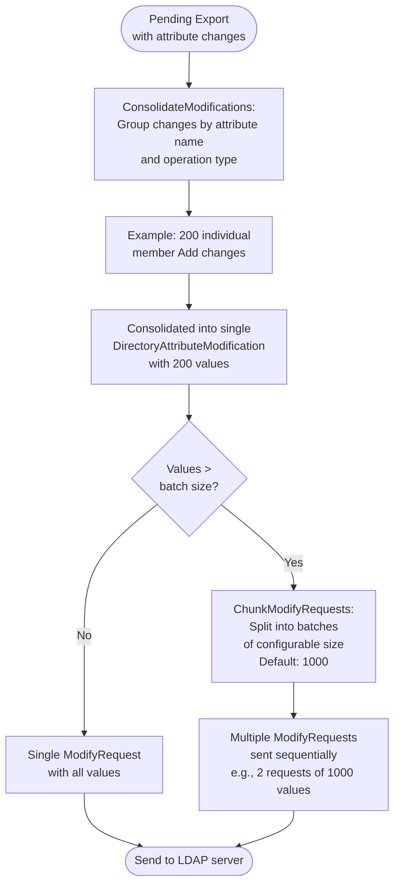
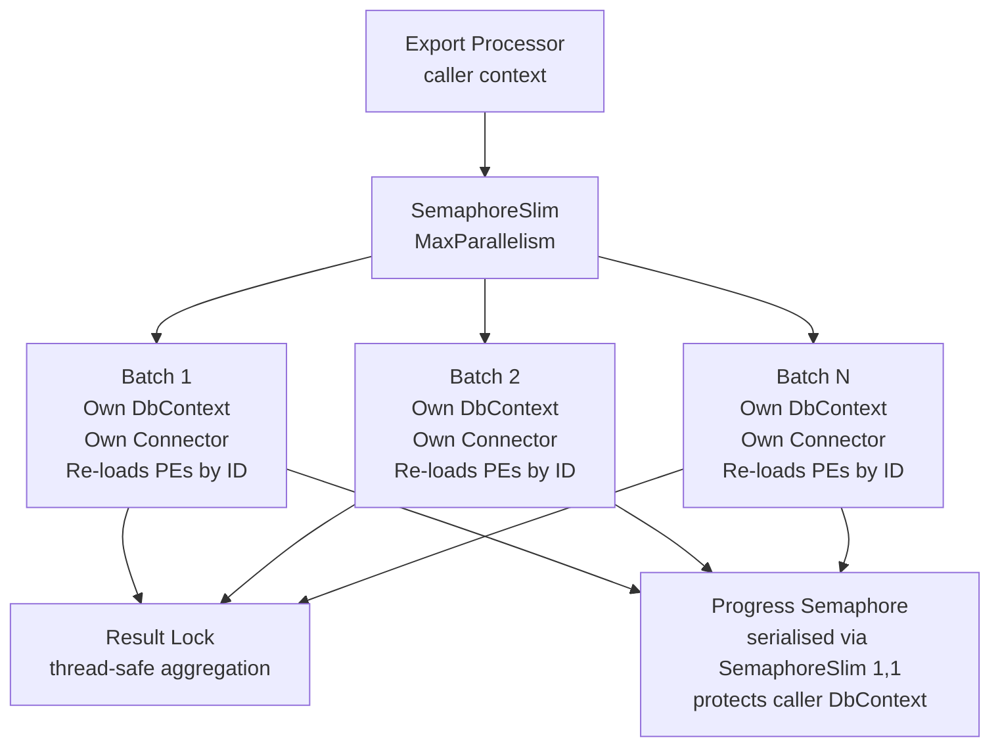

# Export Execution Flow

> Last updated: 2026-09-23, JIM v0.15.0

This diagram shows how Pending Exports are executed against Connected Systems via connectors. The export processor (`SyncExportTaskProcessor`) uses `ISyncServer` to delegate to `ExportExecutionServer` for the core execution logic, and `ISyncRepository` for bulk data access. Supports batching, parallelism, deferred reference resolution, retry with backoff, and per-Run Profile limits on how many creates, updates and deletes a run may send.

Since v0.10.0, connector exceptions thrown during export are always reported as RPEIs. Three catch paths (the file-based outer catch in `ExportExecutionServer`, the call-based sequential-batch catch, and the parallel-batch catch) each create `ProcessedExportItems` for every export in the affected scope. Previously, a thrown connector exception set `FailedCount` without creating RPEIs, so the activity could complete successfully despite silent export failures. Per-batch streaming via `batchCompletedCallback` keeps in-memory `ProcessedExportItem` accumulation bounded at 100K+ exports.

## Export Task Processing

## Export Execution (ExportExecutionServer)

```mermaid
flowchart TD
    Start([ExecuteExportsAsync]) --> GetExecutable[Establish whether there is executable work<br/>Database filter: Status, NextRetryAt, ErrorCount<br/>In-memory filter: has exportable attribute changes<br/>Delete exports already exported are skipped<br/>Creates already exported are skipped while<br/>they await confirmation, #1687<br/>The same filters drive the batch sweep below]
    GetExecutable --> HasExports{Exports<br/>found?}
    HasExports -->|No| EmptyResult([Return empty result])

    HasExports -->|Yes| CheckPreview{Run mode =<br/>PreviewOnly?}
    CheckPreview -->|Yes| PreviewResult[Return export IDs<br/>without executing]
    PreviewResult --> Done([Return result])

    CheckPreview -->|No| Limits{Run Profile has<br/>export limits?}
    Limits -->|Yes| Ledger[Count executable exports per change type<br/>ExportChangeLimitLedger withholds, in full,<br/>any type whose count exceeds its limit<br/>Withheld exports stay Pending, untouched]
    Limits -->|No| ConnectorType
    Ledger --> ConnectorType{Connector<br/>export type?}

    ConnectorType -->|IConnectorExportUsingCalls| PrepareConnector[Inject CertificateProvider<br/>and CredentialProtection]
    PrepareConnector --> OpenExport[OpenExportConnection<br/>with system settings]

    %% --- Batch collection: single forward keyset sweep ---
    OpenExport --> Collect[Collect next page of Pending Exports<br/>keyset cursor on CreatedAt, Id, #985<br/>never rescans from the start<br/>withheld change types excluded]
    Collect --> Empty{Page<br/>empty?}
    Empty -->|Yes| CaptureContainers
    Empty -->|No| SplitExports[Split the page into:<br/>- Immediate exports: no unresolved references<br/>- Deferred exports: have unresolved references]

    %% --- Immediate exports ---
    SplitExports --> HasImmediate{Immediate<br/>exports?}
    HasImmediate -->|Yes| ParallelCheck{MaxParallelism > 1<br/>and factories provided?}
    ParallelCheck -->|Yes| ParallelBatch[Process batches in parallel<br/>Each batch gets own:<br/>- DbContext<br/>- Connector instance<br/>both disposed as the batch completes, #1006<br/>Progress serialised via SemaphoreSlim<br/>LDAP concurrency auto-tuned:<br/>AD/OpenLDAP default 16,<br/>Samba/unknown default 4]
    ParallelCheck -->|No| SequentialBatch[Process batches sequentially<br/>Using existing connector + DbContext]

    ParallelBatch --> ClearTracker[ClearChangeTracker<br/>after each batch]
    SequentialBatch --> ClearTracker
    ClearTracker --> Collect

    %% --- All-deferred fast path ---
    HasImmediate -->|No, whole page deferred| Probe{Any executable<br/>non-deferred exports<br/>beyond the cursor?}
    Probe -->|Yes| Collect
    Probe -->|No| CollectRest[Fast path #985c:<br/>collect ALL remaining deferred<br/>exports in one query and<br/>stop the sweep]
    CollectRest --> CaptureContainers

    %% --- Deferred exports ---
    CaptureContainers[Capture created container<br/>external IDs from connector] --> HasDeferred{Deferred<br/>exports collected?}
    HasDeferred -->|Yes| BulkFetchRefs[Bulk pre-fetch all<br/>referenced CSOs by MVO IDs<br/>in single query]
    BulkFetchRefs --> ResolveRefs[For each deferred export:<br/>Try to resolve MVO references<br/>to target system CSO external IDs]
    ResolveRefs --> Resolved{References<br/>resolved?}
    Resolved -->|Yes| PersistRefs[Persist the resolutions BEFORE<br/>dispatching parallel batches, #994<br/>each batch loads its own copy and<br/>would otherwise export raw MVO IDs]
    PersistRefs --> ExportResolved[Batch export resolved<br/>exports same as immediate]
    Resolved -->|No| MarkDeferred[Mark as deferred<br/>Will be retried next run]

    HasDeferred -->|No| CloseExport
    ExportResolved --> CloseExport
    MarkDeferred --> CloseExport

    CloseExport[CloseExportConnection]
    CloseExport --> SecondPass[Second pass: retry references deferred<br/>by a PREVIOUS export run<br/>single indexed query on the<br/>unresolved-references partial index, #1102]
    SecondPass --> Done

    ConnectorType -->|IConnectorExportUsingFiles| FileExport[File-based export<br/>with batching<br/>reserved against the ledger<br/>before the file is written<br/>Auto-confirming connectors delete<br/>each Pending Export on success]
    FileExport --> Done
```

## Batch Execution Detail

Each batch follows this sequence, whether processed sequentially or in parallel:

## LDAP Export Consolidation and Chunking

For LDAP connectors, individual attribute changes are consolidated and chunked before being sent to the directory server. This ensures RFC 4511 compliance and prevents server rejection of oversized modify requests.

**Batch size** is configurable via the "Modify Batch Size" connector setting (default: 1000, clamped to 10-5000, recommended 100-2000). The default was raised from 100 because several directory servers' per-modification cost grows with the group's current membership size, so fewer, larger requests cut total export time by an order of magnitude for groups with tens of thousands of members. Newly created Connected Systems pick up the new default; existing ones keep their stored value, since connector settings are captured per system at creation.

## Parallel Batch Architecture

When `MaxParallelism > 1`, batches are distributed across concurrent tasks. Each task is fully isolated to avoid EF Core thread-safety issues.

- **Batch IDs are captured** before dispatching - each parallel task re-loads its exports from its own DbContext by ID
- **Progress reporting** is serialised via `SemaphoreSlim(1,1)` to protect the caller's shared DbContext
- **Result aggregation** uses a lock for thread-safe counter updates
- **Connector instances** are created per-batch via factory to avoid shared connection state

## Key Design Decisions

- **Two-pass export**  Exports without unresolved references are executed first (immediate). Exports with unresolved MVO references are deferred, with references bulk-resolved in a single query, then executed in a second pass.

- **Run Profile export limits (#1618, #1629)**  An Export Run Profile may carry Max creates, Max updates and Max deletes. When any is set, the executable Pending Exports are counted per change type once at the start of the run, and `ExportChangeLimitLedger` withholds in full any type whose count exceeds its limit: never a head of the queue, so a frequent Schedule cannot trickle a wrong mass change through. Withheld exports stay `Pending` and untouched (not marked, not failed, given no RPEI), withheld types are excluded from the paging query, and one ledger is shared by both passes and both connector shapes. The Activity records the withheld counts and completes with a warning naming the limit and the remedy. An uncapped run does no extra database work.

- **An exported Create is never re-sent while it awaits confirmation (#1687)**  A Create at `Exported` is filtered out of the executable set: re-sending it would ask the connector to create an object that already exists. Changes staged while it waits are appended to it as `Pending` attribute changes, and travel as one Update once the confirming import confirms the object and reconciliation turns the Create into an Update (see [Pending Export Lifecycle](PENDING_EXPORT_LIFECYCLE.md)). A Create at `ExportNotConfirmed` is still exportable, because it genuinely needs to go again.

- **Refusals JIM makes before, or instead of, the target system (#492, #1250)**  Two refusals give an administrator an actionable error rather than whatever the target system would return. Before a batch is sent, any export that adds an object class without values for that class's required attributes is failed as `ClassMembershipRequirementsNotMet`, naming the attributes. During the export, a connector given a managed scope refuses per object any write outside the selected containers, so an Attribute Flow cannot move an object somewhere JIM could not read it back. Both take the ordinary failure path, and the rest of the batch proceeds.

- **Initial passwords are staged, not delivered (#1121, #1706)**  When a Create succeeds for an object whose provisioning Synchronisation Rule asks for an initial password, the export records a Provisioned password change on the Password Synchronisation queue, after the external ID has been assigned so the object can be addressed. The Password Delivery Service delivers it later over the connector's password channel; setting it inside the export would put a second network call in the loop persisting a write that has already succeeded. A staging failure is logged as an error and counted on the Activity, never turned into a failed export.

- **Keyset batch collection (#985)**  Batches are collected in a single forward sweep with a keyset cursor on `(CreatedAt, Id)`. Executed exports drop out of the query mid-run and deferred ones stay `Pending` while being accumulated in memory, so a strictly-increasing cursor never re-reads a row. The previous OFFSET implementation restarted its scan from zero for every batch and degraded to O(n²) page loads once thousands of deferred exports accumulated; at 200,000 objects with 10,000 reference-bearing groups it spent hours re-reading collected rows before the first group reached the target system. Known trade-off: an export whose `NextRetryAt` backoff elapses mid-run at a position already behind the cursor waits for the next export run.

- **All-deferred fast path (#985c)**  When an entire collected page turns out to be deferred, `AnyExecutableNonDeferredExportsAfterAsync` probes for executable exports beyond the cursor; if there are none, `GetRemainingDeferredExportsAsync` collects the rest in one set-based query and the sweep stops. The probe is mandatory: deferred and executable exports interleave in `(CreatedAt, Id)` order, so a full deferred page does not prove the remainder of the queue is deferred, and breaking out without it would silently skip executable exports created after a contiguous deferred run.

- **Partial writes for unresolved references (#1398)**  A deferred export whose references still cannot all be resolved after the bulk pre-fetch is not held back whole. Its writable changes (everything but the reference values still owed) are handed to the connector alongside the resolved exports; on success the export stays `Pending` with `HasUnresolvedReferences`, its `ChangeType` flips from Create to Update (the row now exists, so it must never be inserted again), and only the reference changes remain for the deferred cadence. The connector always receives the export through `ForConnector`, a view carrying only what can be written now, on the immediate, sequential-deferred and parallel paths alike; the parallel path re-loads from persisted state, which is why the split is derivable from the persisted rows. Unresolved references are classified against the pre-fetched lookup: a referenced Metaverse Object with a Connected System Object but no anchor is waiting and reported nowhere; one with no Connected System Object in the target is unresolvable and reported per the Connected System's `UnresolvedReferenceHandling` (Error: an `UnresolvedReference` error on the referrer's RPEI, or on a `PendingExport`-type RPEI when nothing was written; Warn: a summary count on the Activity; Ignore: log only). Reconciliation on the confirming import confirms the written half of a still-`Pending` export.

- **SQL-filtered second pass (#1102)**  `ExecuteDeferredReferencesAsync` retries references deferred by a *previous* export run. It filters in SQL against a partial index on unresolved references. It previously loaded and hydrated the Connected System's entire Pending Export set, including every attribute value change, then filtered client-side for the usually-zero unresolved rows; at 525,000 Pending Exports that cost around 11 minutes per run even when there was nothing to resolve.

- **Reference resolutions persisted before parallel dispatch (#994)**  Deferred references are resolved in the caller's context, but each parallel batch re-loads its exports from its own `DbContext`. The resolutions are therefore persisted before the batches are dispatched; without that, batches saw the pre-resolution values and sent raw internal identifiers to the target system (an LDAP directory rejects these as "invalid per syntax").

- **Optimistic export apply (#1079)**  After a successful call-based export, the exported values are written straight onto the CSO instead of waiting for the confirming import to re-materialise them from the target system. This collapses the confirming import's write volume (measured: 524,997 exported CSOs previously re-materialised 9.8 million attribute values) and re-arms Full Synchronisation's unchanged-object fast path a run sooner. Delete change types are skipped (the CSO is being removed), and any apply failure is safe: the next confirming import self-heals it. File-based connector exports are unaffected. Applied counts are logged as a summary at the end of every export run.

- **Per-batch resource release (#1006)**  Each parallel batch's `DbContext` and connector are disposed as that batch completes. They were previously held for the remainder of the run, so a large reference-heavy export drained the connection pool after around 29 batches and failed with "the connection pool has been exhausted".

- **Retry with backoff**  Failed exports are retried with exponential backoff via `NextRetryAt`: a call-based failure returns the export to `Pending`, and a file-based export that throws marks the whole file's exports `ExportNotConfirmed` with the same backoff. After `MaxRetries` attempts, the export is marked as permanently `Failed`.

- **No-net-change detection**  Before exports are created during sync, the system checks if the target CSO already has the expected values. This happens upstream in `EvaluateExportRulesWithNoNetChangeDetectionAsync`, not during export execution.

- **Container auto-selection**  When exports create new containers (e.g., OUs in LDAP), their external IDs are captured and auto-selected so they appear in future imports without manual configuration.

- **Preview mode**  `SyncRunMode.PreviewOnly` returns the list of exports that would be processed without executing them, enabling dry-run functionality.

- **Per-batch isolation**  Each parallel batch gets its own `DbContext` and connector instance. EF Core is not thread-safe, so sharing a context across batches would cause data corruption.

- **ParallelBatchWriter (#394)**  The persistence phase of each batch (CSO updates, RPEI persistence, Pending Export status updates) is split across N concurrent PostgreSQL connections via `ParallelBatchWriter`. This parallelises the bulk database writes that were previously sequential, significantly reducing batch persistence time.

- **LDAP consolidation**  Multiple changes to the same attribute with the same operation type (e.g., 200 individual "member Add" operations) are consolidated into a single `DirectoryAttributeModification` before sending to the directory server. This is the correct RFC 4511 pattern and dramatically reduces the number of LDAP modify requests.

- **LDAP chunking**  Consolidated modifications that exceed the configurable batch size (default: 1000) are split into multiple `ModifyRequest` objects sent sequentially. This prevents LDAP server rejection of oversized requests, which is important for large group membership changes.

- **Connector-recommended export parallelism**  When a Connected System has no explicit Max Export Parallelism, the degree of parallelism now comes from the connector's recommendation rather than defaulting to sequential. The LDAP Connector recommends two parallel batch pipelines for directories tuned to a high Export Concurrency and stays sequential otherwise. An explicitly configured value always wins.

- **LDAP export concurrency auto-tuning**  Export concurrency defaults are automatically tuned based on the detected directory server type. AD and OpenLDAP directories default to 16 concurrent export operations, while Samba and unknown directory types default to 4. This balances throughput against server stability; Samba's LDAP implementation is less tolerant of high concurrency.
