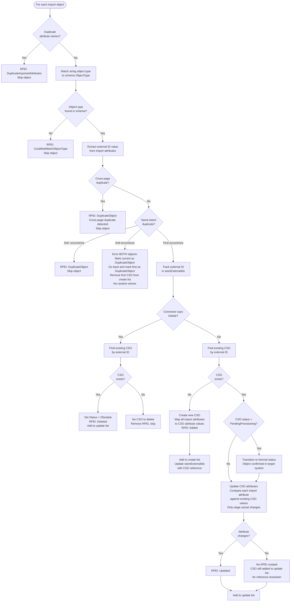
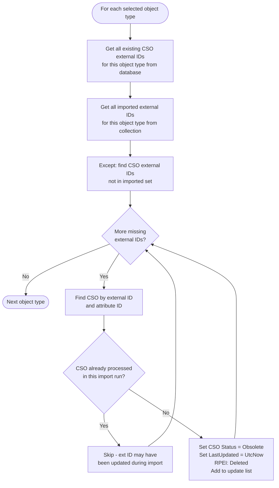
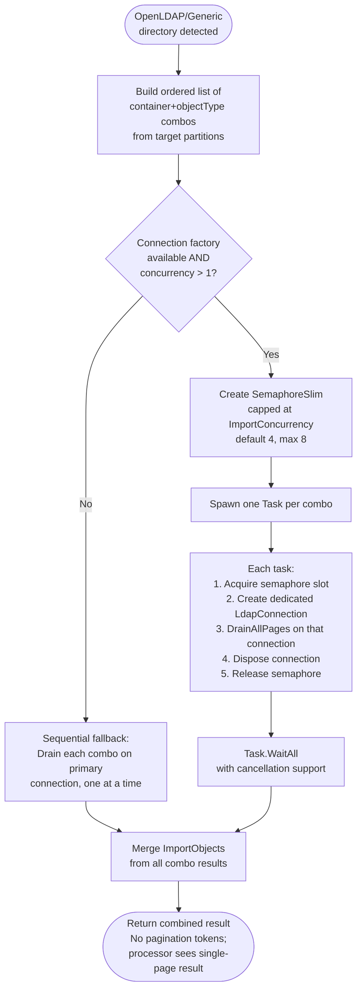
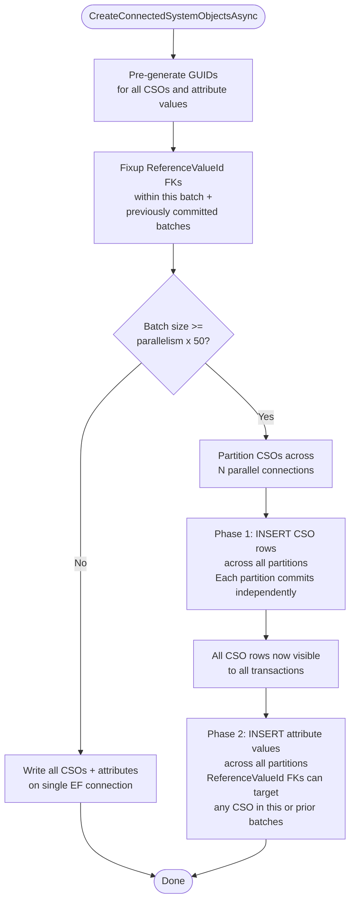
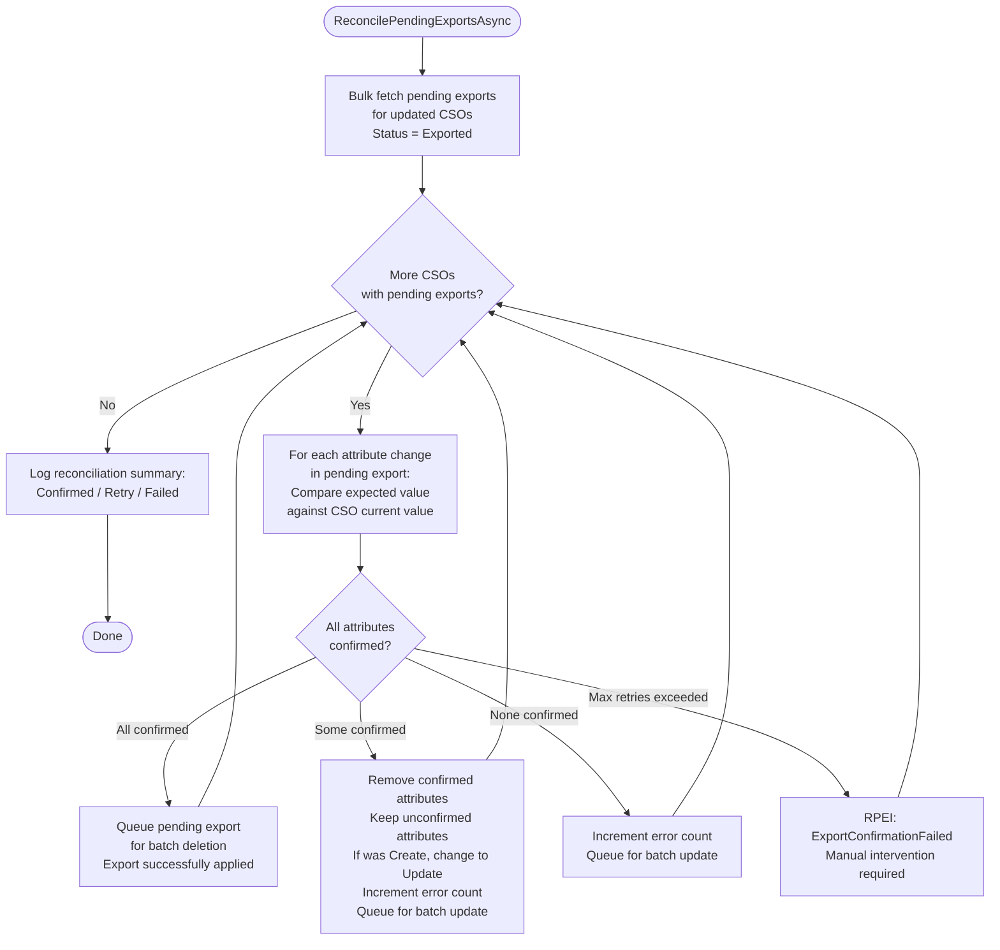

# Full Import Flow

> Last updated: 2026-04-01, JIM v0.8.0

This diagram shows how objects are imported from a connected system into JIM's connector space. Both Full Import and Delta Import use the same processor (`SyncImportTaskProcessor`); the connector handles delta filtering internally via watermark/persisted data.

Since v0.7.1, the import processor uses `ISyncServer` for orchestration (settings, caching, reconciliation) and `ISyncRepository` for dedicated bulk data access (CSO writes, RPEIs).

Since v0.8.0, LDAP connectors for OpenLDAP/Generic directories import using **parallel connections**: each container+objectType combination runs on its own dedicated `LdapConnection`, bypassing RFC 2696 paging cookie limitations (#72). CSO persistence uses **two-phase parallel writes** when writing large batches (#427). Run profiles can optionally **target a specific partition**, filtering which containers are imported (#353).

## Overall Import Flow

```mermaid
flowchart TD
    Start([PerformFullImportAsync]) --> ConnType{Connector<br/>type?}

    %% --- Call-based connector (e.g., LDAP) ---
    ConnType -->|IConnectorImportUsingCalls| InjectServices[Inject CertificateProvider<br/>and CredentialProtection<br/>if connector supports them]
    InjectServices --> OpenConn[OpenImportConnection<br/>with system settings]
    OpenConn --> PartFilter[GetTargetPartitions:<br/>Run profile partition set?<br/>Use it. Otherwise all selected.]
    PartFilter --> InitPage[initialPage = true<br/>paginationTokens = empty<br/>Capture original PersistedConnectorData]

    InitPage --> PagingCheck{Connection-scoped<br/>paging? OpenLDAP/Generic}
    PagingCheck -->|Yes, parallel path| ParallelImport[Build container+objectType combos<br/>One dedicated LdapConnection per combo<br/>Concurrency capped at ImportConcurrency<br/>See Parallel LDAP Import below]
    ParallelImport --> UpdateProgressP[Update activity progress<br/>Imported N objects]
    UpdateProgressP --> CollectExtIdsP[Add external IDs<br/>to collection]
    CollectExtIdsP --> ProcessPageP[ProcessImportObjectsAsync]
    ProcessPageP --> UpdatePersistedData

    PagingCheck -->|No, AD or sequential| PageLoop{More pages?<br/>initialPage OR<br/>tokens present}
    PageLoop -->|Yes| Import[connector.ImportAsync<br/>Pass original persisted data<br/>to ensure consistent watermark]
    Import --> UpdateProgress[Update activity progress<br/>Imported N objects page M]
    UpdateProgress --> CollectExtIds[Add external IDs from this page<br/>to externalIdsImported collection]
    CollectExtIds --> CaptureWatermark{First page with<br/>new persisted data?}
    CaptureWatermark -->|Yes| SaveWatermark[Capture new watermark<br/>Don't save yet - save after all pages]
    CaptureWatermark -->|No| ProcessPage
    SaveWatermark --> ProcessPage[ProcessImportObjectsAsync<br/>See Per-Object Processing below]
    ProcessPage --> PassTokens[Pass pagination tokens<br/>for next page]
    PassTokens --> PageLoop

    PageLoop -->|No| UpdatePersistedData{New watermark<br/>captured?}
    UpdatePersistedData -->|Yes| PersistWatermark[Update ConnectedSystem<br/>PersistedConnectorData]
    UpdatePersistedData -->|No| CloseConn
    PersistWatermark --> CloseConn[CloseImportConnection]

    %% --- File-based connector ---
    ConnType -->|IConnectorImportUsingFiles| FileImport[connector.ImportAsync<br/>Returns all objects at once]
    FileImport --> FileProgress[Update activity:<br/>Processing N objects]
    FileProgress --> FileCollect[Add external IDs<br/>to collection]
    FileCollect --> FileProcess[ProcessImportObjectsAsync]
    FileProcess --> PostImport

    CloseConn --> PostImport{Full Import<br/>and objects > 0?}

    %% --- Deletion detection ---
    PostImport -->|Yes| DeletionDetection[Deletion Detection<br/>For each selected object type:<br/>Compare imported ext IDs<br/>against existing CSO ext IDs<br/>Mark missing CSOs as Obsolete]
    PostImport -->|No, Delta Import<br/>or 0 objects| RefResolution

    DeletionDetection --> RefResolution[Reference Resolution<br/>Resolve unresolved reference strings<br/>into CSO links by external ID]

    %% --- Persist via ISyncRepository ---
    RefResolution --> PersistCreate[Batch create new CSOs<br/>via ISyncRepository<br/>Two-phase parallel write for large batches<br/>See Two-Phase CSO Persistence below]
    PersistCreate --> PersistUpdate[Batch update existing CSOs<br/>with change objects via ISyncRepository]

    %% --- Reconciliation ---
    PersistUpdate --> Reconcile[Reconcile Pending Exports<br/>See Confirming Import below]
    Reconcile --> ValidateRpeis[Validate RPEIs<br/>Detect orphaned create RPEIs<br/>with no CSO assigned]
    ValidateRpeis --> PersistRpeis[Add RPEIs to Activity<br/>and persist]
    PersistRpeis --> End([Import Complete])
```

## Per-Object Processing

For each object in an import page, within `ProcessImportObjectsAsync`:

## Deletion Detection (Full Import Only)

**Safety rule**: If zero objects were imported, deletion detection is skipped entirely. This prevents accidental mass-deletion when the connected system returns no data due to connectivity issues.

**Delta Import exception**: Deletion detection only runs for Full Import. Delta Imports handle explicit deletes via `ObjectChangeType.Deleted` from the connector (e.g., LDAP tombstone/changelog entries).

## Parallel LDAP Import (#72)

For OpenLDAP and Generic LDAP directories, RFC 2696 paging cookies are connection-scoped; starting a new search on the same connection invalidates all outstanding paging cursors. To work around this, the LDAP connector gives each container+objectType combination its own dedicated `LdapConnection` and runs them concurrently, capped by the Import Concurrency setting (default 4, max 8). Each connection fully drains all pages for its combo before being disposed.

AD directories are unaffected; they support multiple concurrent paged searches on a single connection and continue to use the original multi-combo-per-page logic.

**Key properties**: Each combo runs independently with its own paging cursor. The import processor receives the merged result as a single page (no cross-call pagination tokens). If any combo fails, the exception propagates and the import is aborted.

## Two-Phase CSO Persistence (#427)

When the CSO create batch is large enough (>= parallelism x 50), `CreateConnectedSystemObjectsAsync` partitions the work across N parallel database connections. A two-phase write ensures that cross-partition FK references (e.g., a CSO in partition A referencing a CSO in partition B) succeed without post-hoc fixup.

For small batches, all CSOs and attribute values are written on a single connection in one transaction.

**Why two phases?** Without the split, a CSO in partition A could have an attribute referencing a CSO in partition B. If both partitions write concurrently in one transaction, partition A's FK INSERT would fail because partition B's CSO row isn't committed yet. Phase 1 commits all CSO rows first, making them globally visible; Phase 2 then writes attribute values with full FK visibility.

## Confirming Import - Pending Export Reconciliation

After CSOs are persisted, the import processor reconciles previously exported changes against the freshly imported values. This is how JIM confirms that exports actually took effect.

## Key Design Decisions

- **Cross-page duplicate detection**: A `HashSet<string>` tracks external IDs across all pages of a paginated import. This is defence-in-depth against directory servers with faulty paging (e.g., Samba AD).

- **Same-batch duplicate handling**: When duplicates are found within a single page, BOTH objects are rejected (no "random winner" based on file order). This forces data owners to fix the source data.

- **Watermark consistency**: For paginated delta imports, the original persisted connector data (watermark/USN) is passed to every page. The new watermark from the first page is only saved after all pages complete, ensuring consistent queries.

- **RPEI list separation**: RPEIs are maintained separately from the Activity during import to avoid EF Core accidentally persisting CSOs before they're ready (EF would follow the Activity -> RPEI -> CSO navigation chain during `SaveChanges`).

- **Zero-import safety**: If no objects are imported, deletion detection is skipped entirely to prevent accidental mass-deletion when connectivity to the source system fails.

- **PendingProvisioning transition**: CSOs created during export (provisioning) start with `PendingProvisioning` status. The confirming import transitions them to `Normal` when the object is confirmed to exist in the target system.

- **Parallel LDAP connections (#72)**: OpenLDAP/Generic directories use connection-scoped RFC 2696 paging cookies, so each container+objectType combo gets its own `LdapConnection`. Concurrency is capped by the Import Concurrency setting (default 4, max 8). AD directories are unaffected; they multiplex paged searches on a single connection. When the connection factory is unavailable or concurrency is 1, the connector falls back to sequential single-connection processing.

- **Two-phase parallel write (#427)**: CSO persistence splits INSERT into two committed phases (CSO rows first, then attribute values) so that cross-partition FK references (ReferenceValueId pointing to a CSO on a different parallel connection) succeed without post-hoc fixup. Small batches (< parallelism x 50) bypass this and write on a single connection. Write parallelism defaults to `Environment.ProcessorCount` (minimum 2) and is tuneable via `JIM_WRITE_PARALLELISM`.

- **Partition-scoped imports (#353)**: Run profiles can target a specific partition via `GetTargetPartitions()`. When set, only containers within that partition are imported; otherwise all selected partitions are included. This applies to both the import data collection and deletion detection scope.
