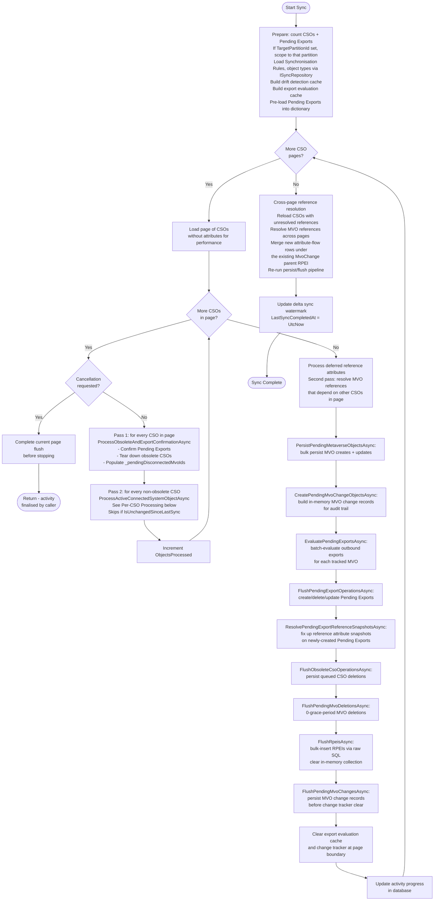
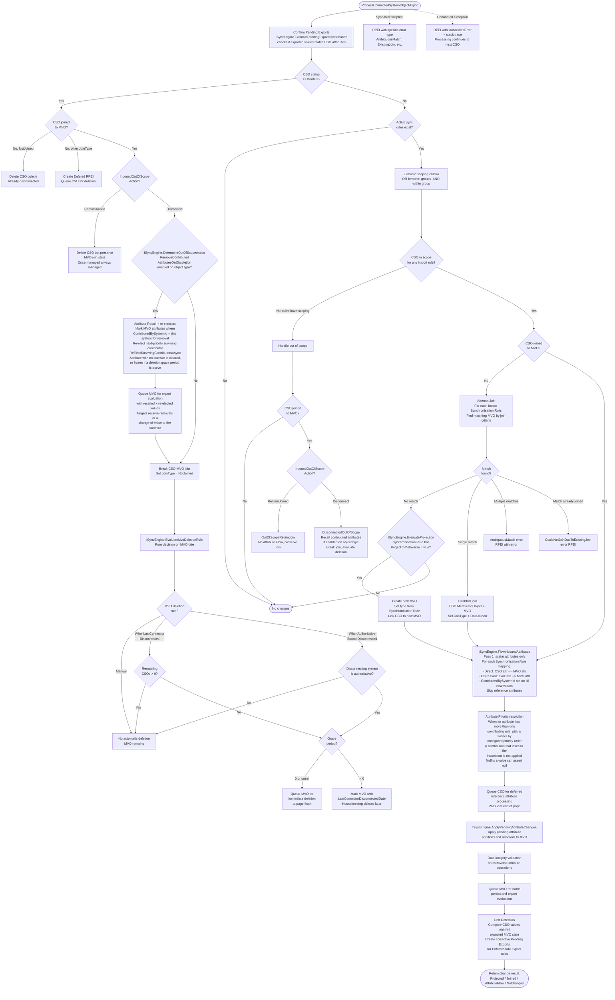

# Full Synchronisation - CSO Processing Flow

> Last updated: 2026-07-10, JIM v0.13.0

This diagram shows the core decision tree for processing a single Connected System Object (CSO) during Full or Delta Synchronisation. This is the central flow of JIM's identity management engine.

Both Full Sync and Delta Sync use identical processing logic per-CSO. The only difference is CSO selection:
- **Full Sync**: processes ALL CSOs in the Connected System (or only those in the target partition, if the Run Profile specifies a `TargetPartitionId`; see below)
- **Delta Sync**: processes only CSOs modified since `LastSyncCompletedAt`

Since v0.7.1, sync decisions are split across three layers:
- **ISyncEngine:** Pure domain logic (projection, Attribute Flow, deletion rules, export confirmation). Stateless, I/O-free.
- **ISyncServer:** Orchestration facade (matching, scoping, drift detection, export evaluation). Delegates to application-layer servers.
- **ISyncRepository:** Dedicated data access (bulk CSO/MVO writes, Pending Exports, RPEIs).

## Overall Page Processing

## Per-CSO Processing

This is the decision tree within `ProcessConnectedSystemObjectAsync` for a single CSO.

## Key Design Decisions

- **Three-layer sync architecture (v0.7.1)**  Sync decisions are split across `ISyncEngine` (pure domain logic: projection, Attribute Flow, deletion rules, export confirmation), `ISyncServer` (orchestration: matching, scoping, drift detection, export evaluation), and `ISyncRepository` (dedicated data access: bulk CSO/MVO writes, Pending Exports, RPEIs). This separation enables deterministic unit testing of business logic without I/O.

- **Two-pass Attribute Flow**  Scalar attributes are processed first (pass 1 via `ISyncEngine.FlowInboundAttributes`), then reference attributes are deferred to a second pass after all CSOs in the page have MVOs. This ensures group member references can resolve to MVOs that were created later in the same page.

- **Batch persistence**  MVO creates/updates, Pending Exports, and CSO deletions are all batched per-page via `ISyncRepository` bulk operations to reduce database round trips. This is critical for performance at scale.

- **No-net-change detection**  Before creating Pending Exports, the system checks if the target CSO already has the expected values (using pre-cached data). This avoids unnecessary export operations.

- **Drift detection**  After inbound Attribute Flow, `DriftDetectionService` checks whether CSO values match expected MVO state. If an `EnforceState` export rule exists and the CSO has drifted, a corrective Pending Export is created.

- **Attribute recall, re-election and hand-over via ContributedBySystemId**  Every MVO attribute value tracks which Connected System contributed it. When a CSO is obsoleted, attributes contributed by that system are recalled (marked for removal from the MVO) when **both** of the following hold: the CSO type has `RemoveContributedAttributesOnObsoletion` enabled, and the MVO is not slated for immediate deletion (the immediate-deletion check avoids nugatory work when the MVO is about to be deleted at page flush, per #390). A configured deletion grace period no longer skips recall wholesale (Attribute Priority, #91): before clearing, `ReElectSurvivingContributorsAsync` hands each recalled attribute to the next-priority still-joined contributor where one survives, a change-of-value rather than a clear. Only an attribute with no surviving contributor is affected by the grace period: it is frozen (preserved) for the grace window rather than cleared, so identity-critical single-source values that feed expression-based exports (for example an LDAP Distinguished Name) are not cleared mid-grace. The recalled and re-elected values are queued for export evaluation so target systems receive the removals or the change-of-value; the only export-evaluation skip is for MVOs pending immediate deletion, whose Delete Pending Exports are created by `FlushPendingMvoDeletionsAsync` instead.

- **Cross-page reference resolution**  After all pages are processed, CSOs with unresolved reference attributes are reloaded from the database. At this point, all MVOs exist, so cross-page references can be resolved. The standard flush pipeline (persist MVOs, evaluate exports, flush PEs) runs again for the resolved references.

- **Partition-scoped imports (v0.8.0, #353)**  When a Run Profile specifies a `TargetPartitionId`, CSO counting and page loading are filtered to only that partition's scope. This allows large Connected Systems to be synchronised in targeted slices rather than processing the entire CSO population every time.

- **Error isolation**  Each CSO is processed within its own try/catch. Errors create RPEIs but do not halt processing of remaining CSOs.

- **Cancellation safety**  `CheckCancel` completes the current page flush before stopping. This ensures all in-progress MVOs, Pending Exports, and RPEIs are persisted; no work is lost on cancellation.

- **Per-page cache loading**  The export evaluation cache is loaded per-page and cleared at page boundaries. This keeps memory consumption bounded regardless of total CSO count, preventing out-of-memory conditions on large Connected Systems.

- **Data integrity validation (v0.9.0, #465)**  Metaverse attribute operations are validated for data integrity before being applied. This prevents silent corruption from malformed attribute values reaching the metaverse.

- **Two-pass per-CSO processing (v0.10.0)**  Each page iterates over its CSOs twice. Pass 1 (`ProcessObsoleteAndExportConfirmationAsync`) handles pending-export confirmation and obsolete CSO teardown for every CSO, populating `_pendingDisconnectedMvoIds` before any Pass 2 work begins. Pass 2 (`ProcessActiveConnectedSystemObjectAsync`) runs join/projection/Attribute Flow only for non-obsolete CSOs. This ordering guarantees that Pass 2 join attempts see the complete set of disconnected MVOs from Pass 1 and skip them, avoiding race conditions where a CSO tries to join an MVO that is being torn down in the same page.

- **Cross-page RPEI merge (v0.10.0)**  The unique index `IX_MetaverseObjectChanges_ActivityRunProfileExecutionItemId` means each RPEI can have at most one MvoChange parent. Cross-page reference resolution therefore merges new reference-attribute changes *under the existing MvoChange parent* rather than creating a second standalone RPEI for the same MVO. This resolves the previous ~2x RPEI duplication and the confusing split-outcome rows that appeared in activity detail when groups spanned multiple pages.

- **Two-phase MVO change persistence (v0.10.0)**  MVO change records are built in-memory during the page (`CreatePendingMvoChangeObjectsAsync`) and persisted in a distinct `FlushPendingMvoChangesAsync` step that runs *before* the change tracker clear. Splitting creation from persistence avoids losing the in-memory records when the change tracker is cleared to bound memory at page boundaries.
