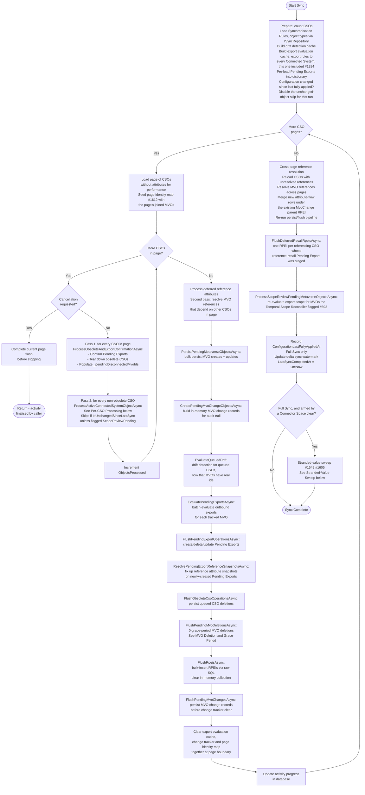
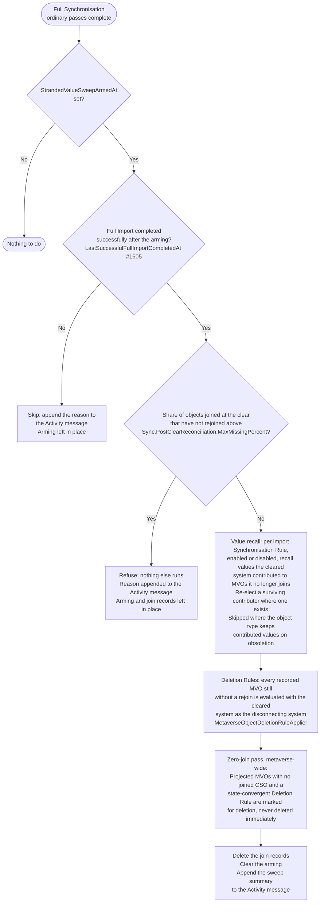

# Full Synchronisation - CSO Processing Flow

> Last updated: 2026-09-23, JIM v0.15.0

This diagram shows the core decision tree for processing a single Connected System Object (CSO) during Full or Delta Synchronisation. This is the central flow of JIM's identity management engine.

Both Full Sync and Delta Sync use identical processing logic per-CSO. The only difference is CSO selection:
- **Full Sync**: processes ALL CSOs in the Connected System. A CSO unchanged since the last completed synchronisation skips Attribute Flow, unless Synchronisation Rule configuration has changed since `ConfigurationLastFullyAppliedAt` (the start of the last completed Full Synchronisation), in which case the skip is disabled for the whole run so the new configuration reaches every object
- **Delta Sync**: processes only CSOs modified since `LastSyncCompletedAt`

A Run Profile's partition (#353) scopes imports and their deletion detection only; synchronisation always works across the whole Connector Space.

Since v0.7.1, sync decisions are split across three layers:
- **ISyncEngine:** Pure domain logic (projection, Attribute Flow, deletion rules, export confirmation). Stateless, I/O-free.
- **ISyncServer:** Orchestration facade (matching, scoping, drift detection, export evaluation). Delegates to application-layer servers.
- **ISyncRepository:** Dedicated data access (bulk CSO/MVO writes, Pending Exports, RPEIs).

## Overall Page Processing

```mermaid
flowchart TD
    Start([Start Sync]) --> Prepare[Prepare: count CSOs<br/>Load Synchronisation Rules, object types via ISyncRepository<br/>Build drift detection cache<br/>Build export evaluation cache: export rules to<br/>every Connected System, this one included #1284<br/>Pre-load Pending Exports into dictionary<br/>Configuration changed since last fully applied?<br/>Disable the unchanged-object skip for this run]
    Prepare --> PageLoop{More CSO<br/>pages?}

    PageLoop -->|Yes| LoadPage[Load page of CSOs<br/>without attributes for performance<br/>Seed page identity map #1612 with<br/>the page's joined MVOs]
    LoadPage --> CsoLoop{More CSOs<br/>in page?}

    CsoLoop -->|Yes| CheckCancel{Cancellation<br/>requested?}
    CheckCancel -->|Yes| FlushBeforeCancel[Complete current page flush<br/>before stopping]
    FlushBeforeCancel --> Return([Return - activity<br/>finalised by caller])
    CheckCancel -->|No| Pass1[Pass 1: for every CSO in page<br/>ProcessObsoleteAndExportConfirmationAsync<br/>- Confirm Pending Exports<br/>- Tear down obsolete CSOs<br/>- Populate _pendingDisconnectedMvoIds]
    Pass1 --> Pass2[Pass 2: for every non-obsolete CSO<br/>ProcessActiveConnectedSystemObjectAsync<br/>See Per-CSO Processing below<br/>Skips if IsUnchangedSinceLastSync<br/>unless flagged ScopeReviewPending]
    Pass2 --> IncrProgress[Increment ObjectsProcessed]
    IncrProgress --> CsoLoop

    CsoLoop -->|No| DeferredRef[Process deferred reference attributes<br/>Second pass: resolve MVO references<br/>that depend on other CSOs in page]
    DeferredRef --> PersistMvo[PersistPendingMetaverseObjectsAsync:<br/>bulk persist MVO creates + updates]
    PersistMvo --> CreateMvoChanges[CreatePendingMvoChangeObjectsAsync:<br/>build in-memory MVO change records<br/>for audit trail]
    CreateMvoChanges --> EvalDrift[EvaluateQueuedDrift:<br/>drift detection for queued CSOs,<br/>now that MVOs have real ids]
    EvalDrift --> EvalExports[EvaluatePendingExportsAsync:<br/>batch-evaluate outbound exports<br/>for each tracked MVO]
    EvalExports --> FlushPE[FlushPendingExportOperationsAsync:<br/>create/delete/update Pending Exports]
    FlushPE --> ResolveSnapshots[ResolvePendingExportReferenceSnapshotsAsync:<br/>fix up reference attribute snapshots<br/>on newly-created Pending Exports]
    ResolveSnapshots --> FlushCSO[FlushObsoleteCsoOperationsAsync:<br/>persist queued CSO deletions]
    FlushCSO --> FlushMVO[FlushPendingMvoDeletionsAsync:<br/>0-grace-period MVO deletions<br/>See MVO Deletion and Grace Period]
    FlushMVO --> FlushRpeis[FlushRpeisAsync:<br/>bulk-insert RPEIs via raw SQL<br/>clear in-memory collection]
    FlushRpeis --> FlushMvoChanges[FlushPendingMvoChangesAsync:<br/>persist MVO change records<br/>before change tracker clear]
    FlushMvoChanges --> ClearCache[Clear export evaluation cache,<br/>change tracker and page identity map<br/>together at page boundary]
    ClearCache --> UpdateProgress[Update activity progress<br/>in database]
    UpdateProgress --> PageLoop

    PageLoop -->|No| CrossPage[Cross-page reference resolution<br/>Reload CSOs with unresolved references<br/>Resolve MVO references across pages<br/>Merge new attribute-flow rows under<br/>the existing MvoChange parent RPEI<br/>Re-run persist/flush pipeline]
    CrossPage --> DeferredRecall[FlushDeferredRecallRpeisAsync:<br/>one RPEI per referencing CSO whose<br/>reference-recall Pending Export was staged]
    DeferredRecall --> ScopeReview[ProcessScopeReviewPendingMetaverseObjectsAsync:<br/>re-evaluate export scope for MVOs the<br/>Temporal Scope Reconciler flagged #892]
    ScopeReview --> Watermark[Record ConfigurationLastFullyAppliedAt<br/>Full Sync only<br/>Update delta sync watermark<br/>LastSyncCompletedAt = UtcNow]
    Watermark --> Sweep{Full Sync, and armed by<br/>a Connector Space clear?}
    Sweep -->|No| End([Sync Complete])
    Sweep -->|Yes| StrandedSweep[Stranded-value sweep #1549 #1605<br/>See Stranded-Value Sweep below]
    StrandedSweep --> End
```

## Per-CSO Processing

This is the decision tree for a single CSO, spanning Pass 1 (`ProcessObsoleteAndExportConfirmationAsync`, whose obsolete path is `ConnectedSystemObjectObsoletionService`) and Pass 2 (`ProcessActiveConnectedSystemObjectAsync`).

```mermaid
flowchart TD
    Entry([Process one CSO]) --> ConfirmPE[Confirm Pending Exports<br/>ISyncEngine.EvaluatePendingExportConfirmation<br/>checks if exported values match CSO attributes]
    ConfirmPE --> CheckObsolete{CSO status<br/>= Obsolete?}

    %% --- Obsolete CSO path ---
    CheckObsolete -->|Yes| CheckJoined{CSO joined<br/>to MVO?}
    CheckJoined -->|No, NotJoined| QuietDelete[Delete CSO quietly<br/>Already disconnected]
    CheckJoined -->|No, other JoinType| DeleteOrphan[Create Deleted RPEI<br/>Queue CSO for deletion]
    CheckJoined -->|Yes| CheckOosAction{ISyncEngine.DetermineOutOfScopeAction<br/>InboundOutOfScope<br/>Action?}

    CheckOosAction -->|RemainJoined| KeepJoin[Delete CSO but preserve<br/>MVO join state<br/>Once managed always managed]
    CheckOosAction -->|Disconnect| RemoveAttrs{RemoveContributed<br/>AttributesOnObsoletion<br/>enabled on object type?<br/>The Deletion Rule is evaluated first,<br/>recall is skipped if the MVO<br/>will be deleted immediately}

    RemoveAttrs -->|Yes| RecallAttrs[Attribute Recall + re-election:<br/>Mark MVO attributes where<br/>ContributedBySystemId = this system for removal<br/>Re-elect next-priority surviving contributor<br/>ReElectSurvivingContributorsAsync<br/>Attribute with no survivor is cleared,<br/>or frozen if a deletion is pending,<br/>or preserved if no import source remains #1570]
    RemoveAttrs -->|No| BreakJoin
    RecallAttrs --> QueueRecall[Queue MVO for export evaluation<br/>with recalled + re-elected values<br/>Targets receive removals or a<br/>change-of-value to the survivor]
    QueueRecall --> BreakJoin[Break CSO-MVO join<br/>Set JoinType = NotJoined]
    BreakJoin --> EvalDeletion[ISyncEngine.EvaluateMvoDeletionRule<br/>Pure decision on MVO fate]
    EvalDeletion --> DeletionRule{MVO deletion<br/>rule?}

    DeletionRule -->|Manual| NoDelete[No automatic deletion<br/>MVO remains]
    DeletionRule -->|WhenLastConnector<br/>Disconnected| CheckRemaining{Remaining<br/>CSOs > 0?}
    CheckRemaining -->|Yes| NoDelete
    CheckRemaining -->|No| CheckGrace{Grace<br/>period?}

    DeletionRule -->|WhenAuthoritative<br/>SourceDisconnected| CheckAuth{Disconnecting system<br/>is authoritative?}
    CheckAuth -->|No| NoDelete
    CheckAuth -->|Yes| CheckGrace

    CheckGrace -->|0 or unset| ImmediateDelete[Queue MVO for<br/>immediate deletion<br/>at page flush]
    CheckGrace -->|> 0| DeferDelete[Mark MVO with<br/>LastConnectorDisconnectedDate<br/>Housekeeping deletes later]

    %% --- Non-obsolete CSO path ---
    CheckObsolete -->|No| CheckSyncRules{Active sync<br/>rules exist?}
    CheckSyncRules -->|No| Done([No changes])

    CheckSyncRules -->|Yes| CheckScope[Evaluate scoping criteria<br/>OR between groups, AND within group]
    CheckScope --> InScope{CSO in scope<br/>for any import rule?}

    InScope -->|No, rules have scoping| HandleOOS[Handle out of scope]
    HandleOOS --> OosJoined{CSO joined<br/>to MVO?}
    OosJoined -->|No| Done
    OosJoined -->|Yes| OosAction{InboundOutOfScope<br/>Action?}
    OosAction -->|RemainJoined| RetainJoin[OutOfScopeRetainJoin<br/>No Attribute Flow, preserve join<br/>OutOfScopeRetainJoin outcome root]
    OosAction -->|Disconnect| DisconnectOOS[DisconnectedOutOfScope<br/>Evaluate deletion, then recall contributed<br/>attributes if enabled on object type,<br/>with the same re-election and freeze rules<br/>Break join, MVO queued for the<br/>page flush, never saved mid-page #1610]

    InScope -->|Yes| CheckMvo{CSO joined<br/>to MVO?}

    %% --- Join/Project path ---
    CheckMvo -->|No| AttemptJoin[Attempt Join<br/>For each import Synchronisation Rule:<br/>Find matching MVO by join criteria]
    AttemptJoin --> JoinResult{Match<br/>found?}

    JoinResult -->|No match| AttemptProject{ISyncEngine.EvaluateProjection<br/>Synchronisation Rule has<br/>ProjectToMetaverse = true?}
    AttemptProject -->|Yes| Project[Create new MVO<br/>Set type from Synchronisation Rule<br/>Link CSO to new MVO]
    AttemptProject -->|No| Done

    JoinResult -->|Single match| EstablishJoin[Establish join<br/>CSO.MetaverseObject = MVO<br/>Set JoinType + DateJoined<br/>Cancels a scheduled MVO deletion when<br/>the rejoin falsifies its trigger:<br/>MvoDeletionCancelled outcome #1627]
    JoinResult -->|Multiple matches| AmbiguousError[AmbiguousMatch error<br/>RPEI with error]
    JoinResult -->|Match already joined| ExistingJoinError[CouldNotJoinDueToExistingJoin<br/>error RPEI]

    %% --- Attribute Flow path ---
    EstablishJoin --> AttrFlow
    Project --> AttrFlow
    CheckMvo -->|Yes| AttrFlow[ISyncEngine.FlowInboundAttributes<br/>Pass 1: scalar attributes only<br/>For each in-scope import Synchronisation Rule<br/>and each of its enabled mappings:<br/>- Direct: CSO attr --> MVO attr<br/>- Expression: evaluate --> MVO attr<br/>- ContributedBySystemId set on all new values<br/>Skip reference attributes]

    AttrFlow --> Priority[Attribute Priority resolution<br/>When an attribute has more than one<br/>contributing rule, pick a winner by<br/>configured priority order<br/>A contribution that loses to the<br/>incumbent is not applied<br/>Null is a value can assert null]
    Priority --> QueueRef[Queue CSO for deferred<br/>reference attribute processing<br/>Pass 2 at end of page]
    QueueRef --> Orphaned[ISyncEngine.RecallOrphanedContributions #1533:<br/>stage removal of values this system contributed<br/>through a mapping that has been deleted<br/>A disabled mapping or rule is dormant:<br/>its values are retained #1537]
    Orphaned --> Withdrawal[Withdrawal re-election:<br/>an attribute left with no value hands over<br/>to the next surviving contributor,<br/>or is cleared as a NoContributor outcome]
    Withdrawal --> ApplyChanges[ISyncEngine.ApplyPendingAttributeChanges<br/>Apply pending attribute<br/>additions and removals to MVO]
    ApplyChanges --> ValidateIntegrity[Data integrity validation<br/>on metaverse attribute operations]
    ValidateIntegrity --> QueueMvo[Queue MVO for batch<br/>persist and export evaluation]
    QueueMvo --> DriftDetect[Queue Drift Detection<br/>evaluated at the page flush, once MVOs<br/>are persisted: compare CSO values against<br/>expected MVO state, stage corrective<br/>Pending Exports for EnforceState export rules]
    DriftDetect --> Result([Return change result:<br/>Projected / Joined / AttributeFlow / NoChanges])

    %% --- Error handling ---
    Entry -.->|SyncJoinException| JoinError[RPEI with specific error type<br/>AmbiguousMatch, ExistingJoin, etc.]
    Entry -.->|Expression failed or<br/>missing input| ExpressionError[RPEI: ExpressionEvaluationError<br/>or ExpressionMissingInput<br/>MVO left untouched]
    Entry -.->|Unhandled Exception| UnhandledError[RPEI with UnhandledError<br/>+ stack trace<br/>Processing continues to next CSO]
```

## Stranded-Value Sweep (after a Connector Space Clear)

A Connector Space clear hard-deletes Connected System Objects without obsoleting them, so no recall or Deletion Rule decision ever runs for them, and it arms the Connected System (`StrandedValueSweepArmedAt`). The Worker runs `ExecuteStrandedValueSweepIfArmedAsync` straight after `PerformFullSyncAsync` returns; every other Full Synchronisation pays one nullable-timestamp read, and Delta Synchronisation never calls it.

```mermaid
flowchart TD
    Start([Full Synchronisation<br/>ordinary passes complete]) --> Armed{StrandedValueSweepArmedAt<br/>set?}
    Armed -->|No| Done([Nothing to do])
    Armed -->|Yes| Gate{Full Import completed<br/>successfully after the arming?<br/>LastSuccessfulFullImportCompletedAt #1605}
    Gate -->|No| Skip[Skip: append the reason to<br/>the Activity message<br/>Arming left in place]
    Gate -->|Yes| Shortfall{Share of objects joined at the clear<br/>that have not rejoined above<br/>Sync.PostClearReconciliation.MaxMissingPercent?}
    Shortfall -->|Yes| Refuse[Refuse: nothing else runs<br/>Reason appended to the Activity message<br/>Arming and join records left in place]
    Shortfall -->|No| Recall[Value recall: per import Synchronisation Rule,<br/>enabled or disabled, recall values the cleared<br/>system contributed to MVOs it no longer joins<br/>Re-elect a surviving contributor where one exists<br/>Skipped where the object type keeps<br/>contributed values on obsoletion]
    Recall --> DeletionRules[Deletion Rules: every recorded MVO still<br/>without a rejoin is evaluated with the cleared<br/>system as the disconnecting system<br/>MetaverseObjectDeletionRuleApplier]
    DeletionRules --> ZeroJoin[Zero-join pass, metaverse-wide:<br/>Projected MVOs with no joined CSO and a<br/>state-convergent Deletion Rule are marked<br/>for deletion, never deleted immediately]
    ZeroJoin --> Clear[Delete the join records<br/>Clear the arming<br/>Append the sweep summary<br/>to the Activity message]
```

A Full Import only arms the gate when it genuinely succeeded (`FullImportSuccessEvaluator`): `Complete`, or `CompleteWithWarning` with no object-level errors, and never when deletion detection withheld deletions under a Run Profile limit. That is what lets the sweep tell a re-imported Connector Space apart from an empty or half-rebuilt one.

## Key Design Decisions

- **Three-layer sync architecture (v0.7.1)**  Sync decisions are split across `ISyncEngine` (pure domain logic: projection, Attribute Flow, deletion rules, export confirmation), `ISyncServer` (orchestration: matching, scoping, drift detection, export evaluation), and `ISyncRepository` (dedicated data access: bulk CSO/MVO writes, Pending Exports, RPEIs). This separation enables deterministic unit testing of business logic without I/O.

- **Two-pass Attribute Flow**  Scalar attributes are processed first (pass 1 via `ISyncEngine.FlowInboundAttributes`), then reference attributes are deferred to a second pass after all CSOs in the page have MVOs. This ensures group member references can resolve to MVOs that were created later in the same page.

- **Batch persistence**  MVO creates/updates, Pending Exports, and CSO deletions are all batched per-page via `ISyncRepository` bulk operations to reduce database round trips. This is critical for performance at scale.

- **No-net-change detection**  Before creating Pending Exports, the system checks if the target CSO already has the expected values (using pre-cached data). This avoids unnecessary export operations.

- **Drift detection**  Inbound Attribute Flow queues each CSO for drift detection, and `EvaluateQueuedDrift` runs it at the page flush once MVOs are persisted (a Metaverse Object projected on this page has no id until then, and a corrective Pending Export records it). `DriftDetectionService` checks whether CSO values match expected MVO state. If an `EnforceState` export rule exists and the CSO has drifted, a corrective Pending Export is created.

- **Attribute recall, re-election and hand-over via ContributedBySystemId**  Every MVO attribute value tracks which Connected System contributed it. When a CSO is obsoleted, attributes contributed by that system are recalled (marked for removal from the MVO) when **both** of the following hold: the CSO type has `RemoveContributedAttributesOnObsoletion` enabled, and the MVO is not slated for immediate deletion (the immediate-deletion check avoids nugatory work when the MVO is about to be deleted at page flush, per #390). A configured deletion grace period no longer skips recall wholesale (Attribute Priority, #91): before clearing, `ReElectSurvivingContributorsAsync` hands each recalled attribute to the next-priority still-joined contributor where one survives, a change-of-value rather than a clear. Only an attribute with no surviving contributor is affected by the freeze: it is preserved rather than cleared when a deletion is pending (for the grace window) or when no remaining joined system carries an enabled import Synchronisation Rule for the object's type (as the object's last known state, surfaced as a `ValuesPreserved` outcome, #1570), so identity-critical single-source values that feed expression-based exports (for example an LDAP Distinguished Name) are not cleared. While an import source remains, the departed system's leftovers are recalled. The recalled and re-elected values are queued for export evaluation so target systems receive the removals or the change-of-value; the only export-evaluation skip is for MVOs pending immediate deletion, whose Delete Pending Exports are created by `FlushPendingMvoDeletionsAsync` instead.

- **Cross-page reference resolution**  After all pages are processed, CSOs with unresolved reference attributes are reloaded from the database. At this point, all MVOs exist, so cross-page references can be resolved. The standard flush pipeline (persist MVOs, evaluate exports, flush PEs) runs again for the resolved references.

- **Partition scope is an import concern (#353)**  A Run Profile's partition filters which containers an import reads and scopes that import's deletion detection. Synchronisation does not filter by partition: CSO counting and page loading always cover the whole Connector Space.

- **Configuration changes reach every object (v0.15.0)**  The unchanged-object skip is only safe while configuration is unchanged too. When any Synchronisation Rule or mapping (on any Connected System, because another system's priority affects this one's resolution) changed after `ConfigurationLastFullyAppliedAt`, a Full Synchronisation loads CSOs without the watermark so every object is re-evaluated, then records its own start time as the new baseline. A Delta Synchronisation never advances this baseline.

- **Orphaned-contribution recall (#1533, #1537)**  After the live mappings have flowed, a value this system contributed through an Attribute Flow mapping that has since been deleted has nothing asserting it any more, so it is staged for removal; the withdrawal re-election then hands the attribute to the next surviving contributor or lets it clear. A disabled mapping, or a mapping on a disabled rule, is dormant rather than gone, so its values are retained. Deleting a Synchronisation Rule with contributed values recalls them through its own queued task instead.

- **Export evaluation includes the Connected System being synchronised (#1284)**  The export evaluation cache holds export rules to every Connected System, including the one being synchronised, so an inbound change can stage a writeback export to its own source system.

- **Stranded-value sweep (#1549, #1605)**  A Connector Space clear bypasses obsoletion, so the next Full Synchronisation after a genuine Full Import recalls the values the cleared system stranded, applies Deletion Rules to objects that did not rejoin, and runs the metaverse-wide zero-join pass, subject to a re-join shortfall check that refuses the whole sweep when too many objects are missing.

- **Error isolation**  Each CSO is processed within its own try/catch. Errors create RPEIs but do not halt processing of remaining CSOs.

- **Cancellation safety**  `CheckCancel` completes the current page flush before stopping. This ensures all in-progress MVOs, Pending Exports, and RPEIs are persisted; no work is lost on cancellation.

- **Per-page cache loading**  The export evaluation cache is loaded per-page and cleared at page boundaries. This keeps memory consumption bounded regardless of total CSO count, preventing out-of-memory conditions on large Connected Systems.

- **Data integrity validation (v0.9.0, #465)**  Metaverse attribute operations are validated for data integrity before being applied. This prevents silent corruption from malformed attribute values reaching the metaverse.

- **Two-pass per-CSO processing (v0.10.0)**  Each page iterates over its CSOs twice. Pass 1 (`ProcessObsoleteAndExportConfirmationAsync`) handles pending-export confirmation and obsolete CSO teardown for every CSO, populating `_pendingDisconnectedMvoIds` before any Pass 2 work begins. Pass 2 (`ProcessActiveConnectedSystemObjectAsync`) runs join/projection/Attribute Flow only for non-obsolete CSOs. This ordering guarantees that Pass 2 join attempts see the complete set of disconnected MVOs from Pass 1 and skip them, avoiding race conditions where a CSO tries to join an MVO that is being torn down in the same page.

- **Cross-page RPEI merge (v0.10.0)**  The unique index `IX_MetaverseObjectChanges_ActivityRunProfileExecutionItemId` means each RPEI can have at most one MvoChange parent. Cross-page reference resolution therefore merges new reference-attribute changes *under the existing MvoChange parent* rather than creating a second standalone RPEI for the same MVO. This resolves the previous ~2x RPEI duplication and the confusing split-outcome rows that appeared in activity detail when groups spanned multiple pages.

- **Two-phase MVO change persistence (v0.10.0)**  MVO change records are built in-memory during the page (`CreatePendingMvoChangeObjectsAsync`) and persisted in a distinct `FlushPendingMvoChangesAsync` step that runs *before* the change tracker clear. Splitting creation from persistence avoids losing the in-memory records when the change tracker is cleared to bound memory at page boundaries.
