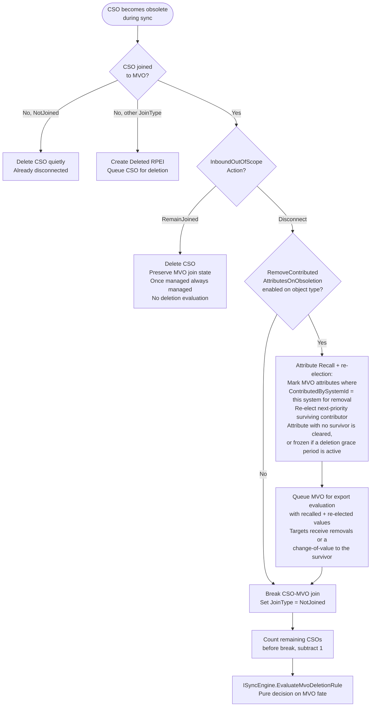
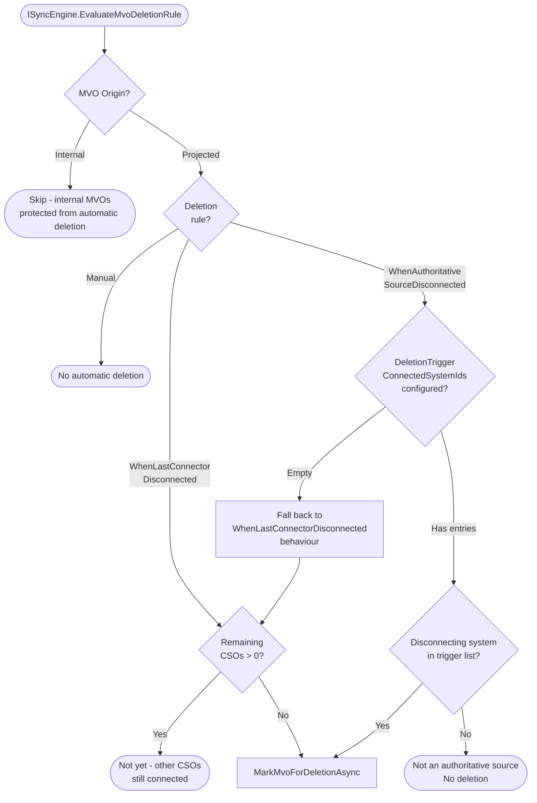
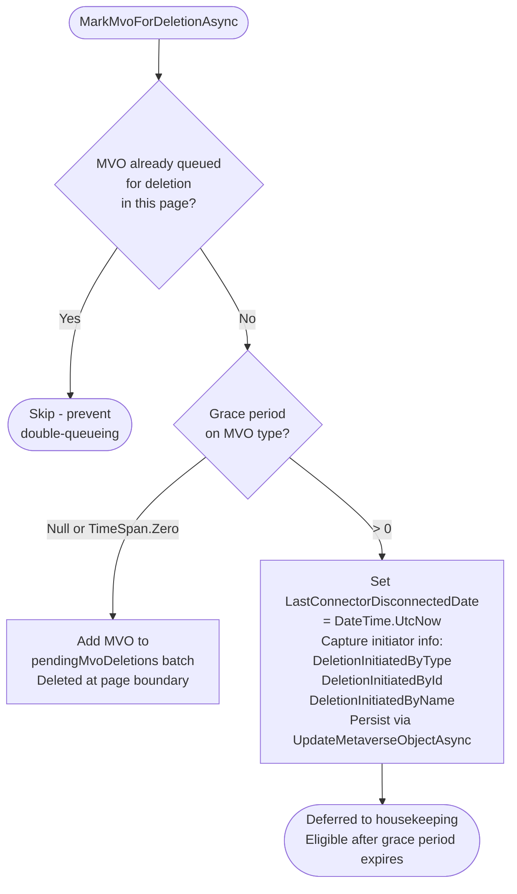
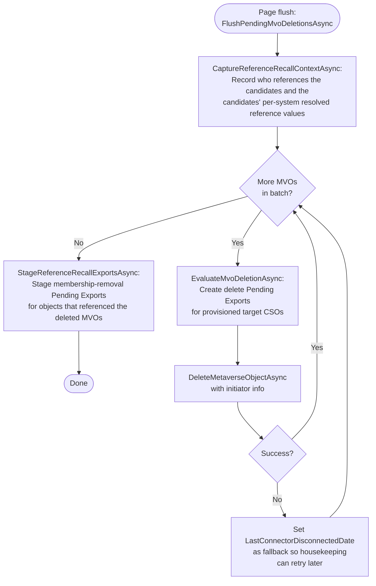
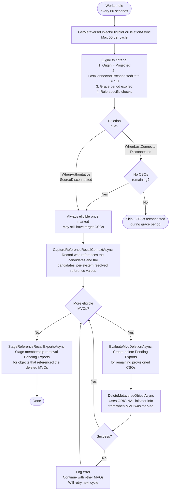
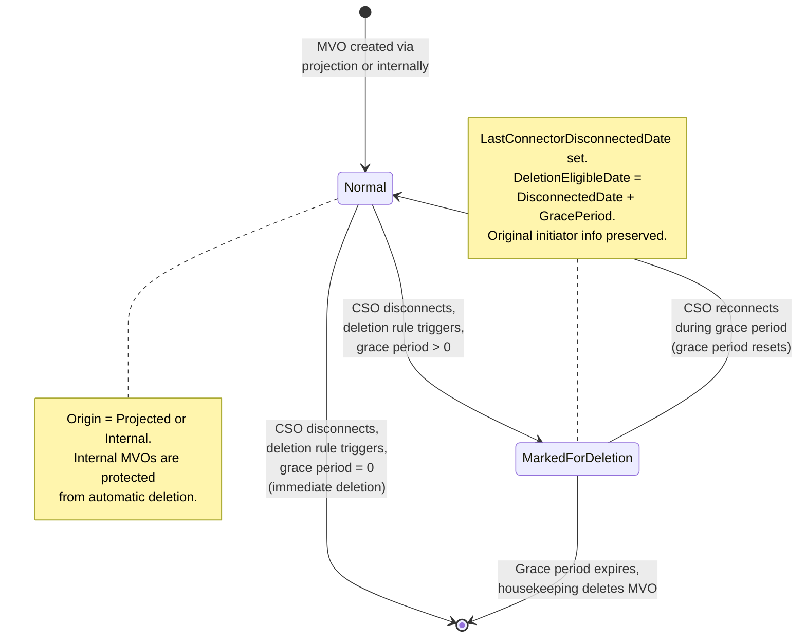

# MVO Deletion and Grace Period

> Last updated: 2026-07-10, JIM v0.13.0

This diagram shows the full lifecycle of Metaverse Object (MVO) deletion, from the trigger event (CSO disconnection) through deletion rule evaluation, grace period handling, and deferred housekeeping cleanup.

## Deletion Rules

| Rule | Value | Trigger | Behaviour |
|------|-------|---------|-----------|
| Manual | 0 | Never | MVO is never automatically deleted. Requires admin intervention. |
| WhenLastConnectorDisconnected | 1 | All CSOs disconnected | MVO deleted when no CSOs remain joined. Default rule. |
| WhenAuthoritativeSourceDisconnected | 2 | Specified system disconnects | MVO deleted when ANY system in `DeletionTriggerConnectedSystemIds` disconnects, even if other CSOs remain. |

## Trigger: CSO Disconnection During Sync

## Deletion Rule Evaluation

## Grace Period Decision

## Immediate Deletion (Zero Grace Period)

## Deferred Deletion (Housekeeping)

## State Diagram

## Key Design Decisions

- **Internal MVO protection**  MVOs with `Origin = Internal` (admin accounts, service accounts created directly in JIM) are never subject to automatic deletion, regardless of the deletion rule configured on the object type.

- **Grace period reconnection**  If a CSO reconnects to an MVO during the grace period, the MVO is no longer eligible for deletion. The `LastConnectorDisconnectedDate` remains set, but the eligibility query checks for remaining CSOs, so the MVO won't be deleted.

- **Initiator preservation**  When an MVO is marked for deferred deletion, the original initiator info (who/what caused the disconnection) is captured on the MVO. When housekeeping eventually deletes it, this original initiator is used in the audit trail, not "housekeeping" or "system".

- **Export cleanup before deletion**  Both immediate and housekeeping deletion paths call `EvaluateMvoDeletionAsync()` before the actual deletion. This creates delete Pending Exports for any provisioned target system CSOs, ensuring the external system is cleaned up.

- **Reference recall after deletion (#908)**  Both deletion paths also stage membership-removal Pending Exports for every Metaverse Object that referenced a deleted one (for example groups whose Static Members included a deleted leaver). The referencing linkage and the deleted objects' per-system resolved reference values (for example target DNs) are captured via `CaptureReferenceRecallContextAsync()` before deletion, because `DeleteMetaverseObjectAsync()` nulls the reference FKs and `EvaluateMvoDeletionAsync()` disconnects the CSOs. After the deletions, `StageReferenceRecallExportsAsync()` evaluates each referencing object once with every reference it lost in the batch, staging Remove changes whose values are pre-resolved at staging time; export-time resolution walks MVO to joined CSO and can never succeed for a deleted object. Without this recall, targets without referential integrity would keep deleted users as group members forever, because the referencing groups' CSOs never change and the unchanged-skip means no sync re-evaluates them.

- **Fallback on failure**  If immediate deletion fails (e.g., database error), the system sets `LastConnectorDisconnectedDate` as a fallback. This ensures housekeeping will pick up the MVO for retry on the next cycle, rather than losing the deletion intent.

- **Capped housekeeping**  Housekeeping processes a maximum of 50 MVOs per cycle (every 60 seconds). This prevents large deletion backlogs from monopolising the worker during idle time.

- **WhenAuthoritativeSourceDisconnected fallback**  If `DeletionTriggerConnectedSystemIds` is empty, the rule falls back to `WhenLastConnectorDisconnected` behaviour. This prevents misconfiguration from causing unexpected deletions.

- **Dedup within page**  Multiple CSOs from the same MVO can disconnect in the same sync page. The dedup check in `MarkMvoForDeletionAsync` prevents the same MVO from being queued for immediate deletion twice.

- **Attribute recall, re-election and hand-over via ContributedBySystemId**  MVO attribute values contributed by the disconnecting system (identified by `ContributedBySystemId`) are recalled when **both** of the following hold: `RemoveContributedAttributesOnObsoletion` is enabled on the CSO type, and the MVO is not slated for immediate deletion (the immediate-deletion check avoids nugatory work when the MVO is about to be deleted at page flush, per #390). A configured deletion grace period no longer skips recall wholesale (Attribute Priority, #91): before clearing, a still-joined next-priority contributor is re-elected for each recalled attribute where one survives, so an authoritative source leaving hands the attribute to the next source (a change-of-value) rather than blanking it. Only an attribute with no surviving contributor is affected by the grace period: it is frozen (preserved) for the grace window rather than cleared, so identity-critical single-source values are not lost mid-grace. The diagram shows only the first gate for clarity. Recalled and re-elected values are queued for export evaluation so target systems receive the removals or the change-of-value; the only skip is for MVOs pending immediate deletion, whose Delete Pending Exports are created by `FlushPendingMvoDeletionsAsync`.

- **IsPendingDeletion**  An MVO is considered pending deletion when it has `LastConnectorDisconnectedDate` set, has `Origin = Projected` (not `Internal`), and its type's deletion rule is either `WhenLastConnectorDisconnected` or `WhenAuthoritativeSourceDisconnected`.
