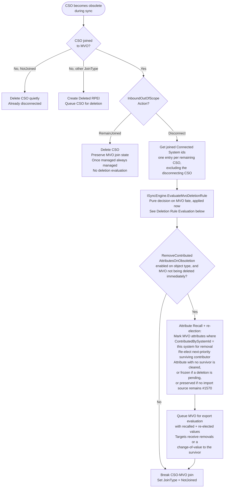
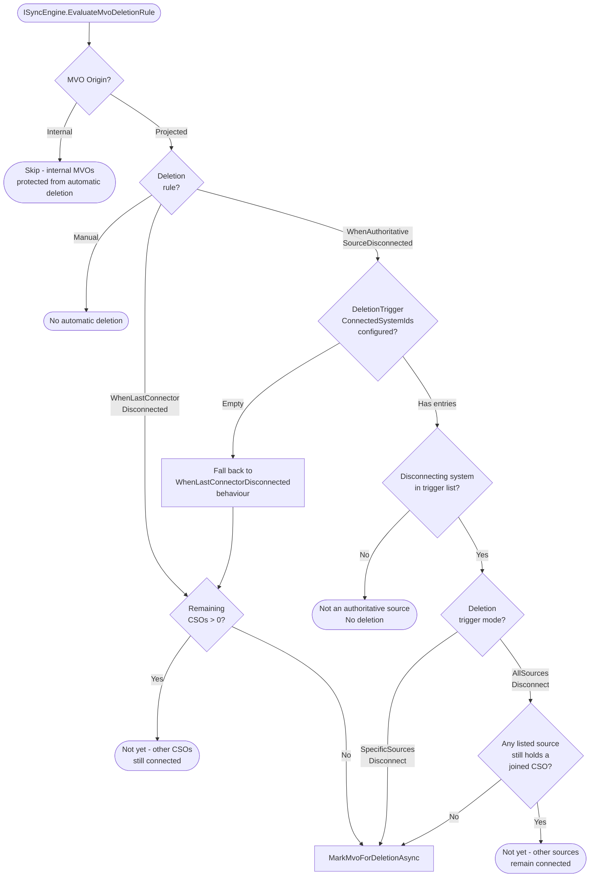
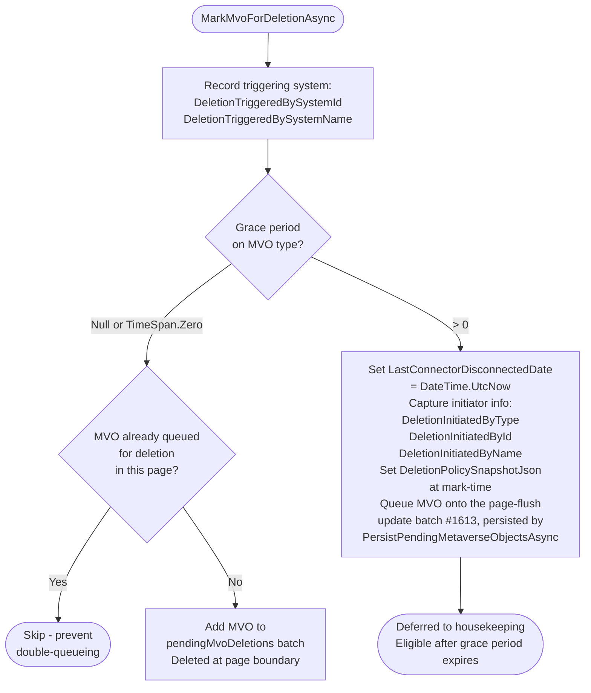
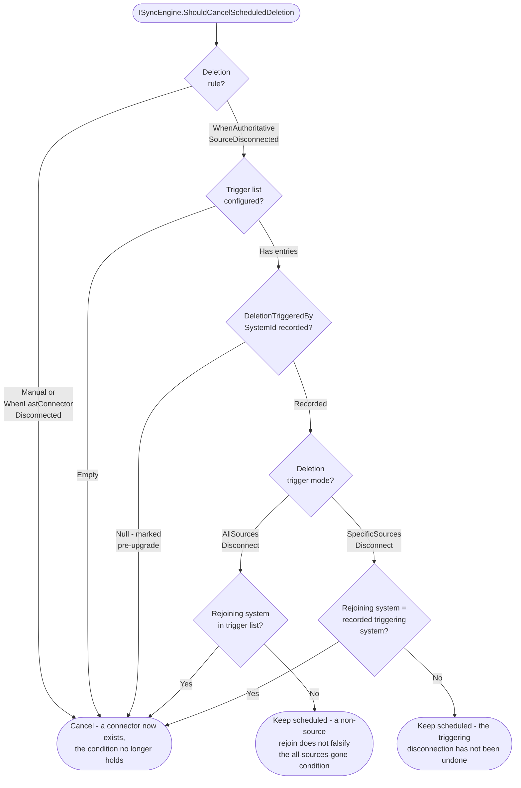
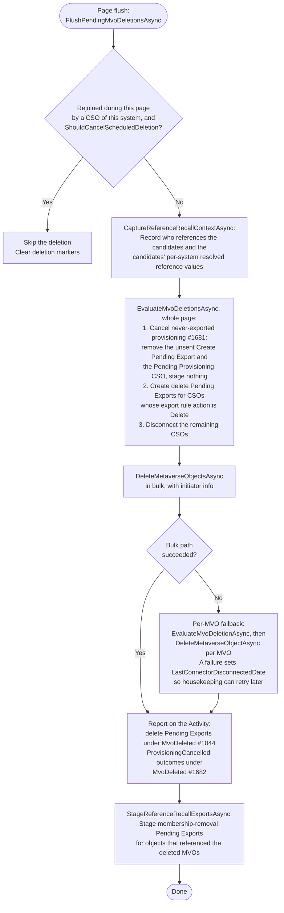
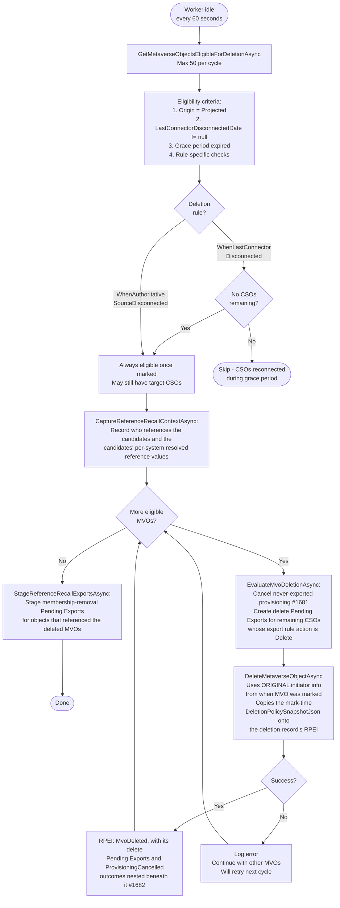
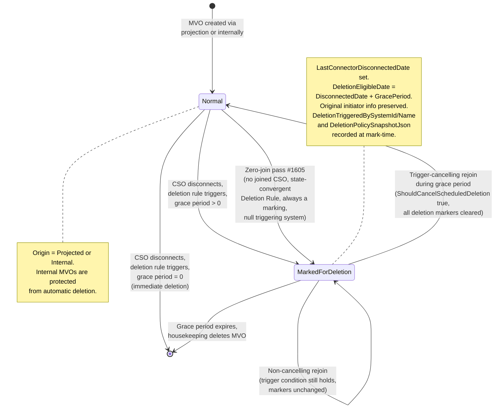

# MVO Deletion and Grace Period

> Last updated: 2026-09-23, JIM v0.15.0

This diagram shows the full lifecycle of Metaverse Object (MVO) deletion, from the trigger event (CSO disconnection) through deletion rule evaluation, grace period handling, mode-aware rejoin cancellation, and deferred housekeeping cleanup.

## Deletion Rules

| Rule | Value | Trigger | Behaviour |
|------|-------|---------|-----------|
| Manual | 0 | Never | MVO is never automatically deleted. Requires admin intervention. |
| WhenLastConnectorDisconnected | 1 | All CSOs disconnected | MVO deleted when no CSOs remain joined. Default rule. |
| WhenAuthoritativeSourceDisconnected | 2 | Selected source system(s) disconnect | MVO deleted when the systems in `DeletionTriggerConnectedSystemIds` disconnect, per the configured trigger mode below, even if other CSOs remain. |

### Authoritative Source Trigger Modes (#119)

`WhenAuthoritativeSourceDisconnected` carries an `AuthoritativeSourceTriggerMode` (`MetaverseObjectType.DeletionTriggerMode`) controlling how the selected sources trigger deletion:

| Mode | Value | Behaviour |
|------|-------|-----------|
| SpecificSourcesDisconnect | 0 | Delete when ANY one of the selected sources disconnects, even if others remain connected. Pre-#119 behaviour; existing configurations read the column default and keep it. |
| AllSourcesDisconnect | 1 | Delete only once NO selected source retains a joined CSO. Non-source connectors (targets) never block or trigger deletion. Default for new configurations (the model property initialiser). |

The enum-numeric/property-initialiser split is deliberate: existing rows read the added column's default `0` (`SpecificSourcesDisconnect`), preserving #115 behaviour with no backfill, while entities newly constructed in code, the portal, or the API start at the safe default (`AllSourcesDisconnect`).

When a deletion is scheduled or executed, the MVO records `DeletionTriggeredBySystemId` and `DeletionTriggeredBySystemName` (a name snapshot that survives deletion of the system itself) plus `DeletionPolicySnapshotJson`, the decision-time policy snapshot (`MvoDeletionPolicySnapshot`: rule, trigger mode, selected sources, grace period, triggering system, and the listed sources still connected at decision time). The same snapshot is written to the outcome-bearing RPEI (`ActivityRunProfileExecutionItems.DeletionPolicySnapshotJson`) whenever a deletion rule evaluation records an outcome, including evaluated-but-not-triggered decisions, so decisions stay explainable after the configuration changes.

## Trigger: CSO Disconnection During Sync

```mermaid
flowchart TD
    Start([CSO becomes obsolete<br/>during sync]) --> Joined{CSO joined<br/>to MVO?}

    Joined -->|No, NotJoined| QuietDelete[Delete CSO quietly<br/>Already disconnected]
    Joined -->|No, other JoinType| DeleteWithRPEI[Create Deleted RPEI<br/>Queue CSO for deletion]

    Joined -->|Yes| OosAction{InboundOutOfScope<br/>Action?}

    OosAction -->|RemainJoined| KeepJoin[Delete CSO<br/>Preserve MVO join state<br/>Once managed always managed<br/>No deletion evaluation]

    OosAction -->|Disconnect| GetRemaining[Get joined Connected System ids<br/>one entry per remaining CSO,<br/>excluding the disconnecting CSO]
    GetRemaining --> EvalDeletion[ISyncEngine.EvaluateMvoDeletionRule<br/>Pure decision on MVO fate, applied now<br/>See Deletion Rule Evaluation below]
    EvalDeletion --> RemoveAttrs{RemoveContributed<br/>AttributesOnObsoletion<br/>enabled on object type, and<br/>MVO not being deleted immediately?}
    RemoveAttrs -->|Yes| RecallAttrs[Attribute Recall + re-election:<br/>Mark MVO attributes where<br/>ContributedBySystemId = this system for removal<br/>Re-elect next-priority surviving contributor<br/>Attribute with no survivor is cleared,<br/>or frozen if a deletion is pending,<br/>or preserved if no import source remains #1570]
    RemoveAttrs -->|No| BreakJoin
    RecallAttrs --> QueueRecall[Queue MVO for export evaluation<br/>with recalled + re-elected values<br/>Targets receive removals or a<br/>change-of-value to the survivor]
    QueueRecall --> BreakJoin[Break CSO-MVO join<br/>Set JoinType = NotJoined]
```

## Deletion Rule Evaluation

```mermaid
flowchart TD
    Start([ISyncEngine.EvaluateMvoDeletionRule]) --> CheckOrigin{MVO Origin?}
    CheckOrigin -->|Internal| Protected([Skip - internal MVOs<br/>protected from automatic deletion])

    CheckOrigin -->|Projected| GetRule{Deletion<br/>rule?}

    GetRule -->|Manual| NoAction([No automatic deletion])

    GetRule -->|WhenLastConnector<br/>Disconnected| CheckRemaining{Remaining<br/>CSOs > 0?}
    CheckRemaining -->|Yes| NoActionYet([Not yet - other CSOs<br/>still connected])
    CheckRemaining -->|No| MarkForDeletion[MarkMvoForDeletionAsync]

    GetRule -->|WhenAuthoritative<br/>SourceDisconnected| CheckTriggers{DeletionTrigger<br/>ConnectedSystemIds<br/>configured?}
    CheckTriggers -->|Empty| FallbackRule[Fall back to<br/>WhenLastConnectorDisconnected<br/>behaviour]
    FallbackRule --> CheckRemaining

    CheckTriggers -->|Has entries| IsAuthSource{Disconnecting system<br/>in trigger list?}
    IsAuthSource -->|No| NoAction2([Not an authoritative source<br/>No deletion])
    IsAuthSource -->|Yes| CheckMode{Deletion<br/>trigger mode?}

    CheckMode -->|SpecificSources<br/>Disconnect| MarkForDeletion
    CheckMode -->|AllSources<br/>Disconnect| AnySourceLeft{Any listed source<br/>still holds a<br/>joined CSO?}
    AnySourceLeft -->|Yes| NoAction3([Not yet - other sources<br/>remain connected])
    AnySourceLeft -->|No| MarkForDeletion
```

The evaluation receives the Connected System id of every CSO still joined after the disconnection (`GetJoinedConnectedSystemIdsByMetaverseObjectIdAsync`, one raw SQL query replacing the previous count-only query), so All mode can test the remaining ids against the trigger list without an extra round trip. The decision-time policy snapshot is built from these same facts before the decision is applied.

## Grace Period Decision

```mermaid
flowchart TD
    Mark([MarkMvoForDeletionAsync]) --> RecordTrigger[Record triggering system:<br/>DeletionTriggeredBySystemId<br/>DeletionTriggeredBySystemName]
    RecordTrigger --> CheckGrace{Grace period<br/>on MVO type?}

    CheckGrace -->|Null or TimeSpan.Zero| DedupCheck{MVO already queued<br/>for deletion<br/>in this page?}
    DedupCheck -->|Yes| Skip([Skip - prevent<br/>double-queueing])
    DedupCheck -->|No| Immediate[Add MVO to<br/>pendingMvoDeletions batch<br/>Deleted at page boundary]

    CheckGrace -->|> 0| Deferred[Set LastConnectorDisconnectedDate<br/>= DateTime.UtcNow<br/>Capture initiator info:<br/>DeletionInitiatedByType<br/>DeletionInitiatedById<br/>DeletionInitiatedByName<br/>Set DeletionPolicySnapshotJson<br/>at mark-time<br/>Queue MVO onto the page-flush<br/>update batch #1613, persisted by<br/>PersistPendingMetaverseObjectsAsync]
    Deferred --> WaitForHousekeeping([Deferred to housekeeping<br/>Eligible after grace period expires])
```

The grace-period markers are never saved on the spot (#1613). Marking runs during Pass 1, before the page flush disables automatic change detection, so an immediate `SaveChangesAsync` on the shared sync context would walk the tracked Activity's execution items, insert this page's RPEIs early, and make the flush's own raw SQL RPEI insert fail on a duplicate key, failing the whole Activity. The markers are plain scalar columns, so the ordinary batch MVO update persists them without a context-wide change scan.

## Mode-Aware Rejoin Cancellation (#119)

A rejoin during the grace period only cancels a scheduled deletion when the rejoin falsifies the mode's trigger condition. `ISyncEngine.ShouldCancelScheduledDeletion(mvo, rejoiningSystemId)` is the pure decision, applied at both cancellation paths: `EstablishJoinAsync` (a CSO joins a marked MVO) and the same-page reconnect check in `FlushPendingMvoDeletionsAsync` (an immediate deletion queued earlier in the page).

```mermaid
flowchart TD
    Start([ISyncEngine.ShouldCancelScheduledDeletion]) --> GetRule{Deletion<br/>rule?}

    GetRule -->|Manual or<br/>WhenLastConnector<br/>Disconnected| Cancel([Cancel - a connector now exists,<br/>the condition no longer holds])

    GetRule -->|WhenAuthoritative<br/>SourceDisconnected| CheckTriggers{Trigger list<br/>configured?}
    CheckTriggers -->|Empty| Cancel

    CheckTriggers -->|Has entries| HasTrigger{DeletionTriggeredBy<br/>SystemId recorded?}
    HasTrigger -->|Null - marked<br/>pre-upgrade| Cancel

    HasTrigger -->|Recorded| CheckMode{Deletion<br/>trigger mode?}
    CheckMode -->|AllSources<br/>Disconnect| IsListed{Rejoining system<br/>in trigger list?}
    IsListed -->|Yes| Cancel
    IsListed -->|No| Keep([Keep scheduled - a non-source<br/>rejoin does not falsify<br/>the all-sources-gone condition])

    CheckMode -->|SpecificSources<br/>Disconnect| IsTrigger{Rejoining system =<br/>recorded triggering<br/>system?}
    IsTrigger -->|Yes| Cancel
    IsTrigger -->|No| Keep2([Keep scheduled - the triggering<br/>disconnection has not been undone])
```

Cancellation clears every deletion marker together (`ClearMvoDeletionMarkers`): `LastConnectorDisconnectedDate`, the `DeletionInitiatedBy*` audit fields, `DeletionTriggeredBySystemId`/`Name`, and `DeletionPolicySnapshotJson`. The null-trigger fallback (cancel on any rejoin) covers rows marked before the triggering system was recorded, rather than stranding a scheduled deletion.

### Same-Page Disconnect-Then-Rejoin Hardening (#1612)

`EstablishJoinAsync` reads `mvo.LastConnectorDisconnectedDate` off whichever Metaverse Object instance the join's matching-rule lookup returned, so the cancellation check above only sees Pass 1's markers if that instance is the SAME one Pass 1 wrote them to. On JIM's single EF Core tracking context, the change tracker's own identity resolution already guarantees this for a same-page disconnect and rekey of the same identity (the two loads resolve to one tracked instance), so the check has always worked correctly against PostgreSQL.

`SyncTaskProcessorBase` now backs that guarantee with an explicit page-wide identity map (`MetaverseObjectPageIdentityMap`) rather than depending solely on the tracking context's behaviour: every Metaverse Object load reachable during a page (a CSO page load, a matching-rule join, cross-page reference resolution, a newly persisted projection) is resolved onto one canonical CLR instance per Id before use. This is defence in depth, not a behavioural fix: it protects the same-page rejoin cancellation, and every other reference-equality-sensitive accumulator in the class (the pending MVO change list, the Pending Export evaluation batch), against a future change to how Metaverse Objects are loaded reintroducing a genuine identity split. The map's lifetime is scoped to match the change tracker's: both are cleared together at every page boundary.

`QueueMvoForUpdate`'s own by-Id consolidation (with a `Warning` log) is now a tripwire for a load site that bypasses the identity map, rather than the primary defence against a same-page collision.

**Only the `EstablishJoinAsync` path records a sync outcome for the cancellation (#1620).** Before the markers are cleared, `EstablishJoinAsync` captures them (the scheduled date, the decision-time policy snapshot, the triggering system name, and the object type's Deletion Rule and trigger mode) and threads them through `MetaverseObjectChangeResult` to whichever site builds the item's `Joined` root outcome, which attaches an `MvoDeletionCancelled` child carrying a detail message and the carried-through policy snapshot. The `FlushPendingMvoDeletionsAsync` same-page reconnect check is a different case entirely: it rescues an MVO queued for *immediate* (zero-grace-period) deletion, which was never scheduled and so never recorded an `MvoDeletionScheduled` outcome to cancel; nothing to un-happen means nothing new to record, and the causality tree exists only for a grace-period deletion in the first place.

## Immediate Deletion (Zero Grace Period)

```mermaid
flowchart TD
    PageEnd([Page flush:<br/>FlushPendingMvoDeletionsAsync]) --> Reconnect{Rejoined during this page<br/>by a CSO of this system, and<br/>ShouldCancelScheduledDeletion?}
    Reconnect -->|Yes| Rescue[Skip the deletion<br/>Clear deletion markers]
    Reconnect -->|No| Capture[CaptureReferenceRecallContextAsync:<br/>Record who references the candidates and the<br/>candidates' per-system resolved reference values]
    Capture --> BulkEval[EvaluateMvoDeletionsAsync, whole page:<br/>1. Cancel never-exported provisioning #1681:<br/>remove the unsent Create Pending Export and<br/>the Pending Provisioning CSO, stage nothing<br/>2. Create delete Pending Exports for CSOs<br/>whose export rule action is Delete<br/>3. Disconnect the remaining CSOs]
    BulkEval --> BulkDelete[DeleteMetaverseObjectsAsync<br/>in bulk, with initiator info]
    BulkDelete --> BulkOk{Bulk path<br/>succeeded?}
    BulkOk -->|No| Fallback[Per-MVO fallback:<br/>EvaluateMvoDeletionAsync, then<br/>DeleteMetaverseObjectAsync per MVO<br/>A failure sets LastConnectorDisconnectedDate<br/>so housekeeping can retry later]
    BulkOk -->|Yes| Report
    Fallback --> Report[Report on the Activity:<br/>delete Pending Exports under MvoDeleted #1044<br/>ProvisioningCancelled outcomes under<br/>MvoDeleted #1682]
    Report --> Recall[StageReferenceRecallExportsAsync:<br/>Stage membership-removal Pending Exports<br/>for objects that referenced the deleted MVOs]
    Recall --> Done([Done])
```

## Deferred Deletion (Housekeeping)

```mermaid
flowchart TD
    Idle([Worker idle<br/>every 60 seconds]) --> Query[GetMetaverseObjectsEligibleForDeletionAsync<br/>Max 50 per cycle]

    Query --> Criteria[Eligibility criteria:<br/>1. Origin = Projected<br/>2. LastConnectorDisconnectedDate != null<br/>3. Grace period expired<br/>4. Rule-specific checks]
    Criteria --> RuleCheck{Deletion<br/>rule?}

    RuleCheck -->|WhenLastConnector<br/>Disconnected| NoCSOs{No CSOs<br/>remaining?}
    NoCSOs -->|Yes| Eligible
    NoCSOs -->|No| NotEligible([Skip - CSOs reconnected<br/>during grace period])

    RuleCheck -->|WhenAuthoritative<br/>SourceDisconnected| Eligible[Always eligible once marked<br/>May still have target CSOs]

    Eligible --> Capture[CaptureReferenceRecallContextAsync:<br/>Record who references the candidates and the<br/>candidates' per-system resolved reference values]
    Capture --> Loop{More eligible<br/>MVOs?}
    Loop -->|No| Recall[StageReferenceRecallExportsAsync:<br/>Stage membership-removal Pending Exports<br/>for objects that referenced the deleted MVOs]
    Recall --> Done([Done])

    Loop -->|Yes| EvalExports[EvaluateMvoDeletionAsync:<br/>Cancel never-exported provisioning #1681<br/>Create delete Pending Exports for remaining CSOs<br/>whose export rule action is Delete]
    EvalExports --> DeleteMVO[DeleteMetaverseObjectAsync<br/>Uses ORIGINAL initiator info<br/>from when MVO was marked<br/>Copies the mark-time<br/>DeletionPolicySnapshotJson onto<br/>the deletion record's RPEI]
    DeleteMVO --> Result{Success?}
    Result -->|Yes| RecordItem[RPEI: MvoDeleted, with its delete<br/>Pending Exports and ProvisioningCancelled<br/>outcomes nested beneath it #1682]
    RecordItem --> Loop
    Result -->|No| LogError[Log error<br/>Continue with other MVOs<br/>Will retry next cycle]
    LogError --> Loop
```

## State Diagram

```mermaid
stateDiagram-v2
    [*] --> Normal: MVO created via<br/>projection or internally

    Normal --> MarkedForDeletion: CSO disconnects,<br/>deletion rule triggers,<br/>grace period > 0

    Normal --> MarkedForDeletion: Zero-join pass #1605<br/>(no joined CSO, state-convergent<br/>Deletion Rule, always a marking,<br/>null triggering system)

    Normal --> [*]: CSO disconnects,<br/>deletion rule triggers,<br/>grace period = 0<br/>(immediate deletion)

    MarkedForDeletion --> Normal: Trigger-cancelling rejoin<br/>during grace period<br/>(ShouldCancelScheduledDeletion true,<br/>all deletion markers cleared)

    MarkedForDeletion --> MarkedForDeletion: Non-cancelling rejoin<br/>(trigger condition still holds,<br/>markers unchanged)

    MarkedForDeletion --> [*]: Grace period expires,<br/>housekeeping deletes MVO

    note right of Normal
        Origin = Projected or Internal.
        Internal MVOs are protected
        from automatic deletion.
    end note
    note left of MarkedForDeletion
        LastConnectorDisconnectedDate set.
        DeletionEligibleDate =
        DisconnectedDate + GracePeriod.
        Original initiator info preserved.
        DeletionTriggeredBySystemId/Name
        and DeletionPolicySnapshotJson
        recorded at mark-time.
    end note
```

## Key Design Decisions

- **Internal MVO protection**  MVOs with `Origin = Internal` (admin accounts, service accounts created directly in JIM) are never subject to automatic deletion, regardless of the deletion rule configured on the object type.

- **Mode-aware grace period reconnection (#119)**  A CSO reconnecting to a marked MVO only cancels the scheduled deletion when `ShouldCancelScheduledDeletion` says the mode's trigger condition no longer holds: any rejoin for `WhenLastConnectorDisconnected`; any listed source for All mode; only the recorded triggering system for Specific mode. Cancellation clears every deletion marker together; a non-cancelling rejoin leaves the MVO scheduled. Rows marked before the triggering system was recorded fall back to the pre-#119 cancel-on-any-rejoin behaviour.

- **Trigger recording (#119)**  Scheduling a deletion records `DeletionTriggeredBySystemId` and `DeletionTriggeredBySystemName` on the MVO. The id makes Specific-mode cancellation precise (re-deriving "is some source still disconnected" from current state is impossible without join history); the name snapshot survives deletion of the system itself and feeds the Pending Deletions page's "Triggered By" column.

- **Decision-time policy snapshot (#119)**  Every deletion rule evaluation that records an outcome (scheduled, deleted, or evaluated-but-not-triggered) writes an `MvoDeletionPolicySnapshot` to the RPEI, capturing the rule, trigger mode, selected sources, grace period, triggering system, and the sources still connected at decision time. For grace period deletions the snapshot is captured at mark-time on the MVO and copied onto the housekeeping deletion record at execution, so the final record reflects the policy that scheduled the deletion, not the configuration at execution time. The RPEI detail page renders deletion rule context from this snapshot; legacy records without one fall back to current configuration with a caveat.

- **Connected System deletion path parity (#119)**  `MarkOrphanedMvosForDeletionAsync` (invoked when a Connected System is deleted with "evaluate deletion rules" enabled) applies the same mode semantics when deciding which MVOs the system's removal orphans: in All mode, deleting one of two still-connected sources does not mark MVOs whose other source remains. Preview and execution share one query (`QueryMvosOrphanedByConnectedSystemDeletion`), so `ConnectedSystemDeletionPreview` counts always agree with what execution does, and the marking records the deleted system as the trigger with a policy snapshot, exactly as the worker path does. The same deletion then runs the state-convergent zero-join pass (#1605), which also catches objects stranded by an earlier Connector Space clear that no Full Synchronisation followed up.

- **Initiator preservation**  When an MVO is marked for deferred deletion, the original initiator info (who/what caused the disconnection) is captured on the MVO. When housekeeping eventually deletes it, this original initiator is used in the audit trail, not "housekeeping" or "system".

- **Export cleanup before deletion**  Both immediate and housekeeping deletion paths evaluate the deletion (`EvaluateMvoDeletionsAsync()` in bulk at the page flush, `EvaluateMvoDeletionAsync()` per object in the fallback and in housekeeping) before the actual deletion. This creates delete Pending Exports for every CSO matched by an export Synchronisation Rule whose `OutboundDeprovisionAction` is `Delete`, regardless of how the CSO was joined, ensuring the external system is cleaned up. CSOs with no matching rule, or whose rules say `Disconnect` (the default), are disconnected and left in place in the target system.

- **Never-exported provisioning is cancelled, not deleted (#1681, #1682)**  A target CSO still Pending Provisioning whose Create was never exported does not exist in the target system, so neither a Delete nor a Disconnect means anything for it. Ahead of the rules above, the deletion evaluation removes its unsent Create Pending Export and the CSO itself, and records a `ProvisioningCancelled` outcome nested beneath the `MvoDeleted` outcome that caused it (a Warning-toned outcome: nothing was destroyed anywhere, and it is not counted as a Pending Export). An object leaving an export rule's scope gets the same cancellation, recorded as a root outcome on its own item.

- **Deletion Rules after a Connector Space clear (#1605)**  A Connector Space clear hard-deletes CSOs without obsoleting them, so no disconnection event ever reaches the Deletion Rule. The stranded-value sweep that follows the next genuine Full Import and Full Synchronisation evaluates every Metaverse Object recorded as joined at the clear that has still not rejoined, with the cleared system as the disconnecting system, through `MetaverseObjectDeletionRuleApplier` (the same evaluation and marking the obsoletion path uses; objects already pending deletion are skipped). It then runs the state-convergent zero-join pass: every Projected Metaverse Object, metaverse-wide, with no joined CSO at all, no existing marking, and a state-convergent Deletion Rule (`WhenLastConnectorDisconnected`, or `WhenAuthoritativeSourceDisconnected` with no trigger sources or in All mode) is marked with a null triggering system and a `NoConnectorRemainsStateConvergence` policy snapshot. The pass always marks and never deletes immediately; housekeeping treats a null grace period as immediately eligible. A re-join shortfall check refuses the whole sweep first when too many recorded objects are missing. See [Full Synchronisation - CSO Processing Flow](FULL_SYNC_CSO_PROCESSING.md).

- **Reference recall after deletion (#908)**  Both deletion paths also stage membership-removal Pending Exports for every Metaverse Object that referenced a deleted one (for example groups whose Static Members included a deleted leaver). The referencing linkage and the deleted objects' per-system resolved reference values (for example target DNs) are captured via `CaptureReferenceRecallContextAsync()` before deletion, because `DeleteMetaverseObjectAsync()` nulls the reference FKs and `EvaluateMvoDeletionAsync()` disconnects the CSOs. After the deletions, `StageReferenceRecallExportsAsync()` evaluates each referencing object once with every reference it lost in the batch, staging Remove changes whose values are pre-resolved at staging time; export-time resolution walks MVO to joined CSO and can never succeed for a deleted object. Without this recall, targets without referential integrity would keep deleted users as group members forever, because the referencing groups' CSOs never change and the unchanged-skip means no sync re-evaluates them.

- **Fallback on failure**  If immediate deletion fails (e.g., database error), the system sets `LastConnectorDisconnectedDate` as a fallback. This ensures housekeeping will pick up the MVO for retry on the next cycle, rather than losing the deletion intent.

- **Capped housekeeping**  Housekeeping processes a maximum of 50 MVOs per cycle (every 60 seconds). This prevents large deletion backlogs from monopolising the worker during idle time.

- **WhenAuthoritativeSourceDisconnected fallback**  If `DeletionTriggerConnectedSystemIds` is empty, the rule falls back to `WhenLastConnectorDisconnected` behaviour in both trigger modes (evaluation and cancellation alike). This prevents misconfiguration from causing unexpected deletions.

- **Dedup within page**  Multiple CSOs from the same MVO can disconnect in the same sync page. The dedup check in `MarkMvoForDeletionAsync` prevents the same MVO from being queued for immediate deletion twice.

- **Attribute recall, re-election and hand-over via ContributedBySystemId**  MVO attribute values contributed by the disconnecting system (identified by `ContributedBySystemId`) are recalled when **both** of the following hold: `RemoveContributedAttributesOnObsoletion` is enabled on the CSO type, and the MVO is not slated for immediate deletion (the immediate-deletion check avoids nugatory work when the MVO is about to be deleted at page flush, per #390). A configured deletion grace period no longer skips recall wholesale (Attribute Priority, #91): before clearing, a still-joined next-priority contributor is re-elected for each recalled attribute where one survives, so an authoritative source leaving hands the attribute to the next source (a change-of-value) rather than blanking it. Only an attribute with no surviving contributor is affected by the freeze: it is preserved rather than cleared when a deletion is pending (for the grace window), or when no remaining joined system carries an enabled import Synchronisation Rule for the object's type (as the object's last known state, recorded as a `ValuesPreserved` outcome, #1570), so identity-critical single-source values are not lost. While an import source remains, the departed system's leftovers are recalled. Recalled and re-elected values are queued for export evaluation so target systems receive the removals or the change-of-value; the only skip is for MVOs pending immediate deletion, whose Delete Pending Exports are created by `FlushPendingMvoDeletionsAsync`.

- **IsPendingDeletion**  An MVO is considered pending deletion when it has `LastConnectorDisconnectedDate` set, has `Origin = Projected` (not `Internal`), and its type's deletion rule is either `WhenLastConnectorDisconnected` or `WhenAuthoritativeSourceDisconnected`.
