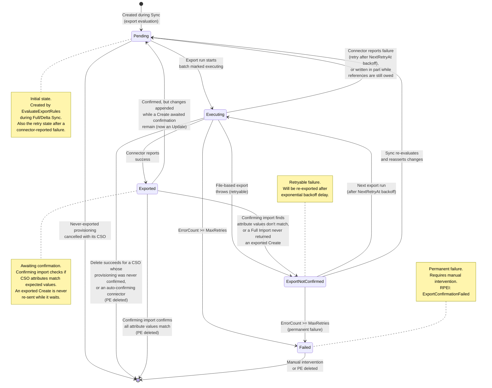
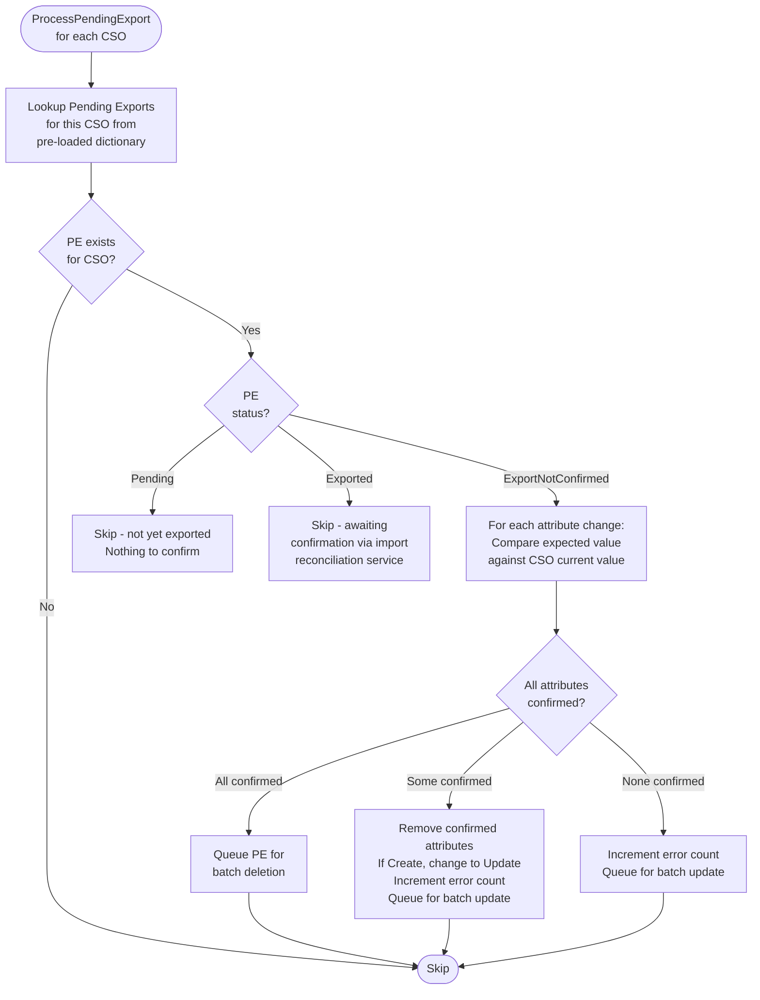
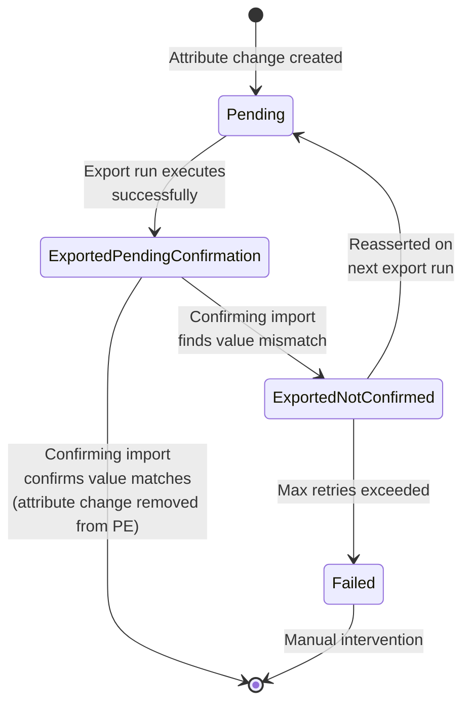
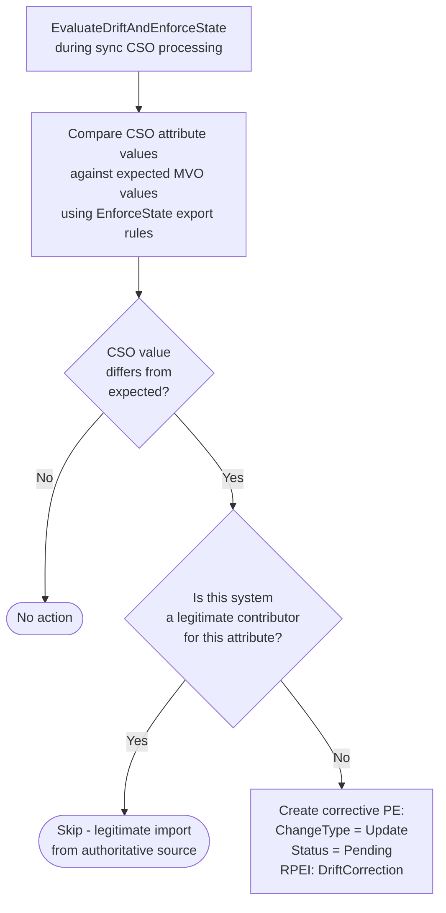
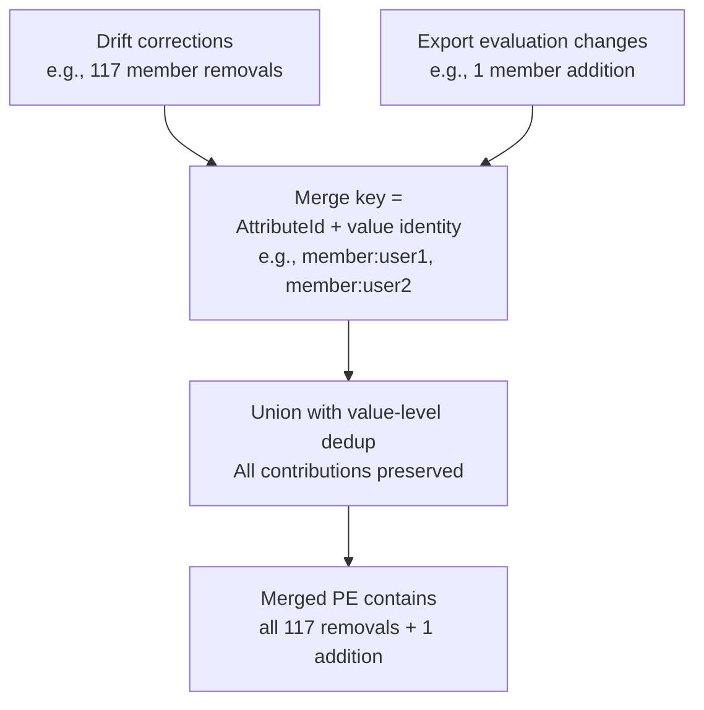

# Pending Export Lifecycle

> Last updated: 2026-09-23, JIM v0.15.0

This diagram shows the full lifecycle of a Pending Export from creation during synchronisation, through export execution, to confirmation during a confirming import. Pending Exports are the mechanism by which JIM propagates changes from the metaverse to target Connected Systems.

## State Diagram

A change type withheld by a Run Profile export limit (#1629) never leaves `Pending`: the export run does not mark it, attempt it, or record anything against it.

## Full Lifecycle Across Operations

A Pending Export's journey typically spans three separate Run Profile executions:

```mermaid
flowchart LR
    subgraph "1. Sync (Full or Delta)"
        SyncStart[MVO attribute changes<br/>during inbound flow<br/>incl. attribute recall +<br/>#91 next-contributor re-election] --> CheckDelete{MVO queued for<br/>immediate deletion?}
        CheckDelete -->|Yes| SkipDelete[Skip export evaluation<br/>MVO about to be deleted;<br/>work would be discarded #390<br/>No PE created]
        CheckDelete -->|No| EvalExport[EvaluateExportRules:<br/>Find export Synchronisation Rules<br/>for MVO type]
        EvalExport --> InScope{MVO in scope<br/>for export rule?}
        InScope -->|No| EvalDeprov[Evaluate deprovisioning:<br/>Create Delete PE if CSO exists<br/>Cancel never-exported provisioning<br/>instead, #1681]
        InScope -->|Yes| MapAttrs[Map MVO attributes<br/>to CSO attributes<br/>via export Synchronisation Rule mappings]
        MapAttrs --> NetChange{No-net-change<br/>detection}
        NetChange -->|CSO already current| Skip[Skip - no PE created<br/>Target already has correct values]
        NetChange -->|Changes needed| CheckExisting{Existing CSO<br/>in target system?}
        CheckExisting -->|Yes, of another<br/>Object Type| TypeConflict[No PE: the MVO's one CSO<br/>in this system is of another<br/>Object Type, #1344<br/>RPEI: CouldNotExportDueTo<br/>ExistingConnectedSystemObject]
        CheckExisting -->|Yes| CreateUpdatePE[Create PE:<br/>ChangeType = Update<br/>Status = Pending]
        CheckExisting -->|Yes, PendingProvisioning,<br/>Create not yet sent| RestageCreate[Restage the Create<br/>from the latest MVO state]
        CheckExisting -->|Yes, PendingProvisioning,<br/>Create already sent| AppendChanges[Append the changes to the<br/>exported Create as Pending, #1687<br/>they travel as one Update<br/>once the Create is confirmed]
        CheckExisting -->|No| CreateCreatePE[Create PE:<br/>ChangeType = Create<br/>Status = Pending<br/>Provision new CSO]
        CreateUpdatePE --> FlushReconcile
        CreateCreatePE --> FlushReconcile
        RestageCreate --> FlushReconcile
        AppendChanges --> FlushReconcile
        EvalDeprov --> FlushReconcile
        FlushReconcile[Flush-time reconciliation:<br/>CREATE+DELETE for same CSO<br/>cancels both no net change<br/>UPDATE+DELETE cancels UPDATE<br/>keeps DELETE]
        FlushReconcile --> PersistPE[Persist remaining PEs]
    end

    subgraph "2. Export"
        GetExecutable[Get executable PEs:<br/>Status = Pending or<br/>ExportNotConfirmed<br/>NextRetryAt <= now<br/>exported Creates skipped<br/>types over a Run Profile limit withheld] --> MarkExec[Mark batch:<br/>Status = Executing]
        MarkExec --> ConnExport[Connector executes<br/>export operations]
        ConnExport --> Success{Success?}
        Success -->|Yes, Create| ProvResult[Status = Exported<br/>Capture new external ID<br/>RPEI: Exported]
        Success -->|Yes, Update| ExpResult[Status = Exported<br/>RPEI: Exported]
        Success -->|Yes, in part| PartResult[References still owed, #1398<br/>Status = Pending<br/>Create becomes Update<br/>RPEI: Exported]
        Success -->|Yes, Delete| DeprovResult[Status = Exported<br/>RPEI: Deprovisioned<br/>Never-confirmed provisioning:<br/>delete PE + CSO now, #1685]
        Success -->|No| FailResult[Increment ErrorCount<br/>Set NextRetryAt<br/>Status = Pending,<br/>or Failed at MaxRetries]
        ProvResult --> OptimisticApply
        ExpResult --> OptimisticApply[Optimistic apply #1079:<br/>Project exported attribute<br/>changes onto the CSO's<br/>in-memory + persisted values<br/>calls-based connectors only;<br/>never stamps LastUpdated/Status]
        PartResult --> OptimisticApply
    end

    subgraph "3. Confirming Import"
        ImportData[Import fresh data<br/>from target system] --> Reconcile[Reconcile each PE for a CSO<br/>the import returned: compare<br/>its attribute changes against<br/>imported CSO values]
        Reconcile --> AllMatch{Any changes<br/>remain?}
        AllMatch -->|No| DeletePE[Delete PE<br/>Export confirmed<br/>PE lifecycle complete]
        AllMatch -->|Yes| Remaining[Remove confirmed changes<br/>A Create becomes an Update:<br/>the object is proven to exist, #1695<br/>Status from what remains:<br/>unconfirmed = ExportNotConfirmed<br/>appended only = Pending<br/>all failed = Failed]
        ImportData --> Unseen{Full Import did not return<br/>an exported Create at all?}
        Unseen -->|Yes| RetryCreate[Mark the Create for retry, #1695<br/>Status = ExportNotConfirmed,<br/>or Failed at MaxRetries<br/>RPEI: ExportNotConfirmed<br/>Delta Imports cannot prove absence]
    end

    PersistPE --> GetExecutable
    OptimisticApply --> ImportData
    FailResult -.->|Next export run<br/>after backoff| GetExecutable
    Remaining -.->|Next export run| GetExecutable
    RetryCreate -.->|Next export run| GetExecutable
```

## Pending Export Confirmation During Sync

During Full/Delta Sync, Pending Exports are also checked for confirmation (separate from the confirming import path above). This uses `ISyncEngine.EvaluatePendingExportConfirmation` for the pure comparison logic, invoked from `SyncTaskProcessorBase`:

## Attribute-Level Status Tracking

Each attribute change within a Pending Export has its own status, enabling partial confirmation:

## Change Types

| Type | When Created | What Happens |
|------|-------------|--------------|
| Create | No CSO exists in target system for this MVO | Provisions new object in target system. Connector creates object + sets attributes. PE captures DN template + all attributes. Once exported it is never re-sent while awaiting confirmation; changes arriving meanwhile are appended to it, and it becomes an Update once an import confirms the object exists. |
| Update | CSO exists but attributes differ from MVO values | Updates existing object attributes. Only changed attributes are included. No-net-change detection avoids unnecessary exports. |
| Delete | MVO deletion rule triggered, or MVO falls out of export scope | Removes object from target system. Created by EvaluateMvoDeletionAsync or EvaluateOutOfScopeExportsAsync. On success the PE goes to Exported and the confirming import removes the PE and CSO; for a CSO whose provisioning was never confirmed, the PE and CSO are removed at once. Never staged for provisioning that was never exported: that is cancelled instead. |

## Drift Detection Creates Corrective Exports

During sync, drift detection can also create Pending Exports:

## Drift Correction and Export Evaluation Merge

When both drift corrections and export evaluation produce changes for the same Pending Export, they are merged at the **value level** using composite keys:

This prevents silent loss of drift corrections when merging with export evaluation changes. Previously, merging by `AttributeId` alone would keep only one side's changes for multi-valued attributes.

## Key Design Decisions

- **Three-operation lifecycle**  A Pending Export typically spans Sync (creation), Export (execution), and Confirming Import (confirmation). This design ensures changes are verified end-to-end.

- **Partial confirmation**  Individual attribute changes can be confirmed independently. If 3 out of 5 attributes match the target system, only the 2 unconfirmed attributes remain on the Pending Export for retry.

- **Create-to-Update demotion (#1695)**  Reconciliation only runs for a CSO an import actually returned, so a Create PE reaching it proves the object exists. Whatever remains on it once confirmed changes are removed (unconfirmed attributes, or changes appended while it awaited confirmation) therefore travels as an Update, whichever attributes confirmed. This replaced two narrower triggers (a confirmed secondary external ID, or every original change confirmed with more queued), under which a single unconfirmed attribute left the PE shaped as a Create and the retry sent a second Create for an existing object. A Create written in part for want of a reference (#1398) is demoted at export time instead, since the row now exists.

- **An exported Create waits; later changes are appended (#1687)**  A CSO stays `PendingProvisioning` until an import confirms its Create. A Metaverse Object change arriving in that window used to delete the exported Create and stage a fresh one carrying every change, so a second Create reached the connector. Staging now distinguishes a Create never sent (`IsProvisioningNeverExported`: restage it in place) from one already sent: the change is appended to the exported Create as a `Pending` attribute change, the export run never re-sends a Create at `Exported`, and the confirming import turns it into one Update carrying the change. An auto-confirming file export, which deletes the Create on success, stages the Update directly.

- **An exported Create a Full Import never saw is retried (#1695)**  Import deletion detection deliberately excludes `PendingProvisioning` CSOs, so a Create that was exported but never reported back by any import used to sit at `Exported` for ever. A Full Import now finds each such Create for the Object Types it read, marks its exported changes for retry (`ExportNotConfirmed`, or `Failed` once past the retry limit) and reports each on the import Activity. A Delta Import leaves them alone, since it cannot prove an object is absent.

- **One CSO per Metaverse Object per Connected System (#1344)**  Export evaluation resolves the target CSO by Metaverse Object and Connected System, so an export Synchronisation Rule targeting a second Object Type in the same system would resolve to the object already holding that slot. `DetectObjectTypeConflict` catches this where the decision is made: nothing is staged, and a `CouldNotExportDueToExistingConnectedSystemObject` RPEI names the rule, both Object Types and the object holding the slot, rather than the page failing on the one-PE-per-CSO unique index.

- **The cross-page reference pass leaves Pending Exports in place (#1741)**  A Full Synchronisation re-evaluates objects whose references span pages once every page is done. That pass used to batch-delete the targets' Pending Exports first, which (since #1687) made a group whose Create was never sent read as already sent, so only its members were staged as an Update for a group that did not exist. It now lets per-object staging find each existing PE and decide: an unsent Create is rebuilt with the resolved references, an exported one has the changes appended, a pending Update is merged.

- **No-net-change detection**  Before creating a PE during sync, the system checks if the target CSO already has the expected values (using pre-cached data in `ExportEvaluationCache`). This avoids unnecessary export operations and reduces connector load.

- **Drift correction**  When `EnforceState` is enabled on an export Synchronisation Rule and the CSO has values that don't match the MVO, a corrective PE is created to reassert the correct values. This detects and corrects unauthorised changes made directly in target systems.

- **Never-exported provisioning is cancelled, not deprovisioned**  When a Metaverse Object is deleted or leaves an export Synchronisation Rule's scope while its target CSO is still `PendingProvisioning` with an unsent Create (`Status = Pending`, never attempted), the object does not exist in the target system. `SyncEngine.IsProvisioningNeverExported` is the verdict; `ExportEvaluationServer` removes the Create PE and the CSO together and stages nothing, whatever the rule's `OutboundDeprovisionAction`. A Delete PE here would carry no identifier (the File connector rejects it with "Delete export has no External ID value"), and the CSO, holding no external ID value, is excluded from import deletion detection, so nothing could ever confirm it away. Once a Create has been handed to a Connector (any other status, or a Pending one with an attempt recorded) the ordinary deprovisioning decision applies. The cancellation is reported as a `ProvisioningCancelled` sync outcome (nested under the `MvoDeleted` outcome for a deletion, or as a root outcome on the execution item of an object leaving scope), so it is visible on the Activity, in the causality tree and Table view, and does not count towards Pending Export totals. Sync Preview mirrors the verdict and reports it as its own `ProvisioningCancelled` node in the outcome tree.

- **Attribute recall and re-election**  When a Connected System Object disconnects (obsoleted, or fallen out of scope), JIM recalls the values that system contributed. If a lower-priority Synchronisation Rule still contributes, the next contributor is re-elected in the same sync run ([Attribute Priority](../../concepts/attribute-priority.md), #91) and export evaluation stages a change-of-value on the target; if no contributor survives, the attribute is cleared and export evaluation stages a null-clear. Export evaluation is no longer skipped for recall. Expression-based mappings (e.g. DN templates) are protected from evaluating against post-recall nulls by re-election supplying a replacement value, by grace-period freezing of identity-critical single-source attributes, and by the #390 skip of recall when the MVO is about to be deleted.

- **Value-level drift merge**  When merging drift corrections with export evaluation changes, the merge key is a composite of `AttributeId` + value identity (not just `AttributeId`). This prevents silent loss of multi-valued attribute drift corrections; e.g., 117 member removals would be dropped if merged by `AttributeId` alone.

- **Flush-time CREATE→DELETE reconciliation** (#218)  At flush time (during sync), deferred CREATE/UPDATE PEs still held in memory are checked against DELETE PEs already persisted for the same CSO earlier in the page: CREATE+DELETE pairs cancel both (no net change), UPDATE+DELETE cancels the UPDATE (deletion still needed). There is deliberately no export-time counterpart. One existed, scanning every executable PE for such pairs before each export, but `IX_PendingExports_ConnectedSystemObjectId_Unique` allows one PE per CSO, so two persisted PEs for the same CSO can never exist and it could never fire. Contradictions across sync runs are resolved where the second PE is staged instead: the one-PE-per-CSO collision policy replaces or reuses, and never-exported provisioning is cancelled outright (next note).

- **Exponential backoff**  Failed exports use increasing retry delays (`NextRetryAt`) to avoid hammering a target system that's experiencing issues.

- **Optimistic export apply** (#1079)  On export success, `ExportExecutionServer.ProcessBatchSuccessAsync` projects the exported attribute changes onto the CSO's attribute values (add-if-absent, replace-on-Update, delete-if-present, delete-all) at export time rather than waiting for the confirming import to re-materialise them. This means the confirming import's "Compare each import attribute against existing CSO values" step (see [Full Import Flow](FULL_IMPORT_FLOW.md)) usually finds nothing to do, avoiding millions of redundant attribute value inserts at scale. Two rules keep this safe:
  - The parent CSO row (`Status`, `LastUpdated`, and every other field) is never touched. `LastUpdated` staying untouched is what lets a no-op confirming import skip the object entirely under the Full Synchronisation unchanged-object watermark; a status transition (e.g. `PendingProvisioning` → `Normal`) is still a genuine change and is stamped by the confirming import as before.
  - Only the calls-based connector paths (sequential, parallel, deferred references) apply; the file-connector export path is excluded because its batch loader does not load the CSO's attribute-value graph, and widening that Include for every file export is a memory-profile trade-off not taken here. File-connector exports keep the pre-#1079 behaviour: the confirming import re-materialises the CSO's attribute values as it always did.

  A failure during optimistic apply is caught, logged as a Warning, and never fails the batch, the Pending Export updates, or the Activity - the export itself already succeeded against the Connected System, and the confirming import self-heals by re-materialising the values regardless.

  Reference-typed attribute changes (for example a group's member list) resolve their Connected System Object Id purely from `PendingExportAttributeValueChange.ResolvedReferenceCsoId`, a persisted column stamped once at the point of resolution (`ExportExecutionServer.TryResolveReferencesFromLookup`, SPEC-1079B). An earlier version of optimistic apply kept this as an in-memory-only hint and fell back to a database lookup whenever a change crossed a persistence boundary without it (cross-run retry, or the parallel batch path's per-batch fresh-context reload); that fallback queried the whole Connected System once per export run, and an even earlier per-batch version of the same fallback cost 10-15 seconds per call over an unindexed scan at Scale500k25kGroups (2026-07-21). Persisting the column removes the loss the fallback was compensating for, so no database lookup is needed here at all: a Pending Export whose Reference change has never been resolved simply applies unresolved (matched on `UnresolvedReferenceValue`, self-healing on the next import) rather than triggering a lookup. No foreign key or index backs the column - see its XML doc for the trade-off.

  Optimistic apply means the confirming import's update path still hydrates every matched CSO's full attribute-value graph to run the diff, even though the diff usually confirms there's nothing to change. At Scale500k25kGroups this held ~9.8M attribute value objects in memory simultaneously across a 524,997-CSO run, tripling the confirming import's live heap versus the pre-#1079 baseline and causing an OOM kill. `SyncImportTaskProcessor.PerformImportAsync` now releases each update-path CSO's hydrated attribute values once its batch has been persisted (`ReleaseHydratedAttributeValues`), well after the diff, the change-history write, and the CSO cache refresh have all read what they needed - reconciliation, which runs afterwards, is unaffected because it reloads each CSO's attribute values fresh from the database per page rather than reading the released in-memory copies.

  `OptimisticExportApplyCalculator.ApplyAdd`/`ApplyRemove` originally called `SyncEngine.ValueExistsOnCso`/a linear scan once per attribute change, while every accepted Add appended to that same growing per-attribute list - O(M^2) for a Pending Export with M Add changes. The live database has groups with up to 495,008 members, and a full-scale run measured 255 slow `OptimisticApply` instances totalling 77.5 minutes, all in the group-batch wave. The calculator now builds a per-attribute index once per Pending Export (a `Dictionary` of value to matching row instances, keyed exactly like `ValueExistsOnCso`'s per-type comparisons - DateTime on `Ticks`, Reference on the CSO row's `UnresolvedReferenceValue`, Binary left as a linear `SequenceEqual` scan since byte arrays do not hash usefully and are never large multi-valued sets) and maintains it incrementally as changes are applied, turning the existence/match check into an O(1) average-case lookup.
