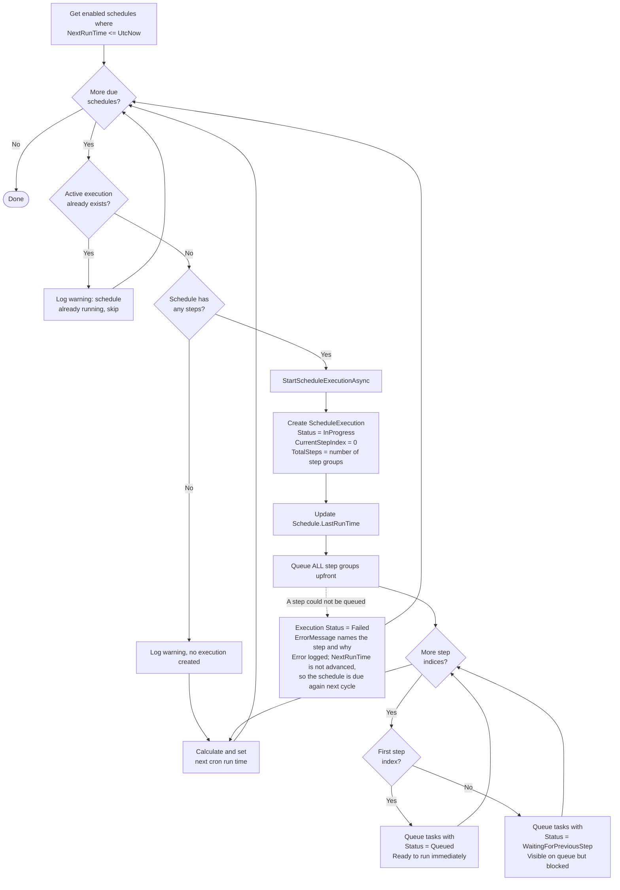
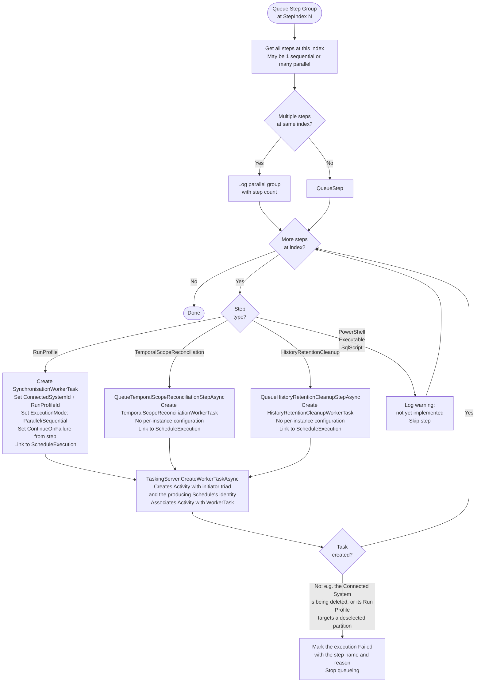
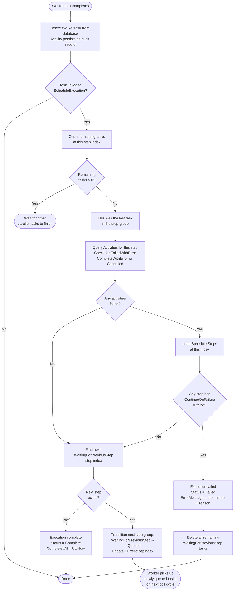
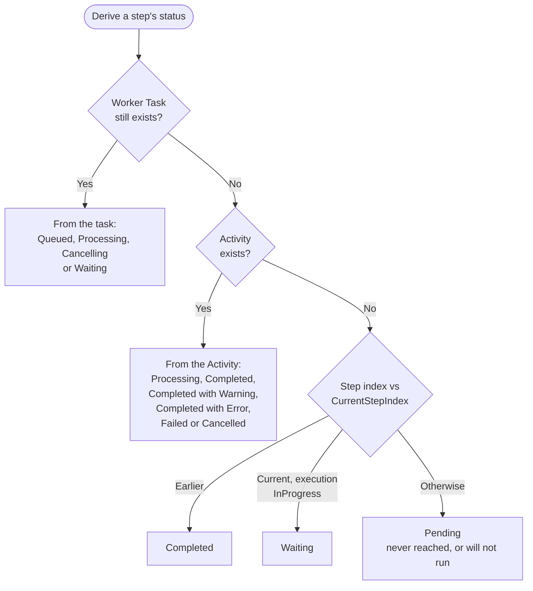

# Schedule Execution Lifecycle

> Last updated: 2026-09-23, JIM v0.15.0

This diagram shows how schedules are triggered, how step groups are queued and advanced, and how the scheduler and worker collaborate to drive multi-step execution to completion.

JIM seeds two built-in Schedules, converging them on every startup (`SeedingServer.BuiltInSchedules`):

- **Temporal Scope Reconciliation** (#85): hourly, cron `0 * * * *`; its single step is of type `TemporalScopeReconciliation` and queues a `TemporalScopeReconciliationWorkerTask`.
- **History Retention Cleanup** (#1118): daily and off-peak, cron `30 2 * * *`; its single step is of type `HistoryRetentionCleanup` and queues a `HistoryRetentionCleanupWorkerTask`, which removes change history, Activities, initial-password records and terminal Pending Password Changes past their retention periods. The Worker reads every retention period from its Service Setting when the task runs, so changing one takes effect on the next pass without the Schedule being touched. This replaces the six-hourly cleanup the Worker used to run during housekeeping.

Both run the same queue-and-advance machinery as any other Schedule; the only difference is the step type they queue (see Step Group Queuing Detail below).

## Three-Service Collaboration

JIM uses three services that collaborate on scheduled execution:

| Service | Role | Polling Interval |
|---------|------|-----------------|
| **JIM.Scheduler** | Detects due schedules, creates executions, queues tasks, recovery | 30 seconds, woken instantly by task-completion notifications |
| **JIM.Worker** | Executes tasks, drives step advancement on completion | 2 seconds |
| **JIM.Web** | Manual run requests (creates worker tasks directly) | On-demand |

The Scheduler does not rely on the 30-second cycle alone: a database trigger publishes a PostgreSQL `NOTIFY` whenever a Worker Task changes, and the Scheduler listens on a dedicated connection. When a task belonging to a Schedule Execution reaches a terminal state, the Scheduler wakes within about half a second and runs its next cycle immediately; the 30-second interval remains as the fallback for missed notifications (#307). The wait is served in 5-second slices, and the Scheduler writes its service heartbeat to the database between them (#1636), so the Operations page does not read a healthy but idle Scheduler as overdue.

## Scheduler Polling Cycle

Due schedules are processed before the next-run-time bootstrap, and must stay that way: both read `NextRunTime`, and running the bootstrap first is how cron-triggered Schedules came to be swallowed on the cycle they became due. The bootstrap now only touches Schedules with no `NextRunTime` at all.

## Due Schedule Processing

## Step Group Queuing Detail

Steps with the same `StepIndex` form a parallel group and execute concurrently.

## Worker-Driven Step Advancement

After the worker completes a task, it drives schedule advancement via `TryAdvanceScheduleExecutionAsync`. This is the primary advancement mechanism (the scheduler has a safety net for the case where the worker crashes between task completion and advancement).

## Recovery Mechanisms

Three safety nets ensure schedules complete even when services crash.

```mermaid
flowchart TD
    subgraph "1. Worker Startup Recovery"
        WS([Worker starts]) --> RecoverAll[RecoverStaleWorkerTasksAsync<br/>TimeSpan.Zero<br/>ALL Processing tasks are<br/>orphaned at startup]
        RecoverAll --> ReQueue1[Fail associated Activities<br/>Delete the task rows<br/>Stuck-execution recovery then<br/>advances or fails the execution<br/>per ContinueOnFailure]
    end

    subgraph "2. Scheduler: Stuck Execution Recovery"
        SE([Every 30 seconds]) --> GetActive[Get InProgress executions]
        GetActive --> ForEach{For each<br/>execution}
        ForEach --> CheckTasks{Has Queued or<br/>Processing tasks?}
        CheckTasks -->|Yes| Normal([Normal operation<br/>Worker is handling it])
        CheckTasks -->|No| HasWaiting{Has Waiting<br/>tasks?}
        HasWaiting -->|Yes| SafetyNet[Worker likely crashed after<br/>completing a step<br/>Run CheckAndAdvanceExecutionAsync<br/>to advance to next step]
        HasWaiting -->|No, zero tasks| Complete[No tasks at all<br/>Mark execution complete]
    end

    subgraph "3. Scheduler: Stale Task Recovery"
        ST([Every 30 seconds]) --> FindStale[Find Processing tasks where<br/>Heartbeat older than<br/>stale threshold]
        FindStale --> HasStale{Stale tasks<br/>found?}
        HasStale -->|No| Skip([Skip])
        HasStale -->|Yes| ReQueue2[Fail associated Activities<br/>Delete the stale task rows<br/>freeing the queue]
    end
```

## Execution State Diagram

```mermaid
stateDiagram-v2
    [*] --> InProgress: Scheduler creates execution<br/>Queues all step groups

    InProgress --> InProgress: Worker completes step<br/>Advances to next step group

    InProgress --> Complete: Last step group completes<br/>No more waiting tasks

    InProgress --> Failed: Step group has failures<br/>ContinueOnFailure = false

    InProgress --> Cancelled: User cancels execution<br/>All tasks deleted

    Complete --> [*]
    Failed --> [*]
    Cancelled --> [*]
```

## Step Display Status

The portal's Schedule Execution detail page and `GET /api/v1/schedule-executions/{id}` both show a status per step (`ScheduleExecutionStepStatus`, #1196). It is derived rather than stored, by one shared rule (`ScheduleStepReading.StatusOf`) that the Operations queue's step group header also uses, so the surfaces cannot disagree about a step that is finishing as they are asked:

A live Worker Task wins because its Activity is necessarily still in progress; the Activity is the durable record once the task has been deleted. Each Activity a Schedule produces also carries the Schedule's id and name, denormalised when the task is queued, so its attribution survives the Schedule being deleted.

## Example: Multi-Step Schedule

A typical schedule with sequential and parallel steps:

**Schedule: "Nightly HR Sync"**

| Index | Steps | Execution |
|-------|-------|-----------|
| 0 | HR System - Full Import | Sequential |
| 1 | HR System - Full Sync | Sequential |
| 2 | AD - Export, LDAP - Export | Parallel (2 tasks) |
| 3 | AD - Confirming Import, LDAP - Confirming Import | Parallel (2 tasks) |

**Timeline:**

1. Scheduler creates execution, queues ALL 6 tasks
   - Index 0: 1 task as Queued
   - Index 1: 1 task as WaitingForPreviousStep
   - Index 2: 2 tasks as WaitingForPreviousStep
   - Index 3: 2 tasks as WaitingForPreviousStep
2. Worker picks up index 0 task, executes Full Import
3. Worker completes → TryAdvance → transitions index 1 to Queued
4. Worker picks up index 1 task, executes Full Sync
5. Worker completes → TryAdvance → transitions index 2 (2 tasks) to Queued
6. Worker dispatches BOTH index 2 tasks in parallel (AD Export + LDAP Export)
7. First export completes → TryAdvance → remaining count > 0, wait
8. Second export completes → TryAdvance → transitions index 3 to Queued
9. Worker dispatches BOTH index 3 tasks in parallel
10. Both confirming imports complete → TryAdvance → no more steps
11. Execution marked Complete

## Key Design Decisions

- **All steps queued upfront**  The scheduler creates all worker tasks at execution start, with subsequent steps as `WaitingForPreviousStep`. This makes the full execution plan visible in the task queue from the beginning.

- **Worker drives advancement**  Step transitions are driven by the worker (via `TryAdvanceScheduleExecutionAsync`) for minimal latency. The scheduler provides a safety net for crash recovery only.

- **Activity-based outcome detection**  Since worker tasks are deleted upon completion, the system uses Activities (immutable audit records) to determine whether a step succeeded or failed.

- **Overlap prevention**  The scheduler checks for active executions before starting a new one for the same schedule. This prevents concurrent execution of the same schedule.

- **ContinueOnFailure**  Each step can be configured to continue or halt on failure. When any step at an index has `ContinueOnFailure = false` and its activity failed, the entire execution stops and remaining waiting tasks are cleaned up.
