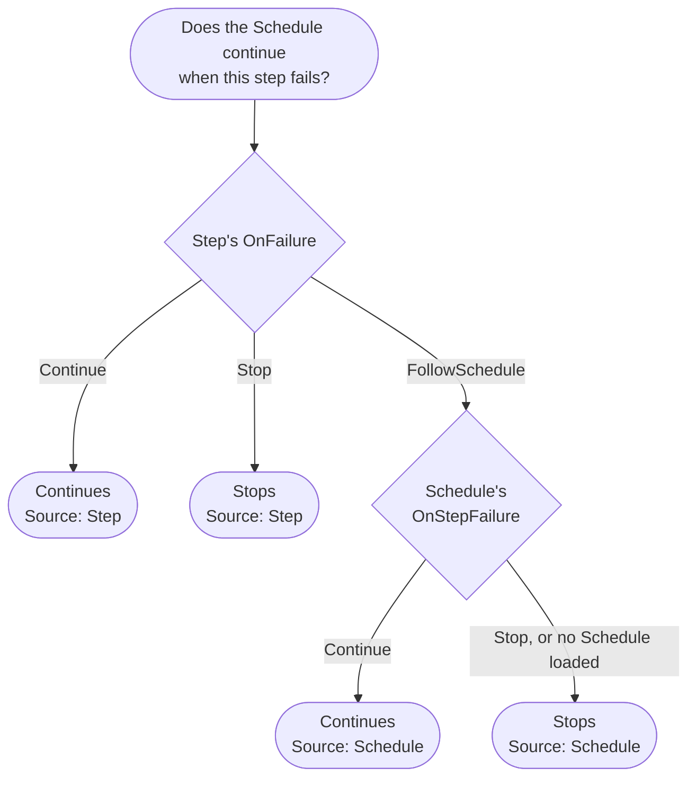
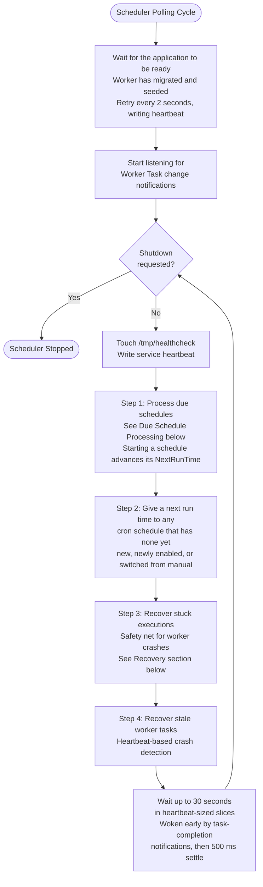
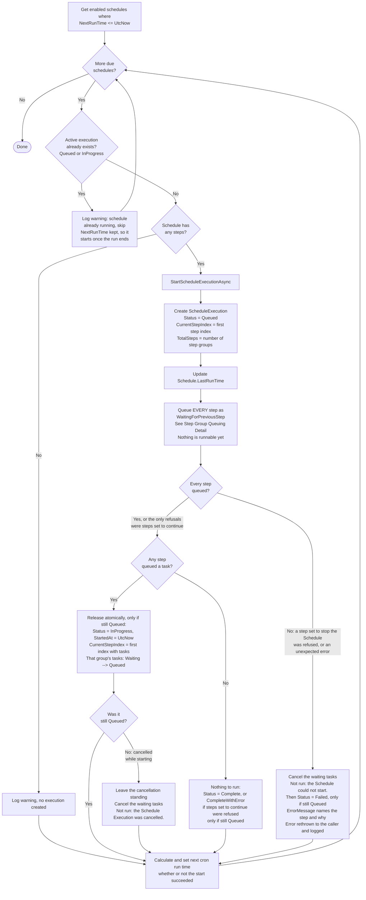
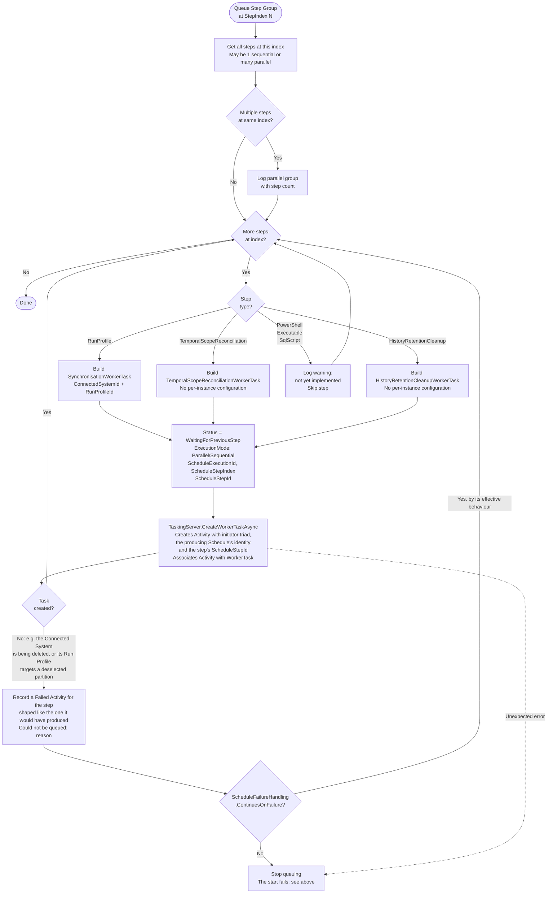
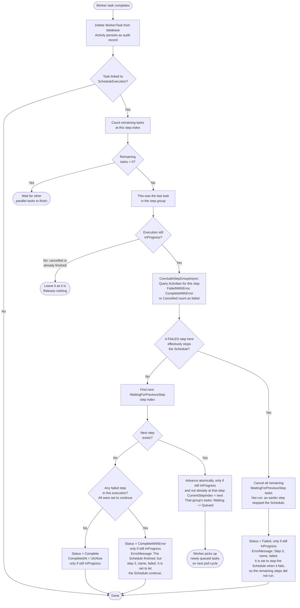
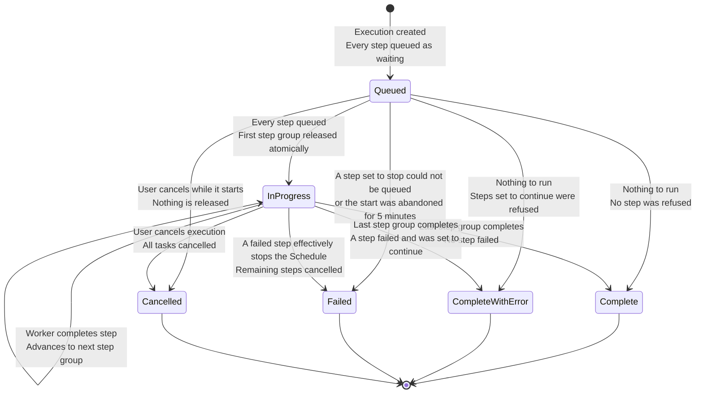

# Schedule Execution Lifecycle

> Last updated: 2026-09-24, JIM v0.15.0 (unreleased changes)

This diagram shows how schedules are triggered, how step groups are queued and advanced, and how the scheduler and worker collaborate to drive multi-step execution to completion.

JIM seeds two built-in Schedules, converging them on every startup (`SeedingServer.BuiltInSchedules`):

- **Temporal Scope Reconciliation** (#85): hourly, cron `0 * * * *`; its single step is of type `TemporalScopeReconciliation` and queues a `TemporalScopeReconciliationWorkerTask`.
- **History Retention Cleanup** (#1118): daily and off-peak, cron `30 2 * * *`; its single step is of type `HistoryRetentionCleanup` and queues a `HistoryRetentionCleanupWorkerTask`, which removes change history, Activities, initial-password records and terminal Pending Password Changes past their retention periods. The Worker reads every retention period from its Service Setting when the task runs, so changing one takes effect on the next pass without the Schedule being touched. This replaces the six-hourly cleanup the Worker used to run during housekeeping.

Both run the same queue-and-advance machinery as any other Schedule; the only difference is the step type they queue (see Step Group Queuing Detail below). Both stop when a step fails, and their steps follow the Schedule; JIM manages that setting, so it cannot be changed from the portal, the REST API or PowerShell (#1787).

## Effective Failure Behaviour

What a failed step does to its Schedule is set in two places (#1787): the Schedule's `OnStepFailure` (`ScheduleFailureBehaviour`: `Stop`, the default, or `Continue`), and each step's `OnFailure` (`ScheduleStepFailureBehaviour`: `FollowSchedule`, the default for new steps, `Stop` or `Continue`). Every decision about a failed step uses the **effective** behaviour, resolved in exactly one place, `ScheduleFailureHandling` (`JIM.Models/Scheduling`):

`ScheduleFailureHandling.ContinuesOnFailure(step, schedule)` answers the question and `ScheduleFailureHandling.Source(step)` says where the answer comes from. The Scheduler's start refusals, the parallel-group rule, Worker-driven advancement and the recovery sweep all call it at the moment of the decision, reading the Schedule as it stands then, so a change saved mid-run applies to the next failure. The portal's step list, the REST API's effective `continueOnFailure` and `failureBehaviourSource`, and each execution step's `ContinueOnFailure` / `FailureBehaviourSource` read it too; none resolves it independently. A step whose Schedule is not loaded fails safe and stops. `ScheduleFailureHandling.FailedStepOutcomes` is likewise the one definition of what counts as a step failing (an Activity ending `FailedWithError`, `CompleteWithError` or `Cancelled`; warnings do not).

## Three-Service Collaboration

JIM uses three services that collaborate on scheduled execution:

| Service | Role | Polling Interval |
|---------|------|-----------------|
| **JIM.Scheduler** | Detects due schedules, creates executions, queues tasks, recovery | 30 seconds, woken instantly by task-completion notifications |
| **JIM.Worker** | Executes tasks, drives step advancement on completion | 2 seconds |
| **JIM.Web** | Manual run requests (starts an execution through the same path as the Scheduler) | On-demand |

The Scheduler does not rely on the 30-second cycle alone: a database trigger publishes a PostgreSQL `NOTIFY` whenever a Worker Task changes, and the Scheduler listens on a dedicated connection. When a task belonging to a Schedule Execution reaches a terminal state, the Scheduler wakes within about half a second and runs its next cycle immediately; the 30-second interval remains as the fallback for missed notifications (#307). The wait is served in 5-second slices, and the Scheduler writes its service heartbeat to the database between them (#1636), so the Operations page does not read a healthy but idle Scheduler as overdue.

## Scheduler Polling Cycle

Due schedules are processed before the next-run-time bootstrap, and must stay that way: both read `NextRunTime`, and running the bootstrap first is how cron-triggered Schedules came to be swallowed on the cycle they became due. The bootstrap now only touches Schedules with no `NextRunTime` at all.

## Due Schedule Processing

The execution is held at `Queued` while its steps are queued (#1768). Nothing acts on a `Queued` execution: the Worker only picks up `Queued` tasks, and every task is created waiting; the Scheduler's safety net advances only `InProgress` executions. So a start that stops part-way leaves no step running, and the step that could not be queued can never be overtaken by an earlier one that was already runnable. Before #1768 the first step group was queued as runnable before the later steps had been queued; when a later step could not be queued, the execution was marked Failed while its first step ran anyway, and the Worker then overwrote the failure with Complete.

The release is two small set-based updates in one transaction rather than a transaction around the whole start. A rolled-back transaction does not roll back EF Core's change tracker, and the Scheduler reuses one context for its whole polling cycle (it saves the same Schedule again afterwards to advance its next run time), so a wide transaction that rolled back could leave tracked inserts behind to fail every later save on that context (#1765).

If cleaning up after a failed start itself fails, the execution is deliberately left `Queued` rather than marked Failed with waiting tasks nothing would remove; the stale-start safety net (below) finishes the job.

## Step Group Queuing Detail

Steps with the same `StepIndex` form a parallel group and execute concurrently. Every step is queued the same way, whatever its position; which group runs first is decided only when the execution is released.

A step that could not be queued but is set to continue leaves no task, only its Failed Activity. A step group made up only of such steps therefore has nothing waiting and is skipped when the execution advances; one with queued siblings is judged when those siblings finish, where the Failed Activity counts as a failed step that is set to continue.

## Worker-Driven Step Advancement

After the worker completes a task, it drives schedule advancement via `TryAdvanceScheduleExecutionAsync`. This is the primary advancement mechanism (the scheduler has a safety net for the case where the worker crashes between task completion and advancement). Once the step group is over, both hand it to one shared decision, `SchedulerServer.ConcludeStepGroupAsync`, so the two can never reach different conclusions about the same execution.

In a parallel step group, only the steps that failed decide (#1768): the Schedule stops if a step that failed effectively stops it (see Effective Failure Behaviour above), whatever its successful siblings are set to. Each Activity records the step that produced it (`ScheduleStepId`), which is how a failure is attributed to one sibling rather than another. An Activity that cannot say (recorded before `ScheduleStepId` existed, or whose step has since been deleted) makes the group fall back to the stricter rule it replaced: stop if any step at that position is set to stop the Schedule.

When the last step group concludes, the execution ends `CompleteWithError` rather than `Complete` if any Activity of the execution has a failed outcome (#1787). A failure that stopped the Schedule has already taken the Failed path, so any failure found at that point was one allowed to continue; the `ErrorMessage` names each such step. `CompleteWithError` counts as finished everywhere `Complete` does (not active, the Schedules list's last outcome, `LastExecutionStatus`, history filters) with one exception: the Temporal Scope Reconciliation watermark (`GetLastCompletedScheduleExecutionAsync`) moves forward only on a clean `Complete`, so a window a failed step missed is covered again on the next run.

Every change here is conditional on the execution still being `InProgress` when the write lands, so a cancellation that arrives while a step is running stands when that step finishes. The remaining steps are cancelled before the execution is marked Failed, so an interruption between the two leaves an `InProgress` execution the safety net will conclude again, never a Failed one with waiting tasks nothing would remove.

## Recovery Mechanisms

Three safety nets ensure schedules complete even when services crash. The stuck-execution recovery's logic lives in `SchedulerServer.RecoverStuckExecutionsAsync`, where it is unit tested; the Scheduler's polling loop only calls it.

```mermaid
flowchart TD
    subgraph "1. Worker Startup Recovery"
        WS([Worker starts]) --> RecoverAll[RecoverStaleWorkerTasksAsync<br/>TimeSpan.Zero<br/>ALL Processing tasks are<br/>orphaned at startup]
        RecoverAll --> ReQueue1[Fail associated Activities<br/>Delete the task rows<br/>Stuck-execution recovery then<br/>advances or fails the execution<br/>per each step's effective behaviour]
    end

    subgraph "2. Scheduler: Stuck Execution Recovery"
        SE([Every 30 seconds]) --> GetActive[SchedulerServer.RecoverStuckExecutionsAsync<br/>Get Queued and InProgress executions]
        GetActive --> ForEach{For each<br/>execution}
        ForEach --> IsQueued{Queued?}
        IsQueued -->|Yes| Stale{Queued for more than<br/>5 minutes?<br/>StaleStartThreshold}
        Stale -->|No| StillStarting([Still starting<br/>Never advanced or completed here])
        Stale -->|Yes| Abandoned[Start abandoned, most likely<br/>a service stopped part-way<br/>Cancel the waiting tasks, then<br/>Status = Failed if still Queued]
        IsQueued -->|No, InProgress| CheckTasks{Has Queued or<br/>Processing tasks?}
        CheckTasks -->|Yes| Normal([Normal operation<br/>Worker is handling it])
        CheckTasks -->|No| HasWaiting{Has Waiting<br/>tasks?}
        HasWaiting -->|Yes| SafetyNet[Worker likely crashed after<br/>completing a step<br/>Run CheckAndAdvanceExecutionAsync<br/>which concludes the step group]
        HasWaiting -->|No, zero tasks| Complete[No tasks at all<br/>Run CheckAndAdvanceExecutionAsync<br/>which completes it]
    end

    subgraph "3. Scheduler: Stale Task Recovery"
        ST([Every 30 seconds]) --> FindStale[Find Processing tasks where<br/>Heartbeat older than<br/>stale threshold]
        FindStale --> HasStale{Stale tasks<br/>found?}
        HasStale -->|No| Skip([Skip])
        HasStale -->|Yes| ReQueue2[Fail associated Activities<br/>Delete the stale task rows<br/>freeing the queue]
    end
```

## Execution State Diagram

A finished execution stays finished (#1768). Every transition out of `Queued` or `InProgress` is a conditional update that only takes effect while the execution is still in the status its writer saw, so whichever of two competing writers (a step finishing, an administrator cancelling, the safety net) reaches the row first decides how the execution ended, and the other changes nothing. Before this, a step that finished after its execution was cancelled overwrote Cancelled with Complete or Failed. `CompleteWithError` is terminal in exactly the same way (#1787).

## Step Display Status

The portal's Schedule Execution detail page and `GET /api/v1/schedule-executions/{id}` both show a status per step (`ScheduleExecutionStepStatus`, #1196). It is derived rather than stored, by one shared rule (`ScheduleStepReading.StatusOf`) that the Operations queue's step group header also uses, so the surfaces cannot disagree about a step that is finishing as they are asked:

A live Worker Task wins because its Activity is necessarily still in progress; the Activity is the durable record once the task has been deleted. Each Activity a Schedule produces also carries the Schedule's id and name, denormalised when the task is queued, so its attribution survives the Schedule being deleted, and the id of the step that produced it (`ScheduleStepId`), which is how the detail read matches parallel steps against the same Connected System to their own Activities.

A step cancelled before it ran also says why (`CancellationReason`, from `ScheduleStepNotRunReasons`): `Not run: an earlier step stopped the Schedule.`, `Not run: the Schedule could not start.` or `Not run: the Schedule Execution was cancelled.`. The portal shows it beneath the step's name in secondary text; the REST API and PowerShell return it on each step. A step that was already running when it was cancelled carries no reason, because it did run.

## Example: Multi-Step Schedule

A typical schedule with sequential and parallel steps:

**Schedule: "Nightly HR Sync"**

| Index | Steps | Execution |
|-------|-------|-----------|
| 0 | HR System - Full Import | Sequential |
| 1 | HR System - Full Sync | Sequential |
| 2 | AD - Export, LDAP - Export | Parallel (2 tasks) |
| 3 | AD - Confirming Import, LDAP - Confirming Import | Parallel (2 tasks) |

**Timeline:**

1. Scheduler creates the execution as Queued, and queues ALL 6 tasks as WaitingForPreviousStep
   - Index 0: 1 task
   - Index 1: 1 task
   - Index 2: 2 tasks
   - Index 3: 2 tasks
2. Every task queued: the execution becomes InProgress and index 0 is released to Queued, in one atomic step
3. Worker picks up index 0 task, executes Full Import
4. Worker completes → TryAdvance → advances to index 1, releasing it to Queued
5. Worker picks up index 1 task, executes Full Sync
6. Worker completes → TryAdvance → advances to index 2, releasing both its tasks to Queued
7. Worker dispatches BOTH index 2 tasks in parallel (AD Export + LDAP Export)
8. First export completes → TryAdvance → remaining count > 0, wait
9. Second export completes → TryAdvance → advances to index 3, releasing it to Queued
10. Worker dispatches BOTH index 3 tasks in parallel
11. Both confirming imports complete → TryAdvance → no more steps
12. Execution marked Complete

Had the LDAP Connected System been being deleted when the Schedule started, its Export and Confirming Import steps could not have been queued. With those steps set to stop the Schedule, nothing would run at all: the four tasks already queued would be cancelled and the execution failed with `The Schedule could not start. Step 3, LDAP - Export, could not be queued: ... No steps ran.` With them set to continue (on the steps themselves, or by following a Schedule set to continue), both would get a Failed Activity, the rest of the Schedule would run without them, and the execution would end `CompleteWithError` naming both steps.

## Key Design Decisions

- **All steps queued upfront, then released**  The scheduler creates all worker tasks at execution start as `WaitingForPreviousStep`, holding the execution at `Queued` until every step is queued, then releases the first step group atomically. This makes the full execution plan visible in the task queue from the beginning, and means a Schedule that cannot fully start runs nothing (#1768).

- **Worker drives advancement**  Step transitions are driven by the worker (via `TryAdvanceScheduleExecutionAsync`) for minimal latency. The scheduler provides a safety net for crash recovery only.

- **Activity-based outcome detection**  Since worker tasks are deleted upon completion, the system uses Activities (immutable audit records) to determine whether a step succeeded or failed.

- **Overlap prevention**  The scheduler checks for active executions before starting a new one for the same schedule. This prevents concurrent execution of the same schedule.

- **Schedule-level failure behaviour with per-step overrides**  The Schedule sets what happens when a step fails, and each step follows it or overrides it (#1787), including when a step fails to be queued at all. The effective behaviour is resolved in one place, `ScheduleFailureHandling`, at the moment of each decision. When a failed step effectively stops the Schedule, the execution stops and remaining waiting tasks are cancelled; a failed step that continues lets the Schedule carry on, whatever its successful parallel siblings are set to, and the execution ends `CompleteWithError` so the failure is never reported as a clean run.

- **A finished execution stays finished**  Starting, advancing, completing, failing and cancelling an execution are all conditional on the status its writer last saw, so no writer can overwrite another's outcome.
