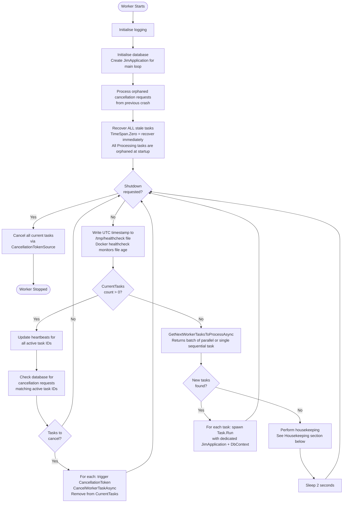
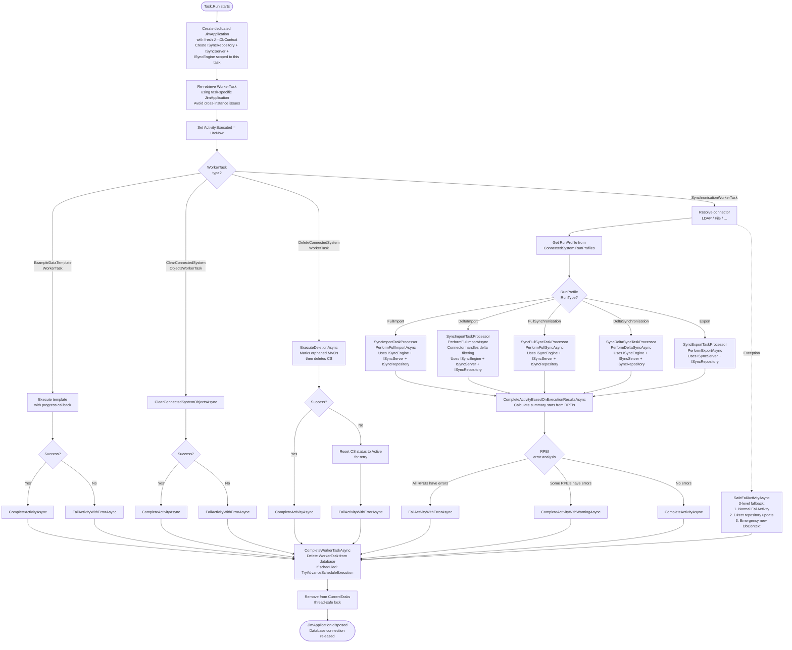
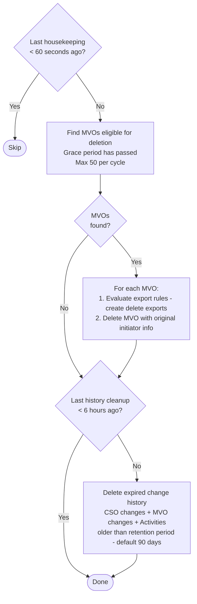
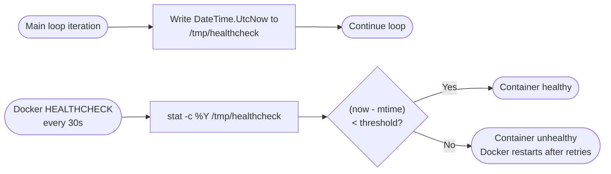

# Worker Task Lifecycle

> Last updated: 2026-04-01 — JIM v0.8.0

This diagram shows how the JIM Worker service picks up, executes, and completes tasks. It covers the main polling loop, task dispatch, heartbeat management, cancellation handling, and housekeeping.

## Worker Main Loop

## Task Execution (per spawned task)

Each task runs in its own `Task.Run` with an isolated `JimApplication`, `JimDbContext`, `ISyncRepository`, and `ISyncServer` to avoid EF Core connection sharing issues. Sync/delta sync processors also receive a stateless `ISyncEngine` for pure domain decisions.

## Housekeeping (idle time)

Runs every 60 seconds when the worker has no active tasks.

## Docker Healthcheck (#185)

Both Worker and Scheduler write a heartbeat file each main-loop iteration. Docker's `HEALTHCHECK` instruction compares the file's modification timestamp against a staleness threshold.

| Service   | Staleness threshold | Start period | Rationale                                  |
|-----------|--------------------:|-----------:|----------------------------------------------|
| Worker    | 60 s                | 60 s       | 2 s polling cycle; 60 s tolerates brief stalls |
| Scheduler | 120 s               | 120 s      | Longer cycle; waits for application readiness  |

## Key Design Decisions

- **Three-layer sync DI architecture (#394)**: Worker processors use three collaborating interfaces injected at task spawn time:
  - **ISyncEngine** — Pure domain logic (projection decisions, attribute flow, deletion rules, export confirmation). Stateless, synchronous, zero-dependency, I/O-free, fully unit-testable. 8 methods covering projection, attribute flow, export confirmation, deletion rules, and reconciliation. Used by import, full sync, and delta sync processors.
  - **ISyncServer** — Orchestration facade that delegates to existing application-layer servers (ExportEvaluationServer, ExportExecutionServer, ScopingEvaluationServer, DriftDetectionService) and ISyncRepository. All processors use this.
  - **ISyncRepository** — Dedicated data access boundary for sync operations (bulk CSO/MVO writes, pending exports, RPEIs). Replaces scattered access through multiple server properties.

- **Per-task DI scope (#394)**: Each spawned task gets its own `JimApplication` (via `IJimApplicationFactory.Create()`), `JimDbContext`, `ISyncRepository`, `ISyncServer`, and `ISyncEngine` — fully isolated from the main loop and other tasks. This avoids EF Core connection sharing issues and ensures each task can be disposed independently. The main loop has its own instance for polling and heartbeats.

- **Heartbeat-based liveness (two levels)**:
  - **Task-level**: Active tasks have their database heartbeats updated every polling cycle (2 seconds). The scheduler uses heartbeat timestamps to detect crashed workers and recover stale tasks.
  - **Container-level (#185)**: The main loop writes a UTC timestamp to `/tmp/healthcheck` each iteration. Docker's `HEALTHCHECK` instruction compares file age against a staleness threshold (60 s for Worker, 120 s for Scheduler) to detect stalled service loops and trigger container restarts.

- **Startup recovery**: On startup, ALL `Processing` tasks are immediately recovered (re-queued) since the worker just started and nothing can genuinely be processing.

- **Task deletion on completion**: Worker tasks are deleted from the database upon completion (not kept). The Activity record serves as the permanent audit trail.

- **SafeFailActivityAsync**: Three-level fallback ensures activities are never left stuck in `InProgress` status, even if EF tracking is corrupted or the DbContext is disposed.

- **Parallel dispatch**: When `GetNextWorkerTasksToProcessAsync` returns multiple tasks (parallel step group from a schedule), they are all spawned via `Task.Run` simultaneously, each with their own DbContext.
