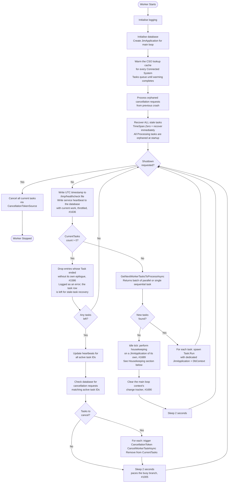
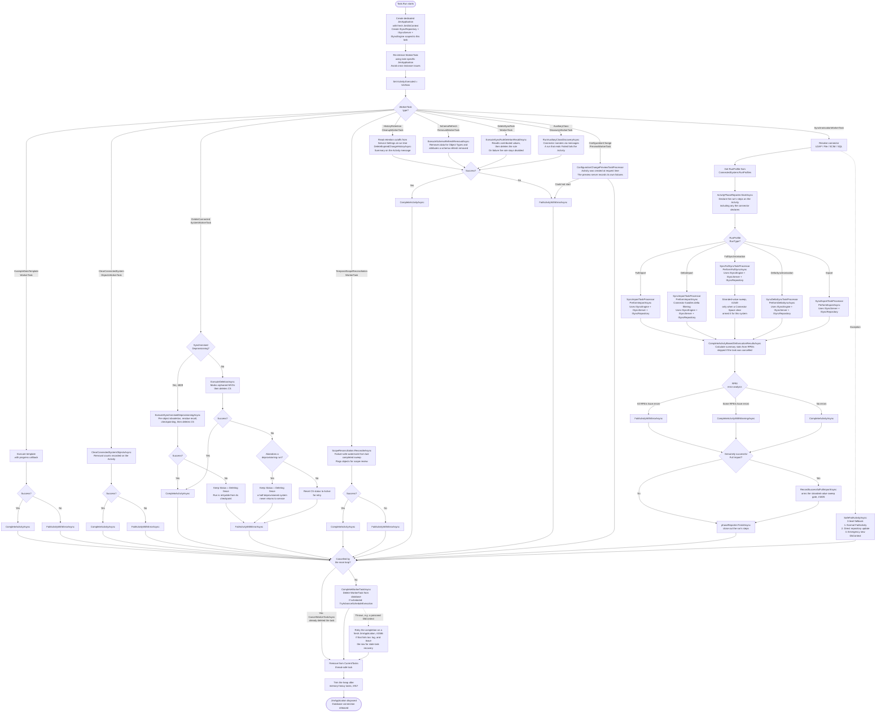
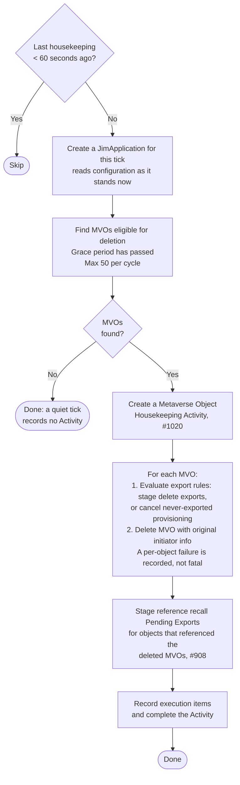
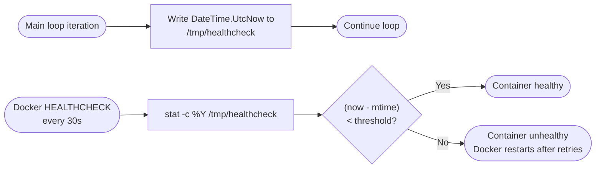

# Worker Task Lifecycle

> Last updated: 2026-09-23, JIM v0.15.0

This diagram shows how the JIM Worker service picks up, executes, and completes tasks. It covers the main polling loop, task dispatch, heartbeat management, cancellation handling, and housekeeping.

## Worker Main Loop

```mermaid
flowchart TD
    Start([Worker Starts]) --> InitLog[Initialise logging]
    InitLog --> InitDb[Initialise database<br/>Create JimApplication for main loop]
    InitDb --> WarmCache[Warm the CSO lookup cache<br/>for every Connected System<br/>Tasks queue until warming completes]

    WarmCache --> CancelOrphans[Process orphaned cancellation requests<br/>from previous crash]
    CancelOrphans --> RecoverStale[Recover ALL stale tasks<br/>TimeSpan.Zero = recover immediately<br/>All Processing tasks are orphaned at startup]

    RecoverStale --> MainLoop{Shutdown<br/>requested?}
    MainLoop -->|Yes| ShutdownCancel[Cancel all current tasks<br/>via CancellationTokenSource]
    ShutdownCancel --> End([Worker Stopped])

    MainLoop -->|No| TouchHealth[Write UTC timestamp to<br/>/tmp/healthcheck file<br/>Write service heartbeat to the database<br/>with current work, throttled, #1636]
    TouchHealth --> HasTasks{CurrentTasks<br/>count > 0?}

    %% --- Active tasks: defunct sweep, heartbeat + cancellation ---
    HasTasks -->|Yes| SweepDefunct[Drop entries whose Task ended<br/>without its own epilogue, #1586<br/>Logged as an error; the task row<br/>is left for stale-task recovery]
    SweepDefunct --> StillActive{Any tasks<br/>left?}
    StillActive -->|No| MainLoop
    StillActive -->|Yes| Heartbeat[Update heartbeats for<br/>all active task IDs]
    Heartbeat --> CheckCancel[Check database for<br/>cancellation requests<br/>matching active task IDs]
    CheckCancel --> AnyCancel{Tasks to<br/>cancel?}
    AnyCancel -->|Yes| DoCancel[For each: trigger CancellationToken<br/>CancelWorkerTaskAsync<br/>Remove from CurrentTasks]
    AnyCancel -->|No| BusySleep
    DoCancel --> BusySleep[Sleep 2 seconds<br/>paces the busy branch, #1005]
    BusySleep --> MainLoop

    %% --- No active tasks: poll for new work ---
    HasTasks -->|No| PollQueue[GetNextWorkerTasksToProcessAsync<br/>Returns batch of parallel or single sequential task]
    PollQueue --> HasNew{New tasks<br/>found?}
    HasNew -->|No| Housekeeping[Idle tick: perform housekeeping<br/>on a JimApplication of its own, #1689<br/>See Housekeeping section below]
    Housekeeping --> ClearTracker[Clear the main loop context's<br/>change tracker, #1690]
    ClearTracker --> Sleep[Sleep 2 seconds]
    Sleep --> MainLoop

    HasNew -->|Yes| Dispatch[For each task: spawn Task.Run<br/>with dedicated JimApplication + DbContext]
    Dispatch --> MainLoop
```

The Worker process also hosts a second `BackgroundService`, the **Password Delivery Service** (`PasswordDeliveryService`, #1638). It is not a Worker Task and never enters this loop: it delivers the Password Synchronisation queue on its own clock (woken by the queue's database notification, by the earliest scheduled retry, and by a 30-second safety poll) so a password change never waits behind a running Run Profile, and it writes its own service heartbeat.

## Task Execution (per spawned task)

Each task runs in its own `Task.Run` with an isolated `JimApplication`, `JimDbContext`, `ISyncRepository`, and `ISyncServer` to avoid EF Core connection sharing issues. Sync/delta sync processors also receive a stateless `ISyncEngine` for pure domain decisions.

```mermaid
flowchart TD
    Spawned([Task.Run starts]) --> CreateJim[Create dedicated JimApplication<br/>with fresh JimDbContext<br/>Create ISyncRepository + ISyncServer +<br/>ISyncEngine scoped to this task]
    CreateJim --> ReRetrieve[Re-retrieve WorkerTask<br/>using task-specific JimApplication<br/>Avoid cross-instance issues]
    ReRetrieve --> SetExecuted[Set Activity.Executed = UtcNow]

    SetExecuted --> TaskType{WorkerTask<br/>type?}

    %% --- Sync task ---
    TaskType -->|SynchronisationWorkerTask| ResolveConnector[Resolve connector<br/>LDAP / File / SCIM / SQL]
    ResolveConnector --> ResolveRP[Get RunProfile from<br/>ConnectedSystem.RunProfiles]
    ResolveRP --> DeclarePhases[ActivityPhaseReporter.StartAsync<br/>Declare the run's steps on the Activity<br/>including any the connector declares]
    DeclarePhases --> RunType{RunProfile<br/>RunType?}

    RunType -->|FullImport| FI[SyncImportTaskProcessor<br/>PerformImportAsync<br/>Uses ISyncEngine + ISyncServer + ISyncRepository]
    RunType -->|DeltaImport| DI[SyncImportTaskProcessor<br/>PerformImportAsync<br/>Connector handles delta filtering<br/>Uses ISyncEngine + ISyncServer + ISyncRepository]
    RunType -->|FullSynchronisation| FS[SyncFullSyncTaskProcessor<br/>PerformFullSyncAsync<br/>Uses ISyncEngine + ISyncServer + ISyncRepository]
    RunType -->|DeltaSynchronisation| DS[SyncDeltaSyncTaskProcessor<br/>PerformDeltaSyncAsync<br/>Uses ISyncEngine + ISyncServer + ISyncRepository]
    RunType -->|Export| EX[SyncExportTaskProcessor<br/>PerformExportAsync<br/>Uses ISyncServer + ISyncRepository]

    FS --> StrandedSweep[Stranded-value sweep, #1549<br/>only when a Connector Space clear<br/>armed it for this system]

    FI --> CompleteActivity
    DI --> CompleteActivity
    StrandedSweep --> CompleteActivity
    DS --> CompleteActivity
    EX --> CompleteActivity

    %% --- Data generation task ---
    TaskType -->|ExampleDataTemplate<br/>WorkerTask| DataGen[Execute template<br/>with progress callback]
    DataGen --> DataGenResult{Success?}
    DataGenResult -->|Yes| DataGenComplete[CompleteActivityAsync]
    DataGenResult -->|No| DataGenFail[FailActivityWithErrorAsync]
    DataGenComplete --> CompleteTask
    DataGenFail --> CompleteTask

    %% --- Clear CSOs task ---
    TaskType -->|ClearConnectedSystem<br/>ObjectsWorkerTask| ClearCSOs[ClearConnectedSystemObjectsAsync<br/>Removal counts recorded on the Activity]
    ClearCSOs --> ClearResult{Success?}
    ClearResult -->|Yes| ClearComplete[CompleteActivityAsync]
    ClearResult -->|No| ClearFail[FailActivityWithErrorAsync]
    ClearComplete --> CompleteTask
    ClearFail --> CompleteTask

    %% --- Delete CS task ---
    TaskType -->|DeleteConnected<br/>SystemWorkerTask| DeleteMode{Synchronised<br/>Deprovisioning?}
    DeleteMode -->|Yes, #809| Deprovision[ExecuteSynchronisedDeprovisioningAsync<br/>Per-object obsoletion, residue recall,<br/>checkpointing, then deletes CS]
    Deprovision --> DeprovResult{Success?}
    DeprovResult -->|Yes| DeleteComplete[CompleteActivityAsync]
    DeprovResult -->|No| KeepFence[Keep Status = Deleting fence<br/>Run is retryable from its checkpoint]
    KeepFence --> DeleteFail

    DeleteMode -->|No| DeleteCS[ExecuteDeletionAsync<br/>Marks orphaned MVOs<br/>then deletes CS]
    DeleteCS --> DeleteResult{Success?}
    DeleteResult -->|Yes| DeleteComplete
    DeleteResult -->|No| Abandons{Abandons a<br/>deprovisioning run?}
    Abandons -->|Yes| KeepFenceImmediate[Keep Status = Deleting fence<br/>a half-deprovisioned system<br/>never returns to service]
    Abandons -->|No| ResetStatus[Reset CS status to Active<br/>for retry]
    KeepFenceImmediate --> DeleteFail
    ResetStatus --> DeleteFail[FailActivityWithErrorAsync]
    DeleteComplete --> CompleteTask
    DeleteFail --> CompleteTask

    %% --- Temporal Scope Reconciliation task ---
    TaskType -->|TemporalScopeReconciliation<br/>WorkerTask| Temporal[ScopeReconciliation.ReconcileAsync<br/>Failure-safe watermark from last<br/>completed sweep<br/>Flags objects for scope review]
    Temporal --> TemporalResult{Success?}
    TemporalResult -->|Yes| TemporalComplete[CompleteActivityAsync]
    TemporalResult -->|No| TemporalFail[FailActivityWithErrorAsync]
    TemporalComplete --> CompleteTask
    TemporalFail --> CompleteTask

    %% --- Server-owned tasks: the server does the work, the Worker owns the Activity's fate ---
    TaskType -->|HistoryRetention<br/>CleanupWorkerTask| Retention[Read retention cutoffs from<br/>Service Settings at run time<br/>DeleteExpiredChangeHistoryAsync<br/>Summary on the Activity message]
    TaskType -->|SchemaRefresh<br/>RemovalWorkerTask| SchemaRemoval[ExecuteSchemaRefreshRemovalAsync<br/>Removes data for Object Types and<br/>attributes a schema refresh removed]
    TaskType -->|DeleteSyncRule<br/>WorkerTask| DeleteRule[ExecuteSyncRuleDeletionRecallAsync<br/>Recalls contributed values,<br/>then deletes the rule<br/>On failure the rule stays disabled]
    TaskType -->|AuxiliaryClass<br/>DiscoveryWorkerTask| AuxDiscovery[RunAuxiliaryClassDiscoveryAsync<br/>Connector narrates via messages<br/>A run that ends Failed fails the Activity]
    Retention --> ServerResult{Success?}
    SchemaRemoval --> ServerResult
    DeleteRule --> ServerResult
    AuxDiscovery --> ServerResult
    ServerResult -->|Yes| ServerComplete[CompleteActivityAsync]
    ServerResult -->|No| ServerFail[FailActivityWithErrorAsync]
    ServerComplete --> CompleteTask
    ServerFail --> CompleteTask

    %% --- Configuration Change Preview task ---
    TaskType -->|ConfigurationChange<br/>PreviewWorkerTask| Preview[ConfigurationChangePreviewTaskProcessor<br/>Activity was created at request time<br/>The preview server records its own failures]
    Preview -->|Could not start| ServerFail
    Preview --> CompleteTask

    %% --- Activity completion for sync tasks ---
    CompleteActivity[CompleteActivityBasedOnExecutionResultsAsync<br/>Calculate summary stats from RPEIs<br/>skipped if the task was cancelled]
    CompleteActivity --> DetermineStatus{RPEI<br/>error analysis}
    DetermineStatus -->|All RPEIs have errors| FailActivity[FailActivityWithErrorAsync]
    DetermineStatus -->|Some RPEIs have errors| WarnActivity[CompleteActivityWithWarningAsync]
    DetermineStatus -->|No errors| SuccessActivity[CompleteActivityAsync]

    FailActivity --> FullImportGate
    WarnActivity --> FullImportGate
    SuccessActivity --> FullImportGate
    FullImportGate{Genuinely successful<br/>Full Import?}
    FullImportGate -->|Yes| RecordFullImport[RecordSuccessfulFullImportAsync<br/>arms the stranded-value sweep gate, #1605]
    FullImportGate -->|No| PhasesDone
    RecordFullImport --> PhasesDone[phaseReporter.FinishAsync<br/>close out the run's steps]
    PhasesDone --> CompleteTask

    %% --- Sync exception handling ---
    ResolveConnector -.->|Exception| SafeFail[SafeFailActivityAsync<br/>3-level fallback:<br/>1. Normal FailActivity<br/>2. Direct repository update<br/>3. Emergency new DbContext]
    SafeFail --> CompleteTask

    %% --- Task completion ---
    CompleteTask{Cancelled by<br/>the main loop?}
    CompleteTask -->|Yes: CancelWorkerTaskAsync<br/>already deleted the task| RemoveFromList
    CompleteTask -->|No| DoComplete[CompleteWorkerTaskAsync<br/>Delete WorkerTask from database<br/>If scheduled: TryAdvanceScheduleExecution]
    DoComplete --> RemoveFromList
    DoComplete -.->|Throws, e.g. a poisoned DbContext| RetryFresh[Retry the completion on a<br/>fresh JimApplication, #1586<br/>If that fails too: log, and leave<br/>the row for stale-task recovery]
    RetryFresh --> RemoveFromList
    RemoveFromList[Remove from CurrentTasks<br/>thread-safe lock] --> TrimHeap[Trim the heap after<br/>memory-heavy tasks, #917]
    TrimHeap --> Disposed([JimApplication disposed<br/>Database connection released])
```

## Housekeeping (idle time)

Runs at most every 60 seconds when the worker has no active tasks. Each tick runs on a `JimApplication` of its own rather than the main loop's (#1689): the main loop's context lives for the Worker's lifetime, and EF Core serves a tracked entity back as it first stood, so housekeeping on it acted on stale Synchronisation Rule and Metaverse Object Type configuration.

```mermaid
flowchart TD
    Check{Last housekeeping<br/>< 60 seconds ago?}
    Check -->|Yes| Skip([Skip])
    Check -->|No| FreshJim[Create a JimApplication for this tick<br/>reads configuration as it stands now]
    FreshJim --> MvoCleanup[Find MVOs eligible for deletion<br/>Grace period has passed<br/>Max 50 per cycle]
    MvoCleanup --> HasMvos{MVOs<br/>found?}
    HasMvos -->|No| Quiet([Done: a quiet tick<br/>records no Activity])
    HasMvos -->|Yes| CreateActivity[Create a Metaverse Object<br/>Housekeeping Activity, #1020]
    CreateActivity --> DeleteLoop[For each MVO:<br/>1. Evaluate export rules: stage delete exports,<br/>or cancel never-exported provisioning<br/>2. Delete MVO with original initiator info<br/>A per-object failure is recorded, not fatal]
    DeleteLoop --> Recall[Stage reference recall Pending Exports<br/>for objects that referenced the<br/>deleted MVOs, #908]
    Recall --> CompleteActivity[Record execution items<br/>and complete the Activity]
    CompleteActivity --> Done([Done])
```

History retention cleanup no longer runs here: it is a step on the built-in **History Retention Cleanup** Schedule (#1118), queued as a `HistoryRetentionCleanupWorkerTask` (see [Schedule Execution Lifecycle](SCHEDULE_EXECUTION_LIFECYCLE.md)). Password delivery is not requested from here either; it is the Password Delivery Service's own loop.

## Docker Healthcheck (#185)

Both Worker and Scheduler write a heartbeat file each main-loop iteration. Docker's `HEALTHCHECK` instruction compares the file's modification timestamp against a staleness threshold.

```mermaid
flowchart LR
    Loop([Main loop iteration]) --> WriteFile["Write DateTime.UtcNow to<br/>/tmp/healthcheck"]
    WriteFile --> NextIteration([Continue loop])

    Docker([Docker HEALTHCHECK<br/>every 30s]) --> StatFile["stat -c %Y /tmp/healthcheck"]
    StatFile --> Compare{"(now - mtime)<br/>< threshold?"}
    Compare -->|Yes| Healthy([Container healthy])
    Compare -->|No| Unhealthy([Container unhealthy<br/>Docker restarts after retries])
```

| Service   | Staleness threshold | Start period | Rationale                                  |
|-----------|--------------------:|-----------:|----------------------------------------------|
| Worker    | 60 s                | 60 s       | 2 s polling cycle; 60 s tolerates brief stalls |
| Scheduler | 120 s               | 120 s      | Longer cycle; waits for application readiness  |

Alongside the file, each service writes a heartbeat row to the database (`ServiceHeartbeatWriter`, #1636) for the Operations page's Service Health view: the Worker's main loop as `WorkerSync` (including what it is running and since when), the Password Delivery Service as `WorkerDelivery`, and the Scheduler as `Scheduler`. Writes are throttled to one every 5 seconds, a heartbeat older than three intervals reads as overdue, and a failed write never interrupts the loop that made it.

## Key Design Decisions

- **Three-layer sync DI architecture (#394)**  Worker processors use three collaborating interfaces injected at task spawn time:
  - **ISyncEngine:** Pure domain logic (projection decisions, Attribute Flow, deletion rules, export confirmation). Stateless, synchronous, zero-dependency, I/O-free, fully unit-testable. Its methods cover projection, Attribute Flow, attribute recall, export confirmation and reconciliation, deletion rules, out-of-scope action, applying pending attribute changes, and the outbound decisions extracted into it under #288 (Metaverse Object deletion exports, out-of-scope deprovisioning, outbound staging and delta computation, reference recall, export matching rule selection). Used by import, full sync, and delta sync processors.
  - **ISyncServer:** Orchestration facade that delegates to existing application-layer servers (ExportEvaluationServer, ExportExecutionServer, ScopingEvaluationServer, DriftDetectionService) and ISyncRepository. All processors use this.
  - **ISyncRepository:** Dedicated data access boundary for sync operations (bulk CSO/MVO writes, Pending Exports, RPEIs). Replaces scattered access through multiple server properties.

- **Per-task DI scope (#394)**  Each spawned task gets its own `JimApplication` (via `IJimApplicationFactory.Create()`), `JimDbContext`, `ISyncRepository`, `ISyncServer`, and `ISyncEngine`, fully isolated from the main loop and other tasks. This avoids EF Core connection sharing issues and ensures each task can be disposed independently. The main loop has its own instance for polling and heartbeats.

- **Heartbeat-based liveness (three levels)**  Task-level: Active tasks have their database heartbeats updated every polling cycle (2 seconds). The scheduler uses heartbeat timestamps to detect crashed workers and recover stale tasks. Container-level (#185): The main loop writes a UTC timestamp to `/tmp/healthcheck` each iteration. Docker's `HEALTHCHECK` instruction compares file age against a staleness threshold (60 s for Worker, 120 s for Scheduler) to detect stalled service loops and trigger container restarts. Service-level (#1636): each service writes a throttled heartbeat row to the database, which the Operations page reads to show whether each service is up, what it is running, and which version it is.

- **Both loop branches are paced (#1005)**  The active-task branch sleeps for 2 seconds after its heartbeat update and cancellation check, matching the idle branch. It previously looped straight back, so for the whole duration of any long-running task the loop spun as fast as its two round trips allowed (measured at 500k scale: ~200 iterations/s, 6.7M heartbeat updates and 16.4M connection-pool resets over one run). Stale-task recovery tolerates far coarser heartbeats, and up to 2 seconds of cancellation latency is acceptable.

- **Startup recovery**  On startup, ALL `Processing` tasks are immediately recovered, since the worker just started and nothing can genuinely be processing: each one's Activity is failed with a crash-recovery message and the task row is deleted to free the queue. A Schedule Execution left waiting on a recovered task is then settled by the Scheduler's stuck-execution safety net, which sees the failed Activity and advances or fails the execution according to the step's `ContinueOnFailure`.

- **Task deletion on completion**  Worker tasks are deleted from the database upon completion (not kept). The Activity record serves as the permanent audit trail.

- **A failed task cannot wedge the queue (#1586)**  An exception escaping a dispatch case (a completion write failing on a DbContext poisoned earlier in the task was the observed trigger, #1568) used to leave the task's entry in `CurrentTasks` for ever, pinning the loop on the busy branch so it never polled for new work while it heartbeated a dead task. Two guards now close this: the busy branch drops any entry whose `Task` has already terminated, logging the fault, and a failed `CompleteWorkerTaskAsync` is retried once on a fresh `JimApplication` before the entry is released regardless. Either way the task row itself is left for stale-task recovery.

- **The main loop's context decides nothing (#1689, #1690)**  The main loop's `JimApplication` lives for the Worker's lifetime, so it is used only for dequeueing, heartbeats and cancellation, all of which are SQL predicates or direct updates. Housekeeping runs on a `JimApplication` created for the tick, and each idle tick clears the main loop's change tracker so it does not retain every Worker Task and Activity it has ever loaded.

- **SafeFailActivityAsync**  Three-level fallback ensures activities are never left stuck in `InProgress` status, even if EF tracking is corrupted or the DbContext is disposed.

- **Parallel dispatch**  When `GetNextWorkerTasksToProcessAsync` returns multiple tasks (parallel step group from a schedule), they are all spawned via `Task.Run` simultaneously, each with their own DbContext.
