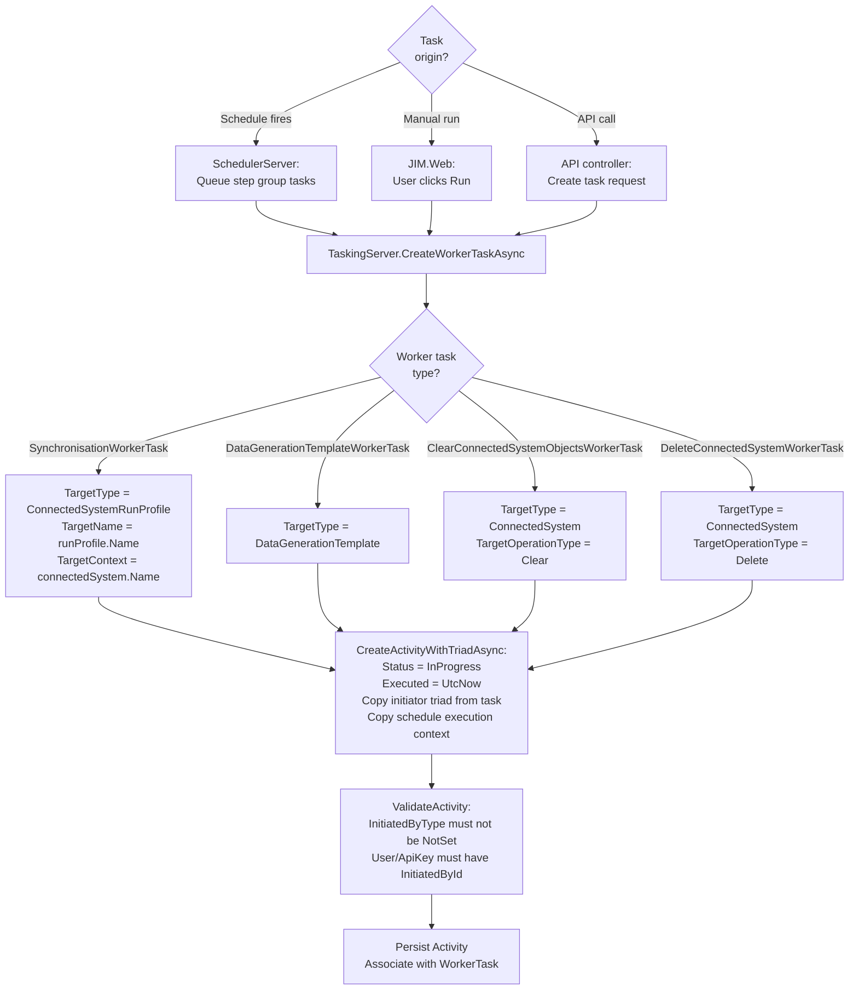
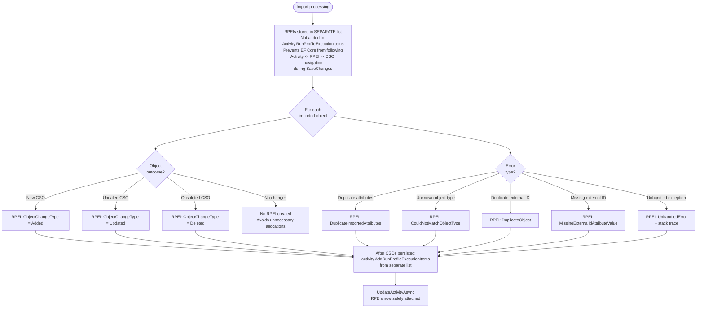
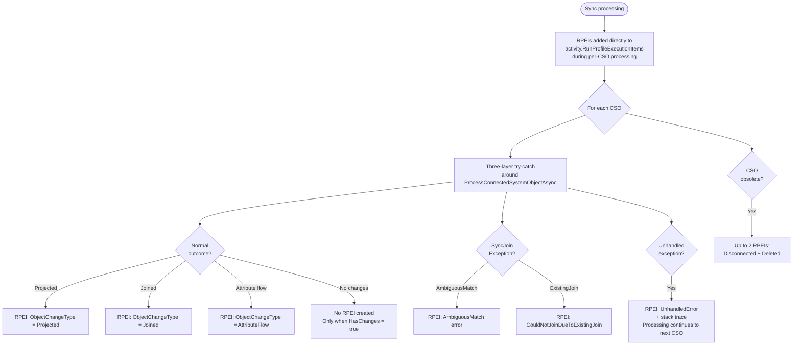
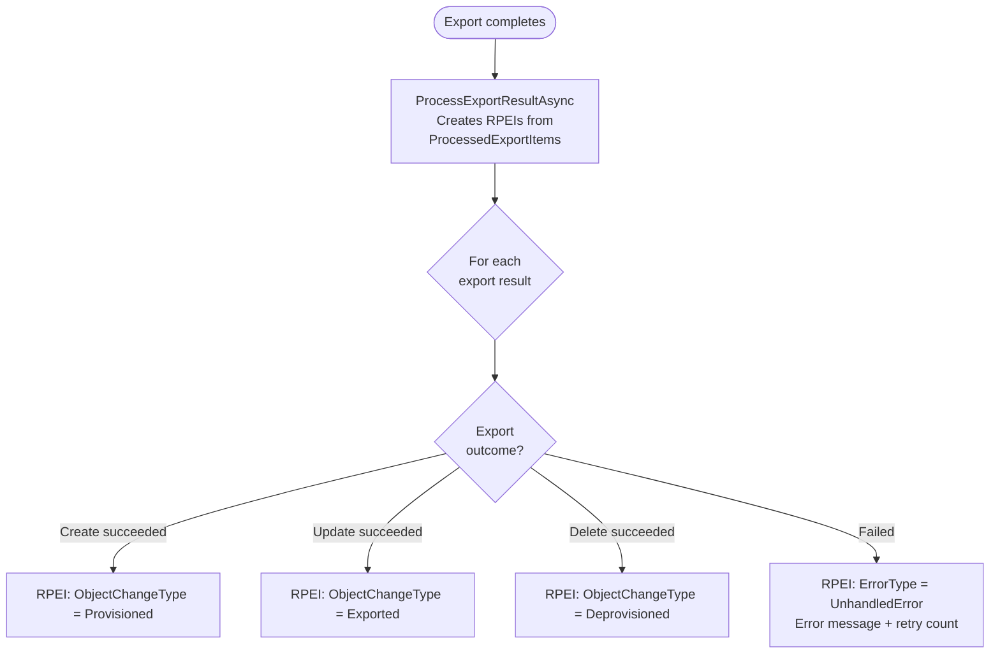
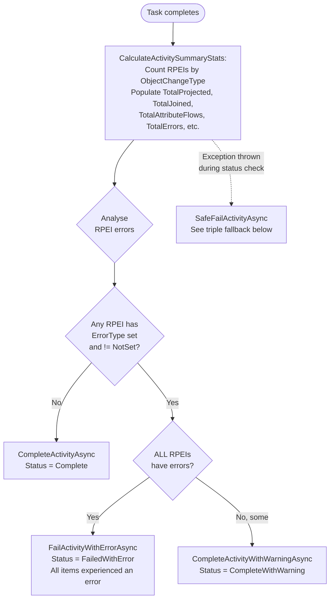
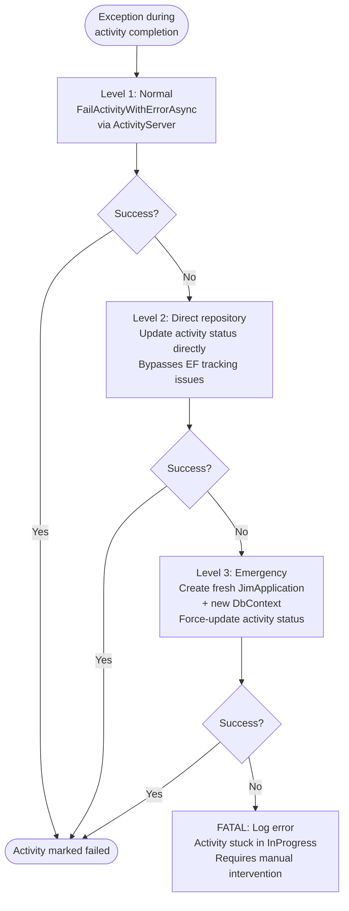

# Activity and RPEI Flow

> Generated against JIM v0.3.0 (`0d1c88e9`). If the codebase has changed significantly since then, these diagrams may be out of date.

This diagram shows how Activities are created, how Run Profile Execution Items (RPEIs) are accumulated during operations, and how the final activity status is determined. Activities are the immutable audit record for every operation in JIM.

## Activity Status Values

| Status | Value | Meaning |
|--------|-------|---------|
| NotSet | 0 | Default, should not appear in practice |
| InProgress | 1 | Set at creation, operation is running |
| Complete | 2 | All RPEIs succeeded, no errors |
| CompleteWithWarning | 3 | Some RPEIs have errors, but not all |
| CompleteWithError | 4 | Exception during processing (with stack trace) |
| FailedWithError | 5 | All RPEIs errored, or unhandled exception |
| Cancelled | 6 | User cancelled the operation |

## Activity Creation

## RPEI Accumulation During Import

## RPEI Accumulation During Sync

## RPEI Accumulation During Export

## Activity Status Determination

## SafeFailActivityAsync - Triple Fallback

When activity completion fails (e.g., EF tracking corruption, disposed DbContext), this three-level fallback ensures activities are never left stuck in InProgress.

## Key Design Decisions

- **RPEI list separation during import**: RPEIs are maintained in a separate list during import to prevent EF Core from following the `Activity -> RPEI -> CSO` navigation chain during `SaveChanges`. This avoids accidentally persisting CSOs before they're ready.

- **Direct attachment during sync**: During sync, RPEIs are added directly to `activity.RunProfileExecutionItems` since CSOs already exist in the database (they were created during a prior import).

- **Conditional RPEI creation**: RPEIs are only created when `HasChanges = true` during sync. This is an optimisation to avoid unnecessary allocations for objects that haven't changed.

- **Error isolation**: Each CSO is processed within its own try-catch during sync. Errors create RPEIs but do not halt processing of remaining CSOs. This ensures a single bad object doesn't prevent the entire sync from completing.

- **Three-tier status model**: `Complete` (no errors), `CompleteWithWarning` (some errors), `FailedWithError` (all errors or unhandled exception). This gives operators clear visibility into the severity of issues.

- **Triple fallback for failure**: `SafeFailActivityAsync` ensures activities are never left stuck in `InProgress`, even when the DbContext is corrupted or disposed. This is critical for system reliability — stuck activities would block future schedule executions.

- **Initiator triad audit**: Every activity records who initiated it (`InitiatedByType`, `InitiatedById`, `InitiatedByName`). For scheduled tasks, this preserves the schedule context. For deferred MVO deletions, the original initiator is captured at mark time and replayed during housekeeping.
