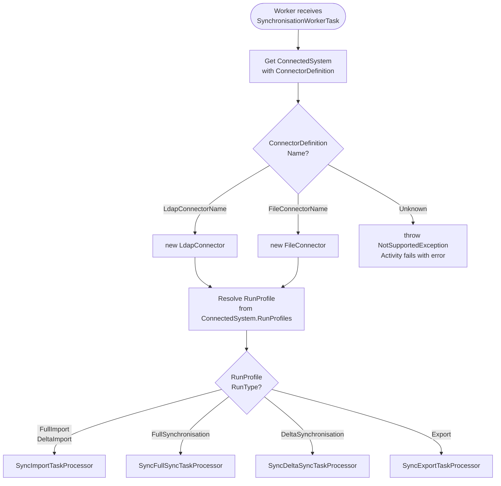
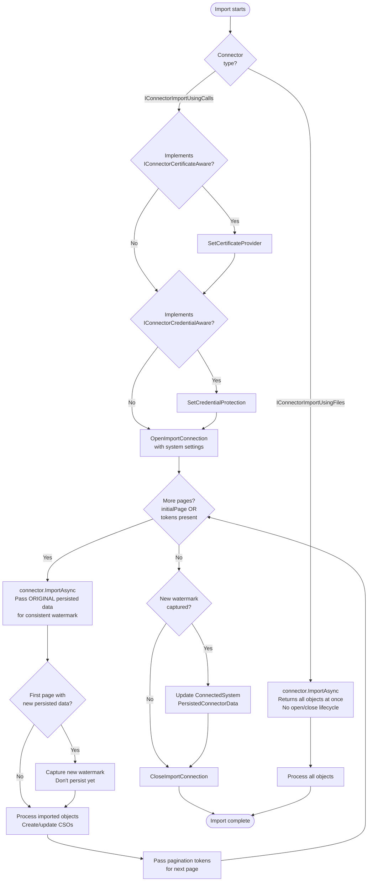
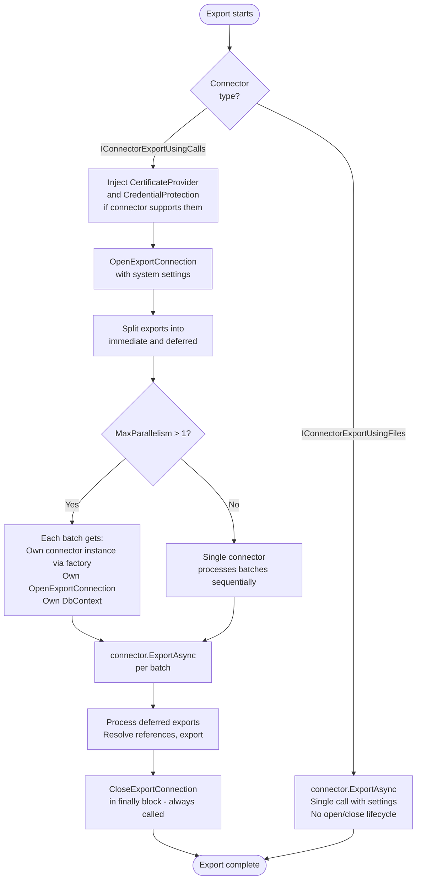
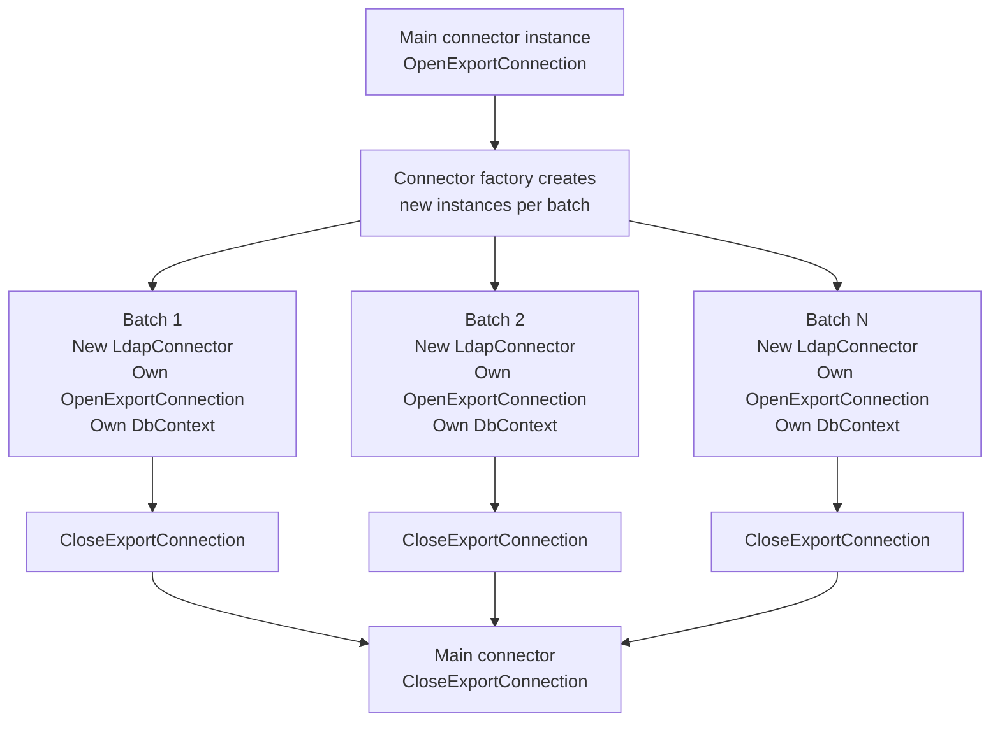

# Connector Lifecycle

> Generated against JIM v0.2.0 (`988472e3`). If the codebase has changed significantly since then, these diagrams may be out of date.

This diagram shows how connectors are resolved, configured, opened, used, and closed across import and export operations. Connectors implement capability interfaces that determine their lifecycle shape.

## Connector Interface Hierarchy

```mermaid
flowchart TD
    IConnector[IConnector<br/>Name, Description, Url] --> ICap[IConnectorCapabilities<br/>What the connector supports]
    IConnector --> ISettings[IConnectorSettings<br/>Configuration definitions<br/>+ validation]
    IConnector --> ISchema[IConnectorSchema<br/>Schema discovery]
    IConnector --> IPartitions[IConnectorPartitions<br/>Partition discovery]

    IConnector --> IImportCalls[IConnectorImportUsingCalls<br/>OpenImportConnection<br/>ImportAsync paginated<br/>CloseImportConnection]
    IConnector --> IImportFiles[IConnectorImportUsingFiles<br/>ImportAsync single call<br/>No open/close]

    IConnector --> IExportCalls[IConnectorExportUsingCalls<br/>OpenExportConnection<br/>ExportAsync batched<br/>CloseExportConnection]
    IConnector --> IExportFiles[IConnectorExportUsingFiles<br/>ExportAsync single call<br/>No open/close]

    IConnector --> ICredential[IConnectorCredentialAware<br/>SetCredentialProtection<br/>Password decryption]
    IConnector --> ICertificate[IConnectorCertificateAware<br/>SetCertificateProvider<br/>SSL/TLS certificates]
    IConnector --> IContainer[IConnectorContainerCreation<br/>Tracks containers created<br/>during export]
```

## Connector Resolution

## Import Lifecycle

## Export Lifecycle

## Parallel Export - Connector Isolation

## Key Design Decisions

- **Two connector families**: Call-based connectors (`IConnectorImportUsingCalls`/`IConnectorExportUsingCalls`) have an explicit open/close lifecycle with connection management. File-based connectors (`IConnectorImportUsingFiles`/`IConnectorExportUsingFiles`) handle everything in a single call with no connection state.

- **Service injection before open**: Certificate and credential providers are injected before `OpenImportConnection`/`OpenExportConnection` is called. This allows connectors to decrypt passwords and load certificates during connection setup.

- **Watermark consistency**: During paginated delta imports, the *original* persisted connector data is passed to every page. The new watermark from the first page is only saved after all pages complete, ensuring the connector sees a consistent view across pages.

- **Parallel connector isolation**: Each parallel export batch gets its own connector instance created via factory. This avoids shared connection state between concurrent batches — critical for connectors like LDAP that maintain stateful connections.

- **CloseExportConnection in finally**: The export connection is always closed, even if an exception occurs during export. This prevents connection leaks in long-running worker processes.

- **Hard-coded resolution**: Connectors are currently resolved by name matching against `ConnectorDefinition.Name`. This will be extended to support user-supplied connector lookup in the future.
