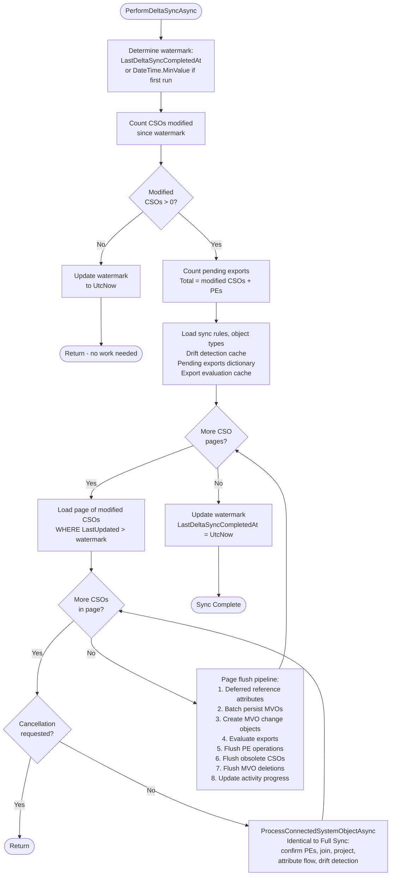
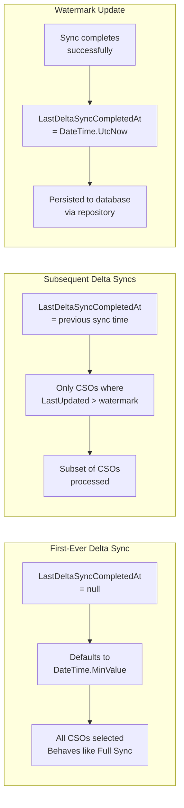
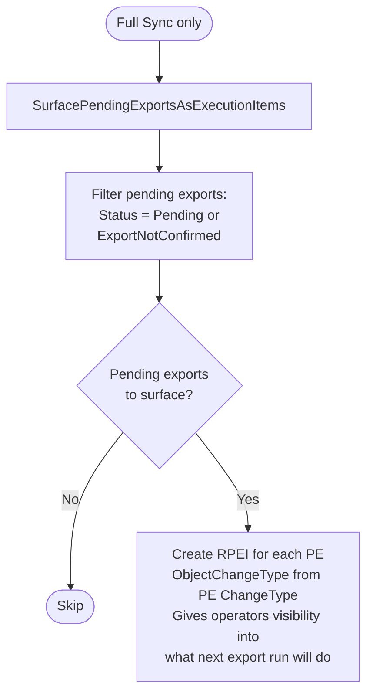

# Delta Sync Flow

> Generated against JIM v0.2.0 (`988472e3`). If the codebase has changed significantly since then, these diagrams may be out of date.

This diagram shows how Delta Synchronisation differs from Full Synchronisation. Both use identical per-CSO processing logic; the only difference is CSO selection and a few lifecycle steps.

## Full Sync vs Delta Sync Comparison

| Aspect | Full Sync | Delta Sync |
|--------|-----------|------------|
| CSO Selection | ALL CSOs | Only CSOs with `LastUpdated > watermark` |
| Early Exit | Never | Yes, if 0 modified CSOs |
| Pending Export Surfacing | Yes (creates RPEIs for operator visibility) | No |
| Per-page pipeline | Identical | Identical |
| Watermark Update | Yes | Yes (even when 0 changes) |
| Use Case | Initial sync, periodic reconciliation | Incremental updates |

## Delta Sync Flow

## Watermark Mechanism

## What Full Sync Does That Delta Sync Does Not

## Key Design Decisions

- **Identical per-CSO logic**: Both full and delta sync share the exact same `ProcessConnectedSystemObjectAsync()` from `SyncTaskProcessorBase`. The only difference is which CSOs are selected for processing.

- **Early exit optimisation**: Delta sync checks if any CSOs have been modified before loading caches and entering the page loop. If nothing has changed, it updates the watermark and returns immediately.

- **Watermark always advances**: Even when zero CSOs are modified, the watermark is updated. This prevents the watermark from becoming stale if no changes occur for an extended period.

- **First delta sync processes everything**: If `LastDeltaSyncCompletedAt` is null (no previous sync), the watermark defaults to `DateTime.MinValue`, effectively selecting all CSOs — the same set as a full sync.

- **No pending export surfacing**: Delta sync skips `SurfacePendingExportsAsExecutionItems()` since it's a lightweight incremental operation. Full sync surfaces pending exports as RPEIs so operators can see what changes are staged for the next export run.
