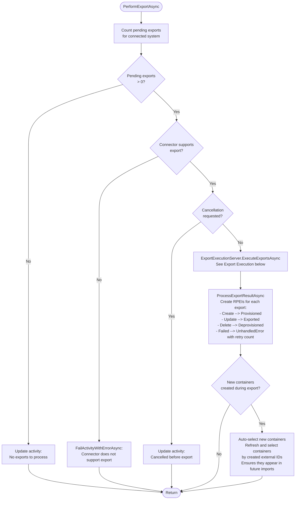
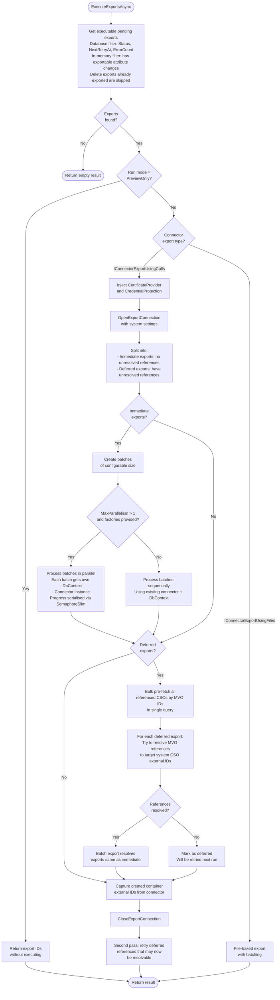

# Export Execution Flow

> Generated against JIM v0.2.0 (`5a4788e9`). If the codebase has changed significantly since then, these diagrams may be out of date.

This diagram shows how pending exports are executed against connected systems via connectors. The export processor (`SyncExportTaskProcessor`) delegates to the `ExportExecutionServer` for the core execution logic, which supports batching, parallelism, deferred reference resolution, and retry with backoff.

## Export Task Processing



## Export Execution (ExportExecutionServer)



## Batch Execution Detail

Each batch follows this sequence, whether processed sequentially or in parallel:


## Parallel Batch Architecture

When `MaxParallelism > 1`, batches are distributed across concurrent tasks. Each task is fully isolated to avoid EF Core thread-safety issues.

```
                    +-------------------+
                    |  Export Processor  |
                    |  (caller context) |
                    +---------+---------+
                              |
                    +---------+---------+
                    |  SemaphoreSlim    |
                    |  (MaxParallelism) |
                    +---------+---------+
                              |
              +---------------+---------------+
              |               |               |
     +--------+------+ +-----+-------+ +-----+-------+
     |   Batch 1     | |   Batch 2   | |   Batch 3   |
     | Own DbContext  | | Own DbCtx   | | Own DbCtx   |
     | Own Connector  | | Own Conn    | | Own Conn     |
     | Re-loads PEs   | | Re-loads    | | Re-loads     |
     | by ID from own | | PEs by ID   | | PEs by ID   |
     | context        | |             | |              |
     +-------+--------+ +------+------+ +------+------+
             |                 |                |
             +--------+--------+--------+-------+
                      |                 |
              +-------+------+  +-------+-------+
              | Result Lock  |  | Progress      |
              | (aggregation)|  | Semaphore     |
              | thread-safe  |  | (serialised)  |
              +--------------+  +---------------+
```

- **Batch IDs are captured** before dispatching - each parallel task re-loads its exports from its own DbContext by ID
- **Progress reporting** is serialised via `SemaphoreSlim(1,1)` to protect the caller's shared DbContext
- **Result aggregation** uses a lock for thread-safe counter updates
- **Connector instances** are created per-batch via factory to avoid shared connection state

## Key Design Decisions

- **Two-pass export**: Exports without unresolved references are executed first (immediate). Exports with unresolved MVO references are deferred, with references bulk-resolved in a single query, then executed in a second pass.

- **Retry with backoff**: Failed exports are retried with exponential backoff via `NextRetryAt`. After `MaxRetries` attempts, the export is marked as permanently `Failed`.

- **No-net-change detection**: Before exports are created during sync, the system checks if the target CSO already has the expected values. This happens upstream in `EvaluateExportRulesWithNoNetChangeDetectionAsync`, not during export execution.

- **Container auto-selection**: When exports create new containers (e.g., OUs in LDAP), their external IDs are captured and auto-selected so they appear in future imports without manual configuration.

- **Preview mode**: `SyncRunMode.PreviewOnly` returns the list of exports that would be processed without executing them, enabling dry-run functionality.

- **Per-batch isolation**: Each parallel batch gets its own `DbContext` and connector instance. EF Core is not thread-safe, so sharing a context across batches would cause data corruption.
