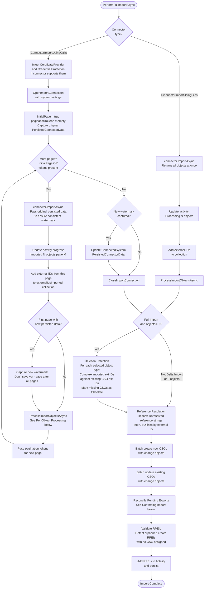
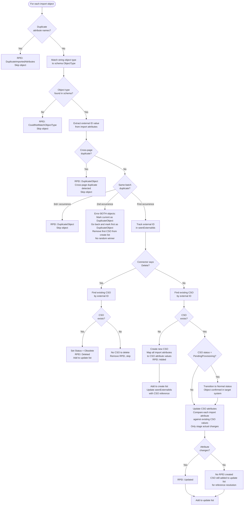
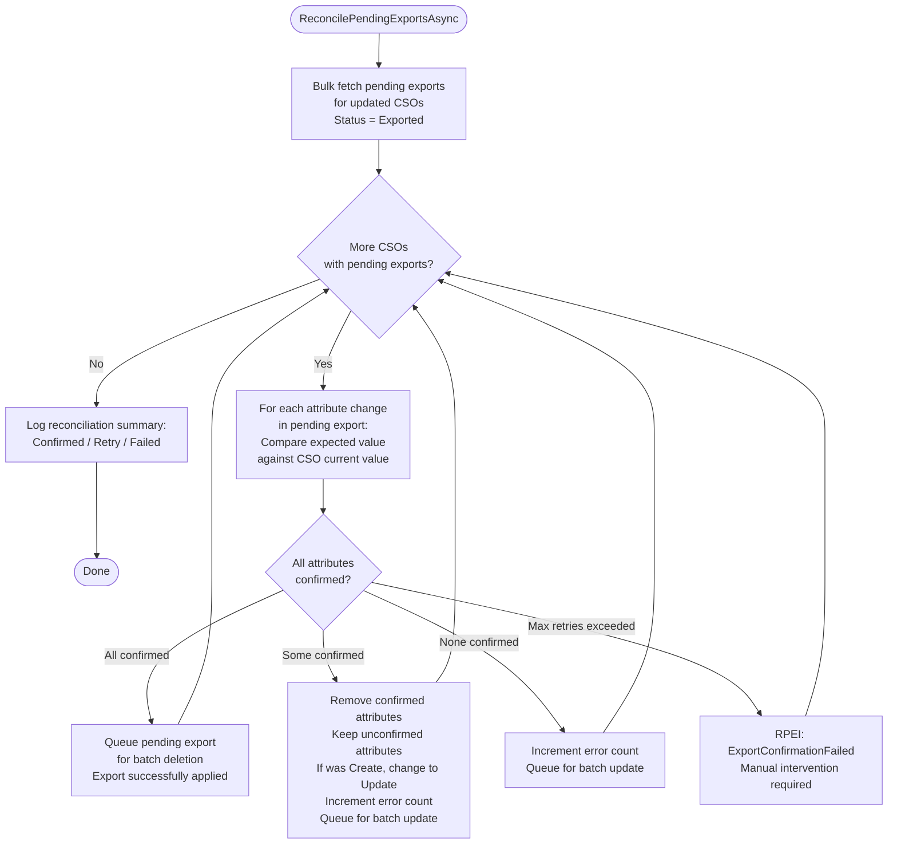

# Full Import Flow

> Generated against JIM v0.2.0 (`5a4788e9`). If the codebase has changed significantly since then, these diagrams may be out of date.

This diagram shows how objects are imported from a connected system into JIM's connector space. Both Full Import and Delta Import use the same processor (`SyncImportTaskProcessor`); the connector handles delta filtering internally via watermark/persisted data.

## Overall Import Flow

## Per-Object Processing

For each object in an import page, within `ProcessImportObjectsAsync`:

## Deletion Detection (Full Import Only)

**Safety rule**: If zero objects were imported, deletion detection is skipped entirely. This prevents accidental mass-deletion when the connected system returns no data due to connectivity issues.

**Delta Import exception**: Deletion detection only runs for Full Import. Delta Imports handle explicit deletes via `ObjectChangeType.Deleted` from the connector (e.g., LDAP tombstone/changelog entries).

## Confirming Import - Pending Export Reconciliation

After CSOs are persisted, the import processor reconciles previously exported changes against the freshly imported values. This is how JIM confirms that exports actually took effect.

## Key Design Decisions

- **Cross-page duplicate detection**: A `HashSet<string>` tracks external IDs across all pages of a paginated import. This is defence-in-depth against directory servers with faulty paging (e.g., Samba AD).

- **Same-batch duplicate handling**: When duplicates are found within a single page, BOTH objects are rejected (no "random winner" based on file order). This forces data owners to fix the source data.

- **Watermark consistency**: For paginated delta imports, the original persisted connector data (watermark/USN) is passed to every page. The new watermark from the first page is only saved after all pages complete, ensuring consistent queries.

- **RPEI list separation**: RPEIs are maintained separately from the Activity during import to avoid EF Core accidentally persisting CSOs before they're ready (EF would follow the Activity -> RPEI -> CSO navigation chain during `SaveChanges`).

- **Zero-import safety**: If no objects are imported, deletion detection is skipped entirely to prevent accidental mass-deletion when connectivity to the source system fails.

- **PendingProvisioning transition**: CSOs created during export (provisioning) start with `PendingProvisioning` status. The confirming import transitions them to `Normal` when the object is confirmed to exist in the target system.
