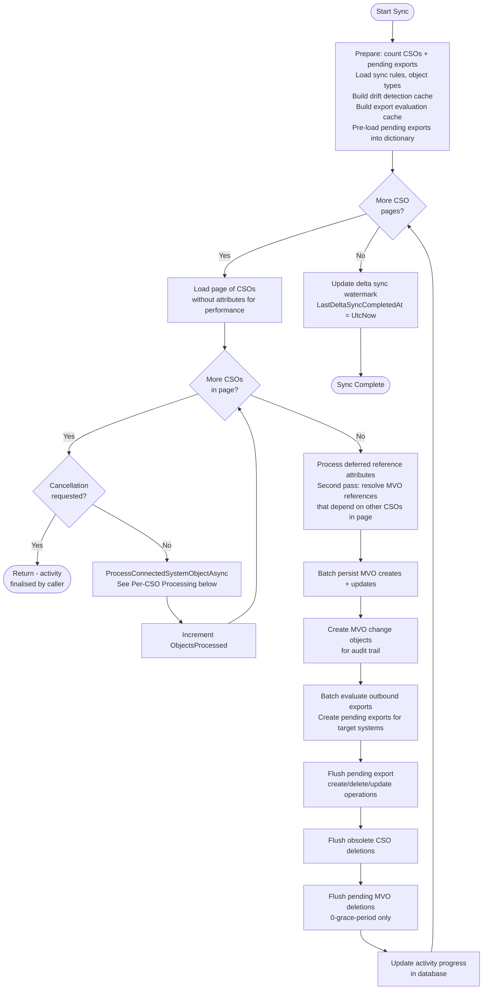
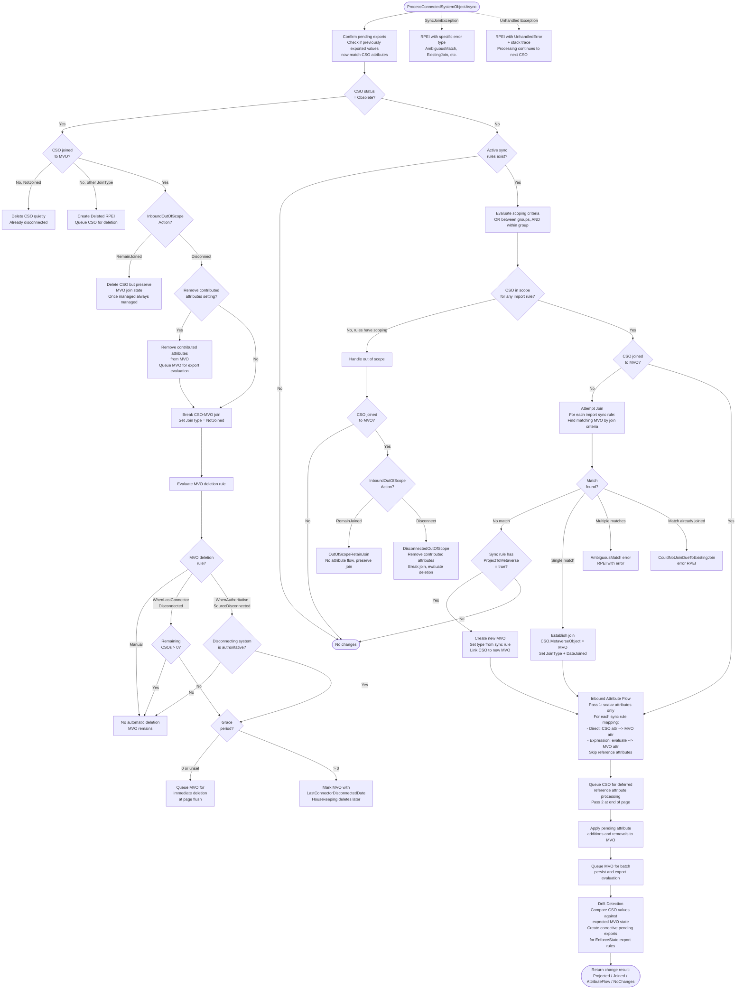

# Full Synchronisation - CSO Processing Flow

This diagram shows the core decision tree for processing a single Connected System Object (CSO) during Full or Delta Synchronisation. This is the central flow of JIM's identity management engine.

Both Full Sync and Delta Sync use identical processing logic per-CSO. The only difference is CSO selection:
- **Full Sync**: processes ALL CSOs in the Connected System
- **Delta Sync**: processes only CSOs modified since `LastDeltaSyncCompletedAt`

## Overall Page Processing

## Per-CSO Processing

This is the decision tree within `ProcessConnectedSystemObjectAsync` for a single CSO.

## Key Design Decisions

- **Two-pass attribute flow**: Scalar attributes are processed first (pass 1), then reference attributes are deferred to a second pass after all CSOs in the page have MVOs. This ensures group member references can resolve to MVOs that were created later in the same page.

- **Batch persistence**: MVO creates/updates, pending exports, and CSO deletions are all batched per-page to reduce database round trips. This is critical for performance at scale.

- **No-net-change detection**: Before creating pending exports, the system checks if the target CSO already has the expected values (using pre-cached data). This avoids unnecessary export operations.

- **Drift detection**: After inbound attribute flow, the system checks whether CSO values match expected MVO state. If an `EnforceState` export rule exists and the CSO has drifted, a corrective pending export is created.

- **Error isolation**: Each CSO is processed within its own try/catch. Errors create RPEIs but do not halt processing of remaining CSOs.
