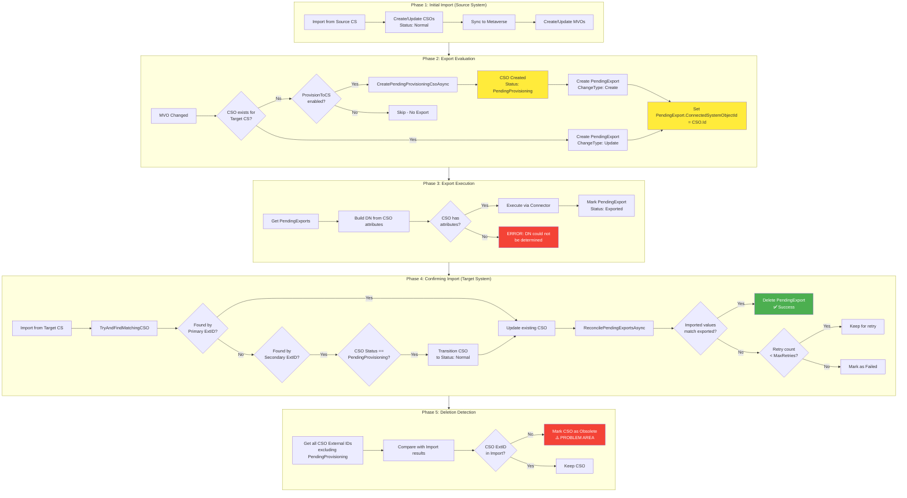

# E2E Import to Provisioning Process

```mermaid
flowchart TD
    subgraph Phase1["Phase 1: Initial Import (Source System)"]
        A1[Import from Source CS] --> A2[Create/Update CSOs<br/>Status: Normal]
        A2 --> A3[Sync to Metaverse]
        A3 --> A4[Create/Update MVOs]
    end

    subgraph Phase2["Phase 2: Export Evaluation"]
        B1[MVO Changed] --> B2{CSO exists for<br/>Target CS?}
        B2 -->|No| B3{ProvisionToCS<br/>enabled?}
        B3 -->|Yes| B4[CreatePendingProvisioningCsoAsync]
        B4 --> B5[CSO Created<br/>Status: PendingProvisioning]
        B5 --> B6[Create PendingExport<br/>ChangeType: Create]
        B6 --> B7[Set PendingExport.ConnectedSystemObjectId = CSO.Id]

        B2 -->|Yes| B8[Create PendingExport<br/>ChangeType: Update]
        B8 --> B7
        B3 -->|No| B9[Skip - No Export]
    end

    subgraph Phase3["Phase 3: Export Execution"]
        C1[Get PendingExports] --> C2[Build DN from CSO attributes]
        C2 --> C3{CSO has<br/>attributes?}
        C3 -->|Yes| C4[Execute via Connector]
        C3 -->|No| C5[ERROR: DN could not<br/>be determined]
        C4 --> C6[Mark PendingExport<br/>Status: Exported]
    end

    subgraph Phase4["Phase 4: Confirming Import (Target System)"]
        D1[Import from Target CS] --> D2[TryAndFindMatchingCSO]
        D2 --> D3{Found by<br/>Primary ExtID?}
        D3 -->|No| D4{Found by<br/>Secondary ExtID?}
        D4 -->|Yes| D5{CSO Status ==<br/>PendingProvisioning?}
        D5 -->|Yes| D6[Transition CSO<br/>to Status: Normal]
        D3 -->|Yes| D7[Update existing CSO]
        D6 --> D7
        D7 --> D8[ReconcilePendingExportsAsync]
        D8 --> D9{Imported values<br/>match exported?}
        D9 -->|Yes| D10[Delete PendingExport<br/>✅ Success]
        D9 -->|No| D11{Retry count<br/>< MaxRetries?}
        D11 -->|Yes| D12[Keep for retry]
        D11 -->|No| D13[Mark as Failed]
    end

    subgraph Phase5["Phase 5: Deletion Detection"]
        E1[Get all CSO External IDs<br/>excluding PendingProvisioning] --> E2[Compare with Import results]
        E2 --> E3{CSO ExtID<br/>in Import?}
        E3 -->|No| E4[Mark CSO as Obsolete<br/>⚠️ PROBLEM AREA]
        E3 -->|Yes| E5[Keep CSO]
    end

    Phase1 --> Phase2
    Phase2 --> Phase3
    Phase3 --> Phase4
    Phase4 --> Phase5

    style B5 fill:#ffeb3b
    style B7 fill:#ffeb3b
    style C5 fill:#f44336,color:#fff
    style E4 fill:#f44336,color:#fff
    style D10 fill:#4caf50,color:#fff
```
