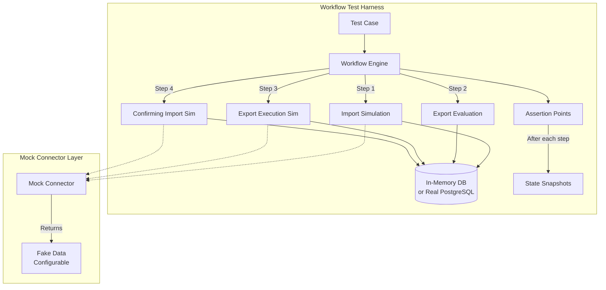

```mermaid
flowchart TD
    subgraph WorkflowTest["Workflow Test Harness"]
        TC[Test Case] --> WE[Workflow Engine]
        WE --> |Step 1| S1[Import Simulation]
        WE --> |Step 2| S2[Export Evaluation]
        WE --> |Step 3| S3[Export Execution Sim]
        WE --> |Step 4| S4[Confirming Import Sim]

        S1 --> DB[(In-Memory DB<br/>or Real PostgreSQL)]
        S2 --> DB
        S3 --> DB
        S4 --> DB

        WE --> AS[Assertion Points]
        AS --> |After each step| ST[State Snapshots]
    end

    subgraph MockLayer["Mock Connector Layer"]
        MC[Mock Connector]
        MC --> |Returns| FD[Fake Data<br/>Configurable]
    end

    S1 -.-> MC
    S3 -.-> MC
    S4 -.-> MC
```
