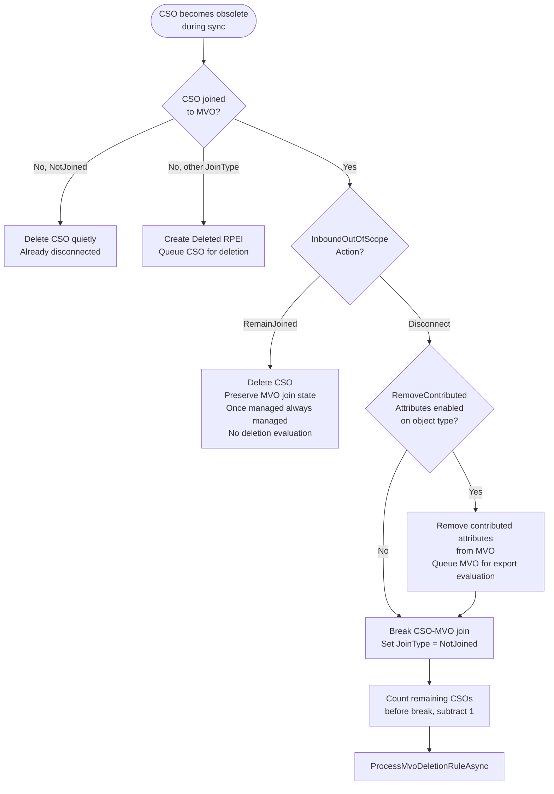
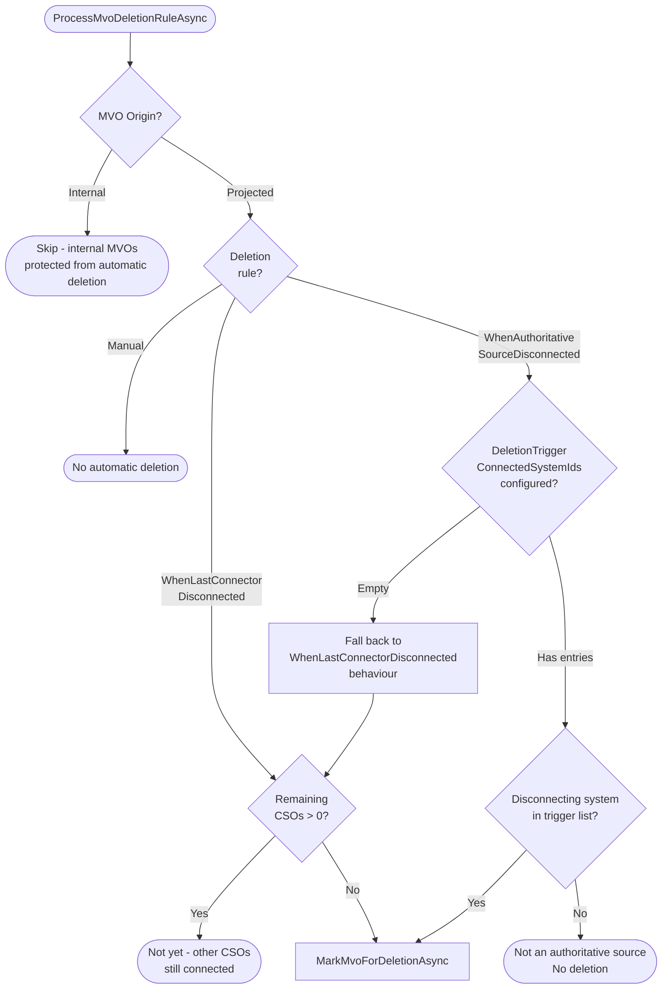
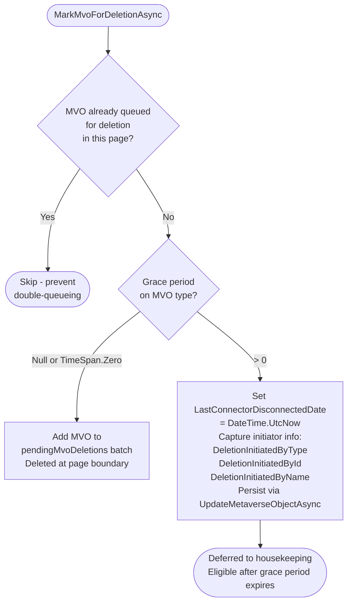
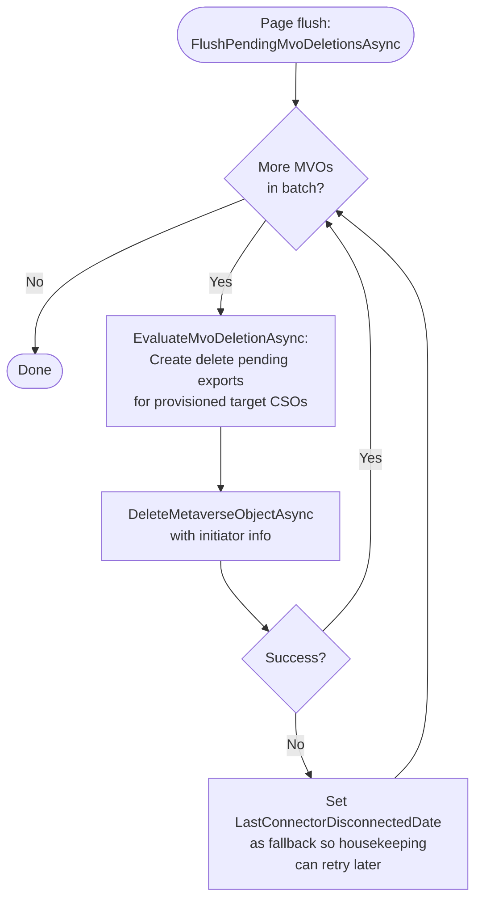
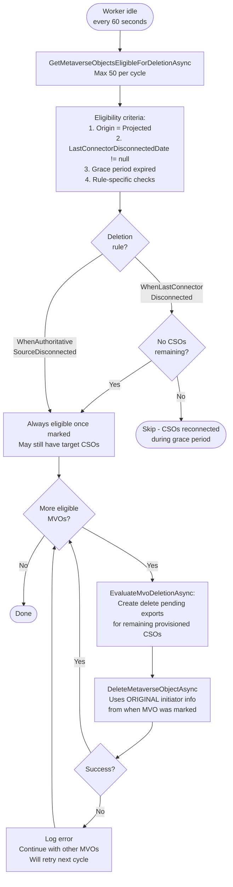
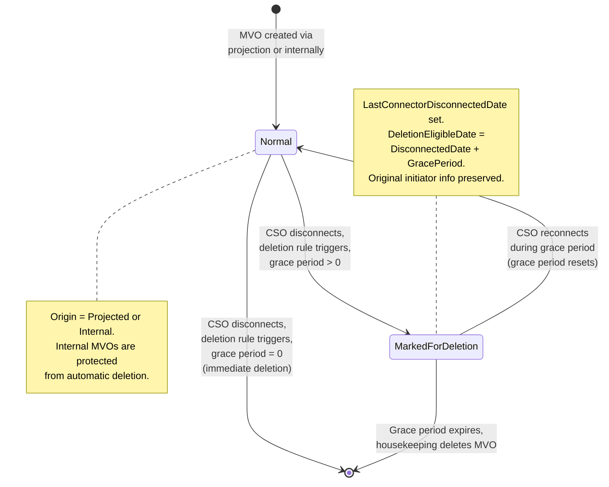

# MVO Deletion and Grace Period

> Generated against JIM v0.2.0 (`988472e3`). If the codebase has changed significantly since then, these diagrams may be out of date.

This diagram shows the full lifecycle of Metaverse Object (MVO) deletion, from the trigger event (CSO disconnection) through deletion rule evaluation, grace period handling, and deferred housekeeping cleanup.

## Deletion Rules

| Rule | Value | Trigger | Behaviour |
|------|-------|---------|-----------|
| Manual | 0 | Never | MVO is never automatically deleted. Requires admin intervention. |
| WhenLastConnectorDisconnected | 1 | All CSOs disconnected | MVO deleted when no CSOs remain joined. Default rule. |
| WhenAuthoritativeSourceDisconnected | 2 | Specified system disconnects | MVO deleted when ANY system in `DeletionTriggerConnectedSystemIds` disconnects, even if other CSOs remain. |

## Trigger: CSO Disconnection During Sync

## Deletion Rule Evaluation

## Grace Period Decision

## Immediate Deletion (Zero Grace Period)

## Deferred Deletion (Housekeeping)

## State Diagram

## Key Design Decisions

- **Internal MVO protection**: MVOs with `Origin = Internal` (admin accounts, service accounts created directly in JIM) are never subject to automatic deletion, regardless of the deletion rule configured on the object type.

- **Grace period reconnection**: If a CSO reconnects to an MVO during the grace period, the MVO is no longer eligible for deletion. The `LastConnectorDisconnectedDate` remains set, but the eligibility query checks for remaining CSOs, so the MVO won't be deleted.

- **Initiator preservation**: When an MVO is marked for deferred deletion, the original initiator info (who/what caused the disconnection) is captured on the MVO. When housekeeping eventually deletes it, this original initiator is used in the audit trail — not "housekeeping" or "system".

- **Export cleanup before deletion**: Both immediate and housekeeping deletion paths call `EvaluateMvoDeletionAsync()` before the actual deletion. This creates delete pending exports for any provisioned target system CSOs, ensuring the external system is cleaned up.

- **Fallback on failure**: If immediate deletion fails (e.g., database error), the system sets `LastConnectorDisconnectedDate` as a fallback. This ensures housekeeping will pick up the MVO for retry on the next cycle, rather than losing the deletion intent.

- **Capped housekeeping**: Housekeeping processes a maximum of 50 MVOs per cycle (every 60 seconds). This prevents large deletion backlogs from monopolising the worker during idle time.

- **WhenAuthoritativeSourceDisconnected fallback**: If `DeletionTriggerConnectedSystemIds` is empty, the rule falls back to `WhenLastConnectorDisconnected` behaviour. This prevents misconfiguration from causing unexpected deletions.

- **Dedup within page**: Multiple CSOs from the same MVO can disconnect in the same sync page. The dedup check in `MarkMvoForDeletionAsync` prevents the same MVO from being queued for immediate deletion twice.
