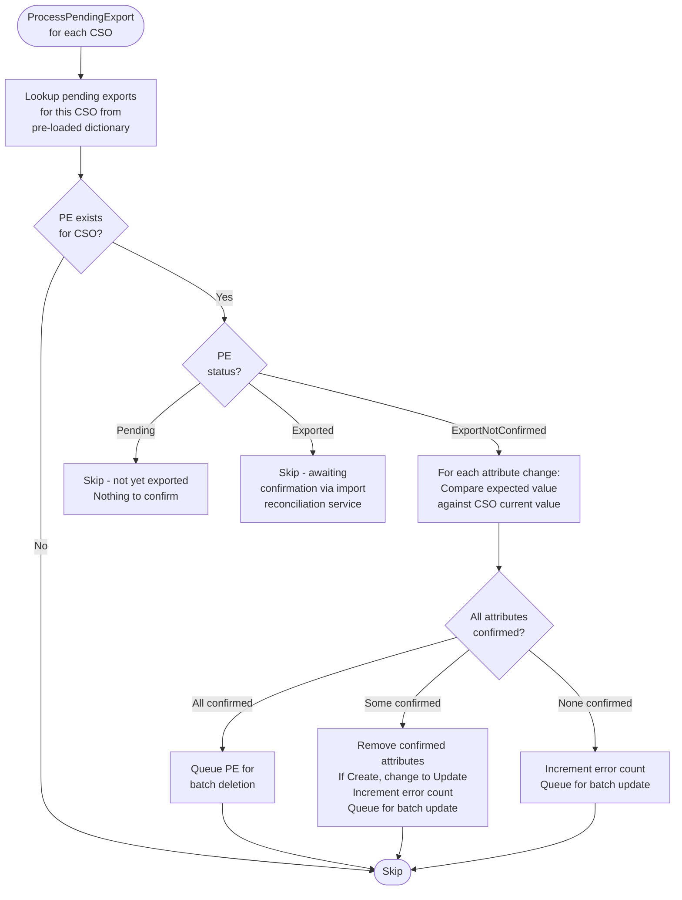
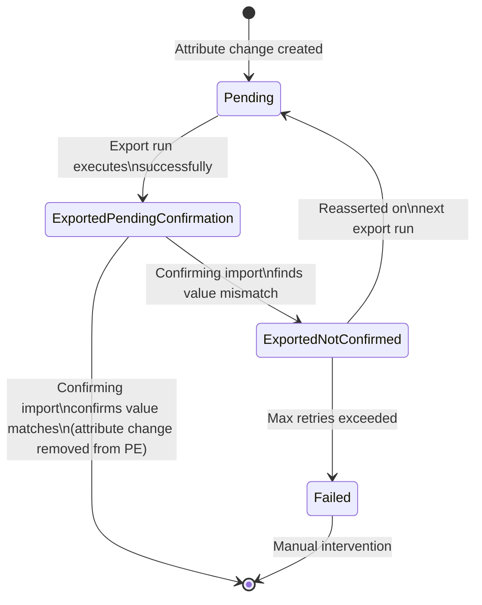
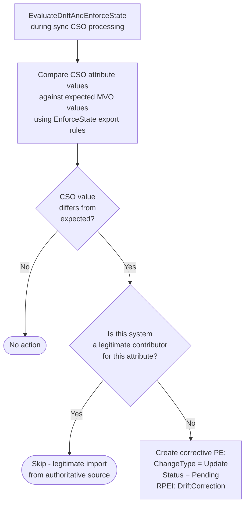

# Pending Export Lifecycle

> Generated against JIM v0.2.0 (`5a4788e9`). If the codebase has changed significantly since then, these diagrams may be out of date.

This diagram shows the full lifecycle of a Pending Export from creation during synchronisation, through export execution, to confirmation during a confirming import. Pending Exports are the mechanism by which JIM propagates changes from the metaverse to target connected systems.

## State Diagram

```mermaid
stateDiagram-v2
    [*] --> Pending: Created during Sync\n(export evaluation)

    Pending --> Executing: Export run starts\nbatch marked executing

    Executing --> Exported: Connector reports\nsuccess

    Executing --> ExportNotConfirmed: Connector reports\nfailure (retryable)
    Executing --> Failed: ErrorCount >= MaxRetries

    Exported --> [*]: Confirming import confirms\nall attribute values match\n(PE deleted)

    Exported --> ExportNotConfirmed: Confirming import finds\nattribute values don't match

    ExportNotConfirmed --> Executing: Next export run\n(after NextRetryAt backoff)

    ExportNotConfirmed --> Pending: Sync re-evaluates\nand reasserts changes

    ExportNotConfirmed --> Failed: ErrorCount >= MaxRetries\n(permanent failure)

    Failed --> [*]: Manual intervention\nor PE deleted

    note right of Pending: Initial state.\nCreated by EvaluateExportRules\nduring Full/Delta Sync.
    note right of Exported: Awaiting confirmation.\nConfirming import checks if\nCSO attributes match expected values.
    note left of ExportNotConfirmed: Retryable failure.\nWill be re-exported after\nexponential backoff delay.
    note left of Failed: Permanent failure.\nRequires manual intervention.\nRPEI: ExportConfirmationFailed
```

## Full Lifecycle Across Operations

A Pending Export's journey typically spans three separate run profile executions:

```mermaid
flowchart LR
    subgraph "1. Sync (Full or Delta)"
        SyncStart[MVO attribute changes<br/>during inbound flow] --> EvalExport[EvaluateExportRules:<br/>Find export sync rules<br/>for MVO type]
        EvalExport --> InScope{MVO in scope<br/>for export rule?}
        InScope -->|No| EvalDeprov[Evaluate deprovisioning:<br/>Create Delete PE if CSO exists]
        InScope -->|Yes| MapAttrs[Map MVO attributes<br/>to CSO attributes<br/>via export sync rule mappings]
        MapAttrs --> NetChange{No-net-change<br/>detection}
        NetChange -->|CSO already current| Skip[Skip - no PE created<br/>Target already has correct values]
        NetChange -->|Changes needed| CheckExisting{Existing CSO<br/>in target system?}
        CheckExisting -->|Yes| CreateUpdatePE[Create PE:<br/>ChangeType = Update<br/>Status = Pending]
        CheckExisting -->|No| CreateCreatePE[Create PE:<br/>ChangeType = Create<br/>Status = Pending<br/>Provision new CSO]
    end

    subgraph "2. Export"
        GetExecutable[Get executable PEs:<br/>Status = Pending or<br/>ExportNotConfirmed<br/>NextRetryAt <= now] --> MarkExec[Mark batch:<br/>Status = Executing]
        MarkExec --> ConnExport[Connector executes<br/>export operations]
        ConnExport --> Success{Success?}
        Success -->|Yes, Create| ProvResult[Status = Exported<br/>Capture new external ID<br/>RPEI: Provisioned]
        Success -->|Yes, Update| ExpResult[Status = Exported<br/>RPEI: Exported]
        Success -->|Yes, Delete| DeprovResult[Delete PE + CSO<br/>RPEI: Deprovisioned]
        Success -->|No| FailResult[Increment ErrorCount<br/>Set NextRetryAt<br/>Status = ExportNotConfirmed]
    end

    subgraph "3. Confirming Import"
        ImportData[Import fresh data<br/>from target system] --> Reconcile[PendingExportReconciliationService:<br/>Compare each PE attribute<br/>against imported CSO values]
        Reconcile --> AllMatch{All attributes<br/>confirmed?}
        AllMatch -->|Yes| DeletePE[Delete PE<br/>Export confirmed<br/>PE lifecycle complete]
        AllMatch -->|Partial| PartialConfirm[Remove confirmed attributes<br/>Keep unconfirmed<br/>Change Create to Update<br/>Status = ExportNotConfirmed]
        AllMatch -->|None| NoneConfirm[Keep all attributes<br/>Increment error count<br/>Status = ExportNotConfirmed]
    end

    CreateUpdatePE --> GetExecutable
    CreateCreatePE --> GetExecutable
    EvalDeprov --> GetExecutable
    ProvResult --> ImportData
    ExpResult --> ImportData
    FailResult -.->|Next export run<br/>after backoff| GetExecutable
    PartialConfirm -.->|Next export run| GetExecutable
    NoneConfirm -.->|Next export run| GetExecutable
```



## Pending Export Confirmation During Sync

During Full/Delta Sync, pending exports are also checked for confirmation (separate from the confirming import path above). This happens in `ProcessPendingExport` within `SyncTaskProcessorBase`:



## Attribute-Level Status Tracking

Each attribute change within a Pending Export has its own status, enabling partial confirmation:



## Change Types

```
+--------+-------------------+---------------------------------------------+
| Type   | When Created      | What Happens                                |
+--------+-------------------+---------------------------------------------+
| Create | No CSO exists in  | Provisions new object in target system      |
|        | target system for | Connector creates object + sets attributes  |
|        | this MVO          | PE captures DN template + all attributes    |
+--------+-------------------+---------------------------------------------+
| Update | CSO exists but    | Updates existing object attributes          |
|        | attributes differ | Only changed attributes are included        |
|        | from MVO values   | No-net-change detection avoids unnecessary  |
+--------+-------------------+---------------------------------------------+
| Delete | MVO deletion rule | Removes object from target system           |
|        | triggered, or MVO | Created by EvaluateMvoDeletionAsync or      |
|        | falls out of      | EvaluateOutOfScopeExportsAsync              |
|        | export scope      | PE deleted along with CSO on success        |
+--------+-------------------+---------------------------------------------+
```

## Drift Detection Creates Corrective Exports

During sync, drift detection can also create Pending Exports:



## Key Design Decisions

- **Three-operation lifecycle**: A pending export typically spans Sync (creation), Export (execution), and Confirming Import (confirmation). This design ensures changes are verified end-to-end.

- **Partial confirmation**: Individual attribute changes can be confirmed independently. If 3 out of 5 attributes match the target system, only the 2 unconfirmed attributes remain on the pending export for retry.

- **Create-to-Update demotion**: When a Create PE is partially confirmed (object was created but some attributes didn't take), it's demoted to an Update PE. This prevents the next export from trying to create an already-existing object.

- **No-net-change detection**: Before creating a PE during sync, the system checks if the target CSO already has the expected values (using pre-cached data in `ExportEvaluationCache`). This avoids unnecessary export operations and reduces connector load.

- **Drift correction**: When `EnforceState` is enabled on an export sync rule and the CSO has values that don't match the MVO, a corrective PE is created to reassert the correct values. This detects and corrects unauthorised changes made directly in target systems.

- **Exponential backoff**: Failed exports use increasing retry delays (`NextRetryAt`) to avoid hammering a target system that's experiencing issues.
