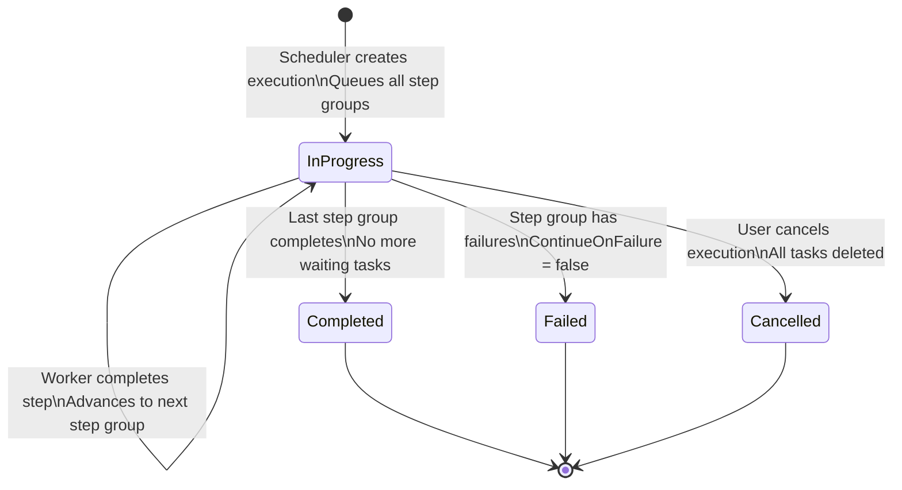

# Schedule Execution Lifecycle

This diagram shows how schedules are triggered, how step groups are queued and advanced, and how the scheduler and worker collaborate to drive multi-step execution to completion.

## Three-Service Collaboration

JIM uses three services that collaborate on scheduled execution:

| Service | Role | Polling Interval |
|---------|------|-----------------|
| **JIM.Scheduler** | Detects due schedules, creates executions, queues tasks, recovery | 30 seconds |
| **JIM.Worker** | Executes tasks, drives step advancement on completion | 2 seconds |
| **JIM.Web** | Manual run requests (creates worker tasks directly) | On-demand |

## Scheduler Polling Cycle


## Due Schedule Processing


## Step Group Queuing Detail

Steps with the same `StepIndex` form a parallel group and execute concurrently.


## Worker-Driven Step Advancement

After the worker completes a task, it drives schedule advancement via `TryAdvanceScheduleExecutionAsync`. This is the primary advancement mechanism (the scheduler has a safety net for the case where the worker crashes between task completion and advancement).


## Recovery Mechanisms

Three safety nets ensure schedules complete even when services crash.


## Execution State Diagram



## Example: Multi-Step Schedule

A typical schedule with sequential and parallel steps:

```
Schedule: "Nightly HR Sync"
+-------+-----------------------------------------------+---------------------+
| Index | Steps                                         | Execution           |
+-------+-----------------------------------------------+---------------------+
|   0   | HR System - Full Import                       | Sequential          |
|   1   | HR System - Full Sync                         | Sequential          |
|   2   | AD - Export  |  LDAP - Export                  | Parallel (2 tasks)  |
|   3   | AD - Confirming Import  |  LDAP - Conf Import | Parallel (2 tasks)  |
+-------+-----------------------------------------------+---------------------+

Timeline:
1. Scheduler creates execution, queues ALL 6 tasks
   - Index 0: 1 task as Queued
   - Index 1: 1 task as WaitingForPreviousStep
   - Index 2: 2 tasks as WaitingForPreviousStep
   - Index 3: 2 tasks as WaitingForPreviousStep

2. Worker picks up index 0 task, executes Full Import
3. Worker completes --> TryAdvance --> transitions index 1 to Queued
4. Worker picks up index 1 task, executes Full Sync
5. Worker completes --> TryAdvance --> transitions index 2 (2 tasks) to Queued
6. Worker dispatches BOTH index 2 tasks in parallel (AD Export + LDAP Export)
7. First export completes --> TryAdvance --> remaining count > 0, wait
8. Second export completes --> TryAdvance --> transitions index 3 to Queued
9. Worker dispatches BOTH index 3 tasks in parallel
10. Both confirming imports complete --> TryAdvance --> no more steps
11. Execution marked Completed
```

## Key Design Decisions

- **All steps queued upfront**: The scheduler creates all worker tasks at execution start, with subsequent steps as `WaitingForPreviousStep`. This makes the full execution plan visible in the task queue from the beginning.

- **Worker drives advancement**: Step transitions are driven by the worker (via `TryAdvanceScheduleExecutionAsync`) for minimal latency. The scheduler provides a safety net for crash recovery only.

- **Activity-based outcome detection**: Since worker tasks are deleted upon completion, the system uses Activities (immutable audit records) to determine whether a step succeeded or failed.

- **Overlap prevention**: The scheduler checks for active executions before starting a new one for the same schedule. This prevents concurrent execution of the same schedule.

- **ContinueOnFailure**: Each step can be configured to continue or halt on failure. When any step at an index has `ContinueOnFailure = false` and its activity failed, the entire execution stops and remaining waiting tasks are cleaned up.
