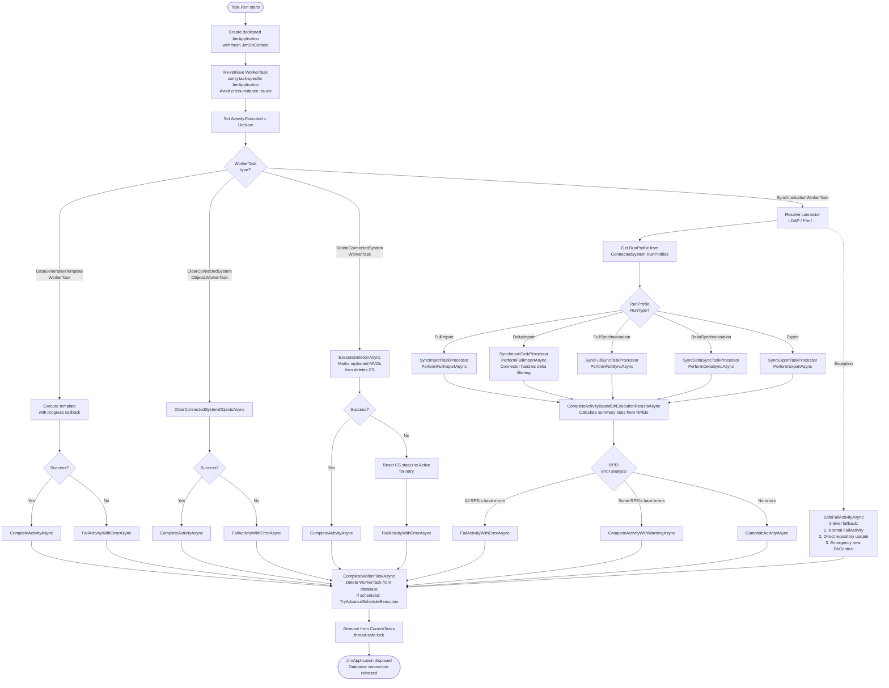
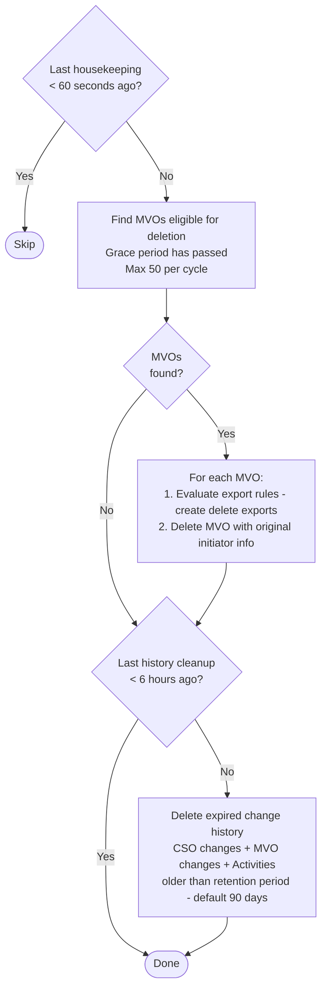

# Worker Task Lifecycle

> Generated against JIM v0.3.0 (`0d1c88e9`). If the codebase has changed significantly since then, these diagrams may be out of date.

This diagram shows how the JIM Worker service picks up, executes, and completes tasks. It covers the main polling loop, task dispatch, heartbeat management, cancellation handling, and housekeeping.

## Worker Main Loop

## Task Execution (per spawned task)

Each task runs in its own `Task.Run` with an isolated `JimApplication` and `JimDbContext` to avoid EF Core connection sharing issues.

## Housekeeping (idle time)

Runs every 60 seconds when the worker has no active tasks.

## Key Design Decisions

- **Isolated DbContext per task**: Each task gets its own `JimApplication` and `JimDbContext` to avoid EF Core connection sharing issues. The main loop has its own instance for polling and heartbeats.

- **Heartbeat-based liveness**: Active tasks have their heartbeats updated every polling cycle (2 seconds). The scheduler uses heartbeat timestamps to detect crashed workers and recover stale tasks.

- **Startup recovery**: On startup, ALL `Processing` tasks are immediately recovered (re-queued) since the worker just started and nothing can genuinely be processing.

- **Task deletion on completion**: Worker tasks are deleted from the database upon completion (not kept). The Activity record serves as the permanent audit trail.

- **SafeFailActivityAsync**: Three-level fallback ensures activities are never left stuck in `InProgress` status, even if EF tracking is corrupted or the DbContext is disposed.

- **Parallel dispatch**: When `GetNextWorkerTasksToProcessAsync` returns multiple tasks (parallel step group from a schedule), they are all spawned via `Task.Run` simultaneously, each with their own DbContext.
