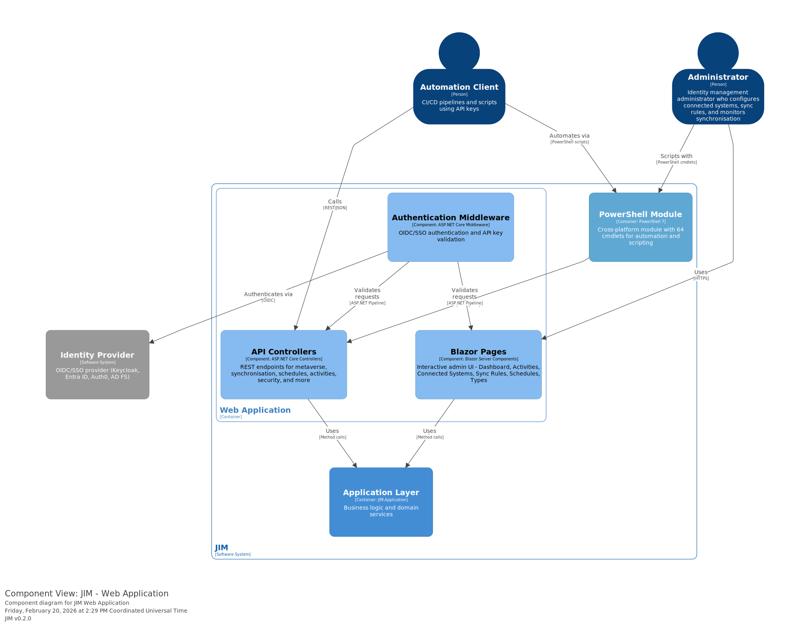
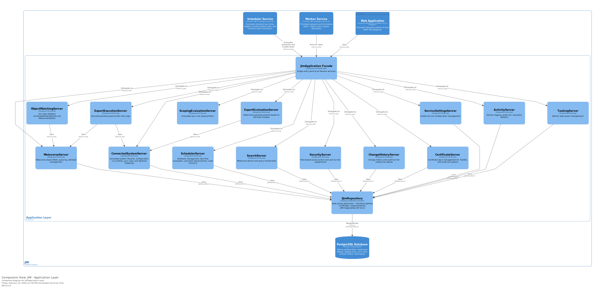
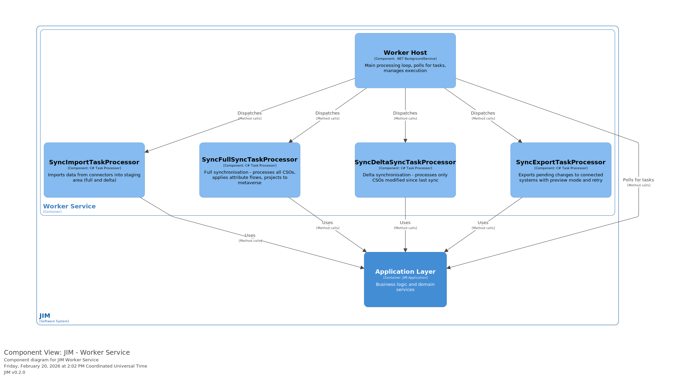
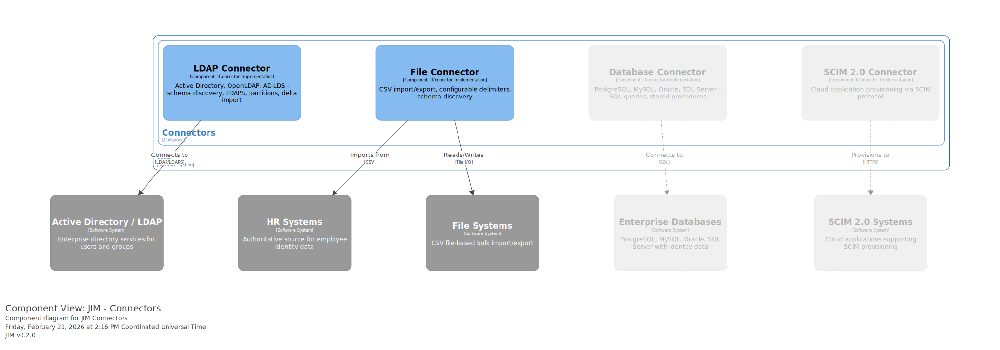
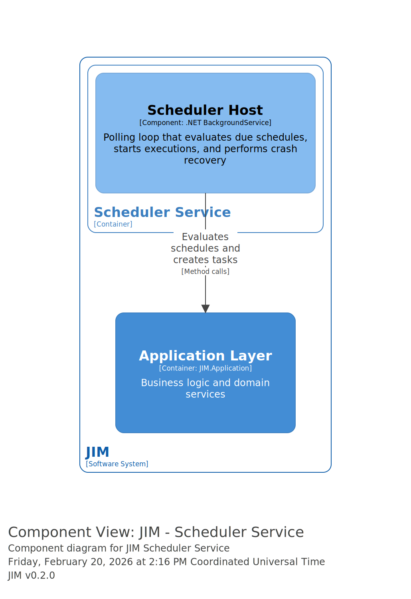

# JIM C4 Architecture Diagrams

This folder contains the C4 model architecture diagrams for JIM, defined using [Structurizr DSL](https://docs.structurizr.com/dsl).

## Diagrams

### Level 1: System Context

Shows JIM's interactions with external systems and users.


### Level 2: Container

Shows JIM's internal deployable units.


### Level 3: Component

#### Web Application Components

Blazor Pages, API Controllers, and Authentication Middleware.



#### Application Layer Components

The business logic and domain services.



#### Worker Components

Import, sync, and export task processors.



#### Connector Components

External system integration adapters.



#### Scheduler Components

Schedule evaluation and execution triggering.



## Viewing Interactive Diagrams

### Using Structurizr Lite (Local Docker)

1. Start Structurizr Lite from the repository root:

   ```powershell
   # PowerShell (Windows/Linux/macOS)
   docker run -it --rm -p 8085:8080 -v ${PWD}/docs/diagrams/structurizr:/usr/local/structurizr structurizr/lite
   ```

   ```bash
   # Bash
   docker run -it --rm -p 8085:8080 -v $(pwd)/docs/diagrams/structurizr:/usr/local/structurizr structurizr/lite
   ```

2. Open http://localhost:8085 in your browser

3. Click on diagram thumbnails in the left panel to view each diagram

### Troubleshooting

- **Port already in use**: Change `8085:8080` to another port like `8090:8080`
- **Browser shows 400 Bad Request**: Try using a private/incognito browser window, or access from outside VS Code port forwarding
- **Diagrams not updating**: Refresh the browser after editing `workspace.dsl`

## Diagram Structure

The workspace contains C4 diagrams at three levels:

### Level 1: System Context
- **SystemContext** - JIM's interactions with external systems and users

### Level 2: Container
- **Containers** - JIM's internal deployable units (Web App, Worker, Scheduler, Connectors, Database)

### Level 3: Component
- **WebAppComponents** - Blazor Pages, API Controllers, Authentication Middleware
- **AppLayerComponents** - JimApplication Facade and domain services
- **WorkerComponents** - Worker Host and task processors
- **ConnectorComponents** - LDAP and File connector implementations
- **SchedulerComponents** - Scheduler Host

## Files

| File | Description |
|------|-------------|
| `workspace.dsl` | Structurizr DSL model defining all diagrams |
| `docs/01-overview.md` | System overview documentation (shown in Structurizr) |
| `adrs/` | Symlink to `docs/adrs/` - Architecture Decision Records (shown in Structurizr via `!adrs`) |
| `export-diagrams.js` | Puppeteer script for automated SVG export |
| `package.json` | Node.js dependencies for the export script |

## Editing the Diagrams

1. Edit `workspace.dsl` using any text editor
2. Refresh Structurizr Lite in your browser to see changes
3. The DSL syntax is documented at https://docs.structurizr.com/dsl/language

## Exporting Diagrams

### Automated Export (Recommended)

Run the `jim-diagrams` alias from the repository root:

```bash
jim-diagrams
```

This starts Structurizr Lite in Docker, exports all diagrams as SVG using headless Chromium, saves them to `docs/diagrams/images/`, and cleans up automatically.

Prerequisites: Node.js, Docker. Dependencies are installed automatically on first run.

### Manual Export

From Structurizr Lite, you can export diagrams as:
- PNG images (click the export button on each diagram)
- SVG for documentation
- PlantUML for alternative rendering
