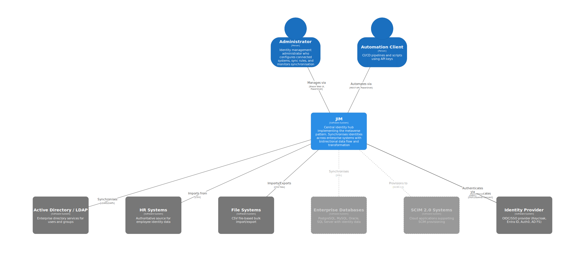
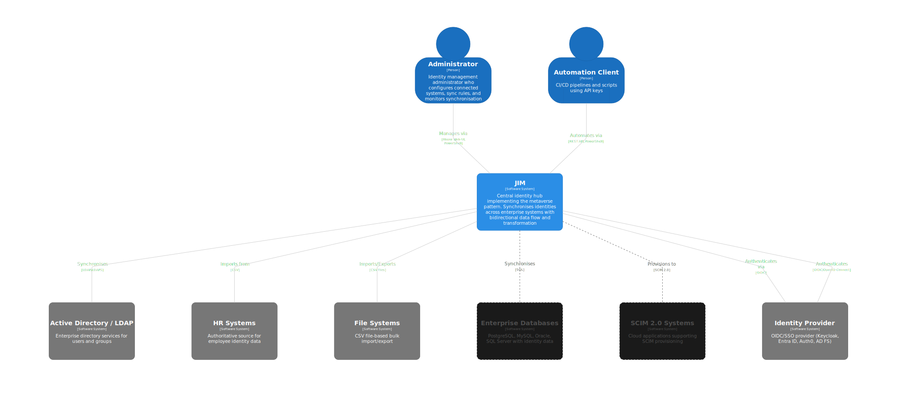

# Junctional Identity Manager (JIM)

JIM is a modern Identity Management system designed for organisations with complex identity synchronisation requirements. It is self-hosted, container-deployable, and works in both connected and air-gapped networks.

## Key Features

-   :material-sync:{ .lg .middle } **Hub-and-Spoke Synchronisation**

    ---

    Central metaverse architecture for identity correlation across all connected systems. Bidirectional sync of Users, Groups, and custom object types.

-   :material-server-network:{ .lg .middle } **Multi-Directory LDAP**

    ---

    Active Directory, OpenLDAP, 389 Directory Server, and other RFC 4512-compliant directories, all supported out of the box.

-   :material-docker:{ .lg .middle } **Container-Native Deployment**

    ---

    Deploys as a single Docker stack with no legacy infrastructure requirements. Bundled or external PostgreSQL.

-   :material-shield-lock:{ .lg .middle } **Single Sign-On (SSO)**

    ---

    OpenID Connect authentication with any OIDC-compliant Identity Provider. PKCE for enhanced security.

-   :material-function-variant:{ .lg .middle } **Expression-Based Transforms**

    ---

    Transform data using expressions with built-in functions for common identity operations.

-   :material-api:{ .lg .middle } **REST API & PowerShell**

    ---

    Full REST API with OpenAPI documentation, plus a cross-platform PowerShell module for automation and Identity as Code.

-   :material-wifi-off:{ .lg .middle } **Air-Gapped Ready**

    ---

    Fully functional without internet connectivity. No cloud dependencies -- designed for sensitive and high-assurance environments.

-   :material-puzzle:{ .lg .middle } **Extensible Connectors**

    ---

    Built-in LDAP and CSV connectors, with a framework for developing custom connectors for bespoke scenarios.

## Scenarios

JIM supports common Identity Governance & Administration (IGA) scenarios:

- **Joiner/Mover/Leaver (JML) Automation:** Synchronise users from HR systems to directories, applications, and downstream systems
- **Attribute Writeback:** Keep HR systems current by writing IT-managed attributes back (e.g. email addresses, phone numbers)
- **Domain Consolidation:** Prepare for cloud migration, simplification, or organisational mergers
- **Domain Migration:** Support divestitures and system decommissioning
- **Identity Correlation:** Bring together user and entitlement data from disparate business applications

## What Makes JIM Different

Enterprise identity synchronisation typically requires cloud connectivity, complex infrastructure, or expensive licensing. JIM takes a different approach: it deploys as a single Docker stack, runs entirely on-premises, and works in air-gapped networks with no external dependencies. Source-available code means you can inspect, audit, and verify everything JIM does with your identity data.

| Capability | JIM |
|---|---|
| Air-gapped deployment | :material-check-bold: |
| Cloud dependencies | None |
| Container-native | :material-check-bold: |
| Source available | :material-check-bold: |
| SSO with any OIDC provider | :material-check-bold: |
| Full REST API | :material-check-bold: |
| PowerShell automation | :material-check-bold: |

## Quick Links

-   :material-rocket-launch:{ .lg .middle } **Getting Started**

    ---

    Deploy JIM and run your first synchronisation.

    [:octicons-arrow-right-24: Getting Started](getting-started/index.md)

-   :material-book-open-variant:{ .lg .middle } **Concepts**

    ---

    Understand the metaverse, connected systems, sync rules, and more.

    [:octicons-arrow-right-24: Concepts](concepts/index.md)

-   :material-cog:{ .lg .middle } **Administration**

    ---

    Configure, monitor, and manage your JIM deployment.

    [:octicons-arrow-right-24: Administration](administration/index.md)

-   :material-power-plug:{ .lg .middle } **Connectors**

    ---

    Connect JIM to LDAP directories, CSV files, and more.

    [:octicons-arrow-right-24: Connectors](connectors/index.md)

## State of Development

JIM has reached MVP completion. The core identity lifecycle is fully functional:

- **Import** identities from source systems (LDAP, CSV)
- **Sync** to reconcile identities in the central metaverse
- **Export** changes to target systems with pending export management
- **Schedule** automated synchronisation using cron or interval-based triggers

## Licensing

JIM uses a Source-Available model where it is free to use in non-production scenarios, but requires a commercial licence for use in production scenarios. [Full details can be found here](https://tetron.io/jim/#licensing).

## More Information

Please visit [https://tetron.io/jim](https://tetron.io/jim) for more information.
