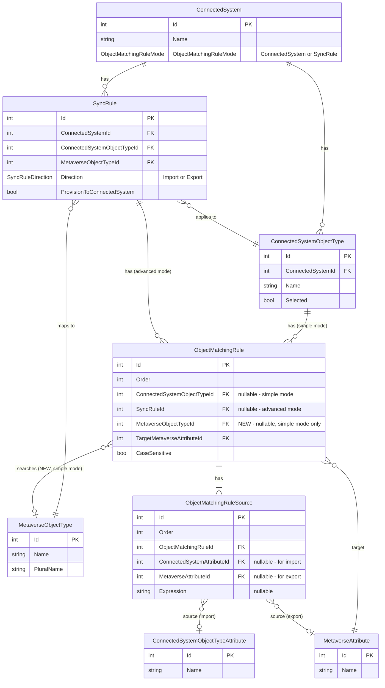

# Simple Mode Object Matching for Import and Export

- **Status:** Planned

## Context

### Current State

Simple mode object matching (`ObjectMatchingRuleMode.ConnectedSystem`) stores matching rules on the `ConnectedSystemObjectType` rather than on individual sync rules. Currently:

- **Import matching** (`FindMatchingMetaverseObjectAsync`): Works, but only when import sync rules exist. `AttemptJoinAsync` iterates import sync rules to drive matching — if none exist, no matching is attempted. This forces admins to create empty import sync rules solely to enable joining, which is confusing and causes side effects.

- **Export matching** (`FindMatchingConnectedSystemObjectAsync`): The method exists in `ObjectMatchingServer` with full simple/advanced mode support, but is **never called** from any sync processor. Export flows have no mechanism to find existing CSOs using object matching rules.

### Problem

1. **Import without sync rules:** Admins must create empty import sync rules (no attribute mappings) solely to enable simple mode joining. This is confusing and the presence of those sync rules can cause unintended side effects during confirming syncs.

2. **No export matching:** When provisioning objects to a target system, JIM cannot use object matching rules to find and join to existing CSOs. This means if an object already exists in the target system, JIM will attempt to provision a duplicate rather than joining to the existing object.

### Root Cause

Both problems stem from the same limitation: `ObjectMatchingRule` is not self-contained. It knows *what to match* (source/target attributes) and *how to match* (case sensitivity), but not *where to search* — the target `MetaverseObjectType` comes from the `SyncRule`, which couples matching to sync rule existence.

### Goal

Make `ObjectMatchingRule` self-contained by adding a `MetaverseObjectTypeId` FK directly to the rule. This enables simple mode object matching to work for **both inbound and outbound** matching without requiring sync rules to provide context:

1. **Import:** `AttemptJoinAsync` can evaluate matching rules directly from the object type — each rule knows which MVO type to search.

2. **Export:** `FindMatchingConnectedSystemObjectAsync` can be integrated into the provisioning flow — before creating a new CSO, JIM checks whether a matching object already exists in the target system.

## Entity Relationship Diagram

Entities involved in object matching. New properties are marked.



## Design Decision: Self-Contained Matching Rules

In advanced mode, `ObjectMatchingRule` belongs to a `SyncRule` which already carries `MetaverseObjectTypeId`. The rule doesn't need its own copy — the sync rule provides the context.

In simple mode, rules belong to `ConnectedSystemObjectType` and there may be no sync rule at all. The new `MetaverseObjectTypeId` on `ObjectMatchingRule` fills this gap, making simple mode rules self-contained:

- **Simple mode rules:** `MetaverseObjectTypeId` is populated — the rule knows where to search
- **Advanced mode rules:** `MetaverseObjectTypeId` is null — the sync rule provides the MVO type as before

This keeps matching logic contained within `ObjectMatchingRule` rather than spreading it across `ConnectedSystemObjectType`.

## Design Decision: ObjectMatchingServer as Pure Matching Engine

Currently `ObjectMatchingServer` has two responsibilities:

1. **Mode resolution** — deciding which rules to use based on `ObjectMatchingRuleMode` (via `GetMatchingRulesForImport`, `GetMatchingRulesForExport`, `GetConnectedSystemObjectTypeRules`)
2. **Rule evaluation** — evaluating matching rules against the repository

With self-contained rules, mode resolution can move to the callers (sync processors, export evaluation) who already have the context to determine which rules apply. `ObjectMatchingServer` becomes a pure matching engine:

- **Before:** `FindMatchingMetaverseObjectAsync(cso, connectedSystem, syncRule)` — server navigates `connectedSystem.ObjectTypes` to resolve rules, reads MVO type from `syncRule`
- **After:** `FindMatchingMetaverseObjectAsync(cso, matchingRules)` — caller passes the applicable rules, each rule carries its own MVO type (simple mode) or caller sets it from the sync rule (advanced mode)

Same simplification for `FindMatchingConnectedSystemObjectAsync`.

This removes `GetMatchingRulesForImport`, `GetMatchingRulesForExport`, and `GetConnectedSystemObjectTypeRules` entirely. The mode distinction (`ObjectMatchingRuleMode`) becomes a concern of the caller, not the matching engine. Cleaner separation of responsibilities.

## Changes

### 1. Add `MetaverseObjectTypeId` FK to `ObjectMatchingRule`

**File:** `src/JIM.Models/Logic/ObjectMatchingRule.cs`

Add after `TargetMetaverseAttributeId` (line 92):
- `int? MetaverseObjectTypeId` (nullable FK)
- `MetaverseObjectType? MetaverseObjectType` (navigation property)

XML doc comment: "The Metaverse Object Type to search when evaluating this rule. Required for simple mode rules (`ObjectMatchingRuleMode.ConnectedSystem`) where no sync rule provides the MVO type. Null for advanced mode rules where the sync rule's `MetaverseObjectTypeId` is used instead."

### 2. EF Core configuration

**File:** `src/JIM.PostgresData/JimDbContext.cs`

Add relationship config for `ObjectMatchingRule`: `HasOne(r => r.MetaverseObjectType).WithMany().HasForeignKey(r => r.MetaverseObjectTypeId).OnDelete(SetNull)`.

### 3. EF Migration

Run `dotnet ef migrations add AddMetaverseObjectTypeToObjectMatchingRule --project src/JIM.PostgresData`.

### 4. Update `ObjectMatchingRule.IsValid()`

**File:** `src/JIM.Models/Logic/ObjectMatchingRule.cs`

Add validation: when the rule belongs to a `ConnectedSystemObjectType` (simple mode), `MetaverseObjectTypeId` must be set. When it belongs to a `SyncRule` (advanced mode), it should be null.

### 5. Update repository loading queries

**File:** `src/JIM.PostgresData/Repositories/ConnectedSystemRepository.cs`

**`GetObjectTypesAsync` (line 1626)** — used by sync processors via `_objectTypes`. Add:
- `.Include(q => q.ObjectMatchingRules).ThenInclude(omr => omr.MetaverseObjectType)`
- `.Include(q => q.ObjectMatchingRules).ThenInclude(omr => omr.Sources).ThenInclude(s => s.ConnectedSystemAttribute)`
- `.Include(q => q.ObjectMatchingRules).ThenInclude(omr => omr.Sources).ThenInclude(s => s.MetaverseAttribute)`
- `.Include(q => q.ObjectMatchingRules).ThenInclude(omr => omr.TargetMetaverseAttribute)`

Currently this query only includes `Attributes`. The matching rules and their MVO types are needed for simple mode matching in `AttemptJoinAsync`.

### 6. Simplify `ObjectMatchingServer` to a pure matching engine

**File:** `src/JIM.Application/Servers/ObjectMatchingServer.cs`

**Replace** the existing `FindMatchingMetaverseObjectAsync(cso, connectedSystem, syncRule)` with a simplified signature:

```csharp
public async Task<MetaverseObject?> FindMatchingMetaverseObjectAsync(
    ConnectedSystemObject connectedSystemObject,
    List<ObjectMatchingRule> matchingRules)
```

- Caller resolves which rules apply (based on mode) and passes them in
- For each rule, reads `MetaverseObjectType` from either the rule itself (simple mode) or as set by the caller (advanced mode — caller copies `syncRule.MetaverseObjectType` onto the rule before passing)
- Evaluates rules in `Order` sequence until first match

**Replace** the existing `FindMatchingConnectedSystemObjectAsync(mvo, connectedSystem, syncRule)` with:

```csharp
public async Task<ConnectedSystemObject?> FindMatchingConnectedSystemObjectAsync(
    MetaverseObject metaverseObject,
    ConnectedSystem connectedSystem,
    ConnectedSystemObjectType connectedSystemObjectType,
    List<ObjectMatchingRule> matchingRules)
```

- Same pattern: caller resolves rules, server evaluates them
- `connectedSystem` and `connectedSystemObjectType` are still needed for the repository query (scoping CSO search)

**Remove** the following private methods entirely:
- `GetMatchingRulesForImport` — mode resolution moves to callers
- `GetMatchingRulesForExport` — mode resolution moves to callers
- `GetConnectedSystemObjectTypeRules` — navigation through `ConnectedSystem.ObjectTypes` no longer needed

`ComputeMatchingValueFromMvo` remains unchanged (already takes a single rule).

### 7. Modify `AttemptJoinAsync` — caller resolves rules

**File:** `src/JIM.Worker/Processors/SyncTaskProcessorBase.cs` (line 1734)

Refactor `AttemptJoinAsync` so the caller resolves matching rules based on mode, then passes them to `ObjectMatchingServer`:

**Existing sync rule path (advanced mode or simple mode with import sync rules):**
- For each import sync rule, resolve rules:
  - Advanced mode: use `syncRule.ObjectMatchingRules`
  - Simple mode: use `objectType.ObjectMatchingRules`
- Call `FindMatchingMetaverseObjectAsync(cso, matchingRules)`

**New fallback (simple mode, no import sync rules):**
- After the sync rule loop, check `_connectedSystem.ObjectMatchingRuleMode == ConnectedSystem` and no import sync rules were evaluated
- Look up `_objectTypes.FirstOrDefault(ot => ot.Id == connectedSystemObject.TypeId)`
- If `objectType.ObjectMatchingRules.Count > 0`, call `FindMatchingMetaverseObjectAsync(cso, objectType.ObjectMatchingRules)`
- If match found, run the same join validation and establishment logic

**Extract join validation into a private helper** to avoid duplicating the `existingCsoJoinCount` / `_pendingDisconnectedMvoIds` checks between the sync rule path and simple mode path:
```csharp
private async Task<bool> EstablishJoinAsync(ConnectedSystemObject cso, MetaverseObject mvo)
```

This helper encapsulates: checking existing join count, adjusting for pending disconnects, throwing `SyncJoinException` for duplicates, setting FK/navigation properties, clearing `LastConnectorDisconnectedDate`.

### 8. Relax early-return guards

**File:** `src/JIM.Worker/Processors/SyncTaskProcessorBase.cs`

**`ProcessActiveConnectedSystemObjectAsync` (line 197):** The `if (activeSyncRules.Count == 0) return;` guard prevents processing even when simple mode could handle it. Relax to allow processing when the connected system is in simple mode and the CSO's object type has matching rules with MVO types configured.

**`ProcessMetaverseObjectChangesAsync` (line 719):** Same guard, same relaxation. When there are no sync rules but simple mode is available, allow fall-through to the join attempt. The subsequent inbound attribute flow loop (line 793) already gracefully handles an empty list (zero iterations).

### 9. Integrate export matching into `CreateOrUpdatePendingExportWithNoNetChangeAsync`

**File:** `src/JIM.Application/Servers/ExportEvaluationServer.cs` (line ~918)

In `CreateOrUpdatePendingExportWithNoNetChangeAsync`, when `existingCso == null` and provisioning is enabled, **before** creating a new `PendingProvisioning` CSO:

1. Resolve matching rules (caller responsibility):
   - Advanced mode: use `exportRule.ObjectMatchingRules`
   - Simple mode: use `exportRule.ConnectedSystemObjectType.ObjectMatchingRules`
2. If rules exist, call `FindMatchingConnectedSystemObjectAsync(mvo, connectedSystem, csoType, matchingRules)` to search for an existing CSO
3. If a match is found:
   - Join the MVO to the existing CSO (set `MetaverseObjectId` FK, update status to `Normal`)
   - Set `csoForExport = matchedCso` and `needsProvisioning = false`
   - Use `PendingExportChangeType.Update` instead of `Create`
   - Log the join at Information level
4. If no match is found, proceed with existing provisioning logic (create new `PendingProvisioning` CSO)

This needs access to the `ConnectedSystem` object and its object types with matching rules. Check whether these navigation properties are loaded in the export evaluation cache; if not, add to the cache loading query (step 10).

### 10. Ensure matching rules are loaded in export evaluation cache

**File:** `src/JIM.Application/Servers/ExportEvaluationServer.cs`

In `BuildExportEvaluationCacheAsync`, verify that export sync rules include their `ConnectedSystem` with `ObjectTypes` and `ObjectMatchingRules` (with `Sources` and attributes). The matching server needs these to evaluate rules. If not already included, add the necessary `.Include()` chains.

### 11. Ensure `FindConnectedSystemObjectUsingMatchingRuleAsync` repository method exists

**File:** `src/JIM.PostgresData/Repositories/ConnectedSystemRepository.cs`

Verify `FindConnectedSystemObjectUsingMatchingRuleAsync` is implemented and handles:
- String matching (case-insensitive)
- GUID matching
- Integer matching
- Scoping to the correct `ConnectedSystemObjectType`

This method is already referenced by `ObjectMatchingServer.FindMatchingConnectedSystemObjectAsync` (line 120) — confirm it exists and works correctly.

### 12. Update simple mode API endpoints

**Files:** `src/JIM.Web/Models/Api/ConnectedSystemDto.cs`, `src/JIM.Web/Controllers/Api/SynchronisationController.cs`

Update existing simple mode matching rule endpoints (`/api/v1/synchronisation/connected-systems/{csId}/matching-rules/...`) to support the new properties:

**DTO changes (`ObjectMatchingRuleDto`):**
- Add `MetaverseObjectTypeId` (int?, read/write) — the MVO type this rule searches
- Add `MetaverseObjectTypeName` (string?, read-only) — human-readable name for display
- Add `SourceMetaverseAttributeId` support in `ObjectMatchingRuleSourceDto` — currently only `ConnectedSystemAttributeId` is exposed; add `MetaverseAttributeId` for export-direction sources
- Update `FromEntity` / `ToEntity` mapping methods

**Controller changes:**
- In `CreateMatchingRule` / `UpdateMatchingRule`: validate `MetaverseObjectTypeId` exists when provided (return 400 if invalid)
- In `GetMatchingRules` / `GetMatchingRule`: include `MetaverseObjectType` in response via DTO mapping

### 13. Add advanced mode API endpoints

**File:** `src/JIM.Web/Controllers/Api/SynchronisationController.cs`

Add new endpoints for managing matching rules on individual sync rules (advanced mode):

| Method | Route | Description |
|--------|-------|-------------|
| `GET` | `/api/v1/synchronisation/sync-rules/{syncRuleId}/matching-rules` | List matching rules for a sync rule |
| `GET` | `/api/v1/synchronisation/sync-rules/{syncRuleId}/matching-rules/{id}` | Get a specific matching rule |
| `POST` | `/api/v1/synchronisation/sync-rules/{syncRuleId}/matching-rules` | Create a matching rule on a sync rule |
| `PUT` | `/api/v1/synchronisation/sync-rules/{syncRuleId}/matching-rules/{id}` | Update a matching rule on a sync rule |
| `DELETE` | `/api/v1/synchronisation/sync-rules/{syncRuleId}/matching-rules/{id}` | Delete a matching rule from a sync rule |

**Validation:**
- Verify the connected system is in advanced mode (`ObjectMatchingRuleMode.SyncRule`) — return 409 Conflict if in simple mode
- `MetaverseObjectTypeId` must be null for advanced mode rules (sync rule provides the MVO type) — return 400 if set
- Reuse `ObjectMatchingRuleDto` / `ObjectMatchingRuleSourceDto` from step 12

**Application layer:**
- Add corresponding methods in `ConnectedSystemServer` (or appropriate Application layer server) that the controller calls — respect n-tier architecture

### 14. Add mode switching API endpoint

**File:** `src/JIM.Web/Controllers/Api/SynchronisationController.cs`

| Method | Route | Description |
|--------|-------|-------------|
| `PUT` | `/api/v1/synchronisation/connected-systems/{csId}/matching-rule-mode` | Switch between simple and advanced mode |

**Request body:**
```json
{
  "mode": "ConnectedSystem"  // or "SyncRule"
}
```

**Behaviour:**
- Calls `SwitchObjectMatchingModeAsync` in the Application layer
- Returns 200 with the updated connected system on success
- Returns 409 Conflict if already in the requested mode
- Returns 400 if the mode value is invalid

### 15. Update PowerShell cmdlets — simple mode

**Files:** `src/JIM.PowerShell/Public/MatchingRules/New-JIMMatchingRule.ps1`, `Set-JIMMatchingRule.ps1`

**`New-JIMMatchingRule`:**
- Add `-MetaverseObjectTypeId` parameter (int, optional) — maps to `metaverseObjectTypeId` in request body
- Add `-SourceMetaverseAttributeId` parameter (int, optional) — creates a source with `metaverseAttributeId` instead of `connectedSystemAttributeId`
- Validation: `-SourceAttributeId` and `-SourceMetaverseAttributeId` are mutually exclusive (use parameter sets)

**`Set-JIMMatchingRule`:**
- Add `-MetaverseObjectTypeId` parameter (int, optional)
- Add `-SourceMetaverseAttributeId` parameter (int, optional) — replaces sources with an export-direction source

**`Get-JIMMatchingRule`:**
- No changes needed — the API response already includes any new properties; PowerShell passes through the full object

**`Remove-JIMMatchingRule`:**
- No changes needed — deletion is mode-agnostic

### 16. Add PowerShell cmdlets — advanced mode

**Directory:** `src/JIM.PowerShell/Public/MatchingRules/`

Create four new cmdlets for managing matching rules on sync rules:

**`Get-JIMSyncRuleMatchingRule`:**
- Parameters: `-SyncRuleId` (mandatory), `-Id` (optional, for single rule)
- Endpoint: `GET /api/v1/synchronisation/sync-rules/{syncRuleId}/matching-rules[/{id}]`
- Adds `SyncRuleId` NoteProperty for pipeline support

**`New-JIMSyncRuleMatchingRule`:**
- Parameters: `-SyncRuleId` (mandatory), `-SourceAttributeId` or `-SourceMetaverseAttributeId` (mandatory, mutually exclusive), `-TargetMetaverseAttributeId` (mandatory), `-Order` (optional), `-CaseSensitive` (optional), `-PassThru` (optional)
- Endpoint: `POST /api/v1/synchronisation/sync-rules/{syncRuleId}/matching-rules`
- Note: `MetaverseObjectTypeId` is intentionally excluded — advanced mode rules inherit MVO type from the sync rule

**`Set-JIMSyncRuleMatchingRule`:**
- Parameters: `-SyncRuleId` (mandatory), `-Id` (mandatory), `-Order`, `-TargetMetaverseAttributeId`, `-SourceAttributeId`, `-SourceMetaverseAttributeId`, `-CaseSensitive`, `-PassThru` (all optional except keys)
- Endpoint: `PUT /api/v1/synchronisation/sync-rules/{syncRuleId}/matching-rules/{id}`

**`Remove-JIMSyncRuleMatchingRule`:**
- Parameters: `-SyncRuleId` (mandatory), `-Id` (mandatory), `-Force` (optional)
- Endpoint: `DELETE /api/v1/synchronisation/sync-rules/{syncRuleId}/matching-rules/{id}`
- `SupportsShouldProcess`, `ConfirmImpact = 'High'`

All four cmdlets follow the same patterns as the existing simple mode cmdlets (connection check, `Invoke-JIMApi`, `ValueFromPipelineByPropertyName`, `Write-Verbose`, `Write-Error`).

### 17. Add mode switching PowerShell cmdlet

**File:** `src/JIM.PowerShell/Public/MatchingRules/Set-JIMObjectMatchingMode.ps1`

**`Set-JIMObjectMatchingMode`:**
- Parameters: `-ConnectedSystemId` (mandatory), `-Mode` (mandatory, `[ValidateSet('ConnectedSystem', 'SyncRule')]`)
- Endpoint: `PUT /api/v1/synchronisation/connected-systems/{csId}/matching-rule-mode`
- `SupportsShouldProcess`, `ConfirmImpact = 'High'` (mode switching migrates rules)
- `-Force` to skip confirmation

### 18. Update mode switching logic

**File:** `src/JIM.Application/Servers/ConnectedSystemServer.cs`

In `SwitchObjectMatchingModeAsync`:
- **Simple → Advanced:** When copying rules from object type to sync rules, clear `MetaverseObjectTypeId` on the copied rules (sync rules provide their own MVO type).
- **Advanced → Simple:** When migrating rules to object types, populate `MetaverseObjectTypeId` from the sync rule's `MetaverseObjectTypeId`.

### 19. Unit tests — matching engine

**File:** `test/JIM.Worker.Tests/OutboundSync/ObjectMatchingServerTests.cs`

Tests for the simplified `ObjectMatchingServer` signatures:

**Import matching (`FindMatchingMetaverseObjectAsync`):**
- Match found using rule's `MetaverseObjectTypeId` directly (no sync rule context needed)
- No matching rules returns null
- Multiple rules evaluated in `Order` sequence, first match wins
- Multiple matches on a single rule throws `MultipleMatchesException`
- Case-sensitive and case-insensitive matching behaviour
- Rule with null `MetaverseObjectTypeId` is skipped (or throws — define expected behaviour)

**Export matching (`FindMatchingConnectedSystemObjectAsync`):**
- Match found using export-direction source (`MetaverseAttributeId`)
- No matching rules returns null
- Multiple matches throws exception
- Scoped correctly to `ConnectedSystemObjectType`
- Case-sensitive and case-insensitive matching behaviour

### 20. Unit tests — sync processor (import join)

**File:** `test/JIM.Worker.Tests/Synchronisation/SimpleMatchingModeJoinTests.cs` (new)

Tests for the `AttemptJoinAsync` simple mode fallback:
- CSO joins via simple mode when no import sync rules exist
- CSO joins via simple mode when import sync rules exist (rules come from object type, not sync rule)
- CSO does not join when no matching rules exist on the object type (graceful no-op)
- CSO does not join when matching rules exist but `MetaverseObjectTypeId` is null
- Existing join prevents duplicate (same validation as sync rule path)
- Early-return guards relaxed: `ProcessActiveConnectedSystemObjectAsync` and `ProcessMetaverseObjectChangesAsync` proceed in simple mode with zero sync rules

### 21. Unit tests — export matching integration

**File:** `test/JIM.Worker.Tests/OutboundSync/ExportMatchingIntegrationTests.cs` (new)

Tests for the integration in `CreateOrUpdatePendingExportWithNoNetChangeAsync`:
- When matching CSO found: no new provisioning CSO created, existing CSO joined with `Update` change type
- When no matching CSO found: provisioning CSO created as before (existing behaviour preserved)
- When no matching rules exist: provisioning CSO created as before (matching skipped)
- When connected system is in advanced mode: uses sync rule's matching rules, not object type's
- When connected system is in simple mode: uses object type's matching rules

### 22. Unit tests — API endpoints

**File:** `test/JIM.Web.Api.Tests/SynchronisationControllerTests.cs` (or new file as appropriate)

**Simple mode endpoints (updated):**
- Create matching rule with `MetaverseObjectTypeId` — succeeds, value persisted
- Create matching rule with invalid `MetaverseObjectTypeId` — returns 400
- Get matching rule — response includes `MetaverseObjectTypeId` and `MetaverseObjectTypeName`
- Create matching rule with `SourceMetaverseAttributeId` — creates export-direction source

**Advanced mode endpoints (new):**
- CRUD operations on sync rule matching rules — standard happy path
- Create on simple mode connected system — returns 409 Conflict
- Create with `MetaverseObjectTypeId` set — returns 400

**Mode switching endpoint (new):**
- Switch from simple to advanced — rules migrated, `MetaverseObjectTypeId` cleared
- Switch from advanced to simple — rules migrated, `MetaverseObjectTypeId` populated
- Switch to current mode — returns 409 Conflict
- Invalid mode value — returns 400

### 23. PowerShell tests (Pester)

**File:** `test/JIM.PowerShell.Tests/MatchingRules.Tests.ps1` (new or extend existing)

**Simple mode cmdlets:**
- `New-JIMMatchingRule` with `-MetaverseObjectTypeId` — included in request body
- `New-JIMMatchingRule` with `-SourceMetaverseAttributeId` — creates export source
- `New-JIMMatchingRule` with both `-SourceAttributeId` and `-SourceMetaverseAttributeId` — error (mutually exclusive)
- `Set-JIMMatchingRule` with `-MetaverseObjectTypeId` — included in request body

**Advanced mode cmdlets:**
- `Get-JIMSyncRuleMatchingRule` — calls correct endpoint
- `New-JIMSyncRuleMatchingRule` — calls correct endpoint, excludes `MetaverseObjectTypeId`
- `Set-JIMSyncRuleMatchingRule` — calls correct endpoint
- `Remove-JIMSyncRuleMatchingRule` — calls correct endpoint, respects `-Force`
- Pipeline support: `Get-JIMSyncRuleMatchingRule | Remove-JIMSyncRuleMatchingRule -Force`

**Mode switching:**
- `Set-JIMObjectMatchingMode` — calls correct endpoint
- `Set-JIMObjectMatchingMode` without `-Force` — prompts for confirmation

### 24. Update Scenario 8 setup

**File:** `test/integration/Setup-Scenario8.ps1`

After the main changes, update the setup to:
- Ensure matching rules on the target group object type have `MetaverseObjectTypeId` set
- Remove the empty "EMEA AD Import Groups" sync rule creation (lines 598-611)
- Verify the DeleteGroup test passes without the empty rule
- Use new cmdlets where appropriate (e.g., `Set-JIMObjectMatchingMode` if mode needs setting)

## Verification

1. `dotnet build JIM.sln` — zero errors
2. `dotnet test JIM.sln` — all tests pass including new matching engine, sync processor, export integration, API, and Pester tests
3. Run Scenario 8 integration test to verify the DeleteGroup step passes without the spurious rename export
4. Verify export matching: configure simple mode matching rules on a target connected system object type, provision an MVO that matches an existing CSO, and confirm JIM joins to the existing CSO rather than creating a duplicate
5. Verify API coverage: all simple mode, advanced mode, and mode switching endpoints return correct responses and error codes
6. Verify PowerShell coverage: all cmdlets work for both simple and advanced mode, including pipeline support and mode switching
