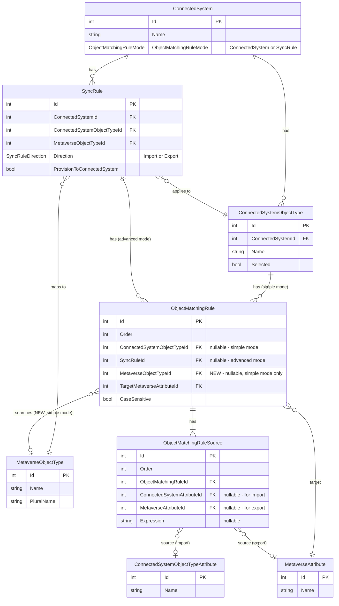

# Simple Mode Object Matching for Import and Export

- **Status:** Planned

## Context

### Current State

Simple mode object matching (`ObjectMatchingRuleMode.ConnectedSystem`) stores matching rules on the `ConnectedSystemObjectType` rather than on individual sync rules. Currently:

- **Import matching** (`FindMatchingMetaverseObjectAsync`): Works, but only when import sync rules exist. `AttemptJoinAsync` iterates import sync rules to drive matching — if none exist, no matching is attempted. This forces admins to create empty import sync rules solely to enable joining, which is confusing and causes side effects.

- **Export matching** (`FindMatchingConnectedSystemObjectAsync`): The method exists in `ObjectMatchingServer` with full simple/advanced mode support, but is **never called** from any sync processor. Export flows have no mechanism to find existing CSOs using object matching rules.

### Problem

1. **Import without sync rules:** Admins must create empty import sync rules (no attribute mappings) solely to enable simple mode joining. This is confusing and the presence of those sync rules can cause unintended side effects during confirming syncs.

2. **No export matching:** When provisioning objects to a target system, JIM cannot use object matching rules to find and join to existing CSOs. This means if an object already exists in the target system, JIM will attempt to provision a duplicate rather than joining to the existing object.

### Root Cause

Both problems stem from the same limitation: `ObjectMatchingRule` is not self-contained. It knows *what to match* (source/target attributes) and *how to match* (case sensitivity), but not *where to search* — the target `MetaverseObjectType` comes from the `SyncRule`, which couples matching to sync rule existence.

### Goal

Make `ObjectMatchingRule` self-contained by adding a `MetaverseObjectTypeId` FK directly to the rule. This enables simple mode object matching to work for **both inbound and outbound** matching without requiring sync rules to provide context:

1. **Import:** `AttemptJoinAsync` can evaluate matching rules directly from the object type — each rule knows which MVO type to search.

2. **Export:** `FindMatchingConnectedSystemObjectAsync` can be integrated into the provisioning flow — before creating a new CSO, JIM checks whether a matching object already exists in the target system.

## Entity Relationship Diagram

Entities involved in object matching. New properties are marked.



## Design Decision: Self-Contained Matching Rules

In advanced mode, `ObjectMatchingRule` belongs to a `SyncRule` which already carries `MetaverseObjectTypeId`. The rule doesn't need its own copy — the sync rule provides the context.

In simple mode, rules belong to `ConnectedSystemObjectType` and there may be no sync rule at all. The new `MetaverseObjectTypeId` on `ObjectMatchingRule` fills this gap, making simple mode rules self-contained:

- **Simple mode rules:** `MetaverseObjectTypeId` is populated — the rule knows where to search
- **Advanced mode rules:** `MetaverseObjectTypeId` is null — the sync rule provides the MVO type as before

This keeps matching logic contained within `ObjectMatchingRule` rather than spreading it across `ConnectedSystemObjectType`.

## Changes

### 1. Add `MetaverseObjectTypeId` FK to `ObjectMatchingRule`

**File:** `src/JIM.Models/Logic/ObjectMatchingRule.cs`

Add after `TargetMetaverseAttributeId` (line 92):
- `int? MetaverseObjectTypeId` (nullable FK)
- `MetaverseObjectType? MetaverseObjectType` (navigation property)

XML doc comment: "The Metaverse Object Type to search when evaluating this rule. Required for simple mode rules (`ObjectMatchingRuleMode.ConnectedSystem`) where no sync rule provides the MVO type. Null for advanced mode rules where the sync rule's `MetaverseObjectTypeId` is used instead."

### 2. EF Core configuration

**File:** `src/JIM.PostgresData/JimDbContext.cs`

Add relationship config for `ObjectMatchingRule`: `HasOne(r => r.MetaverseObjectType).WithMany().HasForeignKey(r => r.MetaverseObjectTypeId).OnDelete(SetNull)`.

### 3. EF Migration

Run `dotnet ef migrations add AddMetaverseObjectTypeToObjectMatchingRule --project src/JIM.PostgresData`.

### 4. Update `ObjectMatchingRule.IsValid()`

**File:** `src/JIM.Models/Logic/ObjectMatchingRule.cs`

Add validation: when the rule belongs to a `ConnectedSystemObjectType` (simple mode), `MetaverseObjectTypeId` must be set. When it belongs to a `SyncRule` (advanced mode), it should be null.

### 5. Update repository loading queries

**File:** `src/JIM.PostgresData/Repositories/ConnectedSystemRepository.cs`

**`GetObjectTypesAsync` (line 1626)** — used by sync processors via `_objectTypes`. Add:
- `.Include(q => q.ObjectMatchingRules).ThenInclude(omr => omr.MetaverseObjectType)`
- `.Include(q => q.ObjectMatchingRules).ThenInclude(omr => omr.Sources).ThenInclude(s => s.ConnectedSystemAttribute)`
- `.Include(q => q.ObjectMatchingRules).ThenInclude(omr => omr.Sources).ThenInclude(s => s.MetaverseAttribute)`
- `.Include(q => q.ObjectMatchingRules).ThenInclude(omr => omr.TargetMetaverseAttribute)`

Currently this query only includes `Attributes`. The matching rules and their MVO types are needed for simple mode matching in `AttemptJoinAsync`.

### 6. Update `ObjectMatchingServer.FindMatchingMetaverseObjectAsync`

**File:** `src/JIM.Application/Servers/ObjectMatchingServer.cs`

Add a new overload that takes a `ConnectedSystemObjectType` directly (no `SyncRule`):
- Gets matching rules from `connectedSystemObjectType.ObjectMatchingRules`
- For each rule, reads `MetaverseObjectType` from the rule itself
- Calls `FindMetaverseObjectUsingMatchingRuleAsync` with the rule's MVO type

The existing `SyncRule`-based overload remains unchanged for advanced mode.

### 7. Modify `AttemptJoinAsync` — simple mode fallback

**File:** `src/JIM.Worker/Processors/SyncTaskProcessorBase.cs` (line 1734)

After the existing `foreach` loop over import sync rules (before `return false`), add:

- Check `_connectedSystem.ObjectMatchingRuleMode == ObjectMatchingRuleMode.ConnectedSystem`
- Check no import sync rules were already evaluated for this CSO type
- Look up `_objectTypes.FirstOrDefault(ot => ot.Id == connectedSystemObject.TypeId)`
- If `objectType.ObjectMatchingRules.Count > 0`, call the new `FindMatchingMetaverseObjectAsync` overload
- If match found, run the same join validation and establishment logic

**Extract join validation into a private helper** to avoid duplicating the `existingCsoJoinCount` / `_pendingDisconnectedMvoIds` checks between the sync rule path and simple mode path. Something like:
```csharp
private async Task<bool> EstablishJoinAsync(ConnectedSystemObject cso, MetaverseObject mvo)
```

This helper encapsulates: checking existing join count, adjusting for pending disconnects, throwing `SyncJoinException` for duplicates, setting FK/navigation properties, clearing `LastConnectorDisconnectedDate`.

### 8. Relax early-return guards

**File:** `src/JIM.Worker/Processors/SyncTaskProcessorBase.cs`

**`ProcessActiveConnectedSystemObjectAsync` (line 197):** The `if (activeSyncRules.Count == 0) return;` guard prevents processing even when simple mode could handle it. Relax to allow processing when the connected system is in simple mode and the CSO's object type has matching rules with MVO types configured.

**`ProcessMetaverseObjectChangesAsync` (line 719):** Same guard, same relaxation. When there are no sync rules but simple mode is available, allow fall-through to the join attempt. The subsequent inbound attribute flow loop (line 793) already gracefully handles an empty list (zero iterations).

### 9. Integrate export matching into `CreateOrUpdatePendingExportWithNoNetChangeAsync`

**File:** `src/JIM.Application/Servers/ExportEvaluationServer.cs` (line ~918)

In `CreateOrUpdatePendingExportWithNoNetChangeAsync`, when `existingCso == null` and provisioning is enabled, **before** creating a new `PendingProvisioning` CSO:

1. Call `FindMatchingConnectedSystemObjectAsync(mvo, connectedSystem, exportRule)` to search for an existing CSO in the target system
2. If a match is found:
   - Join the MVO to the existing CSO (set `MetaverseObjectId` FK, update status to `Normal`)
   - Set `csoForExport = matchedCso` and `needsProvisioning = false`
   - Use `PendingExportChangeType.Update` instead of `Create`
   - Log the join at Information level
3. If no match is found, proceed with existing provisioning logic (create new `PendingProvisioning` CSO)

This needs access to the `ConnectedSystem` object. Check whether `exportRule.ConnectedSystem` navigation property is loaded in the export evaluation cache; if not, add it to the cache loading query.

### 10. Ensure matching rules are loaded in export evaluation cache

**File:** `src/JIM.Application/Servers/ExportEvaluationServer.cs`

In `BuildExportEvaluationCacheAsync`, verify that export sync rules include their `ConnectedSystem` with `ObjectTypes` and `ObjectMatchingRules` (with `Sources` and attributes). The matching server needs these to evaluate rules. If not already included, add the necessary `.Include()` chains.

### 11. Ensure `FindConnectedSystemObjectUsingMatchingRuleAsync` repository method exists

**File:** `src/JIM.PostgresData/Repositories/ConnectedSystemRepository.cs`

Verify `FindConnectedSystemObjectUsingMatchingRuleAsync` is implemented and handles:
- String matching (case-insensitive)
- GUID matching
- Integer matching
- Scoping to the correct `ConnectedSystemObjectType`

This method is already referenced by `ObjectMatchingServer.FindMatchingConnectedSystemObjectAsync` (line 120) — confirm it exists and works correctly.

### 12. Update API layer

**`src/JIM.Web/Models/Api/ConnectedSystemDto.cs`** — Add `MetaverseObjectTypeId` and `MetaverseObjectTypeName` to `ObjectMatchingRuleDto`, update `FromEntity`.

**`src/JIM.Web/Controllers/Api/SynchronisationController.cs`** — In endpoints that create/update matching rules, handle the new `MetaverseObjectTypeId` property: validate the MVO type exists when provided, set on the entity.

### 13. Update PowerShell cmdlets

Update any PowerShell cmdlets that create or modify object matching rules to accept a `-MetaverseObjectTypeId` parameter and include it in the request body.

### 14. Update mode switching logic

**File:** `src/JIM.Application/Servers/ConnectedSystemServer.cs`

In `SwitchObjectMatchingModeAsync`:
- **Simple → Advanced:** When copying rules from object type to sync rules, clear `MetaverseObjectTypeId` on the copied rules (sync rules provide their own MVO type).
- **Advanced → Simple:** When migrating rules to object types, populate `MetaverseObjectTypeId` from the sync rule's `MetaverseObjectTypeId`.

### 15. Unit tests

**`test/JIM.Worker.Tests/OutboundSync/ObjectMatchingServerTests.cs`** — Add tests for the new overload and export matching:
- Import: match found using rule's MVO type directly (no sync rule)
- Import: no matching rules returns null
- Import: multiple matches throws `MultipleMatchesException`
- Export (simple mode): match found using object type rules
- Export (simple mode): no matching rules returns null
- Export (advanced mode): match found using sync rule rules

**New file: `test/JIM.Worker.Tests/Synchronisation/SimpleMatchingModeJoinTests.cs`** — Tests for the `AttemptJoinAsync` simple mode fallback:
- CSO joins via simple mode when no import sync rules exist
- CSO does not join when no matching rules exist (graceful no-op)
- CSO does not join when matching rules exist but `MetaverseObjectTypeId` is null
- Existing join prevents duplicate (same validation as sync rule path)

**New file: `test/JIM.Worker.Tests/OutboundSync/ExportMatchingIntegrationTests.cs`** — Tests for the integration in `CreateOrUpdatePendingExportWithNoNetChangeAsync`:
- When matching CSO found, no new provisioning CSO created — existing CSO used with Update change type
- When no matching CSO found, provisioning CSO created as before
- When matching is disabled (no matching rules), provisioning CSO created as before

### 16. Update Scenario 8 setup (follow-up)

**File:** `test/integration/Setup-Scenario8.ps1`

After the main changes, update the setup to:
- Ensure matching rules on the target group object type have `MetaverseObjectTypeId` set
- Remove the empty "EMEA AD Import Groups" sync rule creation (lines 598-611)
- Verify the DeleteGroup test passes without the empty rule

## Verification

1. `dotnet build JIM.sln` — zero errors
2. `dotnet test JIM.sln` — all tests pass including new ones
3. Run Scenario 8 integration test to verify the DeleteGroup step passes without the spurious rename export
4. Verify export matching: configure simple mode matching rules on a target connected system object type, provision an MVO that matches an existing CSO, and confirm JIM joins to the existing CSO rather than creating a duplicate
