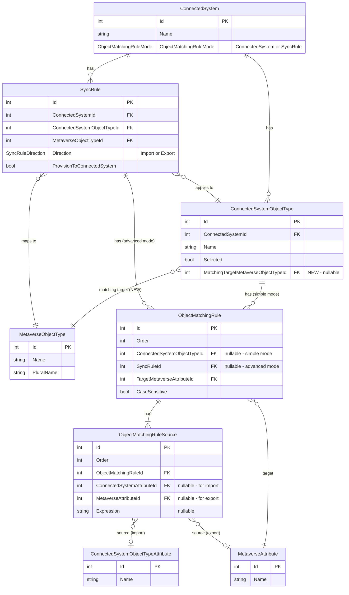

# Simple Mode Object Matching for Import and Export

- **Status:** Planned

## Context

### Current State

Simple mode object matching (`ObjectMatchingRuleMode.ConnectedSystem`) stores matching rules on the `ConnectedSystemObjectType` rather than on individual sync rules. Currently:

- **Import matching** (`FindMatchingMetaverseObjectAsync`): Works, but only when import sync rules exist. `AttemptJoinAsync` iterates import sync rules to drive matching — if none exist, no matching is attempted. This forces admins to create empty import sync rules solely to enable joining, which is confusing and causes side effects.

- **Export matching** (`FindMatchingConnectedSystemObjectAsync`): The method exists in `ObjectMatchingServer` with full simple/advanced mode support, but is **never called** from any sync processor. Export flows have no mechanism to find existing CSOs using object matching rules.

### Problem

1. **Import without sync rules:** Admins must create empty import sync rules (no attribute mappings) solely to enable simple mode joining. This is confusing and the presence of those sync rules can cause unintended side effects during confirming syncs.

2. **No export matching:** When provisioning objects to a target system, JIM cannot use object matching rules to find and join to existing CSOs. This means if an object already exists in the target system, JIM will attempt to provision a duplicate rather than joining to the existing object.

### Goal

Enable simple mode object matching to work for **both inbound and outbound** matching:

1. **Import:** Allow `AttemptJoinAsync` to use simple mode matching rules directly from the object type without requiring an import sync rule. This requires knowing which `MetaverseObjectType` to search, which currently only comes from the sync rule.

2. **Export:** Integrate `FindMatchingConnectedSystemObjectAsync` into the export/provisioning flow so that before provisioning a new CSO, JIM checks whether a matching object already exists in the target system and joins to it instead.

## Entity Relationship Diagram

Entities involved in object matching. The new `MatchingTargetMetaverseObjectTypeId` FK is marked.



## Changes

### Part A: Import Matching Without Import Sync Rules

#### 1. Add `MatchingTargetMetaverseObjectTypeId` FK to `ConnectedSystemObjectType`

**File:** `src/JIM.Models/Staging/ConnectedSystemObjectType.cs`

Add after `RemoveContributedAttributesOnObsoletion` (line 27):
- `int? MatchingTargetMetaverseObjectTypeId` (nullable FK)
- `MetaverseObjectType? MatchingTargetMetaverseObjectType` (navigation property)

XML doc comment should make clear this is specifically for simple mode object matching — when `ObjectMatchingRuleMode.ConnectedSystem` is active and no import sync rule exists for this object type, the matching rules on this object type use this MVO type to scope the metaverse search.

#### 2. EF Core configuration

**File:** `src/JIM.PostgresData/JimDbContext.cs`

Add relationship config: `HasOne(MatchingTargetMetaverseObjectType).WithMany().OnDelete(SetNull)`.

#### 3. EF Migration

Run `dotnet ef migrations add AddMatchingTargetMetaverseObjectTypeToConnectedSystemObjectType --project src/JIM.PostgresData`.

#### 4. Update repository loading queries

**File:** `src/JIM.PostgresData/Repositories/ConnectedSystemRepository.cs`

**`GetObjectTypesAsync` (line 1626)** — used by sync processors via `_objectTypes`. Add:
- `.Include(q => q.MatchingTargetMetaverseObjectType)`
- `.Include(q => q.ObjectMatchingRules).ThenInclude(omr => omr.Sources).ThenInclude(s => s.ConnectedSystemAttribute)`
- `.Include(q => q.ObjectMatchingRules).ThenInclude(omr => omr.Sources).ThenInclude(s => s.MetaverseAttribute)`
- `.Include(q => q.ObjectMatchingRules).ThenInclude(omr => omr.TargetMetaverseAttribute)`

Currently this query only includes `Attributes`. The matching rules and MVO type are needed for the simple mode fallback in `AttemptJoinAsync`.

**`GetConnectedSystemAsync` (line 155)** — the types sub-query already includes `ObjectMatchingRules`. Add `.Include(ot => ot.MatchingTargetMetaverseObjectType)`.

#### 5. New overload on `ObjectMatchingServer.FindMatchingMetaverseObjectAsync`

**File:** `src/JIM.Application/Servers/ObjectMatchingServer.cs`

Add overload that takes `MetaverseObjectType` and `csoTypeId` directly (instead of `SyncRule`):
- Uses `GetConnectedSystemObjectTypeRules(connectedSystem, csoTypeId)` for matching rules
- Passes `metaverseObjectType` directly to `FindMetaverseObjectUsingMatchingRuleAsync` (no change needed to the repository method)

The existing `SyncRule`-based overload remains unchanged.

#### 6. Modify `AttemptJoinAsync` — simple mode fallback

**File:** `src/JIM.Worker/Processors/SyncTaskProcessorBase.cs` (line 1734)

After the existing `foreach` loop over import sync rules (before `return false`), add:

- Check `_connectedSystem.ObjectMatchingRuleMode == ObjectMatchingRuleMode.ConnectedSystem`
- Check no import sync rules were already evaluated for this CSO type
- Look up `_objectTypes.FirstOrDefault(ot => ot.Id == connectedSystemObject.TypeId)`
- If `objectType.MatchingTargetMetaverseObjectType != null`, call the new `FindMatchingMetaverseObjectAsync` overload
- If match found, run the same join validation and establishment logic

**Extract join validation into a private helper** to avoid duplicating the `existingCsoJoinCount` / `_pendingDisconnectedMvoIds` checks between the sync rule path and simple mode path. Something like:
```csharp
private async Task<bool> EstablishJoinAsync(ConnectedSystemObject cso, MetaverseObject mvo)
```

This helper encapsulates: checking existing join count, adjusting for pending disconnects, throwing `SyncJoinException` for duplicates, setting FK/navigation properties, clearing `LastConnectorDisconnectedDate`.

#### 7. Relax early-return guards

**File:** `src/JIM.Worker/Processors/SyncTaskProcessorBase.cs`

**`ProcessActiveConnectedSystemObjectAsync` (line 197):** The `if (activeSyncRules.Count == 0) return;` guard prevents processing even when simple mode could handle it. Relax to allow processing when the connected system is in simple mode and the CSO's object type has a `MatchingTargetMetaverseObjectType` configured.

**`ProcessMetaverseObjectChangesAsync` (line 719):** Same guard, same relaxation. When there are no sync rules but simple mode is available, allow fall-through to the join attempt. The subsequent inbound attribute flow loop (line 793) already gracefully handles an empty list (zero iterations).

#### 8. Update API layer

**`src/JIM.Web/Models/Api/ConnectedSystemRequestDtos.cs`** — Add `int? MatchingTargetMetaverseObjectTypeId` to `UpdateConnectedSystemObjectTypeRequest`.

**`src/JIM.Web/Models/Api/ConnectedSystemDto.cs`** — Add `MatchingTargetMetaverseObjectTypeId` and `MatchingTargetMetaverseObjectTypeName` to `ConnectedSystemObjectTypeDto`, update `FromEntity`.

**`src/JIM.Web/Controllers/Api/SynchronisationController.cs`** — In the PUT endpoint for object types (line 128), handle the new property: validate the MVO type exists, set on the entity.

#### 9. Update PowerShell cmdlet

**File:** `src/JIM.PowerShell/Public/ConnectedSystems/Set-JIMConnectedSystemObjectType.ps1`

Add `-MatchingTargetMetaverseObjectTypeId` parameter, include in request body when specified.

#### 10. Unit tests

**`test/JIM.Worker.Tests/OutboundSync/ObjectMatchingServerTests.cs`** — Add tests for the new overload:
- Match found with MVO type passed directly
- No matching rules returns null
- Multiple matches throws `MultipleMatchesException`

**New file: `test/JIM.Worker.Tests/Synchronisation/SimpleMatchingModeJoinTests.cs`** — Tests for the `AttemptJoinAsync` simple mode fallback:
- CSO joins via simple mode when no import sync rules exist
- CSO does not join when `MatchingTargetMetaverseObjectTypeId` is null (graceful no-op)
- Warning logged when matching rules exist but `MatchingTargetMetaverseObjectTypeId` is not set
- Existing join prevents duplicate (same validation as sync rule path)

#### 11. Update Scenario 8 setup (follow-up)

**File:** `test/integration/Setup-Scenario8.ps1`

After the main changes, update the setup to:
- Set `MatchingTargetMetaverseObjectTypeId` on the target group object type via `Set-JIMConnectedSystemObjectType`
- Remove the empty "EMEA AD Import Groups" sync rule creation (lines 598-611)
- Verify the DeleteGroup test passes without the empty rule

### Part B: Export Matching Integration

Currently `ObjectMatchingServer.FindMatchingConnectedSystemObjectAsync` exists with full simple/advanced mode support, but is never called from any sync processor. The export provisioning flow in `ExportEvaluationServer.CreateOrUpdatePendingExportWithNoNetChangeAsync` always creates a new `PendingProvisioning` CSO when no existing CSO is found — it never attempts to find a matching CSO in the target system using object matching rules.

#### 12. Integrate export matching into `CreateOrUpdatePendingExportWithNoNetChangeAsync`

**File:** `src/JIM.Application/Servers/ExportEvaluationServer.cs` (line ~918)

In `CreateOrUpdatePendingExportWithNoNetChangeAsync`, when `existingCso == null` and provisioning is enabled, **before** creating a new `PendingProvisioning` CSO:

1. Call `FindMatchingConnectedSystemObjectAsync(mvo, connectedSystem, exportRule)` to search for an existing CSO in the target system
2. If a match is found:
   - Join the MVO to the existing CSO (set `MetaverseObjectId` FK, update status to `Normal`)
   - Set `csoForExport = matchedCso` and `needsProvisioning = false`
   - Use `PendingExportChangeType.Update` instead of `Create`
   - Log the join at Information level
3. If no match is found, proceed with existing provisioning logic (create new `PendingProvisioning` CSO)

This needs access to the `ConnectedSystem` object. Check whether `exportRule.ConnectedSystem` navigation property is loaded in the export evaluation cache; if not, add it to the cache loading query.

#### 13. Ensure matching rules are loaded in export evaluation cache

**File:** `src/JIM.Application/Servers/ExportEvaluationServer.cs`

In `BuildExportEvaluationCacheAsync`, verify that export sync rules include their `ConnectedSystem` with `ObjectTypes` and `ObjectMatchingRules` (with `Sources` and attributes). The matching server needs these to evaluate rules. If not already included, add the necessary `.Include()` chains.

#### 14. Ensure `FindConnectedSystemObjectUsingMatchingRuleAsync` repository method exists

**File:** `src/JIM.PostgresData/Repositories/ConnectedSystemRepository.cs`

Verify `FindConnectedSystemObjectUsingMatchingRuleAsync` is implemented and handles:
- String matching (case-insensitive)
- GUID matching
- Integer matching
- Scoping to the correct `ConnectedSystemObjectType`

This method is already referenced by `ObjectMatchingServer.FindMatchingConnectedSystemObjectAsync` (line 120) — confirm it exists and works correctly.

#### 15. Unit tests for export matching

**`test/JIM.Worker.Tests/OutboundSync/ObjectMatchingServerTests.cs`** — The existing tests for `FindMatchingConnectedSystemObjectAsync` should already cover basic scenarios. Verify and add if missing:
- Simple mode: match found using object type rules
- Simple mode: no matching rules returns null
- Advanced mode: match found using sync rule rules
- No match returns null

**New file: `test/JIM.Worker.Tests/OutboundSync/ExportMatchingIntegrationTests.cs`** — Tests for the integration in `CreateOrUpdatePendingExportWithNoNetChangeAsync`:
- When matching CSO found, no new provisioning CSO created — existing CSO used with Update change type
- When no matching CSO found, provisioning CSO created as before
- When matching is disabled (no matching rules), provisioning CSO created as before
- Export matching respects simple vs advanced mode

## Verification

1. `dotnet build JIM.sln` — zero errors
2. `dotnet test JIM.sln` — all tests pass including new ones
3. Run Scenario 8 integration test to verify the DeleteGroup step passes without the spurious rename export
4. Verify export matching: configure simple mode matching rules on a target connected system object type, provision an MVO that matches an existing CSO, and confirm JIM joins to the existing CSO rather than creating a duplicate
