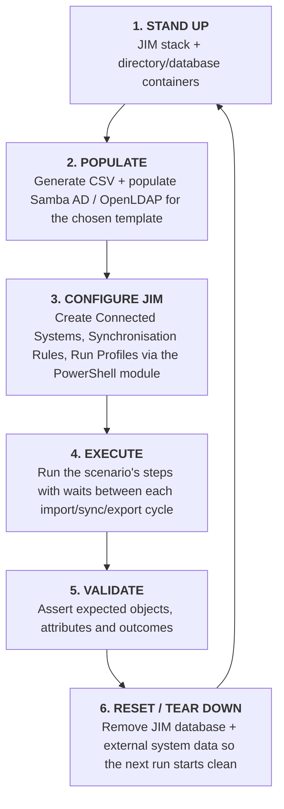
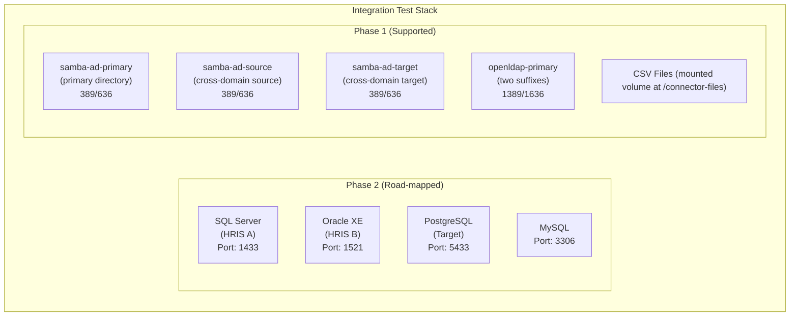

# Integration Testing Framework

| | |
|---|---|
| **Status** | **Phase 1 Complete** |
| **Phase 1** | Supported (currently shipped capabilities) |
| **Phase 2** | Road-mapped (after Database Connector #170) |
| **Related Issue** | [#173](https://github.com/TetronIO/JIM/issues/173) |

---

## Table of Contents

1. [Quick Start](#-quick-start)
2. [Test Lifecycle Quick Reference](#test-lifecycle-quick-reference)
3. [Overview](#overview)
4. [Architecture](#architecture)
5. [Data Scale Templates](#data-scale-templates)
6. [Test Scenarios](#test-scenarios)
7. [Setup & Configuration](#setup--configuration)
8. [Running Tests Locally](#running-tests-locally)
9. [CI/CD Integration](#cicd-integration)
10. [Writing New Scenarios](#writing-new-scenarios)
11. [Performance Diagnostics](#performance-diagnostics)
12. [Prebuilt Samba AD Base Images](#prebuilt-samba-ad-base-images)
13. [Samba AD Snapshot Images](#samba-ad-snapshot-images)
14. [Troubleshooting](#troubleshooting)
15. [Appendix](#appendix)
16. [Current Progress & Known Issues](#current-progress--known-issues)
17. [Workflow Tests vs Integration Tests](#workflow-tests-vs-integration-tests)
18. [Metrics Streaming](#metrics-streaming)
19. [Related Documentation](#related-documentation)

---

## ⚡ Quick Start

**First time running integration tests?** Use the single-command runner:

```powershell
# IMPORTANT: Run these commands inside PowerShell, not bash/zsh!
pwsh

# From the repository root (/workspaces/JIM)
cd /workspaces/JIM

# Run the complete test suite with a single command
./test/integration/Run-IntegrationTests.ps1
```

This single script handles everything:
1. ✅ Builds custom Samba AD image if not present (first run only, ~30 seconds)
2. ✅ Resets the environment (stops containers, removes volumes)
3. ✅ Rebuilds and starts JIM stack + Samba AD
4. ✅ Waits for all services to be ready
5. ✅ Creates an infrastructure API key
6. ✅ Runs the test scenario

**Common Options:**

```powershell
# Run with default settings (Scenario1, Nano template, all steps)
./test/integration/Run-IntegrationTests.ps1

# Run ALL scenarios sequentially (full regression)
./test/integration/Run-IntegrationTests.ps1 -Scenario All -Template Small

# Run a specific scenario
./test/integration/Run-IntegrationTests.ps1 -Scenario "Scenario1-HRToIdentityDirectory"   # HR CSV -> AD provisioning
./test/integration/Run-IntegrationTests.ps1 -Scenario "Scenario2-CrossDomainSync"         # APAC AD -> EMEA AD sync
./test/integration/Run-IntegrationTests.ps1 -Scenario "Scenario4-DeletionRules"           # Deletion rules testing
./test/integration/Run-IntegrationTests.ps1 -Scenario "Scenario5-MatchingRules"           # Matching rules testing
./test/integration/Run-IntegrationTests.ps1 -Scenario "Scenario6-SchedulerService"        # Scheduler service testing
./test/integration/Run-IntegrationTests.ps1 -Scenario "Scenario7-ClearConnectedSystemObjects" # Clear connector space testing
./test/integration/Run-IntegrationTests.ps1 -Scenario "Scenario8-CrossDomainEntitlementSync"  # Group sync between domains
./test/integration/Run-IntegrationTests.ps1 -Scenario "Scenario9-PartitionScopedImports"  # Partition-scoped import Run Profiles
./test/integration/Run-IntegrationTests.ps1 -Scenario "Scenario10-SyncRuleScoping"          # Synchronisation Rule scoping behaviour (inbound + outbound)
./test/integration/Run-IntegrationTests.ps1 -Scenario "Scenario11-ScopingCriteriaMatrix"    # Scoping criteria evaluation matrix (Default tier)
./test/integration/Run-IntegrationTests.ps1 -Scenario "Scenario11-ScopingCriteriaMatrix" -Quick      # Quick tier (~12 cells)
./test/integration/Run-IntegrationTests.ps1 -Scenario "Scenario11-ScopingCriteriaMatrix" -Exhaustive # Exhaustive tier (~152 cells)
./test/integration/Run-IntegrationTests.ps1 -Scenario "Scenario12-RelativeDateScoping"       # Relative-date inbound scoping (joiner/leaver)
./test/integration/Run-IntegrationTests.ps1 -Scenario "Scenario13-RelativeDateOutboundScoping" # Relative-date outbound scoping (staged provisioning)
./test/integration/Run-IntegrationTests.ps1 -Scenario "Scenario14-AttributePriority"        # Attribute Priority multi-source winner resolution (#91, OpenLDAP only)

# Run with a specific template size (see Data Scale Templates for the full list)
./test/integration/Run-IntegrationTests.ps1 -Template Nano                    # smallest; fast dev iteration
./test/integration/Run-IntegrationTests.ps1 -Template Medium                  # typical CI/CD size
./test/integration/Run-IntegrationTests.ps1 -Template Scale100k50Groups       # scale/stress
./test/integration/Run-IntegrationTests.ps1 -Template Scale100k5kGroups       # long-tail, OpenLDAP + Scenario 8 only

# Run only a specific test step (steps vary by scenario)
./test/integration/Run-IntegrationTests.ps1 -Step Joiner                          # Scenario 1: Joiner, Mover, Mover-Rename, Mover-Move, Disable, Enable, Leaver, Reconnection
./test/integration/Run-IntegrationTests.ps1 -Scenario "Scenario2-CrossDomainSync" -Step Provision  # Scenario 2: Provision, ForwardSync, ReverseSync, Conflict
./test/integration/Run-IntegrationTests.ps1 -Scenario "Scenario7-ClearConnectedSystemObjects" -Step DeleteHistory  # Scenario 7: DeleteHistory, KeepHistory, EdgeCases
./test/integration/Run-IntegrationTests.ps1 -Scenario "Scenario8-CrossDomainEntitlementSync" -Step InitialSync  # Scenario 8: InitialSync, ForwardSync, DetectDrift, ReassertState, NewGroup, DeleteGroup, LeaverCohort (OpenLDAP only)
./test/integration/Run-IntegrationTests.ps1 -Scenario "Scenario10-SyncRuleScoping" -Step InboundEnterScope  # Scenario 10: InboundEnterScope/InboundInScopeUpdate/InboundExitDisconnect/InboundExitRemainJoined/OutboundEnterScope/OutboundExitDisconnect/OutboundExitDelete/CrossSystemCascade/CriteriaOperators
./test/integration/Run-IntegrationTests.ps1 -Scenario "Scenario11-ScopingCriteriaMatrix" -OperatorFilter NotEquals  # Scenario 11: filter to cells using a single operator
./test/integration/Run-IntegrationTests.ps1 -Scenario "Scenario14-AttributePriority" -Step BaselineResolution  # Scenario 14: BaselineResolution, RecallReElection, IdenticalValueHandOver, WithdrawalReElection, NoContributorCleared, AssertedNullOverridesSurvivor, NotJoinedNoOpinion, MidLifeJoinBlanksClear, MvaNullIsValueAssertsEmptySet, DisabledRuleNoOpinion, PriorityReorderPropagation, OutOfScopeNoOpinion (OpenLDAP only)

# Combine scenario, template, and step
./test/integration/Run-IntegrationTests.ps1 -Scenario "Scenario2-CrossDomainSync" -Template Small -Step All

# Skip reset for faster re-runs (keeps existing environment)
./test/integration/Run-IntegrationTests.ps1 -SkipReset

# Skip rebuild (use existing Docker images)
./test/integration/Run-IntegrationTests.ps1 -SkipReset -SkipBuild

# Run with export performance tuning (Scenarios 1, 2, 6, 8 only)
./test/integration/Run-IntegrationTests.ps1 -Scenario "Scenario8-CrossDomainEntitlementSync" -ExportConcurrency 4 -MaxExportParallelism 2

# Set log level (overrides .env value for this run, restores afterwards)
./test/integration/Run-IntegrationTests.ps1 -LogLevel Warning

# Disable change tracking (reduces database writes for large tests)
./test/integration/Run-IntegrationTests.ps1 -DisableChangeTracking

# Large-scale test with reduced logging and no change tracking
./test/integration/Run-IntegrationTests.ps1 -Scenario "Scenario1-HRToIdentityDirectory" -Template Large -LogLevel Warning -DisableChangeTracking

# Full pre-release regression suite (all scenarios, both directory types, Samba AD at Medium, OpenLDAP at Large)
./test/integration/Run-IntegrationTests.ps1 -PreRelease
```

**Strict-mode hardening:** the runner uses `Set-StrictMode -Version Latest`, so local debugging must treat uninitialised variables and missing properties as errors. This matches CI behaviour and prevents drift between the two environments.

**-PreRelease preset**: shorthand for the full pre-release regression (`-Scenario All -DirectoryType All -TemplateSambaAD Medium -TemplateOpenLDAP Large`): every implemented scenario against both directory types, with Samba AD at the Medium template and OpenLDAP at the Large template. Use this as the recommended pre-release gate, the final sign-off before cutting a release.

**Available Scenarios (`-Scenario` parameter):**

In **Containers Used**, `samba-* / openldap-primary` means the scenario runs against Samba AD or OpenLDAP depending on `-DirectoryType`; `file (...)` means no directory container (CSV / metaverse only). Scenario 14 is OpenLDAP only.

| Scenario | Description | Containers Used |
|----------|-------------|-----------------|
| `Scenario1-HRToIdentityDirectory` | HR + Training CSV -> AD provisioning (Joiner/Mover/Leaver) | samba-ad-primary / openldap-primary |
| `Scenario2-CrossDomainSync` | APAC -> EMEA directory sync | samba-ad-source, samba-ad-target / openldap-primary |
| `Scenario3-GALSYNC` | AD -> CSV global address list export (stub, not implemented) | samba-ad-primary / openldap-primary |
| `Scenario4-DeletionRules` | Deletion rules and grace period testing | samba-ad-primary / openldap-primary |
| `Scenario5-MatchingRules` | Object Matching Rules testing | samba-ad-primary / openldap-primary |
| `Scenario6-SchedulerService` | Scheduler service end-to-end testing | samba-ad-primary / openldap-primary |
| `Scenario7-ClearConnectedSystemObjects` | Clear connector space testing | samba-ad-primary / openldap-primary |
| `Scenario8-CrossDomainEntitlementSync` | Group sync between APAC and EMEA domains | samba-ad-source, samba-ad-target / openldap-primary |
| `Scenario9-PartitionScopedImports` | Partition-scoped import Run Profiles | samba-ad-primary / openldap-primary |
| `Scenario10-SyncRuleScoping` | Synchronisation Rule scoping behaviour: inbound enter/in-scope-update/exit (Disconnect, RemainJoined); outbound enter/exit (Disconnect, Delete); cross-system inline cascade; criteria persistence | file (HR CSV), samba-ad-primary / openldap-primary |
| `Scenario11-ScopingCriteriaMatrix` | Scoping criteria evaluation matrix: full operator x value-type x group-structure coverage via batched per-cell CSO and MV types. Three tiers: Quick (~12 cells), Default (~41 cells), Exhaustive (~152 cells). Round-trip persistence and API negative-cell probes run first. | file (bespoke deterministic seed) |
| `Scenario12-RelativeDateScoping` | Relative-date inbound scoping: date-driven joiner provisioning and leaver deprovisioning, plus per-run re-evaluation against the live clock | file (HR CSV, metaverse-only) |
| `Scenario13-RelativeDateOutboundScoping` | Relative-date outbound scoping: downstream provisioning held until a joiner's start date arrives, released via the Temporal Scope Reconciler's outbound lane | file (HR CSV source, CSV export target) |
| `Scenario14-AttributePriority` | Attribute Priority multi-source winner resolution (#91): two import Synchronisation Rules contribute the same Metaverse attributes (Description, Job Title, Manager reference, multi-valued Other Telephones) at different priorities; validates winner-takes-all for scalars, multi-valued handling, recall/re-election, and null/withdrawal/priority-reorder behaviour. OpenLDAP only (two-suffix topology: dc=yellowstone Primary + dc=glitterband Secondary in one container) | openldap-primary (two suffixes) |

**Available Templates (`-Template` parameter):**

See [Data Scale Templates](#data-scale-templates) for the full list: sizes, group counts, use case and minimum host RAM.

> **Memory requirements for large templates:** The Scale100k50Groups and above templates require significantly more memory than smaller templates. The worker loads all imported objects into memory during processing; a 100K object import produces a worker peak working set of approximately 2.3 GB, plus 1–2 GB for the database during bulk inserts. **A 16 GB machine is not sufficient for Scale100k50Groups**; the worker will be OOM-killed during the save phase even without IDE overhead. In a GitHub Codespace (16 GB total), the problem is worse because the IDE and dev tools consume additional memory. Run Scale100k50Groups tests on a machine with at least 20–24 GB total RAM. See the [Deployment Guide - Memory Scaling](../docs/administration/deployment.md#memory-scaling-by-identity-object-count) for detailed requirements.

**Available Directory Types (`-DirectoryType` parameter):**

| Directory Type | Description | Backend |
|----------------|-------------|---------|
| `SambaAD` (default) | Samba Active Directory | LDAPS on port 636, `objectGUID`, AD schema discovery |
| `OpenLDAP` | OpenLDAP with multi-suffix partitions | LDAP on port 1389, `entryUUID`, RFC 4512 schema, accesslog delta import |
| `All` | Both directory types (full regression) | Runs all scenarios against SambaAD first, then OpenLDAP |

```powershell
# Run against OpenLDAP
./test/integration/Run-IntegrationTests.ps1 -Scenario All -Template Small -DirectoryType OpenLDAP

# Run against both directory types (full cross-directory regression)
./test/integration/Run-IntegrationTests.ps1 -Scenario All -Template Small -DirectoryType All

# Run against both directory types with different template sizes
# (useful when Samba AD population is too slow for large templates)
./test/integration/Run-IntegrationTests.ps1 -Scenario All -DirectoryType All -TemplateSambaAD Medium -TemplateOpenLDAP Scale100k50Groups

# Run a specific scenario against both directory types
./test/integration/Run-IntegrationTests.ps1 -Scenario Scenario1-HRToIdentityDirectory -DirectoryType All
```

> **Note:** OpenLDAP uses a single container (`openldap-primary`) with two naming contexts (suffixes) for multi-partition scenarios, while Samba AD uses separate containers (`samba-ad-source`, `samba-ad-target`). The test framework abstracts these differences via `Get-DirectoryConfig`.

**Alternative: Manual step-by-step (for debugging or more control)**

```powershell
# 1. Start complete test environment (JIM stack + Samba AD + readiness check)
./test/integration/Start-IntegrationTestEnvironment.ps1

# 2. Create Infrastructure API Key
./test/integration/Setup-InfrastructureApiKey.ps1

# 3. Run Scenario 1
./test/integration/scenarios/Invoke-Scenario1-HRToIdentityDirectory.ps1 -Template Nano -ApiKey (Get-Content test/integration/.api-key)
```

**Helper Scripts:**
- `Run-IntegrationTests.ps1` - **Single-command test runner (recommended!)**
- `Start-IntegrationTestEnvironment.ps1` - Starts JIM + Samba AD (used by runner)
- `Wait-SambaReady.ps1` - Checks if Samba AD is ready
- `Setup-InfrastructureApiKey.ps1` - Creates API key for testing

---

## Test Lifecycle Quick Reference

Integration tests require a complete environment reset between runs to ensure repeatable, idempotent results. This includes resetting **both** external systems (Samba AD, OpenLDAP, databases) **and** JIM itself (metaverse, configuration).

> **Directory reset between scenarios (full-regression runs):** the runner's per-scenario `Reset-JIMForNextScenario` removes the JIM database volume and clears the test data from *both* directory types. Samba AD's test OUs are deleted; OpenLDAP's `ou=People` and `ou=Groups` subtrees under `dc=yellowstone,dc=local` and `dc=glitterband,dc=local` are deleted and the empty base OUs recreated. OpenLDAP is a long-lived container whose data volume is not removed between scenarios, so without this explicit purge each OpenLDAP scenario would import the accumulated objects of every earlier OpenLDAP scenario. Fixed-size scenarios should assert their expected object count (see `Assert-ImportedObjectCount`) so a reset gap fails loudly rather than silently synchronising stale data.

Both locally and in CI, every run follows the same six-stage lifecycle. `Run-IntegrationTests.ps1` (see [Quick Start](#-quick-start)) automates all six stages; you do not drive them by hand.



**Local vs CI:** locally the runner performs the reset between runs (and `Reset-JIMForNextScenario` between scenarios of a full-regression sweep). In CI each run gets a fresh GitHub runner, so there are no persistent volumes and the reset is automatic. See [CI/CD Integration](#cicd-integration) for the workflow itself.

**CI/CD Characteristics:**

| Aspect | Behaviour |
|--------|-----------|
| **Trigger** | Manual only (`workflow_dispatch`) - not on every commit |
| **Isolation** | Fresh GitHub runner = clean state guaranteed |
| **Reset** | `docker compose down -v` in `always()` step ensures cleanup even on failure |
| **Idempotency** | Each run is fully independent; no state persists between runs |
| **Timeout** | 2 hours maximum to prevent runaway costs |

### Why Reset JIM's Database?

Integration tests create real data in JIM:

- **Metaverse Objects** - Identity records from imports
- **Connected System Objects** - Links to external systems
- **Synchronisation Rules** - Attribute Flow configurations
- **Run Profiles** - Execution schedules
- **Activity History** - Sync operation logs

Without resetting JIM, subsequent test runs would:
- Fail join rules (objects already exist)
- Have incorrect object counts
- Accumulate stale configuration
- Produce non-deterministic results

**The `-v` flag removes Docker volumes**, which contain:
- JIM's PostgreSQL database (all metaverse data, configuration)
- External system data (Samba AD, SQL Server, etc.)

This guarantees a clean slate for each test run.

---

## Overview

The Integration Testing Framework provides end-to-end validation of JIM's synchronisation capabilities against real Connected Systems running in Docker containers. This enables:

- **Capability Validation**: Prove JIM works in real-world scenarios
- **Regression Prevention**: Catch breaking changes before production
- **Performance Baselines**: Establish and monitor performance characteristics
- **Connector Validation**: Verify all connectors function correctly
- **Release Confidence**: Automated testing before each release

### Key Principles

- **Realistic Systems**: Test against actual Samba AD, SQL Server, Oracle, etc., not mocks
- **Idempotent**: Complete stand-up/tear-down for repeatable testing
- **Scalable**: Template-based data sets from 3 to 1M objects
- **Phased**: Phase 1 (supported) covers LDAP/CSV; Phase 2 (road-mapped) adds databases
- **Opt-In**: Manual trigger only, not automatic on every commit

### Step-Based Execution Model

Each scenario script supports a `-Step` parameter that controls which test case to execute. This is essential because JIM needs time to complete its import/sync/export cycle between test steps.

**Why step-based?**
1. **JIM Processing Time**: After modifying source data, JIM must import, synchronise, and export before verification
2. **Developer Control**: Run individual steps for debugging or testing specific functionality
3. **CI/CD Automation**: The `-Step All` option runs all steps sequentially with appropriate waits
4. **Realistic Testing**: Simulates real-world ILM operations where changes happen over time

**Common parameters across all scenario scripts**:
- `-Step <StepName>` - Execute a specific test step (or `All` for full sequence)
- `-Template <Size>` - Data scale template; see [Data Scale Templates](#data-scale-templates) for the full list
- `-TemplateSambaAD <Size>` - Override `-Template` for Samba AD when using `-DirectoryType All`
- `-TemplateOpenLDAP <Size>` - Override `-Template` for OpenLDAP when using `-DirectoryType All`
- `-WaitSeconds <N>` - Override default wait time between steps (default: 60)
- `-TriggerRunProfile` - Automatically trigger JIM Run Profile after data changes

**Export performance parameters** (accepted by Scenarios 1, 2, 6, 8, i.e. scenarios with LDAP exports):
- `-ExportConcurrency <N>` - LDAP connector pipelining concurrency (1-8, omit for JIM default of 1)
- `-MaxExportParallelism <N>` - Parallel export batch processing (1-16, omit for JIM default of 1)
- These are only passed through to scenarios when explicitly provided to the test runner

---

## Architecture

### Docker Compose Project Separation

The integration test stack uses a **separate Docker Compose project name** (`jim-integration`) from the main JIM stack (project `jim`). This is configured via the top-level `name: jim-integration` property in `test/integration/docker/docker-compose.integration-tests.yml`.

**Why?** Without separate project names, Docker Compose treats all containers from the same directory as belonging to one project. When you run `jim-build` (main stack), Compose sees the Samba AD containers from integration tests as "orphans" and emits warnings. Separate project names cleanly isolate the two stacks while still sharing the `jim-network` Docker network.

Both stacks communicate via the shared `jim-network` (defined as `external: true` in the integration tests file).

### Container Stack

All external systems run as Docker containers defined in `test/integration/docker/docker-compose.integration-tests.yml`:



The end-to-end run lifecycle (stand up, populate, configure, execute, validate, tear down) is shown under [Test Lifecycle Quick Reference](#test-lifecycle-quick-reference).

---

## Data Scale Templates

Choose the appropriate template based on test goals. For run times see [Run-Time Estimates](#run-time-estimates).

| Template | Users | Groups | Avg Memberships | Total Objects | Use Case | Min RAM |
|----------|-------|--------|-----------------|---------------|----------|---------|
| **Nano** | 3 | 1 | 1 | 4 | Fast dev iteration, debugging | - |
| **Micro** | 10 | 3 | 3 | 13 | Quick smoke tests, development | - |
| **Small** | 100 | 20 | 5 | 120 | Small business, unit tests | - |
| **Medium** | 1,000 | 100 | 8 | 1,100 | Medium enterprise, CI/CD | - |
| **MediumLarge** | 5,000 | 250 | 9 | 5,250 | Large medium enterprise, validation | - |
| **Large** | 10,000 | 500 | 10 | 10,500 | Large enterprise, baselines | - |
| **Scale100k50Groups** | 100,000 | 50 | 12 | 100,050 | Very large enterprise, stress | 20+ GB |
| **Scale100k5kGroups** | 100,000 | 5,027 | ~9 (measured) | 105,027 | Scenario 8 long-tail group shape (OpenLDAP only) | 20+ GB |
| **Scale200k55Groups** | 200,000 | 55 | 12 | 200,055 | Very large enterprise, extended | 24+ GB |
| **Scale200k10kGroups** | 200,000 | 9,984 | ~8 | 209,984 | Scenario 8 long-tail group shape (OpenLDAP only) | 28+ GB |
| **Scale500k65Groups** | 500,000 | 65 | 13 | 500,065 | Massive enterprise, validation | 32+ GB |
| **Scale500k25kGroups** | 500,000 | 24,997 | ~10 | 524,997 | Scenario 8 long-tail group shape (OpenLDAP only) | 40+ GB |
| **Scale750k70Groups** | 750,000 | 70 | 14 | 750,070 | Near-million scale validation | 32+ GB |
| **Scale750k40kGroups** | 750,000 | 40,011 | ~11 | 790,011 | Scenario 8 long-tail group shape (OpenLDAP only) | 48+ GB |
| **Scale1m80Groups** | 1,000,000 | 70 | 15 | 1,000,070 | Global enterprise, scale limits | 64+ GB |
| **Scale1m60kGroups** | 1,000,000 | 60,073 | ~13 | 1,060,073 | Scenario 8 long-tail group shape (OpenLDAP only) | 64+ GB |

- **Scale1m80Groups**: the name's "80" reflects the originally planned group count; the actual count is 70. The capped-groups templates (`Scale*Groups`) are kept for Samba AD scale testing; the long-tail counterparts (`Scale*kGroups`) model realistic group topology and are OpenLDAP only.
- **Scale1m60kGroups**: also requires raising the OpenLDAP accesslog `olcDbMaxSize` proportionally (see Troubleshooting -> "OpenLDAP accesslog full").

### Data Characteristics

All templates generate realistic enterprise data following normal distribution patterns:

- **Job Titles**: Hierarchy (many Individual Contributors, few C-level)
- **Departments**: Realistic structure (IT, HR, Sales, Finance, Operations, Marketing)
- **Group Memberships**: Normal distribution (most users 5-15 groups, power users 30+)
- **Attributes**: Valid names, email patterns, phone numbers, addresses
- **Organisational Structure**: Tree hierarchy with realistic spans of control

---

## Run-Time Estimates

> Wall-clock times **measured on this devcontainer** (best endeavours; cold-cache figures marked *(est.)* are extrapolated, not directly measured). **Time (cached)** assumes the directory snapshot images and JIM stack images already exist, the normal case after the first run on a machine. **First run adds** is the one-time build of those images on top. Two things dominate: run time is driven almost entirely by **Scenarios 1, 7 and 8**, and it is strongly **directory-dependent**, because `samba-tool` takes a per-write LDB lock, Samba AD's Scenario 8 is far slower than OpenLDAP's (Scenario 8 alone measured 96 min on Samba MediumLarge versus 19 min on OpenLDAP at the larger Large template). Scenarios 2, 4, 6, 11, 12, 13 use fixed small data and barely move with `-Template`. Directory-selectable scenarios have a separate Samba AD and OpenLDAP row.

| Runner option | Directory | Template(s) | Time (cached) | Notes |
|---------------|-----------|-------------|---------------|-------|
| `-PreRelease` | Samba AD + OpenLDAP | Medium + Large | **~2h 45m** | first run +~15 min |
| `-Scenario All` | Samba AD | Medium | ~1h 00m | first run +~10 min |
| `-Scenario All` | Samba AD | MediumLarge | ~2h 40m | first run +~10 min |
| `-Scenario All` | OpenLDAP | Large | ~1h 45m | first run +~15 min |
| `-Scenario All` | OpenLDAP | Scale100k50Groups | ~7h 15m | first run +~1h |
| `-Scenario All` | Samba AD or OpenLDAP | Nano / Micro / Small | ~30-40m *(est.)* | not directly measured |
| Scenario1 HRToIdentityDirectory | Samba AD | Medium / MediumLarge | 11m / 24m | scales strongly |
| Scenario1 HRToIdentityDirectory | OpenLDAP | Large / 100k | 21m / 3h | scales strongly |
| Scenario2 CrossDomainSync | Samba AD | any | ~1.5m | fixed |
| Scenario2 CrossDomainSync | OpenLDAP | any | ~1.5m | fixed |
| Scenario3 GALSYNC | n/a | n/a | stub, not implemented | n/a |
| Scenario4 DeletionRules | Samba AD | any | ~7m | fixed (grace-period waits) |
| Scenario4 DeletionRules | OpenLDAP | any | ~7m | fixed (grace-period waits) |
| Scenario5 MatchingRules | Samba AD | Medium / MediumLarge | ~2m | fixed (Nano data) |
| Scenario5 MatchingRules | OpenLDAP | Large / 100k | 5m / 22m | see reset-overhead note |
| Scenario6 SchedulerService | Samba AD | any | ~1m | fixed |
| Scenario6 SchedulerService | OpenLDAP | any | ~1m | fixed |
| Scenario7 ClearConnectedSystemObjects | Samba AD | Medium / MediumLarge | 1.5m / 3m | scales |
| Scenario7 ClearConnectedSystemObjects | OpenLDAP | Large / 100k | 4.5m / 52m | scales |
| Scenario8 CrossDomainEntitlementSync | Samba AD | Medium / MediumLarge | 8m / 96m | scales; samba-tool per-write lock |
| Scenario8 CrossDomainEntitlementSync | OpenLDAP | Large / 100k | 19m / 2h 17m | scales |
| Scenario9 PartitionScopedImports | Samba AD | Medium / MediumLarge | ~1m | ~fixed |
| Scenario9 PartitionScopedImports | OpenLDAP | Large / 100k | 2m / 9m | scales |
| Scenario10 SyncRuleScoping | Samba AD | Medium / MediumLarge | ~2.5m | ~fixed |
| Scenario10 SyncRuleScoping | OpenLDAP | Large / 100k | 3m / 5m | mild scale |
| Scenario11 ScopingCriteriaMatrix | file-based (no directory) | any | ~1m Default | Quick / Default / Exhaustive tiers |
| Scenario12 RelativeDateScoping | file-based (no directory) | any | ~2.5m | date-window wait |
| Scenario13 RelativeDateOutboundScoping | file-based (no directory) | any | ~3m | date-window wait |
| Scenario14 AttributePriority | OpenLDAP only | (ignored) | ~2m | fixed six-user; -Template ignored |

**Notes:**

- Per-scenario times are the scenario's contribution inside a full run. Run one **standalone** and add the fixed harness overhead (reset, start services, cleanup): roughly +1 min warm, or +5 min on a first run that also rebuilds the JIM images (~4 min).
- Nano/Micro/Small full-regression times are estimates, not directly measured. A run floors at roughly 25-30 min from fixed-duration scenarios (Scenario 4's grace periods, Scenarios 12/13's date-window waits) plus ~12 between-scenario resets, so shrinking the template below Medium buys little.
- The first-run directory-snapshot build scales with user count: negligible for light templates, ~45-60 min at Scale100k50Groups (100k users). At scale, also mind the reset-hygiene caveat in [issue #961](https://github.com/TetronIO/JIM/issues/961).
- OpenLDAP per-scenario times at scale can include between-scenario reset/directory overhead (see [#961](https://github.com/TetronIO/JIM/issues/961)); for the non-scaling scenarios (e.g. Scenario 5) treat the 100k figure as an upper bound, not the scenario's intrinsic cost.
- Scenario 14 ignores `-Template` (it always uses its bespoke six-user, two-suffix dataset) and runs on OpenLDAP only.

---

## Test Scenarios

### Phase 1 (Supported) - Person Entity Scenarios (LDAP & CSV)

#### Scenario 1: Person Entity - HR to Identity Directory

**Purpose**: Validate the most common ILM use case - provisioning users from HR system to Active Directory.

**Systems**:
- Source: CSV (HR system)
- Target: Panoply AD

**Test Data**:
- HR CSV includes Company attribute: "Panoply" for employees, partner companies for contractors
- Partner companies: Nexus Dynamics, Akinya, Rockhopper, Stellar Logistics, Vertex Solutions

**Test Steps** (executed sequentially):

| Step | Test Case | Description |
|------|-----------|-------------|
| 1 | **Joiner** | User added to HR CSV -> provisioned to AD with correct attributes and group memberships |
| 2a | **Mover** | User title changed in CSV -> attribute updated in AD (no DN impact) |
| 2b | **Mover-Rename** | User name changed in CSV -> DN renamed in AD (same container) |
| 2c | **Mover-Move** | User department changed in CSV (Admin->Finance) -> DN recalculated with new OU, LDAP move operation executed |
| 2d | **Disable** | User status set to `Archived` in CSV -> AD account disabled via `userAccountControl` (Samba AD only; skipped for OpenLDAP, which has no `userAccountControl` equivalent) |
| 2e | **Enable** | User status set back to `Active` in CSV -> AD account re-enabled (Samba AD only) |
| 3 | **Leaver** | User removed from CSV -> deprovisioned from AD (respecting deletion rules) |
| 4 | **Reconnection** | User re-added to CSV within grace period -> scheduled deletion cancelled |

**Diagnostic steps** (run a partial pipeline; do not participate in `-Step All`):

| Step | Action |
|------|--------|
| **ImportOnly** | Runs the HR CSV Full Import and stops before sync, for debugging CSO creation issues |
| **SyncOnly** | Runs HR CSV Full Import + Full Sync and stops before exports, so Pending Exports can be inspected before they fire |

**Script**: `test/integration/scenarios/Invoke-Scenario1-HRToIdentityDirectory.ps1`

**Execution Model**:

Each test step is triggered via a `-Step` parameter. This allows JIM to complete its import/sync/export cycle between steps:

```powershell
# Step 1: Joiner - Add user to HR CSV, trigger JIM sync, verify in AD
./Invoke-Scenario1-HRToIdentityDirectory.ps1 -Step Joiner -Template Small

# Step 2a: Mover - Modify user attributes in CSV, verify changes in AD
./Invoke-Scenario1-HRToIdentityDirectory.ps1 -Step Mover -Template Small

# Step 2b: Mover-Rename - Change user name, verify DN rename in AD
./Invoke-Scenario1-HRToIdentityDirectory.ps1 -Step Mover-Rename -Template Small

# Step 2c: Mover-Move - Change display name, verify LDAP move operation
./Invoke-Scenario1-HRToIdentityDirectory.ps1 -Step Mover-Move -Template Small

# Step 3: Leaver - Remove user from CSV, verify deprovisioned in AD
./Invoke-Scenario1-HRToIdentityDirectory.ps1 -Step Leaver -Template Small

# Step 4: Reconnection - Re-add user before grace period, verify preserved
./Invoke-Scenario1-HRToIdentityDirectory.ps1 -Step Reconnection -Template Small

# Run all steps sequentially (waits for JIM between each)
./Invoke-Scenario1-HRToIdentityDirectory.ps1 -Step All -Template Small
```

**Step Details**:

| Parameter | Action | Verification |
|-----------|--------|--------------|
| `-Step Joiner` | Creates test user(s) in HR CSV | User exists in AD with correct attributes |
| `-Step Mover` | Modifies title in CSV | Title attribute updated in AD (no DN change) |
| `-Step Mover-Rename` | Changes user name in CSV | DN renamed in AD (CN component changed) |
| `-Step Mover-Move` | Changes department (Admin->Finance) | User moved from OU=Admin to OU=Finance via LDAP move operation |
| `-Step Leaver` | Removes user from HR CSV | User disabled/deleted in AD per deletion rules |
| `-Step Reconnection` | Re-adds user to CSV | Scheduled deletion cancelled, user remains active |
| `-Step All` | Runs all steps sequentially | Full lifecycle validated |

The `-Step All` option includes built-in waits and JIM Run Profile triggers between steps to automate the full test cycle.

##### Outcome Graph Assertions (#363 Phase 4b)

Each step validates that the RPEI Outcome Graph records the correct causal chain. These assertions use `Assert-ActivityOutcomeStats` and `Assert-ActivityItemsHaveOutcomeSummary` from `test/integration/utils/Test-Helpers.ps1`.

| Step | Activity | Validated Outcome | What's Checked |
|------|----------|-------------------|----------------|
| Joiner | CSV Import | `CsoAdded` | Items have `outcomeSummary` containing `CsoAdded` |
| Joiner | Full Sync | `Projected` | Items have `outcomeSummary` containing `Projected`; stats show `totalProvisioned` matching user count |
| Joiner | LDAP Export | `Exported` | Items have `outcomeSummary` containing `Exported` |
| Mover | CSV Delta Sync | `AttributeFlow` | Items have `outcomeSummary` containing `AttributeFlow` |
| Leaver | CSV Full Import | `DeletionDetected` | Items have `outcomeSummary` containing `DeletionDetected` |
| Leaver | CSV Delta Sync | `Disconnected` | Items have `outcomeSummary` containing `Disconnected` |

These assertions piggyback on Scenario 1's existing lifecycle rather than creating a separate scenario, since outcome tracking is a cross-cutting concern exercised by every sync operation.

Repository-level tests for the dual-path stats derivation logic (outcome-based vs legacy fallback) are in `test/JIM.Web.Api.Tests/ActivityOutcomeStatsIntegrationTests.cs`.

---

#### Scenario 2: Person Entity - Cross-domain Synchronisation

**Purpose**: Validate unidirectional synchronisation of person entities between two directory services.

**Systems**:
- Source: Panoply APAC (authoritative)
- Target: Panoply EMEA

**Test Steps** (executed sequentially):

| Step | Test Case | Description |
|------|-----------|-------------|
| 1 | **Provision** | User created in Source AD -> provisioned to Target AD |
| 2 | **ForwardSync** | Attributes changed in Source AD -> flow to Target AD |
| 3 | **ReverseSync** | User created directly in Target AD -> verifies it does NOT project to the metaverse (the Target import rule has `ProjectToMetaverse=false`, so Target imports may only join existing MVOs, never create new ones). Validates the unidirectional design. |
| 4 | **Conflict** | Same user changed simultaneously in Source and Target -> Source wins; Target is overwritten on next sync |

**Script**: `test/integration/scenarios/Invoke-Scenario2-CrossDomainSync.ps1`

**Execution Model**:

```powershell
# Individual steps
./Invoke-Scenario2-CrossDomainSync.ps1 -Step Provision -Template Small
./Invoke-Scenario2-CrossDomainSync.ps1 -Step ForwardSync -Template Small
./Invoke-Scenario2-CrossDomainSync.ps1 -Step ReverseSync -Template Small
./Invoke-Scenario2-CrossDomainSync.ps1 -Step Conflict -Template Small

# Run all steps sequentially
./Invoke-Scenario2-CrossDomainSync.ps1 -Step All -Template Small
```

---

#### Scenario 3: Person Entity - GALSYNC (Global Address List Synchronisation)

**Purpose**: Validate exporting directory users to CSV for distribution/reporting.

**Systems**:
- Source: Panoply AD
- Target: CSV (GAL export)

**Test Steps** (executed sequentially):

| Step | Test Case | Description |
|------|-----------|-------------|
| 1 | **Export** | Users in AD -> exported to CSV with selected attributes only |
| 2 | **Update** | User attributes modified in AD -> CSV updated |
| 3 | **Delete** | User deleted in AD -> removed from CSV |

**Script**: `test/integration/scenarios/Invoke-Scenario3-GALSYNC.ps1`

**Execution Model**:

```powershell
# Individual steps
./Invoke-Scenario3-GALSYNC.ps1 -Step Export -Template Small
./Invoke-Scenario3-GALSYNC.ps1 -Step Update -Template Small
./Invoke-Scenario3-GALSYNC.ps1 -Step Delete -Template Small

# Run all steps sequentially
./Invoke-Scenario3-GALSYNC.ps1 -Step All -Template Small
```

---

#### Scenario 4: MVO Deletion Rules - Comprehensive Coverage

**Purpose**: Validate every MVO deletion rule and obsoletion behaviour end-to-end against a two-source topology, exercising both attribute recall and full MVO deletion.

**Topology**:
- **HR CSV** (primary source) -> MVO (User) -> LDAP (Panoply AD). Contributes identity-critical attributes (`sAMAccountName`, Display Name, Department used in the DN expression). HR disconnection triggers deprovisioning, not recall.
- **Training CSV** (secondary source) joins to the same MVO and contributes non-identity-critical attributes (Training Status -> `description` in AD). Safe to recall without breaking the AD account.
- Each MVO has up to three connectors: HR CSO + Training CSO + LDAP CSO. Removing a user from one source only disconnects that source's CSO; the others remain joined.

This shape lets the same scenario cover both *attribute recall* (Training source: remove the CSO, watch the contributed attributes drain from the MVO and from AD) and *MVO deletion* (HR source as authoritative: remove the CSO, watch the MVO disappear and the AD account be deprovisioned).

**Test Steps**:

| Step | Test Case | Description |
|------|-----------|-------------|
| 1 | **WhenLastConnectorRecall** | `WhenLastConnectorDisconnected` rule + recall enabled. Training CSO removed; Training-contributed attributes are recalled from the MVO, Pending Exports clear them from AD, HR-contributed attributes and the AD account stay intact. |
| 2 | **WhenLastConnectorNoRecall** | Same rule but `RemoveContributedAttributesOnObsoletion=false` and `GracePeriod=0`. HR CSO removed; MVO survives (LDAP CSO still joined), attributes remain on the MVO, no Pending Exports are queued. |
| 3 | **AuthoritativeImmediate** | `WhenAuthoritativeSourceDisconnected` rule + `GracePeriod=0`. HR (authoritative) CSO removed; MVO is deleted immediately during sync, and a delete Pending Export is queued for LDAP. |
| 4 | **AuthoritativeGracePeriod** | Same as Test 3 but with `GracePeriod=1 minute`. After HR CSO removal, the MVO is marked for deletion but not deleted; once the grace period elapses, the housekeeping worker completes the deletion. |
| 5 | **ManualRecall** | `Manual` rule + recall enabled. Same recall behaviour as Test 1 but the MVO is never auto-deleted regardless of connector state (`isPendingDeletion=false`). |
| 6 | **ManualNoRecall** | `Manual` rule + `RemoveContributedAttributesOnObsoletion=false`. MVO survives, attributes are retained, no Pending Exports queued. |
| 7 | **InternalProtection** | MVOs with `Origin=Internal` must never be auto-deleted regardless of rule. **Deferred** pending the Internal MVO management feature. |

**Script**: `test/integration/scenarios/Invoke-Scenario4-DeletionRules.ps1`

**Execution Model**:

```powershell
# Individual steps
./Invoke-Scenario4-DeletionRules.ps1 -Step WhenLastConnectorRecall -Template Small
./Invoke-Scenario4-DeletionRules.ps1 -Step WhenLastConnectorNoRecall -Template Small
./Invoke-Scenario4-DeletionRules.ps1 -Step AuthoritativeImmediate -Template Small
./Invoke-Scenario4-DeletionRules.ps1 -Step AuthoritativeGracePeriod -Template Small
./Invoke-Scenario4-DeletionRules.ps1 -Step ManualRecall -Template Small
./Invoke-Scenario4-DeletionRules.ps1 -Step ManualNoRecall -Template Small

# Run all implemented steps sequentially (skips Test 7 InternalProtection)
./Invoke-Scenario4-DeletionRules.ps1 -Step All -Template Small
```

---

#### Scenario 5: Matching Rules and Join Logic

**Purpose**: Validate matching rules for joining CSOs to existing MVOs based on configurable criteria.

**Systems**:
- Source: CSV (HR system) with `hrId` (GUID) as external ID
- Target: Panoply AD

**Test Steps** (executed sequentially):

| Step | Test Case | Description | Status |
|------|-----------|-------------|--------|
| 1 | **Projection** | New CSO with unique employeeId -> projects to new MVO | ✅ Passing |
| 2 | **Join** | CSO with matching employeeId -> joins existing MVO (no duplicate created) | ✅ Passing |
| 3 | **DuplicatePrevention** | Two CSV rows with same hrId -> BOTH rejected with `DuplicateObject` error | ✅ Passing |
| 4 | **MultipleRules** | First rule doesn't match -> falls back to secondary matching rule | ⏳ Run separately |
| 5 | **JoinConflict** | Two CSOs with different hrIds but same employeeId -> `CouldNotJoinDueToExistingJoin` error | ✅ Passing |
| 6 | **CaseSensitivity** | Case-insensitive matching (the default) joins a CSO with `employeeId=emp123` to an existing MVO with `employeeId=EMP123` | ✅ Passing |

**Script**: `test/integration/scenarios/Invoke-Scenario5-MatchingRules.ps1`

**Key Design**:
- Uses `hrId` (GUID format) as the CSV external ID instead of `employeeId`
- This separates the external ID (for CSO identity) from the matching attribute (employeeId)
- Enables testing both import deduplication (same hrId) and sync join conflict (same employeeId, different hrId)

**Same-Batch Import Deduplication** (Fixed in Issue #280):
When two CSV rows with identical external IDs are processed in the same import batch, JIM detects the duplicate and rejects BOTH objects with a `DuplicateObject` error. This "error both" approach ensures no "random winner" based on file order - the data owner must fix the source data.

**Execution Model**:

```powershell
# Run passing tests (Projection, Join, JoinConflict)
./Invoke-Scenario5-MatchingRules.ps1 -Step All -Template Small

# Individual steps
./Invoke-Scenario5-MatchingRules.ps1 -Step Projection -Template Small
./Invoke-Scenario5-MatchingRules.ps1 -Step Join -Template Small
./Invoke-Scenario5-MatchingRules.ps1 -Step JoinConflict -Template Small

# Test duplicate detection (now runs in All mode)
./Invoke-Scenario5-MatchingRules.ps1 -Step DuplicatePrevention -Template Small

# Test multiple matching rules (complex test - run separately)
./Invoke-Scenario5-MatchingRules.ps1 -Step MultipleRules -Template Small
```

---

#### Scenario 6: Scheduler Service End-to-End Testing

**Purpose**: Validate the scheduler service functionality end-to-end, including schedule creation, automatic triggering, manual execution, step progression, parallel step execution, and overlap handling.

**Concept**: This scenario tests the scheduler component of JIM that allows administrators to automate synchronisation tasks. It verifies that schedules are properly created, picked up by the scheduler service at the right times, executed through the worker, and that multi-step schedules (including parallel step execution) progress correctly.

**Infrastructure**: The enhanced Scenario1 setup creates 4 Connected Systems required for comprehensive parallel testing:
- **HR CSV Source** - Primary identity source
- **Training Records Source** - Secondary source (contributes training attributes)
- **Samba AD** - Primary identity target
- **Cross-Domain Export** - Secondary target (CSV export)

**Systems**:
- Uses any existing Connected Systems (typically from Scenario1, Scenario2, or Scenario8 setup)
- Requires at least one Connected System with Run Profiles configured

**Test Steps** (can be run individually or all together):

| Step | Test Case | Description |
|------|-----------|-------------|
| 1 | **Create** | Create schedules with different patterns (Manual, Cron with specific times, Interval) |
| 2 | **ManualTrigger** | Manually trigger a schedule and verify execution completes successfully |
| 3 | **AutoTrigger** | Enable a schedule with immediate trigger (every minute) and verify scheduler picks it up |
| 4 | **Overlap** | Verify that multiple manual executions can run concurrently for the same schedule |
| 5 | **MultiStep** | Create a schedule with multiple sequential steps and verify they execute in order |
| 6 | **Parallel** | Create a complex 10-step schedule with parallel imports, sequential syncs, parallel exports (requires 4 Connected Systems from Scenario1) |

**Script**: `test/integration/scenarios/Invoke-Scenario6-SchedulerService.ps1`

**Execution Model**:

```powershell
# Run all tests
./Invoke-Scenario6-SchedulerService.ps1 -Step All

# Individual steps
./Invoke-Scenario6-SchedulerService.ps1 -Step Create
./Invoke-Scenario6-SchedulerService.ps1 -Step ManualTrigger
./Invoke-Scenario6-SchedulerService.ps1 -Step AutoTrigger
./Invoke-Scenario6-SchedulerService.ps1 -Step Overlap
./Invoke-Scenario6-SchedulerService.ps1 -Step MultiStep
./Invoke-Scenario6-SchedulerService.ps1 -Step Parallel
```

**Prerequisites**:
- **Requires 4 Connected Systems** - Run Scenario1 setup first to create the full test infrastructure
- The extended Scenario1 setup creates: HR CSV, Training CSV, Samba AD, Cross-Domain CSV
- Example: `./Run-IntegrationTests.ps1 -Scenario Scenario1-HRToIdentityDirectory -Step Joiner` then run Scenario6

**Parallel Step Schedule Structure** (14 steps across 9 unique step indices):
```
Step 0 [PARALLEL x4]: Full Import HR + Full Import Training + Full Import Cross-Domain + Full Import AD
Step 1 [SEQUENTIAL]:  Full Sync HR
Step 2 [SEQUENTIAL]:  Full Sync Training
Step 3 [SEQUENTIAL]:  Full Sync Cross-Domain
Step 4 [SEQUENTIAL]:  Full Sync AD
Step 5 [PARALLEL x2]: Export AD + Export Cross-Domain
Step 6 [PARALLEL x2]: Delta Import AD + Full Import Cross-Domain
Step 7 [SEQUENTIAL]:  Delta Sync Cross-Domain
Step 8 [SEQUENTIAL]:  Delta Sync AD
```

**Parallel Timing Validation**: Test 6 (Parallel) validates that parallel step groups actually execute concurrently by checking for overlapping time ranges in the execution detail API response. This uses the `Assert-ParallelExecutionTiming` helper function.

**Notes**:
- This scenario does not use the Template parameter (template-irrelevant)
- Accepts `-ExportConcurrency` and `-MaxExportParallelism` parameters for export performance tuning
- The Parallel step test requires all 4 Connected Systems; skipped if missing
- The AutoTrigger test is excluded from "All" runs due to timing dependencies; run explicitly with `-Step AutoTrigger`

---

#### Scenario 7: Clear Connected System Objects

**Purpose**: Validate the Clear Connected System Objects feature, which removes all CSOs from a Connected System's connector space, with optional preservation of change history.

**Concept**: Administrators occasionally need to wipe a connector space to start over (recovering from bad data, migrating ownership, resetting a test environment). The clear operation supports two modes: discard change history entirely, or preserve it for audit purposes while still removing the live CSOs.

**Systems**:
- Source: CSV (HR system)
- Target: Panoply AD (or OpenLDAP)

**Test Steps** (executed sequentially):

| Step | Test Case | Description |
|------|-----------|-------------|
| 1 | **DeleteHistory** | Import CSV data to create CSOs with change history, then clear the connector space with `deleteChangeHistory=true` (default). Asserts CSOs are gone (re-import shows all new adds) and `changeRecordCount=0`. |
| 2 | **KeepHistory** | Re-import to recreate CSOs and change history, then clear with `-KeepChangeHistory`. Asserts CSOs are gone but `changeRecordCount > 0` so audit data is preserved. |
| 3 | **EdgeCases** | Clearing an already-empty connector space succeeds without error; clearing one Connected System does not affect CSOs in another. |

**Script**: `test/integration/scenarios/Invoke-Scenario7-ClearConnectedSystemObjects.ps1`

**Execution Model**:

```powershell
# Individual steps
./Invoke-Scenario7-ClearConnectedSystemObjects.ps1 -Step DeleteHistory -Template Nano
./Invoke-Scenario7-ClearConnectedSystemObjects.ps1 -Step KeepHistory -Template Nano
./Invoke-Scenario7-ClearConnectedSystemObjects.ps1 -Step EdgeCases -Template Nano

# Run all steps sequentially
./Invoke-Scenario7-ClearConnectedSystemObjects.ps1 -Step All -Template Nano
```

---

### Phase 1 (Supported) - Entitlement Management Scenarios

These scenarios test group management capabilities - a core ILM function where the system manages group memberships based on identity attributes.

Two further entitlement scenarios are designed but **deferred**, both blocked on the same prerequisite: **Internally-managed MVOs** (Metaverse Objects created within JIM rather than imported from a Connected System). No scenario numbers are assigned; each will be allocated when work begins.

- **Entitlement Management - JIM to AD** ⏸️: JIM as the authoritative source for role-based groups (department/company/job-title), provisioning them to AD with membership derived from person attributes and correcting drift. Needs Internal MVO support to create the groups inside JIM.
- **Entitlement Management - Convert AD Group Authority to JIM** ⏸️: import existing AD groups, then mark them JIM-authoritative (Internal origin) so JIM overwrites subsequent direct-AD changes. Needs the same Internal MVO support to flip imported groups to Internal origin.

---

#### Scenario 8: Entitlement Management - Cross-domain Entitlement Synchronisation

**Purpose**: Validate synchronising entitlement groups between two AD domains, with one domain authoritative for groups.

**Concept**: In multi-domain environments, groups may need to be replicated across domains. This scenario tests importing groups from AD1 (authoritative) and exporting them to AD2, ensuring AD2 groups mirror AD1.

**Systems**:
- Source: Panoply APAC (OU=Entitlements,OU=SourceCorp - authoritative for groups)
- Target: Panoply EMEA (OU=Entitlements,OU=TargetCorp - replica of source groups)

**Important**: Each domain uses dedicated OUs to avoid conflicts with other scenarios.

**Test Steps** (executed sequentially):

| Step | Test Case | Description |
|------|-----------|-------------|
| 1 | **InitialSync** | Groups and membership imported from AD1 -> provisioned to AD2 |
| 2 | **ForwardSync** | Group membership changed in AD1 -> changes flow to AD2 |
| 3 | **DetectDrift** | Admin manually modifies group in AD2 -> JIM detects drift |
| 4 | **ReassertState** | JIM reasserts AD1 membership to AD2, overwriting AD2 changes |
| 5 | **NewGroup** | New group created in AD1 -> provisioned to AD2 |
| 6 | **DeleteGroup** | Group deleted from AD1 -> deleted from AD2 |
| 7 | **LeaverCohort** | *(OpenLDAP only; skipped with a message on Samba AD)* Date-driven leaver deprovisioning at scale via the Temporal Scope Reconciler; see [LeaverCohort details](#leavercohort-temporal-scope-reconciliation-at-scale-908) below |

**Diagnostic step** (runs a partial pipeline; does not participate in `-Step All`):

| Step | Action |
|------|--------|
| **ImportToMV** | Imports from Source AD and projects to the metaverse, stopping before the export. Lets you inspect MVO state before downstream propagation. |

**Script**: `test/integration/scenarios/Invoke-Scenario8-CrossDomainEntitlementSync.ps1`

**Execution Model**:

```powershell
# Individual steps
./Invoke-Scenario8-CrossDomainEntitlementSync.ps1 -Step InitialSync -Template Small
./Invoke-Scenario8-CrossDomainEntitlementSync.ps1 -Step ForwardSync -Template Small
./Invoke-Scenario8-CrossDomainEntitlementSync.ps1 -Step DetectDrift -Template Small
./Invoke-Scenario8-CrossDomainEntitlementSync.ps1 -Step ReassertState -Template Small
./Invoke-Scenario8-CrossDomainEntitlementSync.ps1 -Step NewGroup -Template Small
./Invoke-Scenario8-CrossDomainEntitlementSync.ps1 -Step DeleteGroup -Template Small
./Invoke-Scenario8-CrossDomainEntitlementSync.ps1 -Step LeaverCohort -Template Small   # OpenLDAP runs only; skipped on Samba AD

# Run all steps sequentially
./Invoke-Scenario8-CrossDomainEntitlementSync.ps1 -Step All -Template Small

# LeaverCohort via the runner (OpenLDAP; any template, including the long-tail Scale templates)
./test/integration/Run-IntegrationTests.ps1 -Scenario "Scenario8-CrossDomainEntitlementSync" -Step LeaverCohort -DirectoryType OpenLDAP
```

##### LeaverCohort: Temporal Scope Reconciliation at Scale (#908)

The **LeaverCohort** step (issue [#908](https://github.com/TetronIO/JIM/issues/908)) exercises the Temporal Scope Reconciler ([#892](https://github.com/TetronIO/JIM/issues/892)) against reference-heavy, burst-shaped leaver deprovisioning at whatever scale the template provides. It is the scale companion to the Nano-scale relative-date scoping scenarios: Scenario 12 covers the inbound lane and Scenario 13 the outbound lane, each with a handful of fixed users, while this step drives the same machinery through a cohort of users and their group memberships. It is appended after `DeleteGroup` in the `-Step All` sequence.

**OpenLDAP only.** The step needs a DateTime-typed source attribute to carry the relative-date scoping criterion. The OpenLDAP image's JIM schema extension defines `jimPerson` (SUP inetOrgPerson STRUCTURAL) with `jimEmployeeEndDate` (Generalized Time) and `jimLeaverCohort` (a Boolean cohort marker). Samba AD has no equivalent writable Generalized-Time attribute, so on Samba AD runs the step is skipped with a message. Run it with `-DirectoryType OpenLDAP` using any template, including the long-tail Scale templates (which are Scenario 8 + OpenLDAP only).

**Population changes**: Scenario 8 OpenLDAP users are created as `jimPerson` with a fixed far-future `jimEmployeeEndDate` (`20991231235959Z`). Roughly 1% of users (minimum 1, capped at 10,000) are marked `jimLeaverCohort=TRUE`; the cohort is spread across the user index space and never includes a group's initial member, so no group can be emptied by the cohort's removal (`groupOfNames` requires at least one member value). The cohort choice lives in the directory itself, so snapshot images stay self-describing.

**Setup changes**:

- The Source user import rule gains a scoping criteria group `jimEmployeeEndDate >= now` (relative: Hours/0/FromNow) with `InboundOutOfScopeAction=Disconnect`.
- The User Metaverse Object Type gains a `WhenAuthoritativeSourceDisconnected` deletion rule (Source system trigger, zero grace period), mirroring the existing Group rule.
- The built-in "Temporal Scope Reconciliation" schedule is disabled at setup so it can only be triggered manually by the step (the same pattern Scenarios 12 and 13 use).

**Step flow**:

1. Discover the cohort via LDAP (`jimLeaverCohort=TRUE`).
2. Restamp the cohort's `jimEmployeeEndDate` to now + `-LeaverWindowSeconds` (default 180) via one batched `ldapmodify`.
3. Delta import + delta sync on Source: proves the hot path sees the new dates while they are still in scope (asserts zero disconnections).
4. Wait for the wall clock to pass the boundary.
5. Negative control: a full sync with no data changes must deprovision nothing (the hot path skips unchanged objects).
6. Manually trigger the built-in reconciler schedule, which flags the whole cohort in one sweep.
7. A full sync then disconnects exactly the cohort (asserts `DisconnectedOutOfScope` equals the cohort size); the User deletion rule deletes the Metaverse Objects, and Target deprovisioning plus group membership removals are exported.
8. Assertions: cohort accounts are removed from the Target directory; per-group Target member sets equal the Source member sets minus the cohort (compared by uid; full verification when the template has 150 or fewer groups, sampled otherwise); Source groups are untouched; no unresolved references; no `[ERR]` lines.

**Design constraint**: the membership removals must be JIM-driven. OpenLDAP has no referential-integrity overlay in this stack, so deleting a Target account never strips member values; any removal observed in Target groups can only have come from JIM's export path.

**Step-specific parameter**: `-LeaverWindowSeconds <int>` (default 180) sets how far in the future the cohort's end dates are placed, i.e. the margin the pre-boundary delta cycle must complete within. Raise it on slow hosts if that cycle overruns before the boundary is crossed.

---

#### Scenario 9: Partition-Scoped Import Run Profiles

**Purpose**: Validate that partition-scoped import Run Profiles correctly filter to a specified partition, and that unscoped import Run Profiles import from all selected partitions.

**Concept**: A Connected System may expose multiple partitions (e.g. an OpenLDAP server with two suffixes, or an AD forest with multiple domains). Administrators should be able to define a Full Import Run Profile that targets just one partition rather than the whole Connected System. This scenario verifies both the scoped and unscoped code paths, and that the two are consistent.

**Systems**:
- Samba AD (single domain partition) -> scoped and unscoped imports return the same data, proving the scoped code path does not regress single-partition behaviour
- OpenLDAP (two suffixes: Yellowstone + Glitterband) -> true partition filtering is tested; scoped imports to each partition return only that partition's users, while the unscoped import returns users from both

**Test Steps** (executed sequentially):

| Step | Test Case | Description |
|------|-----------|-------------|
| 1 | **ScopedImport** | Full Import scoped to the primary partition -> only that partition's objects are imported |
| 2 | **ScopedImport2** | (OpenLDAP only) Full Import scoped to the second partition -> only that partition's objects are imported |
| 3 | **UnscopedImport** | Full Import without `PartitionId` -> imports from all selected partitions |
| 4 | **Comparison** | Verify counts are consistent (scoped subsets sum to unscoped total) |

**Script**: `test/integration/scenarios/Invoke-Scenario9-PartitionScopedImports.ps1`

**Execution Model**:

```powershell
# Individual steps
./Invoke-Scenario9-PartitionScopedImports.ps1 -Step ScopedImport
./Invoke-Scenario9-PartitionScopedImports.ps1 -Step UnscopedImport
./Invoke-Scenario9-PartitionScopedImports.ps1 -Step Comparison

# Run all steps sequentially
./Invoke-Scenario9-PartitionScopedImports.ps1 -Step All
```

> **Note**: Nano or Micro templates are recommended; the scenario validates run-profile filtering rather than data scale.

---

#### Scenario 10: Synchronisation Rule Scoping Behaviour

**Purpose**: Validate the full Synchronisation Rule scoping transition matrix end-to-end: what JIM does when an object enters scope, stays in scope while attributes change, and leaves scope, on both the inbound (Import rule) and outbound (Export rule) sides; plus the cross-system inline cascade and round-trip persistence of common criteria operators.

**Systems**:
- Source: CSV (HR system, File connector)
- Target: Panoply AD (or OpenLDAP)

Both Connected Systems are built from scratch by `Setup-Scenario10.ps1`; the scenario is independent of Scenario 1's larger HR + Training fixture.

**Test Steps** (executed sequentially by `-Step All`):

| Step | Test Case | Description |
|------|-----------|-------------|
| 1 | **InboundEnterScope** | New CSO matching `department=Finance` projects an MVO |
| 2 | **InboundInScopeUpdate** | In-scope CSO update flows the title change to the MVO |
| 3 | **InboundExitDisconnect** | CSO moves to `Sales` with `InboundOutOfScopeAction=Disconnect` -> `DisconnectedOutOfScope` RPEI, join broken |
| 4 | **InboundExitRemainJoined** | Same exit with `RemainJoined` -> `OutOfScopeRetainJoin` RPEI, join preserved, no Attribute Flow |
| 5 | **OutboundEnterScope** | In-scope MVO provisions a CSO in the target directory |
| 6 | **OutboundExitDisconnect** | MVO leaves scope with `OutboundDeprovisionAction=Disconnect` -> target row preserved, no PendingExport queued |
| 7 | **OutboundExitDelete** | MVO leaves scope with `Delete` -> Deprovisioned RPEI on next Export run, target row removed |
| 8 | **CrossSystemCascade** | `EvaluateOutOfScopeExportsAsync` runs inline during sync -> Delete PendingExport queued immediately, before any Export run |
| 9 | **CriteriaOperators** | Round-trip persistence of text `Equals`/`StartsWith`/`Contains` criteria in a single `All` group via the public API |

**Script**: `test/integration/scenarios/Invoke-Scenario10-SyncRuleScoping.ps1`

**Execution Model**:

```powershell
# Run all 9 sub-tests in order (default)
./Invoke-Scenario10-SyncRuleScoping.ps1 -Step All

# Run a single sub-test (useful for debugging a specific transition)
./Invoke-Scenario10-SyncRuleScoping.ps1 -Step OutboundExitDelete
./Invoke-Scenario10-SyncRuleScoping.ps1 -Step CrossSystemCascade
```

The three cascade sub-tests (6, 7, 8) each run against a freshly-reset JIM instance (via `Reset-JIMSystem` + re-running `Setup-Scenario10`) so the assertions are not polluted by intermediate state from the inbound block. The reset is the production-realistic Export -> confirming Import -> next Sync loop.

**Scope deliberately omitted from this scenario** (tracked separately):
- Evaluation of `NotEquals` and comparison operators (`GreaterThan`, `LessThan`, `GreaterThanOrEquals`, `LessThanOrEquals`)
- Non-text attribute types in criteria (Number, LongNumber, DateTime, Boolean, Guid)
- `Any` (OR) group type and nested groups with mixed All/Any logic
- `CaseSensitive=false` text comparison
- Missing/null attribute value handling in criteria evaluation

These belong in a dedicated scoping evaluation matrix scenario rather than expanding this one, which is intentionally kept fast and shaped to cover the *transition matrix* most ILM deployments will configure.

The dedicated scoping evaluation matrix scenario is Scenario 11 (below).

---

#### Scenario 11: Scoping Criteria Evaluation Matrix

**Purpose**: Exercise the full operator x value-type x group-structure evaluation matrix that `SyncRuleScopingCriteria` exposes, complementing Scenario 10 which covers the lifecycle action matrix on a single operator. Designed as the natural place to catch regressions in `ScopingEvaluationServer` and the scoping API surface as new operators or value carriers are added.

**Systems**:
- File connector with column-based object-type discovery (one CSO type per matrix cell).
- No LDAP step; the matrix is template-independent and DirectoryConfig-agnostic.

**Three coverage tiers** (PRD: [engineering/prd/PRD_SCOPING_CRITERIA_EVALUATION_MATRIX.md](prd/PRD_SCOPING_CRITERIA_EVALUATION_MATRIX.md)):

| Tier | Selector | Cells (approx) | Target | Purpose |
|------|----------|----------------|--------|---------|
| Quick | `-Quick` | ~12 | < 90s | Fast PR feedback. One cell per `SearchComparisonType` operator. |
| Default | *(no flag)* | ~41 | < 5 min | Every applicable `(operator x value-type)` pair with text `CaseSensitive` variants, plus at least one `All`/`Any`/nested group representative. |
| Exhaustive | `-Exhaustive` | ~152 | < 10 min | Full Cartesian on `(operator x value-type x group-structure)`. Reserved for pre-release runs and post-evaluator-refactor verification. |

**Script**: `test/integration/scenarios/Invoke-Scenario11-ScopingCriteriaMatrix.ps1`

**Manifest**: `test/integration/scenarios/data/scoping-criteria-matrix.json` (generated by `Build-ScopingCriteriaMatrix.ps1`; canonical artifact, do not edit by hand).

**Architecture (Option 1: per-cell CSO types under batched sync)**:

1. The seed CSV is fanned out so each cell has its own copy of the 15-row seed, tagged with a unique `ObjectType` column value.
2. The file connector's column-based object-type discovery creates one CSO type per cell.
3. The scenario creates one MV object type per cell so per-cell projection sets can be read back by type.
4. The scenario creates one inbound Synchronisation Rule per cell with its scoping criteria attached.
5. **One** Full Import run evaluates every rule against the seed (the worker's `EvaluateProjection` runs once per CSO; because each rule's source CSO type is unique to that cell, the `FirstOrDefault` contest is uncontested).
6. Per-cell assertions query MVOs by their dedicated MV type Id and compare the `EmployeeId` set to the manifest's expected list.

The batched approach is what makes Exhaustive fit inside its wall-clock budget; per-cell sync would be ~30 min for the same coverage.

**Execution Model**:

```powershell
# Default tier (~5 min)
./test/integration/Run-IntegrationTests.ps1 -Scenario Scenario11-ScopingCriteriaMatrix

# Quick tier for PR feedback (~90s)
./test/integration/Run-IntegrationTests.ps1 -Scenario Scenario11-ScopingCriteriaMatrix -Quick

# Exhaustive tier for pre-release (~10 min)
./test/integration/Run-IntegrationTests.ps1 -Scenario Scenario11-ScopingCriteriaMatrix -Exhaustive

# Filter to a single operator across the chosen tier
./test/integration/Run-IntegrationTests.ps1 -Scenario Scenario11-ScopingCriteriaMatrix -OperatorFilter NotEquals

# Filter to a single fully-qualified cell name (debug-friendly)
./test/integration/Run-IntegrationTests.ps1 -Scenario Scenario11-ScopingCriteriaMatrix -Step Text.Equals.Single.CS

# Skip the API negative-cell probes (saves a few seconds; useful in CI noise reduction)
./test/integration/Run-IntegrationTests.ps1 -Scenario Scenario11-ScopingCriteriaMatrix -IncludeNegativeCells:$false
```

**Sub-tests** (in order):

| Phase | Test Case | Description |
|-------|-----------|-------------|
| 1 | **Round-trip persistence** | One criterion per value-carrier type (Text, Number, LongNumber, DateTime, Boolean, Guid) configured via the API; read back via the group endpoint to verify every typed field round-trips intact. Runs in every tier. |
| 2 | **Negative-cell probes** | Three or more semantically-invalid `(operator, value-type)` combinations (e.g. `Contains` on Boolean, `GreaterThan` on Guid). Observed API status recorded; informational only - the current evaluator silently returns false rather than 400-ing, which is a known SHOULD. Skip with `-IncludeNegativeCells:$false`. |
| 3 | **Matrix cells** | Every cell in the selected tier runs as its own pass/fail assertion. Per-cell expected `EmployeeId` set is pre-computed in the manifest using the same null-handling and case-folding logic as `ScopingEvaluationServer`. |

**Teardown**: A single `Reset-JIMSystem -Force` at scenario end wipes every sandbox object type, attribute, Synchronisation Rule, and projected MVO so the host is left re-runnable.

---

#### Scenario 12: Relative-Date Inbound Scoping

**Purpose**: Exercise relative-date scoping criteria on an inbound (Import) Synchronisation Rule end-to-end. The rule scopes the "currently-employed" window (`employeeStartDate <= now` and `employeeEndDate >= now`), so a user is in scope only while currently employed: date-driven joiner provisioning and leaver deprovisioning. Crucially, it also proves the criterion is re-resolved against the wall clock on every run, not frozen at rule-creation time; unit tests (which inject "now") cannot prove this against the live `DateTime.UtcNow` path.

**Systems**:
- Source: CSV (HR system, File connector)
- No directory target; metaverse-only by design. Projection is "provisioned" and last-connector deletion is "deprovisioned"; the cross-system Delete cascade to a target directory is covered by Scenario 10, and the scale variant is covered by Scenario 8's `LeaverCohort` step.

The scenario seeds its own fixed test users positioned relative to "now" and ignores the template.

**Test Steps** (executed sequentially):

| Step | Test Case | Description |
|------|-----------|-------------|
| 1 | **InitialScopeWindow** | Seeds a joiner (start date in the future), a leaver (end date in the future) and an always-employed control -> the joiner is out of scope (no Metaverse Object) while the leaver and control are in scope (projected) |
| 2 | **JoinerProvisionedOnStartDate** | The joiner's start date moves into the past -> the same rule now places them in scope, projecting a Metaverse Object: date-driven provisioning |
| 3 | **LeaverDeprovisionedOnEndDate** | The leaver's end date moves into the past -> out of scope; with `InboundOutOfScopeAction=Disconnect` the CSO is disconnected and the User type's default `WhenLastConnectorDisconnected` deletion rule removes the orphaned Metaverse Object: date-driven deprovisioning |
| 4 | **ReEvaluatedEachRun** | A user's end date is a fixed instant a few seconds in the future; sync (in scope), wait past that instant, sync again with no data changes -> the same data falls out of scope purely because "now" advanced |

**Script**: `test/integration/scenarios/Invoke-Scenario12-RelativeDateScoping.ps1`

**Execution Model**:

```powershell
# Run all steps sequentially (default)
./Invoke-Scenario12-RelativeDateScoping.ps1 -Step All -ApiKey "jim_..."

# Individual steps
./Invoke-Scenario12-RelativeDateScoping.ps1 -Step ReEvaluatedEachRun -ApiKey "jim_..."
```

**Step-specific parameter**: `-WindowSeconds <int>` (default 90) sets how far in the future the `ReEvaluatedEachRun` user's end date is placed; raise it on a slow host if the first import + sync does not complete within the window.

---

#### Scenario 13: Relative-Date Outbound Scoping

**Purpose**: Exercise a relative-date scoping criterion on an outbound (Export) Synchronisation Rule and prove the Temporal Scope Reconciler's outbound lane ([#892](https://github.com/TetronIO/JIM/issues/892)). The export rule holds downstream provisioning until the joiner's start date arrives (`Employee Start Date <= now`). The inbound rule is deliberately unscoped, so the Metaverse Object persists throughout; only the export scope flips as "now" advances, pinning any downstream change on the outbound reconciler lane and nothing else.

**Systems**:
- Source: CSV (HR system, File connector)
- Target: File connector (a header-only CSV the connector appends to); no directory container, so the test stays fast and free of directory flakiness, mirroring Scenario 12

The scenario seeds its own fixed test users positioned relative to "now" and ignores the template.

**Test Steps** (executed sequentially):

| Step | Test Case | Description |
|------|-----------|-------------|
| 1 | **OutboundInitialScope** | Seeds a control (start date in the past) and a joiner (start date a fixed instant a few seconds in the future). Both project Metaverse Objects (inbound is unscoped); the export rule provisions the control downstream but holds the joiner, so the target connector space has exactly one object |
| 2 | **ProvisionedOnSchedule** | After the wall clock passes the joiner's start instant, with no data changes: a plain sync provisions nothing new (the hot path never reconsiders an unchanged Metaverse Object); triggering the Temporal Scope Reconciler flags the joiner, the next sync provisions it downstream, and the exported row carries the joiner's Manager reference intact (proving reference attributes survive a reconciler-driven provision) |

**Script**: `test/integration/scenarios/Invoke-Scenario13-RelativeDateOutboundScoping.ps1`

**Execution Model**:

```powershell
# Run all steps sequentially (default)
./Invoke-Scenario13-RelativeDateOutboundScoping.ps1 -Step All -ApiKey "jim_..."

# Individual steps
./Invoke-Scenario13-RelativeDateOutboundScoping.ps1 -Step ProvisionedOnSchedule -ApiKey "jim_..."
```

**Step-specific parameter**: `-WindowSeconds <int>` (default 120) sets how far in the future the joiner's start date is placed; raise it on a slow host if setup plus the first import + sync + export does not complete before the boundary is crossed.

---

### Phase 2 (Road-mapped) - Database Scenarios

> The scenario numbers below (Multi-Source Aggregation, Database Source/Target, Performance Baselines) have been renumbered repeatedly as implemented scenarios claimed each range: Partition-Scoped Imports, Synchronisation Rule Scoping and the Scoping Criteria Matrix took 9-11, the Relative-Date Scoping scenarios took 12-13, and Attribute Priority (#91) took 14. The planned scenarios are now numbered 15-17.

All three Phase 2 scenarios are blocked on the **Database Connector** ([#170](https://github.com/TetronIO/JIM/issues/170)); the scripts do not exist yet. Planned shape:

- **Scenario 15: Multi-Source Aggregation** - two database sources (SQL Server + Oracle) feeding the metaverse, exercising join rules across sources, attribute precedence (each source authoritative for different attributes), and database data-type mapping. Targets Samba AD plus a CSV reporting export.
- **Scenario 16: Database Source/Target** - straight database connector import/export (SQL Server -> PostgreSQL), covering data-type handling and multi-valued attributes.
- **Scenario 17: Performance Baselines** - run each scenario across template scales, measuring import/sync/export time and memory to establish thresholds and identify bottlenecks.

---

## Setup & Configuration

### Prerequisites

- Docker and Docker Compose v2
- PowerShell 7+ (cross-platform)
- JIM built and ready (`dotnet build JIM.sln`)
- 8GB+ RAM available for containers
- 32GB+ disk space for larger templates

### Initial Setup

1. **Clone Repository** (if not already):
   ```bash
   git clone https://github.com/TetronIO/JIM.git
   cd JIM
   ```

2. **Verify Docker**:
   ```bash
   docker --version
   docker compose version
   ```

3. **Review Compose Configuration**:
   ```bash
   cat test/integration/docker/docker-compose.integration-tests.yml
   ```

### JIM Configuration via PowerShell Module

Integration tests require JIM to be configured with Connected Systems, Synchronisation Rules, and Run Profiles. This is automated using the **JIM PowerShell Module** ([#176](https://github.com/TetronIO/JIM/issues/176)) with **API Key Authentication** ([#175](https://github.com/TetronIO/JIM/issues/175)).

#### Why PowerShell Module?

- **Maintainable**: Uses supported JIM APIs, not direct database manipulation
- **Testable**: The module itself is tested, increasing confidence
- **Reusable**: Same cmdlets used for production automation
- **Documented**: Clear, readable configuration scripts

#### Authentication for Non-Interactive Testing

Tests authenticate using API keys (X-API-Key header), avoiding the need for SSO/browser interaction:

```powershell
# API key stored as environment variable or GitHub secret
Connect-JIM -ApiKey $env:JIM_API_KEY -BaseUrl "http://localhost:5203"
```

#### Example: Configure JIM for Scenario 1

```powershell
# test/integration/Setup-Scenario1.ps1

param(
    [string]$ApiKey = $env:JIM_API_KEY,
    [string]$BaseUrl = "http://localhost:5203"
)

Import-Module JIM.PowerShell

# Connect to JIM
Connect-JIM -ApiKey $ApiKey -BaseUrl $BaseUrl

# Create HR CSV Connected System (Source)
$hrSystem = New-JIMConnectedSystem -Name "HR CSV" `
    -ConnectorType "CSV" `
    -Configuration @{
        FilePath = "/connector-files/hr-users.csv"
        Delimiter = ","
        HasHeader = $true
        AnchorAttribute = "employeeId"
    }

# Create Samba AD Connected System (Target)
$adSystem = New-JIMConnectedSystem -Name "Panoply AD" `
    -ConnectorType "LDAP" `
    -Configuration @{
        Server = "samba-ad-primary"
        Port = 389
        BaseDN = "DC=panoply,DC=local"
        BindDN = "CN=Administrator,CN=Users,DC=panoply,DC=local"
        BindPassword = "Test@123!"
        UserContainer = "OU=Users,OU=Corp,DC=panoply,DC=local"
    }

# Create Inbound Synchronisation Rule (HR -> Metaverse)
New-JIMSyncRule -Name "HR Users Inbound" `
    -ConnectedSystemId $hrSystem.Id `
    -Direction Inbound `
    -ObjectType "user" `
    -MetaverseObjectType "person" `
    -JoinRules @(
        @{ CSAttribute = "employeeId"; MVAttribute = "employeeId" }
    ) `
    -AttributeFlows @(
        @{ Source = "employeeId"; Target = "employeeId"; Type = "Direct" }
        @{ Source = "firstName"; Target = "givenName"; Type = "Direct" }
        @{ Source = "lastName"; Target = "sn"; Type = "Direct" }
        @{ Source = "email"; Target = "mail"; Type = "Direct" }
        @{ Source = "department"; Target = "department"; Type = "Direct" }
        @{ Source = "title"; Target = "title"; Type = "Direct" }
    )

# Create Outbound Synchronisation Rule (Metaverse -> AD)
New-JIMSyncRule -Name "AD Users Outbound" `
    -ConnectedSystemId $adSystem.Id `
    -Direction Outbound `
    -ObjectType "user" `
    -MetaverseObjectType "person" `
    -AttributeFlows @(
        @{ Source = "givenName"; Target = "givenName"; Type = "Direct" }
        @{ Source = "sn"; Target = "sn"; Type = "Direct" }
        @{ Source = "mail"; Target = "mail"; Type = "Direct" }
        @{ Source = "department"; Target = "department"; Type = "Direct" }
        @{ Source = "title"; Target = "title"; Type = "Direct" }
        @{ Source = "employeeId"; Target = "employeeNumber"; Type = "Direct" }
    )

# Create Run Profile
New-JIMRunProfile -Name "HR to AD Full Sync" `
    -Steps @(
        @{ ConnectedSystemId = $hrSystem.Id; Type = "FullImport" }
        @{ Type = "FullSynchronisation" }
        @{ ConnectedSystemId = $adSystem.Id; Type = "Export" }
    )

Write-Host "Scenario 1 configuration complete" -ForegroundColor Green
```

#### Dependencies

| Dependency | Issue | Status | Notes |
|------------|-------|--------|-------|
| API Key Authentication | [#175](https://github.com/TetronIO/JIM/issues/175) | **✅ Complete** | API key authentication fully functional for all endpoints |
| PowerShell Module | [#176](https://github.com/TetronIO/JIM/issues/176) | **✅ Complete** | Core cmdlets implemented and tested |

Both dependencies above are complete (see the Dependencies table). API key authentication works for all verbs (GET/POST/PUT/DELETE), and the core cmdlets (`Connect-JIM`, `Get-JIMConnectorDefinition`, and the `*-JIMConnectedSystem` / `*-JIMRunProfile` / `*-JIMSyncRule` families) are implemented and tested. The one known gap is a schema-import cmdlet: Synchronisation Rules need object-type IDs from the imported connector schema.

---

## Running Tests Locally

**Use the runner.** `Run-IntegrationTests.ps1` (see [Quick Start](#-quick-start)) is the supported way to run tests locally; it stands up the stack, populates data, configures JIM, runs the scenario, and tears down, for any scenario, template, and directory type. Everything below is for low-level debugging only.

**Driving the pieces by hand** (when you need to inspect state between stages): stand up the environment with `Start-IntegrationTestEnvironment.ps1`, create an API key with `Setup-InfrastructureApiKey.ps1`, then invoke a scenario script directly (see the [Manual step-by-step](#-quick-start) block in Quick Start). Scenario 2 and Scenario 8 need two Samba AD instances, brought up with the `scenario2` compose profile:

```powershell
docker compose -f test/integration/docker/docker-compose.integration-tests.yml --profile scenario2 up -d
```

**Alternative all-Phase-1 invoker:** `./test/integration/Invoke-IntegrationTests.ps1 -Template Medium -Phase 1` stands up every Phase 1 system, runs all scenarios, collects results to `test/integration/results/`, and tears down. Prefer `Run-IntegrationTests.ps1 -Scenario All` unless you specifically need this script.

Phase 2 (database) scenarios are not yet runnable; they are blocked on the Database Connector ([#170](https://github.com/TetronIO/JIM/issues/170)).

---

## CI/CD Integration

Integration tests run manually via GitHub Actions `workflow_dispatch` to avoid excessive resource consumption.

### Triggering a Test Run

1. Navigate to **Actions** tab in GitHub
2. Select **Integration Tests** workflow
3. Click **Run workflow**
4. Choose:
   - **Template**: Data scale (Micro to Scale1m80Groups; or Scale100k5kGroups-Scale1m60kGroups for long-tail / OpenLDAP-only)
   - **Phase**: 1 (Supported) or 2 (Road-mapped)
5. Click **Run workflow**

### Workflow Configuration

See `.github/workflows/integration-tests.yml` for complete workflow definition.

**Key Features**:
- Manual trigger only (`workflow_dispatch`)
- Configurable template and phase
- Complete stand-up/tear-down for idempotency
- Artefact upload for test results
- Timeout protection (2 hours max)

**When to Run**:
- Before creating a release
- After major connector changes
- After sync engine modifications
- When validating performance improvements
- Before merging large PRs

**Not Recommended**:
- On every commit (too expensive)
- On every PR (use unit tests instead)
- During development (use local testing)

---

## Writing New Scenarios

### Scenario Script Template

```powershell
<#
.SYNOPSIS
    Test Scenario X: [Brief Description]

.DESCRIPTION
    [Detailed description of what this scenario validates]

.PARAMETER Template
    Data scale template (Micro, Small, Medium, Large, Scale100k50Groups, Scale200k55Groups, Scale500k65Groups, Scale750k70Groups, Scale1m80Groups, Scale100k5kGroups, Scale200k10kGroups, Scale500k25kGroups, Scale750k40kGroups, Scale1m60kGroups)

.EXAMPLE
    ./Invoke-ScenarioX-Name.ps1 -Template Medium
#>

param(
    [Parameter(Mandatory=$false)]
    [ValidateSet("Nano", "Micro", "Small", "Medium", "MediumLarge", "Large", "Scale100k50Groups", "Scale200k55Groups", "Scale500k65Groups", "Scale750k70Groups", "Scale1m80Groups", "Scale100k5kGroups", "Scale200k10kGroups", "Scale500k25kGroups", "Scale750k40kGroups", "Scale1m60kGroups")]
    [string]$Template = "Small"
)

Set-StrictMode -Version Latest
$ErrorActionPreference = "Stop"

# Import test utilities
. "$PSScriptRoot/../utils/Test-Helpers.ps1"

Write-Host "Starting Scenario X: [Name]" -ForegroundColor Cyan
Write-Host "Template: $Template" -ForegroundColor Gray

# Test Step 1
Write-Host "`n[Step 1] Description of step..." -ForegroundColor Yellow
# ... perform action ...
Assert-Condition -Condition $result -Message "Expected outcome"

# Test Step 2
Write-Host "`n[Step 2] Description of step..." -ForegroundColor Yellow
# ... perform action ...
Assert-Condition -Condition $result -Message "Expected outcome"

# Summary
Write-Host "`n✓ Scenario X completed successfully" -ForegroundColor Green
```

### Testing Utilities

Create reusable helpers in `test/integration/utils/`:

**`Test-Helpers.ps1`**:
```powershell
function Assert-Condition {
    param(
        [bool]$Condition,
        [string]$Message
    )

    if (-not $Condition) {
        Write-Host "✗ FAILED: $Message" -ForegroundColor Red
        throw "Assertion failed: $Message"
    }

    Write-Host "✓ PASSED: $Message" -ForegroundColor Green
}

function Wait-ForSync {
    param(
        [int]$TimeoutSeconds = 300
    )

    # Poll JIM API for activity completion
    # ... implementation ...
}

function Get-ADUser {
    param(
        [string]$SamAccountName,
        [string]$Server = "localhost",
        [int]$Port = 389
    )

    # LDAP query to get user
    # ... implementation ...
}
```

### Best Practices

1. **Idempotent**: Script should be runnable multiple times safely
2. **Clear Output**: Use colour-coded Write-Host for test steps
3. **Error Handling**: Fail fast with descriptive error messages
4. **Cleanup**: Leave systems in known state after test
5. **Documentation**: Clear parameter descriptions and examples
6. **Assertions**: Use helper functions for consistent assertion messages
7. **Selective Attribute Selection**: Only select attributes that are actually needed for sync flows (see below)

### Development Guidelines

#### Configure JIM Through the PowerShell Module

Integration tests configure JIM exclusively through the **`JIM.PowerShell` module**. The module is JIM's canonical scripting surface and is designed to give one-to-one coverage of the REST API: every endpoint should have a corresponding cmdlet, and tests, automation, and administrators all share the same interface.

The REST API sits beneath the module and tests should not call it directly. Direct SQL against JIM's database is never acceptable for setup or teardown.

**Why**:
- Direct SQL bypasses business logic, validation, and audit trails
- Calling REST endpoints directly hides which capabilities are missing from the supported scripting interface, and lets workarounds masquerade as product
- Tests should validate the same surface that real users and administrators use
- A test that fails because a cmdlet is missing is one of the most valuable signals integration testing produces

**Handling missing PowerShell coverage**:

If a test needs functionality the module does not yet expose, the right move is to build the missing cmdlet, not to drop down to a direct REST call or to SQL. If the underlying REST endpoint is also missing, build that first and add the cmdlet on top of it. Once the gap is closed, return to the test and use the new cmdlet.

That work is part of the test, not a detour from it.

**Example**: Scenario 2 (Directory-to-Directory) was initially blocked because no API existed for partition selection. We documented the gap, created GitHub issue #191 for the missing REST endpoints, implemented the API and the matching cmdlets (`Get-JIMConnectedSystemPartition`, `Set-JIMConnectedSystemPartition`, `Import-JIMConnectedSystemHierarchy`), and only then updated the test scripts.

**Acceptable SQL usage**:
- **External systems only**: Querying Samba AD, test databases, or other external systems being tested
- **Verification queries**: Read-only queries to verify JIM's internal state (never for setup or teardown)
- **Emergency debugging**: Temporary diagnostic queries during development (never committed)

#### Selective Attribute Selection

**BEST PRACTICE**: Integration test setup scripts should only select the attributes that are actually needed for sync flows, rather than selecting all available attributes from the imported schema.

**Rationale** (see [GitHub Issue #227](https://github.com/TetronIO/JIM/issues/227)):
- More representative of real-world ILM configurations
- Reduces unnecessary attribute metadata being loaded and stored
- Improves test performance by processing fewer attributes
- Better simulates how production administrators configure systems

**Implementation**:

Instead of selecting all attributes:
```powershell
# ❌ Don't do this - selects all attributes
$ldapAttrUpdates = @{}
foreach ($attr in $ldapUserType.attributes) {
    $ldapAttrUpdates[$attr.id] = @{ selected = $true }
}
```

Select only the attributes needed for your Synchronisation Rules:
```powershell
# ✅ Do this - select only required attributes
$requiredLdapAttributes = @(
    'sAMAccountName',     # Account Name - required anchor
    'givenName',          # First Name
    'sn',                 # Last Name (surname)
    'displayName',        # Display Name
    'cn',                 # Common Name
    'mail',               # Email
    'userPrincipalName',  # UPN
    'title',              # Job Title
    'department',         # Department
    'distinguishedName'   # DN - required for LDAP provisioning
)

$ldapAttrUpdates = @{}
foreach ($attr in $ldapUserType.attributes) {
    if ($requiredLdapAttributes -contains $attr.name) {
        $ldapAttrUpdates[$attr.id] = @{ selected = $true }
    }
}
```

**Current Implementation**:
- **Scenario 1 (HR to AD)**: Selects 10 LDAP attributes for export (sAMAccountName, givenName, sn, displayName, cn, mail, userPrincipalName, title, department, distinguishedName)
- **Scenario 2 (Directory Sync)**: Selects 11 LDAP attributes for bidirectional sync (adds telephoneNumber for Phone attribute)

---

## Performance Diagnostics

JIM includes built-in performance diagnostics that automatically measure and log operation timings during sync operations. This is invaluable for identifying performance bottlenecks during integration testing.

### Performance Optimisation

JIM's synchronisation hot paths were heavily optimised under [#190](https://github.com/TetronIO/JIM/issues/190). The durable wins:

1. Eliminated O(N×M) query complexity through pre-loaded caching
2. Batch database operations for Metaverse Objects
3. `.AsSplitQuery()` to prevent cartesian explosion on eager-loaded graphs
4. Pre-loaded lookup dictionaries for export rules and Connected System Objects

For current measured run times see [Run-Time Estimates](#run-time-estimates); the diagnostics below are how you profile a specific run.

### Automatic Enablement

Performance diagnostics are automatically enabled in:
- **Worker Service**: 100ms slow operation threshold (logs warnings for operations exceeding this)
- **Unit Tests**: 50ms slow operation threshold (via `GlobalTestSetup.cs` in test projects)

### Viewing Performance Metrics

**During Docker Stack Testing:**

```bash
# View worker logs with timing information
docker logs jim.worker 2>&1 | grep -i "DiagnosticListener"

# Follow logs in real-time during sync operations
docker logs -f jim.worker 2>&1 | grep -i "DiagnosticListener"

# View all worker logs (includes timing in context)
docker logs jim.worker --tail 200
```

**During Unit/Integration Tests:**

```powershell
# Run tests with verbose output to see timing info
dotnet test JIM.Worker.Tests --verbosity normal

# Run specific test with detailed output
dotnet test JIM.Worker.Tests --filter "FullyQualifiedName~SyncImport" --verbosity detailed
```

### Understanding Diagnostic Output

Diagnostic output appears in logs like:

```
DiagnosticListener: FullImport completed in 1234.56ms
DiagnosticListener: ImportPage completed in 45.23ms [pageNumber=1]
DiagnosticListener: ProcessImportObjects completed in 892.10ms [objectCount=100]
```

Operations exceeding the slow threshold are logged at **Warning** level for easy identification.

### Instrumented Operations

The following sync operations are instrumented:

| Operation | Description |
|-----------|-------------|
| `FullImport` | Complete import from a Connected System |
| `CallBasedImport` | Import using connector API calls |
| `FileBasedImport` | Import from file-based connectors |
| `ImportPage` | Single page of paginated import |
| `ReadFile` | File connector file read |
| `ProcessImportObjects` | Processing imported objects |
| `ProcessDeletions` | Processing object deletions |
| `ResolveReferences` | Resolving object references |
| `PersistConnectedSystemObjects` | Database persistence |
| `FullSync` | Full synchronisation cycle |
| `LoadSyncRules` | Loading Synchronisation Rules |
| `LoadObjectTypes` | Loading object types |
| `ProcessConnectedSystemObjects` | Processing CSOs during sync |
| `Export` | Export to Connected System |
| `ExecuteExports` | Executing Pending Exports |

### Adding Custom Instrumentation

When adding new operations that should be timed:

```csharp
using JIM.Application.Diagnostics;

using var span = Diagnostics.Sync.StartSpan("MyNewOperation");
span.SetTag("relevantContext", contextValue);

try
{
    await PerformOperationAsync();
    span.SetSuccess();
}
catch (Exception ex)
{
    span.SetError(ex);
    throw;
}
```

### Path to OpenTelemetry

The diagnostics infrastructure uses `System.Diagnostics.ActivitySource` (the .NET OpenTelemetry API). To export telemetry to external systems like Jaeger, Zipkin, or Azure Monitor, add OpenTelemetry exporters without any instrumentation code changes. See [GitHub Issue #212](https://github.com/TetronIO/JIM/issues/212) for .NET Aspire evaluation.

---

## Prebuilt Samba AD Base Images

The integration test framework uses a custom Samba AD Docker image with the domain already provisioned at build time, rather than the vanilla `samba-ad-dc` image which provisions on first start. This cuts Samba AD startup from ~5 minutes to ~30 seconds.

`Run-IntegrationTests.ps1` builds this image automatically on first use if it is not present locally; subsequent runs reuse the cached image.

These are **empty** domain-provisioned base images. Post-populated snapshots with test data are layered on top of them and covered separately under [Samba AD Snapshot Images](#samba-ad-snapshot-images).

### Image Details

- Base image: `diegogslomp/samba-ad-dc:latest` (supports `linux/amd64` and `linux/arm64`; Docker pulls the correct variant automatically, so Apple Silicon runs natively without Rosetta)
- Published images: `ghcr.io/tetronio/jim-samba-ad:{primary,source,target}`
- Build script: `test/integration/docker/samba-ad-prebuilt/Build-SambaImages.ps1`
- Samba binaries inside the container: `/usr/local/samba/bin/`

### Rebuilding the Base Images

Required after base image updates or password changes.

```powershell
pwsh test/integration/docker/samba-ad-prebuilt/Build-SambaImages.ps1 -Images All
```

### Publishing to GitHub Container Registry (Maintainers Only)

Authenticate with GHCR first. You **must** use a Personal Access Token with the `write:packages` scope; the `gh` CLI token does not include this scope and will fail with `permission_denied: The token provided does not match expected scopes.`

Create a PAT at https://github.com/settings/tokens/new with `write:packages`, then:

```bash
echo YOUR_TOKEN | docker login ghcr.io -u YOUR_GITHUB_USERNAME --password-stdin
```

In Codespaces you can use `gh auth token | docker login ghcr.io -u YOUR_USERNAME --password-stdin` for the login itself, but the underlying token still needs `write:packages` for the push to succeed.

Push the images:

```powershell
pwsh test/integration/docker/samba-ad-prebuilt/Build-SambaImages.ps1 -Images All -Push
```

---

## Samba AD Snapshot Images

For larger templates (Scale100k50Groups, Scale200k55Groups, Scale500k65Groups, Scale750k70Groups, Scale1m80Groups), populating Samba AD with test data (users, groups, memberships) can take **many hours**. To avoid repeating this on every test run, the framework supports **snapshot images**: pre-populated Docker images that start in seconds.

> Note: the long-tail templates (`Scale100k5kGroups`, `Scale200k10kGroups`, `Scale500k25kGroups`, `Scale750k40kGroups`, `Scale1m60kGroups`) are OpenLDAP-only (they hard-fail on Samba AD), so Samba snapshots don't apply. OpenLDAP snapshots are built via [`Build-OpenLDAPSnapshots.ps1`](../test/integration/Build-OpenLDAPSnapshots.ps1).

### How Snapshots Work

1. **First run**: The runner detects no snapshot exists, builds one automatically by starting a base Samba container, running the populate scripts, and committing the result as a Docker image
2. **Subsequent runs**: The runner detects the snapshot, uses it as the Samba image, and skips population entirely
3. **Staleness detection**: A SHA256 hash of the populate scripts and `Build-SambaSnapshots.ps1` is stored as a Docker image label (`jim.samba.snapshot-hash`). If you modify any of these files, the hash won't match and the snapshot is rebuilt automatically

### Snapshot Image Tags

| Scenario | Role | Image Tag |
|----------|------|-----------|
| Scenario 1 | Primary AD | `jim-samba-ad:primary-{size}` |
| Scenario 8 | Source AD (APAC) | `jim-samba-ad:source-s8-{size}` |
| Scenario 8 | Target AD (EMEA) | `jim-samba-ad:target-s8-{size}` |

Where `{size}` is the lowercase template name (e.g., `xlarge`, `nano`).

### Manual Snapshot Management

```powershell
# Build snapshots manually (without running tests)
./test/integration/Build-SambaSnapshots.ps1 -Scenario Scenario8 -Template Scale100k50Groups

# Force rebuild even if hash matches
./test/integration/Build-SambaSnapshots.ps1 -Scenario Scenario8 -Template Scale100k50Groups -Force

# Ignore snapshots and force live population during a test run
./test/integration/Run-IntegrationTests.ps1 -Scenario Scenario8-CrossDomainEntitlementSync -Template Scale100k50Groups -IgnoreSnapshots
```

### Backup and Restore

Snapshot images live inside the devcontainer's Docker daemon (Docker-in-Docker). They are **not visible** from the host machine's Docker. Large snapshots (e.g., Scale100k50Groups at ~3.7GB) take hours to build, so backing them up is strongly recommended.

**Export (run inside devcontainer terminal):**

```bash
docker save jim-samba-ad:source-s8-xlarge | gzip > /workspaces/JIM/samba-snapshot-source-s8-xlarge.tar.gz
docker save jim-samba-ad:target-s8-xlarge | gzip > /workspaces/JIM/samba-snapshot-target-s8-xlarge.tar.gz
```

The files appear in your repo workspace directory (bind-mounted from the host). Move them to external storage (NAS, cloud, etc.) from there. The `*.tar.gz` pattern is already in `.gitignore`.

**Restore (run inside devcontainer terminal):**

```bash
docker load < /workspaces/JIM/samba-snapshot-source-s8-xlarge.tar.gz
docker load < /workspaces/JIM/samba-snapshot-target-s8-xlarge.tar.gz
```

The images are restored with their original tags and labels. The integration test runner will detect them automatically on the next run.

### Important Notes

- Snapshots are **preserved during post-test Docker cleanup**; the runner's prune step filters by the `jim.samba.snapshot-hash` label
- Snapshots are **per-scenario and per-size**; a Scale100k50Groups snapshot is not used for a Small run
- If you delete the devcontainer or run `docker system prune -a` inside it, the snapshots are lost
- `docker save`/`docker load` are single-threaded; exporting a 2.7GB image takes a few minutes

---

## Troubleshooting

### Container Issues

**Samba AD won't start**:
```powershell
# Check logs
docker logs samba-ad-primary

# Common issue: Port already in use
netstat -an | Select-String "389"

# Solution: Stop conflicting service or change port mapping
```

**Oracle takes forever to start**:
```powershell
# Oracle XE first start can take 10-15 minutes
docker logs -f oracle-hris-b

# Wait for: "DATABASE IS READY TO USE!"
```

**PostgreSQL connection refused**:
```powershell
# Check if container is running
docker ps | Select-String "postgres"

# Check connection
Test-NetConnection -ComputerName localhost -Port 5433
```

### Data Population Issues

**Populate script fails with "Access Denied"**:
```powershell
# Ensure Samba AD is fully initialised
Start-Sleep -Seconds 120

# Verify admin credentials
docker exec samba-ad-primary samba-tool user list
```

**CSV files not found**:
```powershell
# Verify volume mount
docker volume inspect test-csv-data

# Check file exists
Get-ChildItem /connector-files/test-data/
```

### OpenLDAP Accesslog Issues

**Delta import finds zero changes after modifications were made:**

The OpenLDAP accesslog database uses MDB (Lightning Memory-Mapped Database) with a fixed maximum map size (`olcDbMaxSize`). When the map file reaches this limit, OpenLDAP **silently stops recording changes** (no error, no warning). Delta imports then find zero modifications because the changes were never logged.

**Symptoms:**
- Delta import reports `Total objects: 0` despite changes being present in the directory
- `ldapsearch` on `cn=accesslog` shows no entries after a certain timestamp
- The accesslog `data.mdb` file size matches `olcDbMaxSize` exactly

**Diagnosis:**
```bash
# Check accesslog data file size vs configured limit
docker exec openldap-primary ls -lh /bitnami/openldap/data/accesslog/data.mdb

# Check configured limit
docker exec openldap-primary ldapsearch -x -H ldapi:/// \
  -D "cn=admin,cn=config" -w "Test@123!" \
  -b "cn=config" "(olcSuffix=cn=accesslog)" olcDbMaxSize -LLL
```

If the file size matches `olcDbMaxSize`, the map is full.

**Fix:**

Increase the map size in `test/integration/docker/openldap/scripts/01-add-second-suffix.sh` and rebuild the OpenLDAP container. Current setting: 8 GB (sufficient for Scale100k50Groups / 100K objects with large group membership operations, and tested against Scale100k5kGroups at ~5,000 groups / ~1M memberships). For higher-tier long-tail templates (Scale200k10kGroups through Scale1m60kGroups), raise the limit proportionally; estimate ~10 MB per 1,000 objects for initial population plus additional capacity for sync cycles and group membership writes. Scale1m60kGroups (~1.06M total objects, ~10M memberships) needs at least 32 GB; size headroom generously rather than tuning to the limit.

The map size cannot be reliably increased on a running instance; it requires a container rebuild.

### Scenario Failures

**User not provisioned**:
1. Check JIM logs: `docker logs jim.web`
2. Verify Connected System configured correctly
3. Verify Synchronisation Rule Attribute Flows
4. Check Run Profile executed successfully
5. Review Activity history in JIM UI

**Attribute Flow incorrect**:
1. Review Synchronisation Rule configuration
2. Check attribute precedence rules
3. Verify source attribute populated
4. Check for transformation functions

**Performance degradation**:
1. Check database query performance
2. Review Activity execution times
3. Check container resource limits
4. Monitor memory consumption
5. Check for n+1 query patterns

### Getting Help

- **GitHub Issues**: [Create an issue](https://github.com/TetronIO/JIM/issues/new) with `integration-testing` label
- **Logs**: Always include relevant logs from containers and JIM services
- **Template**: Specify which template size was being used
- **Environment**: Note if running locally or in CI/CD

---

## Appendix

### File Structure

```
JIM/
├── engineering/
│   └── INTEGRATION_TESTING.md                              # This document
└── test/
    ├── JIM.Web.Api.Tests/                                  # API unit tests
    ├── JIM.Models.Tests/                                   # Model unit tests
    ├── JIM.Worker.Tests/                                   # Worker/business logic tests
    └── integration/
        ├── README.md                                       # Quick orientation for the integration test directory
        ├── Run-IntegrationTests.ps1                        # Single-command test runner (recommended)
        ├── Invoke-IntegrationTests.ps1                     # Alternative invoker script
        ├── Start-IntegrationTestEnvironment.ps1            # Starts JIM + directory containers
        ├── Setup-InfrastructureApiKey.ps1                  # Creates API key for testing
        ├── Setup-Scenario1.ps1                             # Configures JIM for Scenario 1
        ├── Setup-Scenario2.ps1                             # Configures JIM for Scenario 2
        ├── Setup-Scenario8.ps1                             # Configures JIM for Scenario 8
        ├── Setup-Scenario9.ps1                             # Configures JIM for Scenario 9
        ├── Setup-Scenario10.ps1                            # Configures JIM for Scenario 10
        ├── Setup-Scenario12.ps1                            # Configures JIM for Scenario 12
        ├── Setup-Scenario13.ps1                            # Configures JIM for Scenario 13
        ├── Add-Scenario8Schedules.ps1                      # Optional schedule wiring for Scenario 8
        ├── Populate-SambaAD.ps1                            # Samba AD population (Scenarios 1, 4, 5, etc.)
        ├── Populate-SambaAD-Scenario8.ps1                  # Samba AD population (Scenario 8)
        ├── Populate-OpenLDAP.ps1                           # OpenLDAP population (general)
        ├── Populate-OpenLDAP-Scenario8.ps1                 # OpenLDAP population (Scenario 8)
        ├── Generate-TestCSV.ps1                            # CSV generation (HR, training, departments)
        ├── Get-OrGenerate-TestCSV.ps1                      # Cached wrapper around Generate-TestCSV
        ├── Test-CsvCache.ps1                               # CSV cache determinism acceptance test
        ├── Build-SambaSnapshots.ps1                        # Build pre-populated Samba snapshot images
        ├── Build-OpenLDAPSnapshots.ps1                     # Build pre-populated OpenLDAP snapshot images
        ├── Wait-SambaReady.ps1                             # Samba AD readiness check
        ├── Wait-SystemsReady.ps1                           # General health check script
        ├── Show-PerformanceTree.ps1                        # Performance reporting
        ├── Analyse-QueryPerformance.ps1                    # Query performance analysis
        ├── Capture-DockerStats.ps1                         # Docker stats sampler (auto-invoked by runner)
        ├── Stream-WorkerLogs.ps1                           # Tails jim.worker logs during a run
        ├── Get-HostFingerprint.ps1                         # Captures host profile for JIM-Bench
        ├── Submit-TestResults.ps1                          # Submits run results to JIM-Bench
        ├── Test-ParallelOptimization.ps1                   # Parallelisation testing
        ├── scenarios/
        │   ├── Invoke-Scenario1-HRToIdentityDirectory.ps1        # HR CSV -> AD provisioning
        │   ├── Invoke-Scenario2-CrossDomainSync.ps1              # APAC -> EMEA directory sync
        │   ├── Invoke-Scenario3-GALSYNC.ps1                      # AD -> CSV export (stub)
        │   ├── Invoke-Scenario4-DeletionRules.ps1                # Deletion rules testing
        │   ├── Invoke-Scenario5-MatchingRules.ps1                # Matching rules testing
        │   ├── Invoke-Scenario6-SchedulerService.ps1             # Scheduler service testing
        │   ├── Invoke-Scenario7-ClearConnectedSystemObjects.ps1  # Clear connector space testing
        │   ├── Invoke-Scenario8-CrossDomainEntitlementSync.ps1   # Group sync between domains
        │   ├── Invoke-Scenario9-PartitionScopedImports.ps1       # Partition-scoped import Run Profiles
        │   ├── Invoke-Scenario10-SyncRuleScoping.ps1             # Synchronisation Rule scoping behaviour
        │   ├── Invoke-Scenario11-ScopingCriteriaMatrix.ps1       # Scoping criteria evaluation matrix
        │   ├── Invoke-Scenario12-RelativeDateScoping.ps1         # Relative-date inbound scoping
        │   ├── Invoke-Scenario13-RelativeDateOutboundScoping.ps1 # Relative-date outbound scoping
        │   ├── Invoke-Scenario14-AttributePriority.ps1          # Attribute Priority winner resolution (OpenLDAP only)
        │   ├── data/                                             # Per-scenario data + manifests (incl. Scenario 11 matrix)
        │   └── data/                                              # Scenario-specific CSV overlays (Scenarios 4, 5)
        ├── docker/
        │   ├── docker-compose.integration-tests.yml             # External system containers
        │   ├── samba-ad-prebuilt/                                # Custom prebuilt Samba AD base image
        │   │   ├── Dockerfile
        │   │   ├── Build-SambaImages.ps1                         # Image build script
        │   │   ├── provision.sh                                  # Domain provisioning
        │   │   ├── post-provision.sh                             # Post-provisioning setup
        │   │   ├── start-samba.sh                                # Container startup
        │   │   └── README.md
        │   └── openldap/                                          # Custom OpenLDAP image with multi-suffix bootstrap
        │       ├── Dockerfile
        │       ├── Build-OpenLdapImage.ps1                       # Image build script
        │       ├── bootstrap/                                    # LDIF bootstrap data
        │       ├── scripts/                                      # Suffix/accesslog setup scripts
        │       └── start-openldap.sh                             # Container startup
        ├── utils/
        │   ├── Test-Helpers.ps1                                  # Common test utilities
        │   ├── LDAP-Helpers.ps1                                  # LDAP query functions
        │   ├── Test-GroupHelpers.ps1                             # Group management helpers
        │   └── CsvCache-Helpers.ps1                              # CSV cache implementation
        ├── test-data/                                            # Generated CSV test data (gitignored)
        └── results/                                              # Test results output (gitignored)
```

### Container Port Reference

All integration-test containers are internal to the `jim-network` Docker network; **no ports are published to the host**. The JIM containers reach them by container name, and you can `docker exec` in for ad-hoc queries. The ports below are container-internal.

| Container | Role | Port | Protocol |
|-----------|------|------|----------|
| `samba-ad-primary` | Primary directory (single-directory scenarios) | 389 / 636 | LDAP / LDAPS |
| `samba-ad-source` | Cross-domain source (Scenarios 2 & 8) | 389 / 636 | LDAP / LDAPS |
| `samba-ad-target` | Cross-domain target (Scenarios 2 & 8) | 389 / 636 | LDAP / LDAPS |
| `openldap-primary` | OpenLDAP, two suffixes (all directory scenarios; Scenario 14 only) | 1389 / 1636 | LDAP / LDAPS |
| `sqlserver-hris-a` | Phase 2 source (road-mapped) | 1433 | TCP |
| `oracle-hris-b` | Phase 2 source (road-mapped) | 1521 | TCP |
| `postgres-target` | Phase 2 target (road-mapped) | 5432 | TCP |
| `mysql-test` | Phase 2 (road-mapped) | 3306 | TCP |

### Environment Variables

| Variable                    | Default            | Description                          |
|-----------------------------|--------------------|--------------------------------------|
| `INTEGRATION_TEST_TEMPLATE` | `Medium`           | Default template for test runs       |
| `INTEGRATION_TEST_TIMEOUT`  | `7200` (2 hours)   | Maximum test execution time          |
| `SAMBA_ADMIN_PASSWORD`      | `Test@123!`        | Samba AD admin password              |
| `SQL_SA_PASSWORD`           | `Test@123!`        | SQL Server SA password               |
| `ORACLE_ADMIN_PASSWORD`     | `Test@123!`        | Oracle SYS/SYSTEM password           |
| `POSTGRES_PASSWORD`         | `Test@123!`        | PostgreSQL admin password            |

---

## Current Progress & Known Issues

### Phase 1 Status (as of 2026-07-10) - ✅ COMPLETE

| Component | Status | Notes |
|-----------|--------|-------|
| Infrastructure | ✅ Complete | Samba AD, CSV file mounting, volume orchestration |
| API Endpoints | ✅ Complete | Schema management, Synchronisation Rules, mappings, Run Profiles |
| PowerShell Module | ✅ Complete | Cmdlets cover every scenario currently in use (1, 2, 4-14) |
| Scenario 1 | ✅ Complete | 8 lifecycle tests (Joiner, Mover, Mover-Rename, Mover-Move, Disable, Enable, Leaver, Reconnection) plus ImportOnly/SyncOnly diagnostic steps |
| Scenario 2 | ✅ Complete | All 4 tests (Provision, ForwardSync, ReverseSync, Conflict) |
| Scenario 3 | ⏳ Pending | Stub script exists, not yet implemented |
| Scenario 4 | ✅ Complete | Deletion rules: 6 implemented tests (WhenLastConnector ± recall, AuthoritativeImmediate, AuthoritativeGracePeriod, Manual ± recall). InternalProtection deferred pending Internal MVO support. |
| Scenario 5 | ✅ Complete | Matching rules: 5 tests passing (Projection, Join, DuplicatePrevention, JoinConflict, CaseSensitivity); MultipleRules run separately |
| Scenario 6 | ✅ Complete | Scheduler service (Create, ManualTrigger, AutoTrigger, Overlap, MultiStep, Parallel) |
| Scenario 7 | ✅ Complete | Clear Connected System Objects (DeleteHistory, KeepHistory, EdgeCases) |
| Scenario 8 | ✅ Complete | All 7 tests (InitialSync, ForwardSync, DetectDrift, ReassertState, NewGroup, DeleteGroup, LeaverCohort (OpenLDAP only)) plus ImportToMV diagnostic step |
| Scenario 9 | ✅ Complete | Partition-scoped import Run Profiles |
| Scenario 10 | ✅ Complete | Synchronisation Rule scoping behaviour: 9 sub-tests covering the full inbound + outbound scope transition matrix, cross-system inline cascade, and criteria persistence (#656) |
| Scenario 11 | ✅ Complete | Scoping criteria evaluation matrix: three tiers (Quick / Default / Exhaustive) covering operator x value-type x group-structure end-to-end via batched per-cell CSO types, plus round-trip persistence and API negative-cell probes |
| Scenario 12 | ✅ Complete | Relative-date inbound scoping: date-driven joiner provisioning and leaver deprovisioning, plus per-run re-evaluation against the live clock (#85) |
| Scenario 13 | ✅ Complete | Relative-date outbound scoping: staged downstream provisioning via the Temporal Scope Reconciler's outbound lane (#892) |
| Scenario 14 | ✅ Complete | Attribute Priority multi-source winner resolution: 12 steps covering winner-takes-all scalar resolution, multi-valued handling, recall/re-election and null/withdrawal/priority-reorder behaviour (OpenLDAP only) (#91) |
| Entitlement (JIM-to-AD) | ⏸️ Deferred | Requires Internal MVO design |
| Entitlement (Convert Authority) | ⏸️ Deferred | Requires Internal MVO design |
| Scenarios 15-17 | ⏳ Road-mapped | Database scenarios (multi-source aggregation, database source/target, performance baselines): require Database Connector (#170) |
| GitHub Actions | ⏳ Pending | CI/CD workflow not yet created |

### Remaining Work

- **Scenario 3 (GALSYNC)** - stub exists; AD-to-CSV export not yet implemented
- **GitHub Actions workflow** - `.github/workflows/integration-tests.yml` for CI/CD automation
- **Entitlement Management** (both deferred scenarios) and **Scenarios 15-17** - blocked on Internal MVO design and the Database Connector ([#170](https://github.com/TetronIO/JIM/issues/170)) respectively

### Known Gaps

- **Test data reset (low priority):** between-scenario reset is handled by the runner's `Reset-JIMForNextScenario`, and scenarios self-reset via `Reset-JIMSystem -Force`. Residual rough edges: standalone/manual AD cleanup can still emit "user not found" noise, and there is no dedicated metaverse-purge API for testing (reset is via a full DB-volume teardown).

---

## Workflow Tests vs Integration Tests

For many debugging and development scenarios, **Workflow Tests** provide a faster alternative to full integration tests:

| Aspect | Workflow Tests | Integration Tests |
|--------|---------------|-------------------|
| **Execution time** | Seconds | Minutes to hours |
| **External dependencies** | None (in-memory DB, mock connectors) | Real systems (Samba AD, databases) |
| **State inspection** | Snapshots after each step | Limited to logs and queries |
| **Debugging** | Easy - run in IDE with breakpoints | Complex - Docker containers |
| **Scale testing** | 1000+ objects in seconds | Depends on external system performance |
| **Use case** | Logic debugging, regression testing | End-to-end validation, production readiness |

**When to use Workflow Tests:**
- Debugging sync logic issues (e.g., issue #234)
- Testing multi-step scenarios (import -> sync -> export -> confirming import)
- Validating state transitions (CSO status changes, PendingExport reconciliation)
- Fast iteration during development

**When to use Integration Tests:**
- Validating real connector behaviour (LDAP, CSV, database)
- Testing with real external systems
- Pre-release validation
- Performance baseline measurement

See [Developer Guide - Workflow Tests](DEVELOPER_GUIDE.md#workflow-tests) for details on writing and running workflow tests.

---

## Metrics Streaming

Integration test runs stream performance metrics to a central tracking system (JIM-Bench) so that runs from any environment can be compared on equal footing. This produces the Grafana dashboards used to spot regressions and to track long-term throughput trends.

**What is captured:**

- `DiagnosticListener` span durations for sync, import, export, and flush phases
- `MetricsCheckpoint` Information-level log lines for guaranteed throughput tracking at any log level
- Cumulative object count and wall-clock offset tags per span, enabling phase-by-phase throughput profiling
- Host fingerprint (CPU model, core count, memory, kernel, Docker version) so dashboards can normalise results across machines

**Configuration:**

Metrics streaming is opt-in. Set these variables in `.env` (or supply via the runner's environment) to enable streaming:

| Variable | Description |
|----------|-------------|
| `JIM_BENCH_API_URL` | Bench ingestion endpoint (e.g. `https://bench-api.junctional.io`) |
| `JIM_BENCH_API_KEY` | Bench ingestion API key |

For **local devcontainer use**, set both directly in `.env` (the `.env.example` template has commented-out lines ready to uncomment). The devcontainer setup script (`.devcontainer/setup.sh`) prints a pending-action reminder at the end of container creation if `JIM_BENCH_API_KEY` is empty, so you'll notice if streaming is silently disabled. Codespaces users can set the two variables as Codespaces secrets and setup.sh will propagate them into `.env` automatically.

For **CI/CD use**, `scripts/Set-JIMBenchSecrets.ps1` is an interactive helper that provisions the same two values (plus `JIM_BENCH_DISPATCH_TOKEN`) as **GitHub Actions secrets** on the repo; it does not write to your local `.env`.

When either variable is missing the runner skips the streaming step and continues without error, so untracked local runs keep working. See `engineering/plans/done/476-integration-test-metrics-jim-side.md` and the `bench-sync.yml` workflow for end-to-end details.

---

## Related Documentation

- [MVP Definition](plans/done/MVP_DEFINITION.md) - Overall project status
- [Developer Guide](DEVELOPER_GUIDE.md) - Development setup and architecture
- [GitHub Issue #173](https://github.com/TetronIO/JIM/issues/173) - Integration Testing Framework tracking issue
- [GitHub Issue #170](https://github.com/TetronIO/JIM/issues/170) - SQL Database Connector (Phase 2 dependency)
- [GitHub Issue #175](https://github.com/TetronIO/JIM/issues/175) - API Key Authentication (required for non-interactive testing)
- [GitHub Issue #176](https://github.com/TetronIO/JIM/issues/176) - PowerShell Module (required for JIM configuration)
- [GitHub Issue #238](https://github.com/TetronIO/JIM/issues/238) - Workflow Test Framework
