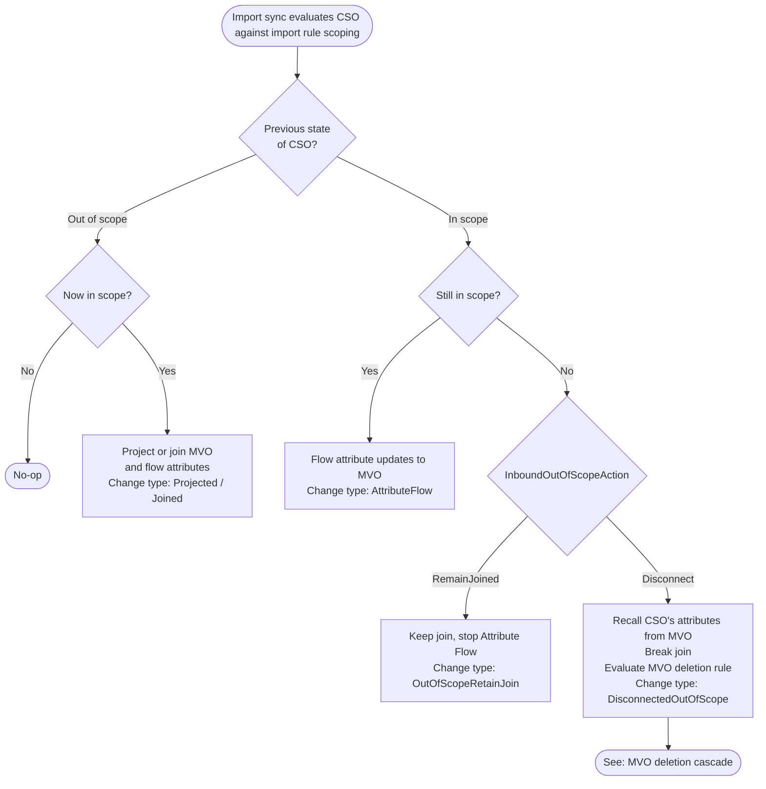
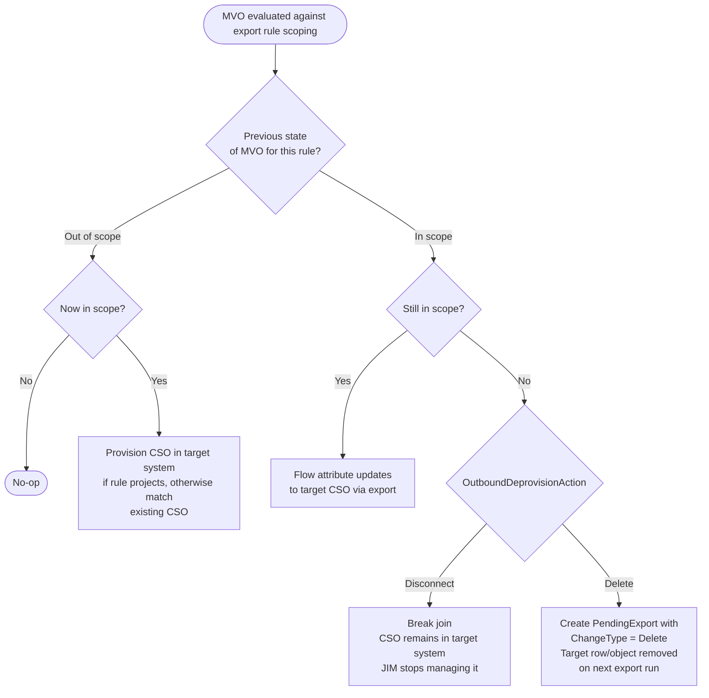
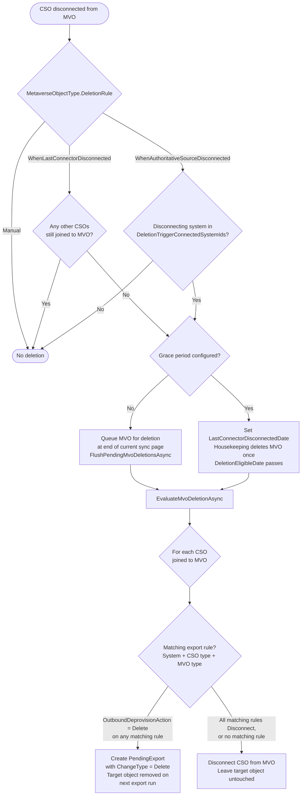
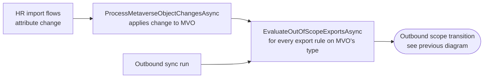

# Synchronisation Rule Scoping

| | |
|---|---|
| **Created** | 2026-04-23 |
| **Last Updated** | 2026-04-23 |
| **Status** | Active |

This document describes the behaviour of Synchronisation Rule scoping in JIM, the administrator-facing scenarios it supports, and how each scenario is realised in code.

## Business scenarios supported today

Scoping rules on a Synchronisation Rule determine which Connected System Objects (CSOs) or Metaverse Objects (MVOs) the rule applies to. Transitions in and out of scope drive the following business scenarios:

- **Onboarding**: a new CSO from an authoritative system (for example HR) enters scope of an import rule, causing the identity to be projected into the metaverse and subsequently provisioned into downstream systems by matching export rules.
- **Ongoing attribute updates**: CSOs and MVOs that remain in scope have their attribute changes flowed through the normal precedence logic.
- **Role or department change**: an attribute change to an MVO (typically flowed from HR) shifts the MVO in or out of scope of one or more export rules. Downstream systems gain or lose the account to match the new role, without any separate manual step.
- **Targeted access removal**: an MVO falls out of scope of an export rule because an administrator edits the rule, or because an attribute on the MVO changes. The matching downstream CSO is either disconnected or deleted depending on configuration.
- **Attribute contribution cut-off without breakage**: a CSO falls out of scope of an import rule, but the join to its MVO is preserved. The CSO no longer contributes attributes, but the historical linkage remains for audit, manual review, or a later back-in-scope transition.
- **Leaver cascade**: an authoritative source stops reporting an identity. The MVO's deletion rule triggers and every downstream CSO whose export rule's deprovisioning action is `Delete` is removed from its target system in a single coordinated pass.
- **Soft disconnect versus hard delete**: for both inbound and outbound deprovisioning, administrators choose whether "out of scope" means "break the link but leave the target object alone" (suitable for audit, legal hold, or shared accounts) or "remove the target object entirely".
- **Cross-system cascade in one pass**: an inbound attribute change can trigger an outbound deprovision in the same sync page. Administrators do not have to wait for a separate export run for the effect to propagate.

The rest of this document shows the specific code paths that realise these scenarios, grouped by direction.

## Configuration summary

| Property | Location | Values | Default |
|---|---|---|---|
| `SyncRule.InboundOutOfScopeAction` | Import rules | `Disconnect`, `RemainJoined` | `Disconnect` |
| `SyncRule.OutboundDeprovisionAction` | Export rules | `Disconnect`, `Delete` | `Disconnect` |
| `MetaverseObjectType.DeletionRule` | Metaverse Object Type | `Manual`, `WhenLastConnectorDisconnected`, `WhenAuthoritativeSourceDisconnected` | per type |
| `MetaverseObjectType.DeletionTriggerConnectedSystemIds` | Metaverse Object Type | Set of Connected System IDs | empty |
| `MetaverseObjectType.DeletionGracePeriod` | Metaverse Object Type | Timespan (nullable) | null (immediate) |

## Inbound (import rule) scope transitions

An import rule's scoping rules control whether a CSO contributes to the metaverse. The state machine below applies every time an import sync processes a CSO.

Relevant code:

- `src/JIM.Application/Servers/ScopingEvaluationServer.cs`: criterion evaluation (`IsCsoInScopeForImportRule`).
- `src/JIM.Worker/Processors/SyncTaskProcessorBase.cs`: `GetInScopeImportRulesAsync` (line 3050), the out-of-scope handler `HandleCsoOutOfScopeAsync` (line 3091).
- `src/JIM.Models/Enums/ObjectChangeType.cs`: `DisconnectedOutOfScope`, `OutOfScopeRetainJoin`.

## Outbound (export rule) scope transitions

An export rule's scoping rules control whether an MVO projects into a target Connected System. Re-evaluation happens in two places: inline during inbound sync when an MVO's attributes change, and during a normal export run.

Relevant code:

- `src/JIM.Application/Servers/ExportEvaluationServer.cs`: `EvaluateOutOfScopeExportsAsync` (line 180 non-cached, line 404 cached) and `HandleOutboundDeprovisioningAsync` (line 464).
- `src/JIM.Worker/Processors/SyncTaskProcessorBase.cs`: the call site at line 1364 that performs outbound re-evaluation during inbound sync.

## MVO deletion cascade

Triggered either by an import disconnection that satisfies the MVO type's deletion rule, or by a CSO going obsolete on an import run. The cascade is the mechanism by which a leaver in an authoritative system results in downstream accounts being removed.

Relevant code:

- `src/JIM.Worker/Processors/SyncTaskProcessorBase.cs`: `ProcessMvoDeletionRuleAsync` (line 836), `FlushPendingMvoDeletionsAsync` (line 2398).
- `src/JIM.Application/Servers/SyncEngine.cs`: `EvaluateMvoDeletionRule` (line 151).
- `src/JIM.Application/Servers/ExportEvaluationServer.cs`: `EvaluateMvoDeletionAsync` / `EvaluateMvoDeletionsAsync`. Deprovisioning is driven by each matching export Synchronisation Rule's `OutboundDeprovisionAction`, regardless of the CSO's `JoinType` ([issue #655](https://github.com/TetronIO/JIM/issues/655)); `Delete` wins when multiple matching rules disagree. This matches the out-of-scope cascade's behaviour.
- `src/JIM.Worker/Worker.cs`: line 596, the housekeeping entry point for grace-period deletions.

## Cross-system cascade

This is the integration point that lets inbound attribute changes take effect in downstream systems within the same sync page, without requiring a subsequent export run.

The inline call at `SyncTaskProcessorBase.cs:1364` is what makes "HR changes department, DB row removed in the same sync" work. Without it, the deprovision would be deferred to the next export run against the target Connected System.

## Relative date criteria

A DateTime scoping criterion can compare against a date resolved relative to "now" instead of a fixed value. The criterion stores `ValueMode = Relative` plus `RelativeCount` / `RelativeUnit` (Hours, Days, Weeks, Months, Years) / `RelativeDirection` (Ago, FromNow); the absolute `DateTimeValue` is unused in that mode.

`RelativeDateResolver.Resolve(count, unit, direction, nowUtc)` (`src/JIM.Models/Search/`) turns those fields into a concrete UTC boundary: FromNow adds and Ago subtracts; month/year arithmetic is calendar-correct (clamping short months); every unit except Hours is rounded down to midnight UTC (whole-day rounding), while Hours keeps instant precision. It is a pure function: the caller supplies `nowUtc` so the boundary is deterministic and resolved once per evaluation pass.

`ScopingEvaluationServer` resolves "now" once at the top of `IsMvoInScopeForExportRule` / `IsCsoInScopeForImportRule` (injectable for tests) and feeds the resolved boundary into the existing `EvaluateDateTimeComparison`. A relative criterion never matches an object with no value for the attribute. The predefined-search query translator resolves the boundary to a literal before building the SQL predicate, so the per-column DateTime index stays usable.

Worked examples (export rule on a Person's termination-date attribute):

- **Leavers terminated within the last year**: an `All` group with the date attribute *on or before* `30 days ago` (`LessThanOrEquals`, 30 Days Ago) and *after* `364 days ago` (`GreaterThan`, 364 Days Ago). The window slides forward on every run.
- **Accounts expiring soon**: `AccountExpiry` *on or before* `7 days from now` (`LessThanOrEquals`, 7 Days FromNow) scopes in objects due to expire within the coming week.

## What scoping does not do today

The following behaviours are out of scope for the current implementation. They are captured here for administrators planning deployments and for future design work.

- **Cascade back to the source Connected System**: an outbound deprovision does not trigger a write back to the originating system. This is intentional to prevent circular exports.
- **End-to-end integration test coverage of the full scope transition matrix**: individual transitions are covered by unit tests, but no single integration scenario exercises every combination against a running stack. Tracked in [issue #656](https://github.com/TetronIO/JIM/issues/656).

## References

- Models: `src/JIM.Models/Logic/SyncRule.cs`, `src/JIM.Models/Core/CoreEnums.cs`, `src/JIM.Models/Enums/ObjectChangeType.cs`.
- Inbound flow: `src/JIM.Worker/Processors/SyncTaskProcessorBase.cs`, `src/JIM.Application/Servers/ScopingEvaluationServer.cs`.
- Outbound flow: `src/JIM.Application/Servers/ExportEvaluationServer.cs`.
- Deletion rule evaluation: `src/JIM.Application/Servers/SyncEngine.cs`.
- Tests: `test/JIM.Worker.Tests/Synchronisation/ScopingEvaluationTests.cs`, `OutOfScopeChangeTypeTests.cs`, `test/JIM.Worker.Tests/SyncEngineTests/SyncEngineOutOfScopeTests.cs`, `DeletionRuleWorkflowTests.cs`, `test/JIM.Worker.Tests/ExportEvaluationTests.cs`.
