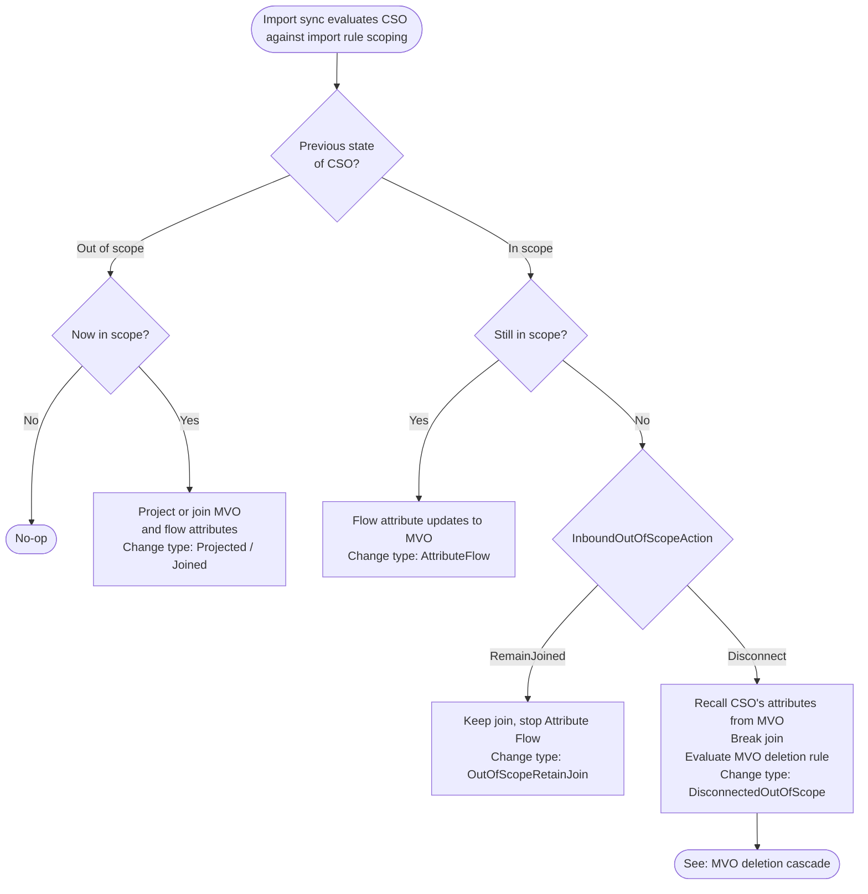
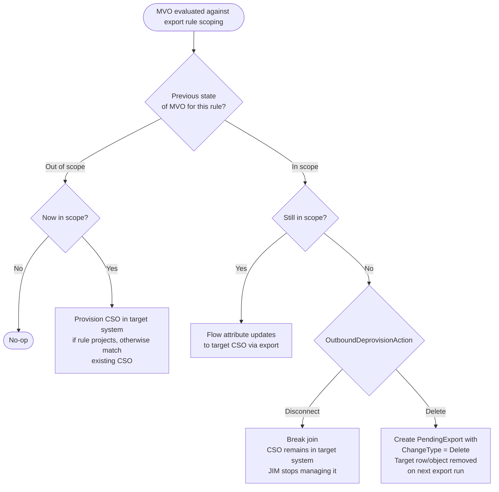
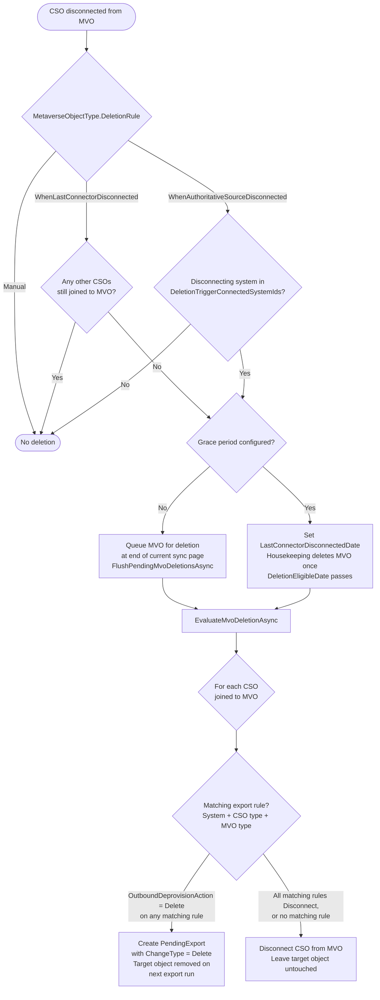
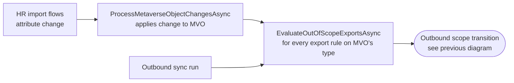

# Synchronisation Rule Scoping

| | |
|---|---|
| **Created** | 2026-04-23 |
| **Last Updated** | 2026-10-05 |
| **Status** | Active |

This document describes the behaviour of Synchronisation Rule scoping in JIM, the administrator-facing scenarios it supports, and how each scenario is realised in code.

## Business scenarios supported today

Scoping rules on a Synchronisation Rule determine which Connected System Objects (CSOs) or Metaverse Objects (MVOs) the rule applies to. Transitions in and out of scope drive the following business scenarios:

- **Onboarding**: a new CSO from an authoritative system (for example HR) enters scope of an import rule, causing the identity to be projected into the metaverse and subsequently provisioned into downstream systems by matching export rules.
- **Ongoing attribute updates**: CSOs and MVOs that remain in scope have their attribute changes flowed through the normal precedence logic.
- **Role or department change**: an attribute change to an MVO (typically flowed from HR) shifts the MVO in or out of scope of one or more export rules. Downstream systems gain or lose the account to match the new role, without any separate manual step.
- **Targeted access removal**: an MVO falls out of scope of an export rule because an administrator edits the rule, or because an attribute on the MVO changes. The matching downstream CSO is either disconnected or deleted depending on configuration.
- **Attribute contribution cut-off without breakage**: a CSO falls out of scope of an import rule, but the join to its MVO is preserved. The CSO no longer contributes attributes, but the historical linkage remains for audit, manual review, or a later back-in-scope transition.
- **Leaver cascade**: an authoritative source stops reporting an identity. The MVO's deletion rule triggers and every downstream CSO whose export rule's deprovisioning action is `Delete` is removed from its target system in a single coordinated pass.
- **Soft disconnect versus hard delete**: for both inbound and outbound deprovisioning, administrators choose whether "out of scope" means "break the link but leave the target object alone" (suitable for audit, legal hold, or shared accounts) or "remove the target object entirely".
- **Cross-system cascade in one pass**: an inbound attribute change can trigger an outbound deprovision in the same sync page. Administrators do not have to wait for a separate export run for the effect to propagate.

The rest of this document shows the specific code paths that realise these scenarios, grouped by direction.

## Configuration summary

| Property | Location | Values | Default |
|---|---|---|---|
| `SyncRule.InboundOutOfScopeAction` | Import rules | `Disconnect`, `RemainJoined` | `Disconnect` |
| `SyncRule.OutboundDeprovisionAction` | Export rules | `Disconnect`, `Delete` | `Disconnect` |
| `MetaverseObjectType.DeletionRule` | Metaverse Object Type | `Manual`, `WhenLastConnectorDisconnected`, `WhenAuthoritativeSourceDisconnected` | per type |
| `MetaverseObjectType.DeletionTriggerConnectedSystemIds` | Metaverse Object Type | Set of Connected System IDs | empty |
| `MetaverseObjectType.DeletionGracePeriod` | Metaverse Object Type | Timespan (nullable) | null (immediate) |

## Inbound (import rule) scope transitions

An import rule's scoping rules control whether a CSO contributes to the metaverse. The state machine below applies every time an import sync processes a CSO.

```mermaid
flowchart TD
    Start([Import sync evaluates CSO against import rule scoping]) --> Prev{Previous state<br/>of CSO?}

    Prev -->|Out of scope| OutNow{Now in scope?}
    OutNow -->|No| NoOpOut([No-op])
    OutNow -->|Yes| ProjectJoin[Project or join MVO<br/>and flow attributes<br/>Change type: Projected / Joined]

    Prev -->|In scope| InNow{Still in scope?}
    InNow -->|Yes| FlowUpdate[Flow attribute updates to MVO<br/>Change type: AttributeFlow]
    InNow -->|No| OutAction{InboundOutOfScopeAction}

    OutAction -->|RemainJoined| Retain[Keep join, stop Attribute Flow<br/>Change type: OutOfScopeRetainJoin]
    OutAction -->|Disconnect| Disconnect[Recall CSO's attributes from MVO<br/>Break join<br/>Evaluate MVO deletion rule<br/>Change type: DisconnectedOutOfScope]

    Disconnect --> MvoDeletion([See: MVO deletion cascade])
```

Relevant code:

- `src/JIM.Application/Servers/ScopingEvaluationServer.cs`: criterion evaluation (`IsCsoInScopeForImportRule`).
- `src/JIM.Worker/Processors/SyncTaskProcessorBase.cs`: `GetInScopeImportRulesAsync` (line 3050), the out-of-scope handler `HandleCsoOutOfScopeAsync` (line 3091).
- `src/JIM.Models/Enums/ObjectChangeType.cs`: `DisconnectedOutOfScope`, `OutOfScopeRetainJoin`.

## Outbound (export rule) scope transitions

An export rule's scoping rules control whether an MVO projects into a target Connected System. Re-evaluation happens in two places: inline during inbound sync when an MVO's attributes change, and during a normal export run.

```mermaid
flowchart TD
    Start([MVO evaluated against export rule scoping]) --> Prev{Previous state<br/>of MVO for this rule?}

    Prev -->|Out of scope| OutNow{Now in scope?}
    OutNow -->|No| NoOpOut([No-op])
    OutNow -->|Yes| Provision[Provision CSO in target system<br/>if rule projects, otherwise match<br/>existing CSO]

    Prev -->|In scope| InNow{Still in scope?}
    InNow -->|Yes| FlowExport[Flow attribute updates<br/>to target CSO via export]
    InNow -->|No| OutAction{OutboundDeprovisionAction}

    OutAction -->|Disconnect| SoftDisconnect[Break join<br/>CSO remains in target system<br/>JIM stops managing it]
    OutAction -->|Delete| HardDelete[Create PendingExport with<br/>ChangeType = Delete<br/>Target row/object removed<br/>on next export run]
```

Relevant code:

- `src/JIM.Application/Servers/ExportEvaluationServer.cs`: `EvaluateOutOfScopeExportsAsync` (line 180 non-cached, line 404 cached) and `HandleOutboundDeprovisioningAsync` (line 464).
- `src/JIM.Worker/Processors/SyncTaskProcessorBase.cs`: the call site at line 1364 that performs outbound re-evaluation during inbound sync.

## MVO deletion cascade

Triggered either by an import disconnection that satisfies the MVO type's deletion rule, or by a CSO going obsolete on an import run. The cascade is the mechanism by which a leaver in an authoritative system results in downstream accounts being removed.

```mermaid
flowchart TD
    Start([CSO disconnected from MVO]) --> Rule{MetaverseObjectType.DeletionRule}

    Rule -->|Manual| NoDelete([No deletion])
    Rule -->|WhenLastConnectorDisconnected| LastCheck{Any other CSOs<br/>still joined to MVO?}
    Rule -->|WhenAuthoritativeSourceDisconnected| AuthCheck{Disconnecting system in<br/>DeletionTriggerConnectedSystemIds?}

    LastCheck -->|Yes| NoDelete
    LastCheck -->|No| Grace{Grace period configured?}
    AuthCheck -->|No| NoDelete
    AuthCheck -->|Yes| Grace

    Grace -->|No| Immediate[Queue MVO for deletion<br/>at end of current sync page<br/>FlushPendingMvoDeletionsAsync]
    Grace -->|Yes| Deferred[Set LastConnectorDisconnectedDate<br/>Housekeeping deletes MVO once<br/>DeletionEligibleDate passes]

    Immediate --> Evaluate[EvaluateMvoDeletionAsync]
    Deferred --> Evaluate

    Evaluate --> PerCso{For each CSO<br/>joined to MVO}
    PerCso --> Match{Matching export rule?<br/>System + CSO type + MVO type}
    Match -->|OutboundDeprovisionAction = Delete<br/>on any matching rule| CreateDelete[Create PendingExport<br/>with ChangeType = Delete<br/>Target object removed on<br/>next export run]
    Match -->|All matching rules Disconnect,<br/>or no matching rule| DisconnectOnly[Disconnect CSO from MVO<br/>Leave target object untouched]
```

Relevant code:

- `src/JIM.Worker/Processors/SyncTaskProcessorBase.cs`: `ProcessMvoDeletionRuleAsync` (line 836), `FlushPendingMvoDeletionsAsync` (line 2398).
- `src/JIM.Application/Servers/SyncEngine.cs`: `EvaluateMvoDeletionRule` (line 151).
- `src/JIM.Application/Servers/ExportEvaluationServer.cs`: `EvaluateMvoDeletionAsync` / `EvaluateMvoDeletionsAsync`. Deprovisioning is driven by each matching export Synchronisation Rule's `OutboundDeprovisionAction`, regardless of the CSO's `JoinType` ([issue #655](https://github.com/TetronIO/JIM/issues/655)); `Delete` wins when multiple matching rules disagree. This matches the out-of-scope cascade's behaviour.
- `src/JIM.Worker/Worker.cs`: line 596, the housekeeping entry point for grace-period deletions.

## Cross-system cascade

This is the integration point that lets inbound attribute changes take effect in downstream systems within the same sync page, without requiring a subsequent export run.

```mermaid
flowchart LR
    HR[HR import flows<br/>attribute change] --> Process[ProcessMetaverseObjectChangesAsync<br/>applies change to MVO]
    Process --> Eval[EvaluateOutOfScopeExportsAsync<br/>for every export rule on MVO's type]
    Eval --> Outbound([Outbound scope transition<br/>see previous diagram])

    Export[Outbound sync run] --> Eval
```

The inline call at `SyncTaskProcessorBase.cs:1364` is what makes "HR changes department, DB row removed in the same sync" work. Without it, the deprovision would be deferred to the next export run against the target Connected System.

## Relative date criteria

A DateTime scoping criterion can compare against a date resolved relative to "now" instead of a fixed value. The criterion stores `ValueMode = Relative` plus `RelativeCount` / `RelativeUnit` (Hours, Days, Weeks, Months, Years) / `RelativeDirection` (Ago, FromNow); the absolute `DateTimeValue` is unused in that mode.

`RelativeDateResolver.Resolve(count, unit, direction, nowUtc)` (`src/JIM.Models/Search/`) turns those fields into a concrete UTC boundary: FromNow adds and Ago subtracts; month/year arithmetic is calendar-correct (clamping short months); every unit except Hours is rounded down to midnight UTC (whole-day rounding), while Hours keeps instant precision. It is a pure function: the caller supplies `nowUtc` so the boundary is deterministic and resolved once per evaluation pass.

`ScopingEvaluationServer` resolves "now" once at the top of `IsMvoInScopeForExportRule` / `IsCsoInScopeForImportRule` (injectable for tests) and the shared evaluator compares against the resolved boundary (see Evaluation and explanations below). A relative criterion never matches an object with no value for the attribute. The predefined-search query translator resolves the boundary to a literal before building the SQL predicate, so the per-column DateTime index stays usable.

Worked examples (export rule on a Person's termination-date attribute):

- **Leavers terminated within the last year**: an `All` group with the date attribute *on or before* `30 days ago` (`LessThanOrEquals`, 30 Days Ago) and *after* `364 days ago` (`GreaterThan`, 364 Days Ago). The window slides forward on every run.
- **Accounts expiring soon**: `AccountExpiry` *on or before* `7 days from now` (`LessThanOrEquals`, 7 Days FromNow) scopes in objects due to expire within the coming week.

## Criteria groups and loading

A rule's criteria are a tree: top-level groups (ORed together; the rule is in scope if any top-level group is met), each an `All` or `Any` group of criteria and child groups, nested to any depth. An empty group counts as met, and a rule with no groups is in scope.

Because an empty group counts as met, a group that fails to load silently widens the rule's scope, so loading the whole tree is a synchronisation integrity requirement, not a convenience. Include chains cannot express "every level", so every repository path that reads a rule's tree goes through `SyncRuleScopingTreeLoader` (`src/JIM.PostgresData/Repositories/`): `LoadAsync` completes rules' trees (tracked or untracked, matching the rules), and `GetCriterionOwnershipAsync` resolves criteria at any depth to their owning rule for reference queries (configuration drift scope, the attribute-in-use check). Only top-level groups carry the rule id; deeper groups carry only `ParentGroupId`, so the loader walks the tree level by level. Do not add scoping-group `Include`s to a rule loader; call the loader. `SyncRuleScopingDepthDatabaseTests` guards every path against real PostgreSQL. (Before #348's prerequisite fix, the loaders included two levels, so deeper groups were ignored at evaluation and dropped from the editor.)

## Evaluation and explanations

There is one implementation of scoping evaluation: `ScopingEvaluator` (`src/JIM.Application/Servers/Scoping/`). `ScopingEvaluationServer.IsMvoInScopeForExportRule` / `IsCsoInScopeForImportRule`, which every synchronisation path calls, and `ExplainMvoForExportRule` / `ExplainCsoForImportRule`, which tell an administrator why an object is or is not in scope (#348), are thin wrappers over it, so an explanation always reports the outcome synchronisation reaches. Its semantics:

- Top-level groups are ORed, and synchronisation stops at the first one met. Within a group every child is evaluated (no short-circuit), then `All` or `Any` applies; an empty group is met.
- A missing value (no row, or a Metaverse asserted-null marker, #91) fails every comparison except Equals against an all-empty absolute criterion.
- Only an attribute's first value is compared ([#1923](https://github.com/TetronIO/JIM/issues/1923)).
- An operator invalid for the attribute's type throws `InvalidOperationException` when synchronisation reaches it (defence in depth behind the write path's validation).

The evaluator reads objects through a struct value source (`MvoScopingValueSource`, `CsoScopingValueSource`) under a generic constraint, so there is no boxing or interface dispatch, and builds an explanation tree only when one is asked for: the boolean path allocates nothing per evaluation (`ScopingExplanationTests` guards this; it previously cost a list per group and a closure per criterion). In explain mode an invalid criterion is recorded as `Invalid` rather than thrown, every top-level group is evaluated so the whole tree can be shown, and the rule outcome is still the one synchronisation would reach: `Undetermined` only where synchronisation would reach the invalid criterion before a met group, `InScope` where it stops at an earlier met group.

An explanation (`ScopingExplanation`, `src/JIM.Models/Logic/Scoping/`) records each group's outcome, met count and child count, and each criterion's attribute, comparison, expected value (a relative date's resolved boundary too), the value compared, how many further values went uncompared, and an outcome (Met, Not met, No value, Attribute missing, Invalid). Nodes carry a one-based dot path (`1.3.2`), criteria counted before child groups as the evaluator takes them. Values are rendered culture-invariantly (dates in UTC, `4 Oct 2026` at midnight, `4 Oct 2026 10:41 UTC` otherwise). Values of credential attributes are withheld: names on `CredentialAttributes`' denylist always, and credential-like names on text or binary attributes (a date such as `pwdLastSet` cannot hold a credential, and its value is often why a rule scopes someone out). `ScopingExplanationTests` compares the two modes across every operator, data type and value state, relative dates, trees to depth four, and a few thousand seeded random trees, on both sides.

`ScopingExplanationSummariser` turns an explanation into words, once, on the server: the one-line hint ("Fails on Department; Cost Centre or Job Title"), the "To come into scope" bullets, a copyable plain-text summary and the tree's line descriptions. It words comparisons with the criteria editors' labels (`SearchComparisonOperators.LabelFor`), so the editor and the explanation never disagree on how a comparison reads.

### Connection explanations

`MetaverseServer.GetMetaverseObjectConnectionExplanationsAsync` (`MetaverseServer.ConnectionExplanations.cs`) answers "why is this Metaverse Object connected where it is, and why not elsewhere" for the portal's Connections tab, `GET metaverse/objects/{id}/connections` and `Get-JIMMetaverseObjectConnection`, which all show its words unchanged. It makes seven reads whatever the number of rules, criteria or connections (the header, the joined objects, the type's enabled rules with their trees through `SyncRuleScopingTreeLoader`, the joined objects' Pending Exports, the criteria attributes' values on each side, and the join history), then evaluates everything in memory at one instant, so relative dates resolve identically throughout.

- **Joined connections** carry the join record, the explanation of every relevant enabled rule (import rules against the Connected System Object for a source, export rules against the Metaverse Object for a target), and any Object Type conflict (another export rule on the same Connected System for a different object type, detected by `SyncEngine.DetectExportObjectTypeConflict`).
- **Not connected entries** cover each enabled export rule whose Connected System holds no joined object (Connected Systems being deleted are excluded; disabled ones are included and say so). The reason follows from the explanation: `Undetermined` is Rule misconfigured, `OutOfScope` is Not in scope, and an in-scope object is Not yet provisioned when the rule provisions or Rule doesn't provision when it does not. A Not yet provisioned entry reads the object's `ScopeReviewPending` flag (carried on `MetaverseObjectHeader`, so no extra read): when set, the next synchronisation's export scope review stages the provisioning ([#1925](https://github.com/TetronIO/JIM/issues/1925)); when not, nothing stages it until the object's values change or the rule is saved with a scope-widening change. Provisioning under way is a joined row, never an entry.

The join record is durable: `ConnectedSystemObject.RecordJoin` stores how the join was made (`JoinMethod`: Projection, Provisioning, InboundMatching, ExportMatching), the Synchronisation Rule responsible and a snapshot of its name at the four join sites, and `ClearJoinRecord` clears them wherever a join is broken; deleting the rule nulls the reference and keeps the name. Inbound matching on a Connected System's own Object Matching Rules records the method with no rule, which is what tells it apart from a join made before recording began. For those older joins the method and rule are derived from Activity history, accepted only from an Activity that was running when the object joined, and marked as derived; with neither, the record says it was not recorded. Recording adds no read to synchronisation: the columns ride the existing raw-SQL CSO writes (`CsoBulkColumns`), each covered by a `RequiresPostgres` round-trip test.

## What scoping does not do today

The following behaviours are out of scope for the current implementation. They are captured here for administrators planning deployments and for future design work.

- **Cascade back to the source Connected System**: an outbound deprovision does not trigger a write back to the originating system. This is intentional to prevent circular exports.
- **End-to-end integration test coverage of the full scope transition matrix**: individual transitions are covered by unit tests, but no single integration scenario exercises every combination against a running stack. Tracked in [issue #656](https://github.com/TetronIO/JIM/issues/656).

## References

- Models: `src/JIM.Models/Logic/SyncRule.cs`, `src/JIM.Models/Core/CoreEnums.cs`, `src/JIM.Models/Enums/ObjectChangeType.cs`.
- Inbound flow: `src/JIM.Worker/Processors/SyncTaskProcessorBase.cs`, `src/JIM.Application/Servers/ScopingEvaluationServer.cs`.
- Outbound flow: `src/JIM.Application/Servers/ExportEvaluationServer.cs`.
- Deletion rule evaluation: `src/JIM.Application/Servers/SyncEngine.cs`.
- Evaluation and explanations: `src/JIM.Application/Servers/Scoping/ScopingEvaluator.cs`, `src/JIM.Models/Logic/Scoping/`.
- Tests: `test/JIM.Worker.Tests/Synchronisation/ScopingEvaluationTests.cs`, `ScopingExplanationTests.cs`, `OutOfScopeChangeTypeTests.cs`, `test/JIM.Worker.Tests/SyncEngineTests/SyncEngineOutOfScopeTests.cs`, `DeletionRuleWorkflowTests.cs`, `test/JIM.Worker.Tests/ExportEvaluationTests.cs`.
