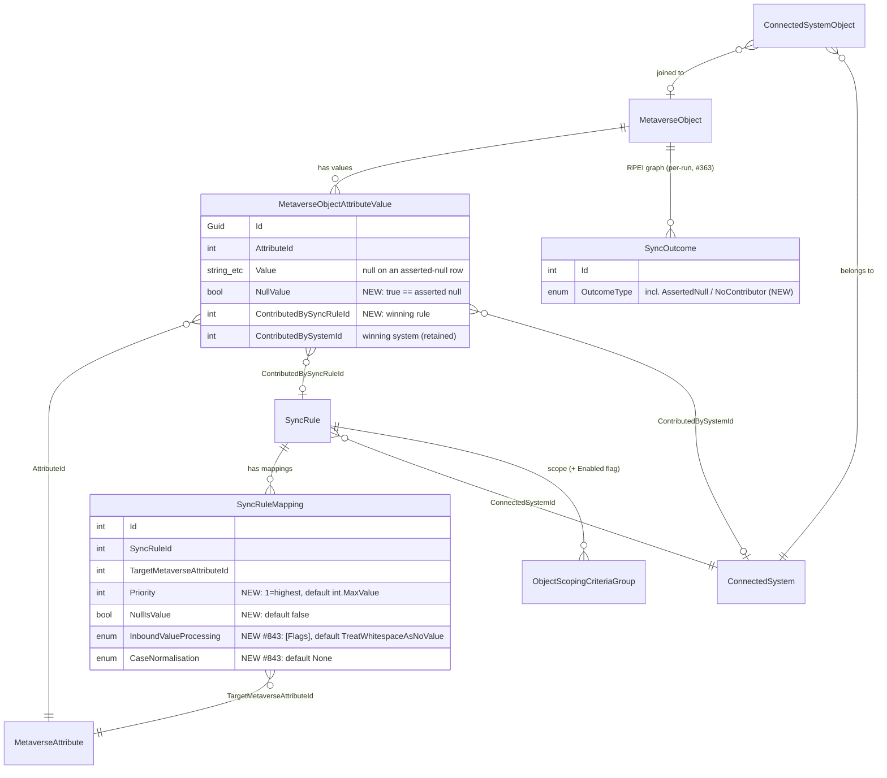
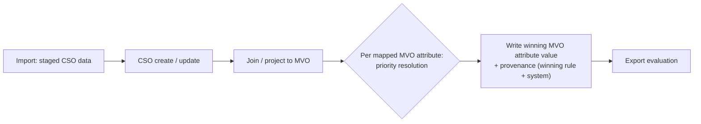
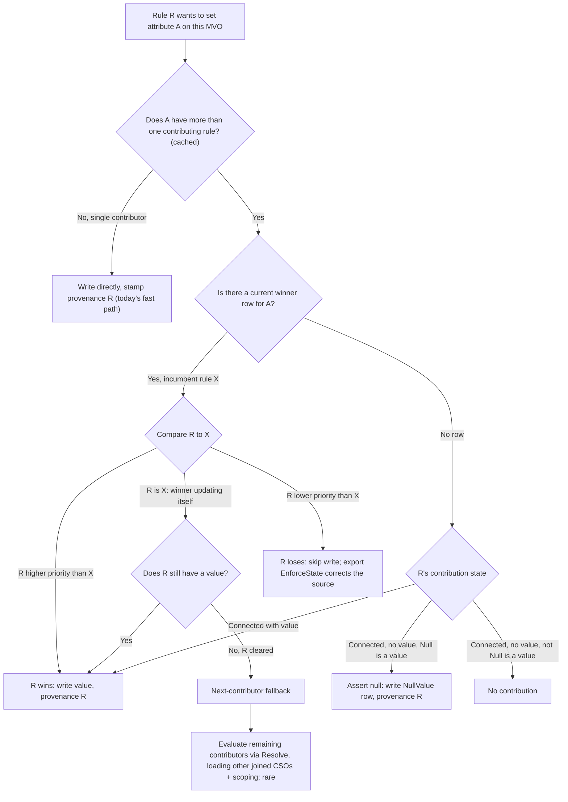
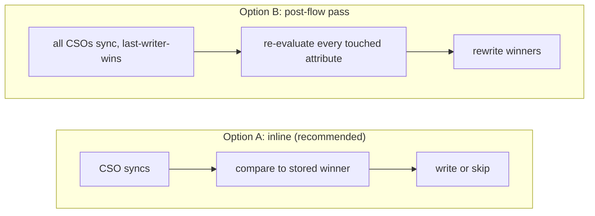

# Attribute Priority Design Document

- **Status:** Doing (Phase 1 schema/model/API landed; Phase 2 engine design proposed, awaiting approval; UI deferred)
- **Issue:** [#91](https://github.com/TetronIO/JIM/issues/91)
- **Last Updated**: 2026-06-26

## Overview

This document defines the design for **Attribute Priority** (inbound sync): how JIM determines which source "wins" when multiple systems contribute to the same MVO attribute.

> **Related design:** [DRIFT_DETECTION.md](../done/DRIFT_DETECTION.md) (shipped) covers the outbound-sync concern of detecting and correcting unauthorised changes in target systems. The two were originally specified together because drift detection needs to know whether a system is a legitimate contributor to an attribute (has import rules) or just a recipient (only has export rules). Drift detection shipped first using a coarse contributor check (`HasImportRuleForAttribute`); attribute priority refines that check into a priority-aware version (see "Interaction with Drift Detection" below).

---

## Table of Contents

1. [Problem Statement](#problem-statement)
2. [Attribute Priority](#attribute-priority)
3. [Design](#design)
4. [Implementation Plan](#implementation-plan)
5. [Open Questions](#open-questions)

---

## Problem Statement

When multiple connected systems import values for the same MVO attribute, we need a deterministic way to decide which value wins.

**Example scenario:**
- HR System imports `department` with value "Engineering"
- Corporate Directory imports `department` with value "IT Services"
- Which value should the MVO have?

Without explicit priority, the result depends on sync execution order - unpredictable and error-prone.

**Traditional ILM limitation:**
Many identity management systems use fallback logic where if the top-priority source doesn't provide a value, the system automatically falls back to the next source. This is problematic when you want to **assert null** - i.e., explicitly say "this attribute should have no value" from the authoritative source, without falling back to a secondary source.

---

## Attribute Priority

> **Scope**: Attribute priority is an **inbound sync** concern - it determines which source system's value wins when multiple systems contribute to the same MVO attribute. This is distinct from drift detection, which is an **outbound sync** concern (see [DRIFT_DETECTION.md](../done/DRIFT_DETECTION.md)).

### Current State

**Existing Infrastructure:**
- `ContributedBySystem` navigation property exists on `MetaverseObjectAttributeValue` ([MetaverseObjectAttributeValue.cs:45](../src/JIM.Models/Core/MetaverseObjectAttributeValue.cs#L45)) - tracks which connected system contributed each attribute value
- `ContributedBySystemId` scalar FK (added Feb 2026, commit `41116255`); explicit `int?` property that avoids the need to `.Include(ContributedBySystem)`. All 14 attribute creation paths in the inbound attribute-flow engine (`SyncEngine.AttributeFlow.cs`, formerly `SyncRuleMappingProcessor`) now set this scalar FK via a `contributingSystemId` parameter. Recall logic in `SyncTaskProcessorBase` uses the scalar FK directly (`av.ContributedBySystemId == connectedSystemId`).

**Current Behaviour (Temporary):**
The inbound attribute-flow engine ([SyncEngine.AttributeFlow.cs#L53](../src/JIM.Application/Servers/SyncEngine.AttributeFlow.cs#L53)) applies every mapping in source order with no priority resolution yet: when multiple mappings target the same MVO attribute, the last one processed wins.

This "last-writer-wins" behaviour is intentionally temporary and will be replaced by proper priority resolution.

**Known Limitation (Feb 2026):** When attributes are recalled (CSO obsoleted with `RemoveContributedAttributesOnObsoletion=true`), the system does not attempt to find an alternative contributor from another connected system with inbound attribute flow for the same MVO attribute. This requires the attribute priority infrastructure (Issue #91).

**Interim mitigation (implemented):** Attribute recall is skipped entirely when the MVO type has a deletion grace period configured (`SyncTaskProcessorBase`); the MVO retains its attribute values during the grace period and the Delete export fires on expiry. Without a grace period, recalled attributes are still simply cleared. Proper next-contributor fallback remains gated on attribute priority.

### The Problem

When multiple connected systems import values for the same MVO attribute, we need a deterministic way to decide which value wins.

**Example scenario:**
- HR System imports `department` with value "Engineering"
- Corporate Directory imports `department` with value "IT Services"
- Which value should the MVO have?

Without explicit priority, the result depends on sync execution order - unpredictable and error-prone.

**Traditional ILM limitation:**
Many identity management systems use fallback logic where if the top-priority source doesn't provide a value, the system automatically falls back to the next source. This is problematic when you want to **assert null** - i.e., explicitly say "this attribute should have no value" from the authoritative source, without falling back to a secondary source.

---

### Design Options Considered

#### Option A: System-Level Priority Ranking

Each connected system has a **priority number** (1 = highest). For any MVO attribute, the highest-priority source that provides a value wins.

**Pros:** Simple mental model, system-wide
**Cons:** Too coarse - can't have different priorities per attribute on the same system. Ruled out.

---

#### Option B: Per-Attribute Numerical Priority

Each import attribute flow has a **numerical priority** for that specific MVO attribute. When multiple systems contribute to the same attribute, evaluate in priority order.

**Design intent:** Similar to traditional attribute precedence systems, but with additional control over null handling.

---

#### Option C: Attribute Ownership Model

Each MVO attribute has **one owner** (connected system). Only the owner can update it.

**Pros:** Crystal clear - no conflicts possible
**Cons:** Too inflexible - doesn't support fallback scenarios or staged configuration changes. Ruled out.

---

#### Option D: Equal Precedence

Multiple systems contribute on an equal footing; last writer wins.

**Cons:** Non-deterministic in practice; the traditional ILM workaround for dual-authority scenarios that this design exists to avoid. Real deployments evidence odd behaviours such as some objects not updating from the system that should own them. **Explicitly rejected; JIM will not offer it.** Scoped sync rules at distinct priorities express every dual-authority scenario equal precedence is used for, deterministically (see "Fine-Grained Authority via Scoped Sync Rules" below).

---

### Decision: Option B - Per-Attribute Numerical Priority ✓

> **Status**: DESIGN APPROVED - Implementation deferred

**User stories (draft; needs consolidation):** as a synchronisation administrator:

- I want to priority-order the list of sync rules that have import attribute flow to a Metaverse attribute, so that multi-source contribution is deterministic.
- I want the engine to select the highest-priority rule that can contribute (enabled, joined, in scope) and use the result of that rule's attribute flow.
- I want a rule to be able to assert null/no-value for the population it covers ("Null is a value"), so that authoritative absence propagates downstream instead of being back-filled.
- I want one system to be authoritative for most objects and another system authoritative for a defined subset of objects (differently-scoped rules at different priorities), without resorting to equal-precedence semantics.
- I want disabled sync rules to remain visible in the priority list (greyed out, never contributing) so the ordering stays stable while I stage configuration changes.
- I want to see, for any MVO attribute value, which sync rule/system currently contributes it, so I can troubleshoot "where did this value come from?".

**Core Design:**

1. **Numerical priority per attribute contribution** - Each import sync rule mapping that targets an MVO attribute has a priority number (1 = highest priority, larger numbers = lower priority). The priority list for an MVO attribute is therefore a list of **sync rules** (one entry per rule with a mapping flowing to that attribute). A connected system may appear multiple times in the list via differently-scoped rules; this is what enables fine-grained authority (see below).

2. **Default behaviour (fallback chain)** - Evaluate contributions in priority order; use the first rule that yields a value

3. **Advanced option: "Null is a value"** - When enabled on a specific contribution, if that rule's system is *connected to the MVO and in scope of the rule* but contributes null/absent, stop evaluation immediately (no fallback). This allows explicitly asserting "no value" from the authoritative source. If the rule is **not applicable** (`RuleNotApplicable`, informally "no opinion": disabled, no joined CSO, or CSO out of scope), it is skipped and evaluation continues to the next priority regardless of this flag; see "Contribution States" in the Design section. The flag is incoherent without that distinction.

4. **Multivalued attributes: fully supported from phase 1, with winner-takes-all-values semantics** - The winning rule contributes the *entire* value set of an MVA; losing rules contribute nothing. "Connected, no value" for an MVA means the empty set, so "Null is a value" asserts an empty set (e.g. a group with no members). SVAs and MVAs are resolved by the same priority list with no extra configuration or UI. An additional per-value *merge* mode is deferred to a second iteration; see "Multivalued Attribute Handling: Options Explored" below.

**The four factors of contribution.** Whether a priority list entry contributes to an MVO attribute is determined by:

1. **Sync rule scope**: is a CSO in scope of an *enabled* sync rule that has inbound attribute flow to the MVO attribute in question?
2. **Null handling**: is "Null is a value" set on this entry in the attribute priority list?
3. **Connection**: is a CSO from that rule's connected system joined to the MVO being evaluated?
4. **Priority**: what is the rule's position in the attribute priority list?

**Example Configuration:**

```
MVO Attribute: department (Person)
+--------------------------------------------------------------------------+
| Priority | Sync Rule               | Connected System | Null Handling    |
+----------+-------------------------+------------------+------------------+
|    1     | HR People Inbound       | HR System        | [x] Null=Value   |
|    2     | CorpDir People Inbound  | Corporate Dir    | [ ] Null=Value   |
|    3     | AD Self-Service Inbound | Self-Service AD  | [ ] Null=Value   |
+----------+-------------------------+------------------+------------------+
```

**Behaviour with above configuration:**
- If HR System provides "Engineering" -> MVO gets "Engineering" (priority 1 wins)
- If HR System provides null and "Null is a value" is checked -> MVO gets null (no fallback)
- If HR System provides null and "Null is a value" is unchecked -> check Corporate Dir (priority 2)
- If Corporate Dir provides "IT Services" -> MVO gets "IT Services"
- And so on down the chain...
- If HR System has **no opinion** for this MVO (rule disabled, no joined CSO, or CSO out of the rule's scope), it is skipped entirely ("Null is a value" irrelevant) and Corporate Dir is evaluated

**Motivating scenarios for "Null is a value":**

The semantic gap it fills: a ranked precedence list cannot distinguish *"the authoritative source knows this object and says it has no value"* from *"the authoritative source doesn't know this object"*. Plain fall-through treats both as "no contribution, ask the next source".

1. **Clears must propagate (stale value resurrection)**: a manager leaves and HR clears `manager`; a lower-priority directory still holds the old manager. With plain fall-through the metaverse keeps the old manager, and everything driven by it (manager-based approvals, dynamic groups) keeps operating against the wrong person. Same shape for `department`/cost centre cleared during a reorg. Traditional ILM solutions needed custom rules extensions and sentinel-value hacks to express this.
2. **Fallback for one population, exclusivity for another, in one configuration**: a secondary system must stay in the priority list because it is the only source for objects the primary doesn't manage, but for primary-managed objects, blank-in-primary must mean blank. See the worked migration example below.
3. **Data minimisation / compliance**: personal data removed at the authoritative source must propagate as a removal everywhere, not be re-sourced from a secondary copy and republished indefinitely.
4. **Disconnect/leaver semantics**: combined with attribute recall, when the authoritative CSO obsoletes with "Null is a value", the attribute is asserted null instead of being reanimated by a secondary source.

> **Blast radius (motivates a separate Guardrails capability):** "Null is a value" amplifies blast radius: a misbehaving priority-1 import (truncated file, empty delta) becomes a mass attribute-clearing event rather than a harmless no-op. This is **not** mitigated inside attribute priority; it is one motivating case for a holistic **Guardrails** capability (per-run mass-change thresholds across clears, updates, deletes, and exports, with warn/halt/confirm), tracked as #846 and deliberately out of scope here.

**Worked example 1 (HR system migration; null assertion + fallback):**

An MVO object type has three connected systems: **AD** (target), **HR 1** (new HR system, priority 1, "Null is a value" on its mappings), **HR 2** (legacy HR system, priority 2). Both HR systems may project to the MV; most people exist in HR 2, and some have not yet been migrated to HR 1.

- **Person in HR 1**: HR 1 is connected, so it is always authoritative. `department = null` on the HR 1 CSO is asserted into the MV and flows to AD as a clear; HR 2 can never contribute for this person.
- **Person only in HR 2**: HR 1 has *no opinion* for this MVO, so evaluation skips HR 1 entirely (regardless of "Null is a value") and HR 2 contributes full attribute flow.

Without the no-opinion distinction, "Null is a value" on HR 1 would block HR 2 from ever contributing, making HR 2's inbound flow pointless. With it, one priority list serves both populations.

> **Migration note:** the day a person is added to HR 1, the new join flips HR 1 from no-opinion to connected, and HR 1's blank fields will (correctly) clear values HR 2 had been contributing. This is the intended semantic but is operationally surprising; user documentation must call it out so migration runbooks populate HR 1 records before joining them.

**Fine-grained authority via scoped sync rules:**

Because priority list entries are **sync rules** (not connected systems), and a system can have multiple import rules with different scopes, per-subset authority falls out of the model with no extra machinery:

> One system is nominally authoritative for an attribute (e.g. `member` on groups), but another system is authoritative for that attribute **for a defined subset of objects** (e.g. groups named `SG-*` are managed directly in AD). Updates from AD for that subset flow to the Metaverse and must not be overwritten; updates to those groups in any other system are corrected by drift enforcement. For all other groups, the nominally authoritative system wins and direct AD changes are corrected.

This is expressed by creating multiple inbound rules for the same system: some with no scope (apply to the whole connector space) and some with a narrower scope, then ordering them in the attribute priority list. Traditional ILM systems cannot express this: they flatten all flows for a system into a single contributor entry, leaving only "equal precedence" (with its non-determinism) for dual-authority scenarios.

**Worked example 2 (dual-forest group authority transfer):**

- An organisation has an **AD 1** forest where it authors groups, and an **AD 2** forest. JIM initially synchronises groups AD 1 -> AD 2.
- It later decides to manage groups in **AD 2** instead and synchronise them back to AD 1, **except** for a subset of groups it wants to continue managing in AD 1.
- Object matching: simple, on `sAMAccountName` for both systems. Export rules to AD 1 are created for the writeback (not shown; exports do not affect Metaverse attribute values and so do not appear in the attribute priority list).

Configuration at the end of the timeline:

| Connected System | Sync Rule                            | Projection Enabled? | Status       | Priority |
|:-----------------|:-------------------------------------|:--------------------|:-------------|:---------|
| AD 1             | AD 1 - Groups - Exceptions - Inbound | Yes                 | Active       | 1        |
| AD 1             | AD 1 - Groups - Legacy - Inbound     | Yes                 | **Disabled** | 2        |
| AD 2             | AD 2 - Groups - Inbound              | Yes                 | Active       | 3        |
| AD 1             | AD 1 - Groups - Inbound              | Yes                 | Active       | 4        |

> **Note:** `AD 1 - Groups - Legacy - Inbound` is disabled but still shown in the priority list. A disabled rule has no bearing on synchronisation decisions (it is never evaluated), but keeping it visible avoids destabilising the ordering of the other rules while configuration changes are staged.

Expected outcomes:

- New groups from AD 2 in scope of `AD 2 - Groups - Inbound` are projected to the Metaverse and provisioned to AD 1.
- New groups from AD 1 in scope of `AD 1 - Groups - Legacy - Inbound` only are **not** projected; the rule is disabled.
- New groups from AD 1 in scope of `AD 1 - Groups - Exceptions - Inbound` are projected to the Metaverse and provisioned to AD 2.
- New groups from AD 1 in scope of `AD 1 - Groups - Inbound` are projected if no matching MVO exists, provisioned to AD 2, and thereafter managed in AD 2: subsequent AD 2 changes flow back to AD 1, and direct AD 1 changes are corrected as drift (priority 3 beats priority 4).
- Changes to groups in scope of `AD 1 - Groups - Exceptions - Inbound` synchronise to the Metaverse and on to AD 2 (priority 1 wins).
- Changes to groups in scope of `AD 1 - Groups - Inbound` (non-exception groups) lose resolution to `AD 2 - Groups - Inbound` and are corrected in AD 1 by export re-evaluation.

> **Scope transition note:** scoping criteria evaluate against CSO attributes, so an object can move in or out of a rule's scope when its attributes change (e.g. a group renamed to match the exceptions pattern). Authority then transfers between systems on the object's next sync. This is the intended semantic, but it is powerful and quiet; user documentation must call it out.

Note that fine-grained authority is **per object** (which system owns this group's membership), so it works under winner-takes-all-values MVA semantics; it does not require per-value merge.

**Multivalued Attribute Handling: Options Explored**

MVAs are **fully supported from phase 1**; this section records the research (Jun 2026) into which resolution semantic they should use. Options evaluated on their merits:

| Option | Description | Assessment |
|--------|-------------|------------|
| **1. Winner-takes-all-values** | The winning rule contributes the entire value set; losing rules contribute nothing. NullIsValue asserts the empty set. | Deterministic, one-sentence explainable, identical mental model and UI to SVAs, and the dominant semantic for ranked-precedence resolution across the industry. Fine-grained authority scenarios work because authority is per object (worked example 2). **Selected for phase 1.** |
| **2. Per-value merge/union** | Every contributing rule's values are combined into a union. | Genuinely needed in a minority of scenarios (mail alias attributes contributed by multiple systems, cross-forest group membership where both sides legitimately add members). However, safe merge requires substantial machinery: per-value provenance, removal semantics (which contributor may delete a value), and dedup/conflict rules. Demand research shows removal semantics is the universal hard part wherever merge exists. **Deferred to iteration 2.** |
| **3. Last-writer-wins / equal footing** | Contributors overwrite each other in sync order. | Non-deterministic; this is what attribute priority exists to eliminate (Option D above). **Rejected.** |
| **4. Per-value priority** | Each individual value is resolved by the priority of its contributor. | Effectively merge with ranked removal rights; collapses into option 2's design space rather than standing alone. **Subsumed into the iteration 2 exploration.** |

**Iteration 2 sketch (not committed):** a per-contribution mode, e.g. `Exclusive` (default; winner-takes-all-values) vs `Merge` (rule contributes its values into a union), with removal rights scoped to each rule's own contributed values. JIM's per-row `ContributedBySystemId` already provides the per-value provenance this requires. To be explored and designed as a follow-up issue once iteration 1 is in production and real demand is validated.

**Configuration Change Propagation**

Decided (Jun 2026): a three-mode model, delivered incrementally. Changing attribute priority configuration (reordering, NullIsValue, rule enablement) does not in itself initiate synchronisation; resolution happens at sync time. The modes:

| Mode | Behaviour | Delivery |
|------|-----------|----------|
| **1. Apply only** (default) | The change is saved and takes effect as objects are next synchronised. The admin acknowledges on save that MVOs will not reflect the new configuration until a full synchronisation of affected objects completes, and that an in-flight or imminent *delta* sync schedule will apply the new configuration only to recently-changed CSOs, leaving results out of kilter with the rest until a full sync runs. | **Phase 1** |
| **2. Impact analysis (preview) before applying** | A read-only analysis of what would change across all affected objects if the new priority configuration were applied, reviewed before committing. Builds on Sync Preview / What-If Analysis (#288, on the `SyncOutcome` foundation from #363), and is the same capability pattern as scope-change preview (#204) and connected system deletion impact analysis (#134); these should be designed as one family. #827 maps the full configuration-change preview coverage across all sync-affecting surfaces and proposes the unified framework. | Later iteration |
| **3. Apply and re-synchronise** | After saving, trigger a full re-synchronisation of all affected objects. Requires suspending active synchronisation schedules for the duration, and has implications for the future Event-Based Synchronisation mode. | Later iteration; needs concept validation |

Why "apply only" is an acceptable phase 1 default: it provides a natural safeguard (a mistaken change can be undone before any sync runs) and is the shortest development path. The known cons (delta-sync skew, delayed desired state with possible compliance impact) are mitigated in phase 1 by the save-time acknowledgement and a recommendation to run a full synchronisation; the mode is also genuinely preferable for admins iterating quickly during design/build phases.

Phase 1 mitigation (cheap, recommended): persist a "configuration changed since last full synchronisation" indicator per affected object type, surfaced on the priority management UI and the Operations page, so the out-of-kilter window is visible rather than silent.

Definition needed for modes 2 and 3: "affected objects" = MVOs of the object type joined to CSOs in scope of the sync rules whose mappings changed; pin down precisely in their design.

**Rationale:**

1. **Granular control** - Different attributes can have different priority orders, even from the same connected system

2. **Addresses traditional ILM limitation** - The "Null is a value" option solves a common frustration with traditional identity management systems where you couldn't assert null from an authoritative source

3. **Operational flexibility** - Admins can reorder priorities at any time without removing/recreating sync rules. This is valuable for staged configuration changes ahead of business change windows.

4. **Explicit over implicit** - Priority is explicitly configured, not inferred from rule order or other implicit factors

**Design Decisions:**

- **Priority storage**: per sync rule mapping (rule + target attribute). The UI presents the priority list per MVO attribute with sync rules as the line items; per-attribute divergence in a rule's rank is therefore possible (see open question on ordering UX)
- **Default priority (safe addition)**: when a new import mapping is created targeting an attribute that already has contributors, auto-assign the next-lowest priority (max existing priority for that attribute + 1). This is deliberately a safe, non-disruptive default: the newly added import attribute flow (IAF) never wins resolution until an admin explicitly reorders the attribute's priority list. Resolution must have a deterministic tie-break (e.g. mapping id) as a safety net, but duplicate priorities within one attribute's list should be prevented by validation
- **Default null handling**: "Null is a value" = false (fallback behaviour, matching traditional ILM expectations)
- **MVA semantics (phase 1)**: winner-takes-all-values; an additional per-value merge mode deferred to iteration 2 (see options above)
- **Configuration change propagation**: apply-only with acknowledgement in phase 1; impact analysis and apply-and-resync as later iterations (see "Configuration Change Propagation" above)
- **Disabled rules**: remain visible in the priority list (greyed out) but are never evaluated
- **Equal precedence**: deliberately not offered (see Option D above)
- **Expression null = assert no value (decided Jun 2026)**: an import expression that evaluates to null is a positive assertion of "no value", not "no opinion" (avoiding the counter-intuitive traditional-ILM `Null()`-is-no-opinion behaviour). It produces the `ConnectedNoValue` state, feeding the same tri-state resolver as a direct mapping with no source value (clear if winning/only contributor or `NullIsValue` set; otherwise fall through). Implementation notes: (1) today the inbound path clears unconditionally on expression null (`SyncEngine.AttributeFlow.cs:204`), correct only for single-contributor; under priority it must emit `ConnectedNoValue` and let the resolver decide. (2) Expression *evaluation failure* must never be treated as null; it must surface as an RPEI error. This is now handled by typed exception handlers that throw `SyncExpressionEvaluationException` (`SyncEngine.AttributeFlow.cs:195-202`), shipped as **prerequisite bug #842**, so a thrown expression is never conflated with a deliberate null. (3) Empty/whitespace handling is a **per-mapping** inbound value-processing setting, **#843** (`SyncRuleMapping.InboundValueProcessing`, whitespace-as-no-value on by default), applied at the import value boundary so `""`/whitespace and null behave identically when enabled; this supersedes both the earlier "internalise normalisation" idea and the initial per-connected-system framing (see `engineering/plans/doing/INBOUND_VALUE_PROCESSING.md`). (4) String-concatenation expressions yield malformed non-null values on missing input (e.g. `"CN=," + ...`), not null, so they bypass the clear path; document and steer admins to `Coalesce`/`IIF`/guards (public expression docs, **#844**). Empty arrays already clear all MVA values (`SyncEngine.AttributeFlow.cs:718`), consistent with the empty-set assertion.
- **Contribution provenance (decided Jun 2026): record the winning sync rule, not just the system.** Every contributed MVO attribute value records *which sync rule* won resolution. `MetaverseObjectAttributeValue` gains `ContributedBySyncRuleId` (the precise winning rule; with the target attribute it also identifies the winning mapping) alongside the existing `ContributedBySystemId`, which is retained (denormalised, so it survives deletion of the rule, and keeps winner-share analytics a single-column aggregate). This closes a core traditional-ILM diagnosis gap: knowing only the contributing connected system is insufficient when one system backs many sync rules, because you cannot tell which rule set the value. Forward-compatible with the iteration-2 merge mode, which needs per-value provenance regardless.
- **Asserted-null observability (decided Jun 2026): persisted on the value row via a `NullValue` flag.** This supersedes the earlier "no new MVO state / re-derive on demand" decision. The concrete requirement is that an admin viewing an MVO sees each attribute's value *and* its contributing rule/system, including blanks that were *positively asserted*; that cannot be served from nothing stored, and re-deriving every blank on every page load conflates "current truth" with "live recompute". An asserted null is therefore stored as a `MetaverseObjectAttributeValue` row with all value columns null and a new `NullValue` boolean set true, stamped with the same `ContributedBySyncRuleId`/`ContributedBySystemId` provenance as any other value. The three persisted outcomes are now distinct at rest: **value** (value column(s) set, `NullValue=false`), **asserted null** (value columns null, `NullValue=true`, provenance set), and **no contributor** (no row). `NullValue` follows the existing `*Value` property naming on the entity and keeps everything in one table (no provenance side-table; deliberately rejected as over-engineering for one use case). RPEI `SyncOutcome` nodes (#363) and explain-on-demand (#288 engine) remain the *history* and *why* surfaces; the row is the *current state* surface.
  - **Integrity invariant, honoured by query-filtering rather than per-consumer checks:** a `NullValue=true` row carries no value, and the engine must see the same row set it sees today. The cleanest and safest way to guarantee this is to **filter `NullValue=true` rows out of engine-side read paths at the query boundary**, not to rely on every consumer remembering a check. The read surfaces that must exclude them: (1) **the inbound diff that builds `removedAttributes`/`changedAttributes`** (the critical one; if a newly written `NullValue` row were read back as "still has a value", no removal delta is emitted and the stale value is never cleared from the target, a silent divergence); (2) drift detection / full-sync expected-state computation; (3) MVA value enumeration, value counts, existence checks, and API/UI value serialisation. The scalar export value-setting path is self-correcting because null value columns already express as a clear (`ExportEvaluationServer.cs:1643-1668`), but filtering keeps it uniform. Two paths deliberately *do* include `NullValue` rows: the observability/MVO-view reads (their whole purpose), and the resolution write path that manages row lifecycle (replacing value to asserted-null to absent transitions and preventing duplicate markers). Needs explicit test coverage, especially the inbound-diff case.
- **UI placement and navigation (decided Jun 2026)**: place in the **Schema** concept now, with a **"Both"** navigation model, across three surfaces: (1) the import sync rule mapping editor (point-of-creation surfacing; read-only precedence context + link in the first release, reordering deferred), (2) the MVO object type detail page attribute table (the management home; expandable `ChildRowContent` controls row), and (3) a new Schema "Data Flow" discovery list page (all inbound and outbound flows). Reorder/NullIsValue management is owned canonically by Surface 2; Surfaces 1 and 3 surface and link to it. A **Policy** concept is recorded as the future home for cross-cutting governance (precedence, RBAC, lifecycle workflows) but deliberately not stood up for this one feature; only Surface 3 would migrate there later (Surface 2 is intrinsically schema-shaped). See UI section 2a

---

## Design

### Summary

| Aspect | Approach | Status |
|--------|----------|--------|
| Priority model | Per-attribute numerical priority on import mappings; sync rules are the priority list line items (multiple differently-scoped rules per system enable fine-grained authority) | Design approved, implementation deferred |
| Default behaviour | Fallback chain - use the first contribution with an opinion and a value, in priority order | Design approved, implementation deferred |
| Null handling | "Null is a value" flag per contribution (default: false) | Design approved, implementation deferred |
| Equal precedence | Deliberately not offered; scoped rules at distinct priorities replace it | Design approved |

### Schema Changes

#### Attribute Priority (Import Sync Rule Mappings)

```csharp
public class SyncRuleMapping
{
    // ... existing properties ...

    /// <summary>
    /// Priority for this attribute contribution when multiple sync rules import
    /// to the same MVO attribute. Lower numbers = higher priority (1 is highest).
    /// Only applicable to import sync rules.
    /// </summary>
    public int Priority { get; set; } = int.MaxValue; // Sentinel until auto-assigned (max existing + 1)

    /// <summary>
    /// When true, if this rule's system is connected to the MVO and in scope
    /// but contributes null/absent for this attribute, stop evaluation
    /// immediately without falling back to lower-priority contributions.
    /// Has no effect when the rule has no opinion for the MVO (disabled rule,
    /// no joined CSO, or CSO out of scope). When false (default), null values
    /// are skipped and evaluation continues to the next priority level.
    /// </summary>
    public bool NullIsValue { get; set; } = false;
}
```

**Note:** The `Priority` value is scoped to the target MVO attribute. When a new import mapping is created targeting an MVO attribute that already has contributors, the system should assign the next available priority number (max existing priority + 1). `SyncRule.Enabled`, `SyncRule.ObjectScopingCriteriaGroups`, and per-rule mappings already provide the rule-granular building blocks for fine-grained authority.

#### Attribute Value Provenance and Asserted Null (Metaverse Object Attribute Values)

```csharp
public class MetaverseObjectAttributeValue
{
    // ... existing value columns (StringValue, IntValue, ReferenceValue, etc.) ...

    /// <summary>
    /// The sync rule whose mapping won resolution and contributed this value.
    /// With AttributeId, identifies the winning mapping. Null when the value is
    /// managed internally (not contributed by a sync rule).
    /// </summary>
    public int? ContributedBySyncRuleId { get; set; }
    public SyncRule? ContributedBySyncRule { get; set; }

    /// <summary>
    /// Existing. The connected system that contributed this value. Retained
    /// alongside ContributedBySyncRuleId: denormalised so it survives deletion
    /// of the contributing rule, and keeps winner-share analytics a single-column
    /// aggregate.
    /// </summary>
    public int? ContributedBySystemId { get; set; }

    /// <summary>
    /// When true, this row is an asserted null: a connected, in-scope contributor
    /// positively asserted "no value" for this attribute (NullIsValue set, or an
    /// import expression evaluating to null). All value columns are null. Distinct
    /// from the absence of any row, which means "no contributor". Carries no value;
    /// engine-side read queries filter these rows out so the hot path treats them
    /// exactly as an absent row (see the integrity invariant in the design).
    /// </summary>
    public bool NullValue { get; set; }
}
```

Storage of the three resolution outcomes:

| Outcome | Stored as |
|---------|-----------|
| **Value contributed** | Row with value column(s) set, `NullValue=false`, provenance stamped |
| **Asserted null** | Row with all value columns null, `NullValue=true`, provenance stamped |
| **No contributor** | No row |

For a multivalued attribute under winner-takes-all-values, an asserted empty set is a single `NullValue=true` marker row (no value rows), distinguishing "asserted empty" from "never resolved" (no row at all).

### Data Model for Null Tracking

Null is tracked across three planes; the configuration and value planes are persisted, the observability plane is run-history plus on-demand recompute.



| Plane | Persisted? | Where null lives | Answers |
|-------|-----------|------------------|---------|
| **1. Configuration** | Yes, durable | `SyncRuleMapping.NullIsValue` (+ `Priority`), per (rule, target MV attribute). `SyncRuleMapping.InboundValueProcessing` (#843) governs what counts as null at the import boundary, per mapping. | "Which contributions treat null as an assertion, and in what order?" |
| **2. Value (metaverse state)** | Yes | `MetaverseObjectAttributeValue`. A value row has `NullValue=false` and provenance; an asserted null has `NullValue=true`, value columns null, and provenance; no-contributor has no row. | "What is the current value (or asserted null), and which rule/system contributed it?" |
| **3. Observability (history + on-demand)** | Run history only | RPEI `SyncOutcome` nodes (`AssertedNull`/`NoContributor`, #363) record what happened at a sync. "Explain this attribute" re-runs the resolver live (#288 engine), never stored. | "*Why* is this blank, and what happened at the last sync?" |

**Query optimisation and the integrity invariant (same mechanism).** Because the engine never needs an asserted null as an input (export clears ride on run-scoped removal deltas, not row presence; resolution re-derives each run), engine-side read queries should **filter `NullValue=true` rows out at the query boundary**. This makes asserted-null rows invisible to the hot path exactly as an absent row was, which is both the performance optimisation (no materialisation or value-type-switching over rows the engine would discard) and the most robust way to honour the integrity invariant (the dangerous "phantom value" leak cannot occur if the rows are never loaded). The critical surface is the inbound diff that computes `removedAttributes`; see the integrity invariant bullet in the decision section for the full surface list and the two paths that deliberately include `NullValue` rows (observability reads and the resolution write path). Asserted-null rows are typically sparse, so the raw volume saved is modest; the principal benefit is correctness-by-construction. A PostgreSQL partial index excluding `NullValue=true` is an option to evaluate at implementation if engine queries dominate.

**Implementation feasibility (traced Jun 2026).** Engine read paths load attribute values via EF Core `.Include(mo => mo.AttributeValues)` (`MetaverseRepository.cs`), so the exclusion is a one-line *filtered include* (`.Include(mo => mo.AttributeValues.Where(av => !av.NullValue))`), not a refactor. The trace found two surfaces to handle deliberately, both consistent with the invariant: (1) the write/reconcile path `UpdateMetaverseObjectsAsync` (`MetaverseRepository.cs:751-777`) manually marks any tracked attribute value absent from `mvo.AttributeValues` as `Deleted`, so it MUST load the *unfiltered* collection; applying the filter there would orphan or mismanage `NullValue` rows. The filter applies only to engine read queries that feed resolution/diff/export, never to this lifecycle-management load. (2) Scoping/matching *presence* predicates (an `.Any` keyed only on attribute id) would be wrongly satisfied by a `NullValue` row, so "attribute is present" criteria need a `!NullValue` guard; value-comparison predicates (for example `MetaverseRepository.cs:922-928`) are self-safe because a `NullValue` row's value columns are null.

### Sync Engine Changes

#### Contribution States

A rule's contribution to an MVO attribute is **tri-state**; the distinction between **rule not applicable** (`RuleNotApplicable`; informally "no opinion", the term used in prose elsewhere in this doc) and **connected, no value** is what makes "Null is a value" coherent:

| State | Meaning | Evaluation |
|-------|---------|------------|
| **Rule not applicable** (`RuleNotApplicable`) | The rule is disabled, no CSO from the rule's system is joined to the MVO, or the joined CSO is out of the rule's scope | Always skip to the next priority, regardless of `NullIsValue` |
| **Connected, no value** (`ConnectedNoValue`) | The rule is enabled and a joined, in-scope CSO exists, but the mapping yields nothing (for an MVA: the empty set) | If `NullIsValue`: stop and assert null/empty set (persist a `NullValue` row). Otherwise fall through to the next priority |
| **Connected, with value** | The rule is enabled, a joined, in-scope CSO exists, and the mapping yields a value | This value wins (for an MVA: the entire value set) |

Scope matters, not just join existence: if a rule's scoping criteria exclude the joined CSO, the rule has no opinion; otherwise an out-of-scope rule could assert nulls it has no entitlement to assert.

#### Attribute Priority Resolution (Inbound Sync)

```csharp
enum ContributionState
{
    RuleNotApplicable,  // rule disabled, no joined CSO, or CSO out of rule scope
    ConnectedNoValue,   // enabled rule with joined, in-scope CSO; mapping yields nothing
    ConnectedWithValue  // enabled rule with joined, in-scope CSO; mapping yields a value
}

/// <summary>
/// Resolves the winning value for an MVO attribute when multiple sync rules contribute.
/// Called during inbound sync processing.
/// </summary>
AttributeResolution ResolveAttributeValue(MetaverseObject mvo, MetaverseAttribute attribute)
{
    // All import mappings targeting this MVO attribute, ordered by priority
    var contributions = GetImportMappingsForAttribute(attribute, mvo.Type)
        .OrderBy(m => m.Priority);

    foreach (var contribution in contributions)
    {
        var (state, value) = EvaluateContribution(mvo, contribution);

        switch (state)
        {
            case ContributionState.RuleNotApplicable:
                // This rule does not apply to this MVO; always continue,
                // regardless of NullIsValue.
                continue;

            case ContributionState.ConnectedWithValue:
                return AttributeResolution.Value(value, contribution);

            case ContributionState.ConnectedNoValue:
                if (contribution.NullIsValue)
                    return AttributeResolution.AssertedNull(contribution); // authoritative absence; persists a NullValue row
                continue; // fallback allowed
        }
    }

    return AttributeResolution.NoContributor();
}
```

> **Implementation notes:** the MVO stores only the *winning* contribution (`MetaverseObjectAttributeValue` stamped with `ContributedBySyncRuleId` and `ContributedBySystemId`); it does not retain the losing contributions. `EvaluateContribution` therefore implies reading the MVO's other joined CSOs, and evaluating scoping criteria against them, at resolution time whenever fallback is needed. `AssertedNull` persists a row with `NullValue=true` and provenance, whereas `NoContributor` persists no row; the two are distinct at rest (see "Asserted-null observability" in the decision section).

#### Engine Integration and Pipeline Placement (Phase 2)

> **Status:** design proposed Jun 2026; awaiting approval before implementation. The `ResolveAttributeValue` pseudo-code above defines the *semantics*; this section pins down *where* resolution runs in the engine and *how* it stays fast.

**Requirement: the inbound pipeline stays linear.** Resolution happens at the point the Metaverse Object attribute is written, as part of attribute flow; it is **not** a separate re-evaluation pass run after attribute flow has already mutated the Metaverse Object. The per-object inbound pipeline is:



Resolution is step D, inline. Inbound never writes to a Connected System Object or a Connected System; a losing contribution simply never reaches the Metaverse Object.

**Current state (to be replaced).** Today attribute flow is applied per Connected System Object independently: each CSO's mapping diffs its own value into the Metaverse Object and, for a single-valued attribute, the last CSO processed wins (`SyncEngine.AttributeFlow.cs`). No point in the flow sees all contributors to one attribute together, so the result depends on sync order.

**The performance lever: the winner's provenance is already on the row.** Phase 1 stamps every contributed Metaverse Object attribute value with `ContributedBySyncRuleId` (the rule that won). So when a contribution arrives, the engine does not re-evaluate every contributor; it compares the incoming rule's priority against the *stored incumbent's* priority. That is an O(1) decision in the common case, with a full re-evaluation only in the rare case where the current winner retracts.

**Per-contribution decision (step D):**



**Next-contributor fallback (the only expensive path).** When the current winner stops contributing (its rule clears the value without `NullIsValue`, or its CSO disconnects or falls out of scope), the engine evaluates the remaining contributors for that attribute to find the new winner, calling the `AttributePriorityService.Resolve` core over the freshly evaluated contributions. This is where the Metaverse Object's other joined CSOs and their scoping are read. It is bounded by the join count (usually a handful) and only fires on retraction/disconnect, not on every sync. This same path replaces the interim grace-period recall freeze (Phase 2c).

**Options considered.**

| Option | Where resolution runs | Cost model | Verdict |
|--------|-----------------------|------------|---------|
| **A. Inline at attribute write, incumbent-comparison** | Step D of the linear pipeline; compare the incoming rule's priority to the stored winner's | Single-contributor attributes unchanged. Multi-contributor: +1 cached lookup per contribution; losers skip the write. Full re-evaluation only on winner retraction. | **Recommended.** Linear, elegant, common path O(1); can *reduce* writes for multi-contributor attributes. |
| **B. Post-flow re-evaluation pass** | A second pass after attribute flow, before export | Re-evaluates all contributors for every touched attribute, every run | Rejected: non-linear (the "update then re-evaluate" shape), and re-reads contributors even when nothing changed. |
| **C. Collect-all-then-resolve per MVO** | Gather every contributor's value for the Metaverse Object, then resolve per attribute in one place | Loads all joined CSOs and evaluates all their mappings up front, per Metaverse Object, every run | Rejected: breaks per-CSO streaming, higher memory and CPU at scale, larger hot-path rewrite. |



**Performance analysis (the headline).**

- **Single-contributor attributes (the vast majority) cost nothing extra.** A per-run cache lookup says an attribute has one contributor, and the engine uses today's write path unchanged; the priority machinery never engages.
- **Multi-contributor attributes add one dictionary lookup per contribution** (the incumbent rule's priority), with no extra database round-trips in the steady state: the incumbent's identity is already on the Metaverse Object attribute value row, and the priority list is cached per run.
- **It can reduce work.** Today every CSO contributing to a shared attribute writes to the Metaverse Object (last-writer-wins overwrites). Under Option A a losing contribution is detected by an O(1) comparison and **skips the write and its change record entirely**, so multi-contributor attributes generate fewer Metaverse Object writes and less change history.
- **The expensive path is rare and bounded.** Loading other joined CSOs only happens on winner retraction/disconnect, bounded by the Metaverse Object's join count.
- **Caches:** the per-(Metaverse Object Type, attribute) priority list and the per-(system, attribute) contributor lookup are built once per run, mirroring (and ideally sharing) the existing `DriftDetectionService` import-mapping cache. No per-object query.

**Relationship to the resolver core.** The pure `AttributePriorityService.Resolve(contributions)` (built and unit-tested in Phase 2a) defines the canonical semantics. The inline incumbent-comparison is an O(1) specialisation that yields the identical outcome for the common single-incoming-contribution case; the fallback path calls `Resolve` directly over the gathered contributions. The two are consistent by construction and can be cross-checked with a property test (fast-path result equals `Resolve` result).

#### Interaction with Drift Detection (priority-aware contributor check)

The shipped drift detection treats any system with an import mapping for an attribute as a legitimate contributor (`DriftDetectionService.HasImportRuleForAttribute`; see [DRIFT_DETECTION.md](../done/DRIFT_DETECTION.md)) and skips drift evaluation for it. Once attribute priority lands, **contributor legitimacy must become priority-aware**:

- A CSO's inbound change to an attribute is legitimate only if its contribution **wins** resolution for that MVO attribute (enabled, in scope, connected, and highest priority among contributions with an opinion).
- When a CSO's change *loses* resolution, the MV retains the winning value, and the losing system's local state is corrected by export re-evaluation where an export rule with `EnforceState` targets that system (see worked example 2: direct AD 1 changes to non-exception groups are corrected because AD 2's rule outranks AD 1's).

> **Sync flow remains linear.** Inbound processing never writes to CSOs or to connected systems; a losing contribution simply never reaches the MVO (the import still updates the CSO, which mirrors the source system's actual state). Correction of the losing system is purely the standard outbound path: that system is *also* an export target, so when export evaluation finds its actual state differs from the expected state derived from the MVO, a corrective pending export is staged like any other export. If no export rule with `EnforceState` targets that system for the attribute, the losing system simply remains divergent; the Metaverse and downstream systems are protected either way.

This supersedes the earlier open question on drift interaction; the dual-forest scenario's expected outcomes require it.

### UI Changes

#### 1. Attribute Priority Management

Attribute priority is delivered across **three surfaces**, placed under the existing **Schema** concept for now, with a **"Both"** navigation model (per-attribute drill-down as the management home, plus a centralised discovery list). Decided Jun 2026; see Open Question 6.

**Schema now, Policy as the future home (decided Jun 2026).** Attribute priority is conceptually a *resolution policy*, and a Policy concept is anticipated for later governance capabilities (expanded RBAC, lifecycle workflows for internal MVO management). The decision is deliberately *not* to stand up a Policy area now to host this one feature: a single-resident concept reads as unfinished, and anchoring the Policy IA on this small, early feature risks distorting the larger, not-yet-designed RBAC/workflow features that should actually shape it. Crucially, concept ownership and surface location diverge here: the *management home* (Surface 2) is intrinsically schema-shaped (you set an attribute's precedence while looking at the attribute) and stays on the object type detail page whatever concept owns the feature. Only the cross-cutting *discovery* surface (Surface 3) is a candidate to migrate to a Policy area later; it is a thin list page, cheap to re-home (one route, one nav link). So: build in Schema now; record Policy as the intended future home for cross-cutting governance; design Surface 3 to be relocatable. When Policy is stood up for real (with RBAC/workflows giving it genuine mass), attribute priority's discovery surface is its natural first migrant.

##### 1a. The three surfaces

**Surface 1: Import sync rule mapping editor (point-of-creation surfacing only).** When a mapping targets a multi-contributor attribute, show a **read-only** contributor list so the admin can see where this attribute's precedence stands, with a link to Surface 2 to manage it. **No reordering on this surface in the first release** (decided Jun 2026): a new mapping has not been persisted yet, so letting the admin reorder a list that mixes persisted siblings with an unsaved new entry, and renumbering sibling `SyncRuleMapping.Priority` rows transactionally from inside an unsaved mapping form, is disproportionately fiddly for the benefit. New mappings therefore always land at the safe-addition default (lowest priority) and are promoted on Surface 2. "Null is a value" is still set here, because it is a property of *this* mapping (persisted with it), not a cross-mapping reorder. A later iteration could add initial-position-at-creation to close the unpaused-schedule window; deferred.

```
Surface 1 mock - Import sync rule mapping editor (read-only precedence context)
+-----------------------------------------------------------------------------+
| Import Attribute Mapping (CorpDir People Import)                            |
+-----------------------------------------------------------------------------+
| Source: [department v]              Target (MV): [department v]             |
|                                                                             |
| +-------------------------------------------------------------------------+ |
| | [i] 'department' already has 2 contributors. This mapping will be added | |
| |     at the lowest priority (3 of 3) and will not win until promoted on  | |
| |     the object type page.                                               | |
| |   1. HR System           (HR People Import)        [x] Null=Value       | |
| |   2. Self-Service AD      (AD Self-Service Import)                      | |
| |   3. Corporate Directory  (this mapping, once saved)                    | |
| |   [Manage precedence on the object type page ->]                        | |
| +-------------------------------------------------------------------------+ |
|                                                                             |
| > Advanced Options                                                          |
|   [ ] Null is a value (assert no value; no fallback to lower priority)      |
|                                                                             |
|                                                    [Cancel]  [Save]         |
+-----------------------------------------------------------------------------+
```

**Surface 1 UX:**
- **Read-only precedence context** - shows the current contributor order and where this mapping will land (lowest), only when the target attribute already has contributors.
- **Link to the management home** - "Manage precedence on the object type page ->" navigates to Surface 2 for reordering.
- **"Null is a value" at creation** - set here in Advanced Options; it is a property of this mapping, not a cross-mapping reorder.

**Surface 2: MVO object type detail page attribute table (the management home).** Extend the existing attribute table at `/admin/schema/object-types/{id}`; no separate per-attribute detail page is introduced. Attributes with multiple contributors show an indicator; a per-row expander opens an inline controls row (MudBlazor `MudTable` `ChildRowContent`, confirmed available; it renders a full-width row beneath the parent) hosting the ordered contributor list with drag-reorder and "Null is a value" toggles. The type detail page is already scoped to one object type, matching priority's per-object-type scope exactly (so there is no object-type selector; the type is fixed by the page). The multi-contributor badge is one cheap aggregate over `SyncRuleMapping` grouped by target attribute. Optional later analytics (winning-share per system/rule from `ContributedBySystemId`/`ContributedBySyncRuleId`) load independently so they never gate the config control's responsiveness; that stat reflects which contribution *won*, not which *could* contribute (losing contributions are not stored).

```
Surface 2 mock - object type detail page attribute table (department row expanded)
Schema > Object Types > Person
+-----------------------------------------------------------------------------+
| Person - Attributes                                              [+ Add]    |
+------------------+--------+-----------+-------------------------------------+
| Attribute        | Type   | Plurality | Contributors                        |
+------------------+--------+-----------+-------------------------------------+
| accountName      | Text   | Single    | 1                                   |
| v department     | Text   | Single    | 3   (expanded)                      |
|   +---------------------------------------------------------------------+   |
|   | # | Pri | Connected System    | Sync Rule          | Null=Value     |   |
|   +---+-----+---------------------+--------------------+----------------+   |
|   | = |  1  | HR System           | HR People Inbound  |     [x]        |   |
|   | = |  2  | Corporate Directory | CorpDir People In. |     [ ]        |   |
|   | = |  3  | Self-Service AD     | AD Self-Service In |     [ ]        |   |
|   +---------------------------------------------------------------------+   |
|   | Disabled rules show greyed but hold position.       [Save order]    |   |
|   +---------------------------------------------------------------------+   |
| > manager        | Ref    | Single    | 2                                   |
| > member         | Ref    | Multi     | 2                                   |
| employeeId       | Text   | Single    | 1                                   |
+------------------+--------+-----------+-------------------------------------+
```

**Surface 2 UX:**
- **Expandable controls row** - `MudTable` `ChildRowContent`; click the attribute to slide open the contributor list beneath it.
- **Drag-and-drop reordering** (= handle) - reorder contributions; renumbering is automatic.
- **Inline "Null is a value"** - toggle directly in the row.
- **Multi-contributor indicator** - the Contributors count flags which attributes need attention; single-contributor attributes need no priority.
- **Disabled rules** - shown greyed but holding position, never contributing.

**Surface 3: the "Data Flow" page (new Schema list page).** A new list page under Admin > Schema named **"Data Flow"** giving a single, system-wide view of **all attribute data flows in both directions** (decided Jun 2026): every Import flow (single or multi-contributor) and every Export flow (terms are the `SyncRuleDirection` enum: `Import` / `Export`, not "Inbound"/"Outbound"), with MVO object type, connected system, source/target attributes, direction, and the owning sync rule (truncated, with tooltip/expander for long names). Filterable across all dimensions: direction (`SyncRuleDirection`: Import / Export / All), connected system, CS object type, MVO object type, CS attribute, MVO attribute, free-text. This makes it a data-flow / lineage map ("what writes `department` to AD?", "what contributes `manager` in the metaverse?"), not just a precedence audit. **No inline management in the first implementation** (decided): it is pure discovery; rows link to the relevant surface, import rows to Surface 2 (the attribute's precedence) and to the contributing sync rule mapping, export rows to the export sync rule mapping. Priority and "Null is a value" appear only on import rows (they are import concerns); export rows show direction-appropriate detail (e.g. the export mapping and its drift `EnforceState`). Because it spans both directions, this surface is effectively a general flows explorer that attribute priority plugs into, and is the natural first migrant to a future Policy area.

```
Surface 3 mock - the Data Flow page
Schema > Data Flow
+------------------------------------------------------------------------------------------+
| Data Flow                                                                                |
+------------------------------------------------------------------------------------------+
| Direction [All | Import | Export v]   Connected System [All v]   MV Object Type [All v]  |
| CS Object Type [All v]   CS Attr [All v]   MV Attr [All v]   Search [____________]       |
+----------+---------+------------+-------------------+--------------------+-----+---------+
| Direction| MV Type | MV Attr    | CS / CS Attr      | Sync Rule          | Pri | Null    |
+----------+---------+------------+-------------------+--------------------+-----+---------+
| Import   | Person  | department | HR / dept         | HR People Import   |  1  | [x]     |
| Import   | Person  | department | CorpDir / dept    | CorpDir People Imp |  2  | [ ]     |
| Export   | Person  | department | AD / department   | AD People Export   |  -  | (Enf.)  |
| Import   | Person  | manager    | HR / managerId    | HR People Import   |  1  | [ ]     |
| Export   | Group   | member     | AD / member       | AD Group Export    |  -  | (Enf.)  |
+----------+---------+------------+-------------------+--------------------+-----+---------+
| Rows link to the sync rule mapping; Import rows also link to the attribute's priority    |
| on the object type page. Pri / Null apply to Import rows only; (Enf.) = EnforceState.    |
+------------------------------------------------------------------------------------------+
```

**Surface 3 UX:**
- **Direction filter** - Import / Export / All (uses `SyncRuleDirection`), plus filters on every dimension and free-text search.
- **Read-only discovery** - no reorder/NullIsValue editing here; rows link out to the owning mapping (and Surface 2 for Import precedence).
- **Direction-appropriate columns** - Pri and Null on Import rows; Export rows surface the export mapping and its `EnforceState`.

##### 1b. Cross-cutting design

**One management home (architecture principle).** The reorder + "Null is a value" management gesture is owned by **Surface 2**. Surface 1 shows a read-only view and links to Surface 2; Surface 3 links to Surface 2. This avoids multiple authoritative places to change precedence, removing both inconsistency risk and "which surface wins?" confusion.

**Shared component and shared write path.** The ordered contributor-list control (priority, sync rule, connected system, enabled/disabled greyed state, "Null is a value", drag handle) is a reusable Blazor component used by **Surface 2** (Surface 1 renders the same list read-only). Reorder saves go through the attribute-priority-order API for a (MVO object type, MVO attribute) pair, which **always renumbers all affected `SyncRuleMapping.Priority` rows server-side in one transaction**: reordering inherently renumbers siblings across *other* sync rules, so the renumbering must never be the caller's responsibility (a per-surface ad-hoc write would risk duplicate priorities and an indeterminate engine selection). Two write shapes are offered, both server-renumbered and both returning the resulting order so the caller never re-fetches:
> - **Move one mapping to a position** (the primary primitive): the caller states only "put mapping X at position N"; the engine shuffles the others and renumbers. A single drag-drop gesture maps to exactly one move call. This is the safe default; an admin cannot leave the list in a two-at-position-2 state, and cannot forget to renumber the others.
> - **Replace the whole order**: the caller submits the complete ordered list (validated as exactly the current contributor set). For surfaces that batch several pending reorders behind a single "Save".
>
> New mappings created on Surface 1 simply persist at the safe-addition default and are reordered later on Surface 2; this also sidesteps the awkwardness of renumbering persisted sibling priorities from inside an unsaved mapping form.

**Bulk-prioritise a connected system (later-phase feature).** "Make connected system X authoritative for everything it contributes" = move X's import flows to priority 1 for every attribute it contributes to. High blast radius (mass authority shift across many attributes and objects), so it is a prime consumer of the configuration-change preview framework (#827) and must offer impact analysis before applying. Deferred to a later phase; would live most naturally on the Data Flow page.

##### 1c. Supporting indicator: sync rule list

Not one of the three primary surfaces, but a cheap signpost: in the sync rule list/summary view, indicate if any of a rule's mappings contribute to attributes that have multiple contributors, linking through to Surface 2.

```
+-----------------------------------------------------------------------------+
| Sync Rules                                                                  |
+-------------------------+-----------+-------------+----------+--------------+
| Name                    | Direction | Object Type | Mappings | Priority     |
+-------------------------+-----------+-------------+----------+--------------+
| HR People Inbound       | Import    | Person      | 12       | [*] 3 attrs  |
| CorpDir People Inbound  | Import    | Person      | 8        | [*] 2 attrs  |
| AD People Export        | Export    | Person      | 10       | -            |
+-------------------------+-----------+-------------+----------+--------------+

Legend: [*] = contributes to N attributes that have multiple contributors
```

---

#### 2. UI Implementation Notes

**MudBlazor Components to Use:**
- `MudExpansionPanel` - For Advanced Options sections and attribute groups
- `MudTable` with `@ref` for drag-and-drop - For priority reordering (or MudDropZone)
- `MudCheckBox` - For Null is a value toggle
- `MudAlert` - For the priority context info panel
- `MudSelect` - For the Data Flow page filters (direction, connected system, object types, attributes)

**State Management:**
- Priority changes should be tracked as pending until "Save Changes" is clicked
- Visual indicator (e.g., asterisk or colour change) for modified but unsaved rows
- Warn before navigating away with unsaved changes

**Validation:**
- Prevent duplicate priority numbers within the same attribute
- Auto-renumber priorities when drag-drop reorders items

---

## Implementation Plan

> **Status**: Design approved, implementation deferred to a future phase.

> **First-release scope (decided Jun 2026).** The build stages below describe the full feature. To keep the first release lean, the following are deferred to a fast-follow: Surface 1 reordering (read-only precedence context only; initial-ordering-at-creation deferred), the persisted "configuration changed since last full synchronisation" indicator (the apply-only save-time acknowledgement still ships), and explain-on-demand (gated on #288 Sync Preview). **Retained** in the first release: core priority resolution + tri-state + `NullIsValue`; the safe-addition default; Surface 2 (management home) and Surface 3 (Data Flow); `NullValue` asserted-null persistence; and `ContributedBySyncRuleId` provenance. The priority-1 mass-null anomaly guardrail is **not** in attribute-priority scope at all; it is deferred to a holistic **Guardrails** capability (a cross-cutting set of mass-change protective controls spanning clears, updates, deletes, and exports), tracked as #846.

### Prerequisites and linked issues (tracked as sub-issues of #91)

These were spun out while sanity-checking the expression-null semantics (Open Question 8) and are GitHub sub-issues of #91 so they cannot get lost:

| Issue | Type | Relationship | Ordering |
|-------|------|--------------|----------|
| **#842** | Bug | Inbound sync silently swallows expression *evaluation failures*. **Hard prerequisite:** before expression-null becomes a destructive "assert no value", a thrown expression must be cleanly separated from a deliberate null (errored via RPEI, value untouched). | **Land before** the Phase 2 expression-null/`ConnectedNoValue` work; safe to do now, independently. |
| **#843** | Feature | Per-mapping inbound value processing (`SyncRuleMapping.InboundValueProcessing` + `CaseNormalisation`): whitespace-as-no-value (default on), trim, collapse-internal-whitespace, case. Companion: whitespace-as-no-value and expression/direct-null both feed the same `ConnectedNoValue` state; #843 supersedes both the old "normalise whitespace internally" note and the initial per-connected-system framing. Implemented; see `INBOUND_VALUE_PROCESSING.md`. | Coupled to the Phase 2 `ConnectedNoValue` work; align the two. |
| **#844** | Docs | Document expression null/whitespace authoring hazards (null asserts no value; null-safe functions propagate null; string-concat yields malformed non-null values). | Points 2-3 documentable now; point 1's priority/`NullIsValue` interaction lands with this feature (Phase 5). |

Not a sub-issue: **#846** (holistic Guardrails) is deliberately *out of scope* (see the first-release scope note) and tracked separately, not nested under #91.

#### Phase 0: Admin IA Review (prerequisite) ✅

- [x] Decided (Jun 2026): place in the **Schema** concept now; **"Both"** navigation model; three surfaces (mapping editor, MVO object type detail page management home, Schema "Data Flow" discovery page). Reorder owned by Surface 2 ("one management home"). **Policy** recorded as the future home for cross-cutting governance (RBAC, lifecycle workflows); not stood up for this one feature, with only Surface 3 a candidate to migrate later. See UI section 1a and Open Question 6.

#### Phase 1: Schema and Model Changes

- [x] Add `ContributedBySystemId` scalar FK to `MetaverseObjectAttributeValue` (prerequisite; Feb 2026, commit `41116255`)
- [x] Thread `contributingSystemId` through all 14 attribute creation paths in `SyncEngine.AttributeFlow.cs` (then `SyncRuleMappingProcessor`)
- [x] Add `Priority` property to `SyncRuleMapping` model (default: int.MaxValue)
- [x] Add `NullIsValue` property to `SyncRuleMapping` model (default: false)
- [~] Add `ContributedBySyncRuleId` FK to `MetaverseObjectAttributeValue` (winning rule provenance): model property, nav, `OnDelete(SetNull)` config and migration **done**; threading it through the attribute creation paths that set `ContributedBySystemId` remains Phase 2 engine work
- [x] Add `NullValue` boolean to `MetaverseObjectAttributeValue` (default: false; asserted-null marker)
- [x] Create database migration (`20260624174100_AddAttributePriorityAndProvenance`)
- [x] Update API DTOs (`SyncRuleMappingDto.Priority`/`NullIsValue`; `CreateSyncRuleMappingRequest.NullIsValue`)
- [x] Add API endpoints to get/set/move attribute priority order, all keyed by (Metaverse Object Type, Metaverse attribute) and homed under the Metaverse Attribute resource (priority is a Metaverse Attribute concern, so the endpoints live on `MetaverseController`, not `SynchronisationController`), all transactional and returning the resulting order; unit-tested:
  - `GET /metaverse/attributes/{metaverseAttributeId}/priorities/{metaverseObjectTypeId}` reads the ordered contributor list.
  - `PUT /metaverse/attributes/{metaverseAttributeId}/priorities/{metaverseObjectTypeId}` replaces the **whole** order (complete-set validation; for drag-reorder-then-save surfaces).
  - `PUT /metaverse/attributes/{metaverseAttributeId}/priorities/{metaverseObjectTypeId}/mappings/{mappingId}` **moves a single mapping** to a 1-based position (body: `position`, optional `nullIsValue`); the engine shuffles the other contributors and renumbers, so a caller never restates the whole list or renumbers siblings itself. This is the footgun-free reorder primitive the drag-drop UI and PowerShell will use. Position is clamped to range; only rows that actually changed are persisted/audited; a no-op move writes nothing.
  - Routing note: nesting `priorities` under `attributes/{id:int}` does not clash with `GET /metaverse/attributes/{id:int}`; the int route constraint and ASP.NET Core's literal-over-parameter precedence keep them distinct. The application-layer logic stays on `ConnectedSystemServer` (it operates on `SyncRuleMapping` rows alongside the other mapping methods); only the HTTP surface moved.

#### Phase 2: Attribute Priority Logic

- [ ] Create `AttributePriorityService` in `src/JIM.Application/Services/`
- [ ] Implement the tri-state contribution evaluation (`RuleNotApplicable` / `ConnectedNoValue` / `ConnectedWithValue`), respecting rule enabled state and scoping criteria
- [ ] Implement winner-takes-all-values MVA resolution (winning rule replaces the full value set; per-row `ContributedBySystemId` makes the diff computable)
- [ ] Integrate into inbound sync processing (`SyncEngine.AttributeFlow.cs`)
- [ ] Auto-assign priority on new import mapping creation (max existing + 1); deterministic tie-break in resolution
- [ ] Make the drift detection contributor check priority-aware: legitimate only when the contribution wins resolution (replaces the has-import-rule check in `DriftDetectionService`)
- [ ] Replace the interim grace period recall freeze with proper next-contributor fallback
- [ ] (Out of attribute-priority scope; deferred to a holistic **Guardrails** capability) Mass-change protection for `NullIsValue`-driven clears is one special case of a broader concern (mass clears, updates, deletes, exports). Do **not** build a one-off fence inside attribute priority; tracked as #846
- [ ] (Deferred beyond first release) Track "configuration changed since last full synchronisation" per affected object type (apply-only propagation mode); the apply-only save-time acknowledgement still ships in the first release
- [ ] Persist asserted nulls as `MetaverseObjectAttributeValue` rows with `NullValue=true` and `ContributedBySyncRuleId`/`ContributedBySystemId` provenance; the resolution write path manages row lifecycle (value to asserted-null to absent transitions, no duplicate markers)
- [ ] Filter `NullValue=true` rows out of engine-side MVOAV read queries (inbound `removedAttributes`/`changedAttributes` diff, drift / full-sync expected-state, export value sourcing, MVA enumeration/counts) so asserted nulls are invisible to the hot path exactly as absent rows are; include them only in observability/UI reads and the write path. This is both the integrity invariant and the query optimisation; evaluate a partial index excluding `NullValue=true`. Test the inbound-diff case explicitly (stale value must clear when resolution flips to asserted null)
- [ ] Stamp `ContributedBySyncRuleId` on every winning contribution (alongside the existing `ContributedBySystemId`) so the MVO attribute view can show the contributing rule, not just the system
- [ ] Emit "asserted null" and "no contributor" as `SyncOutcome` node types in the RPEI outcome graph (#363) for observability (first release)
- [ ] (Deferred beyond first release; gated on #288) Expose a single-object resolution trace ("explain this attribute") via the #288 Sync Preview engine
- [ ] Unify expression-null and direct-absent into a single `ConnectedNoValue` signal feeding the resolver (replace the current unconditional clear at `SyncEngine.AttributeFlow.cs:204`). Related spin-off issues: expression evaluation failures surfacing as RPEI errors are prerequisite bug #842 (shipped); whitespace handling is per-mapping value processing #843 (shipped)

#### Phase 3: UI Updates

- [ ] Build the ordered contributor-list Blazor component (priority, sync rule, connected system, enabled/disabled greyed state, "Null is a value", drag handle) used by Surface 2; Surface 1 renders the same list read-only
- [ ] Add a single transactional "get/set attribute priority order" API for a (MVO object type, MVO attribute) pair that renumbers all affected `SyncRuleMapping.Priority` rows; Surface 2 calls it
- [ ] **Surface 2 (management home):** extend the MVO object type detail page attribute table with a multi-contributor indicator and a `MudTable` `ChildRowContent` expander hosting the shared control
- [ ] **Surface 1 (mapping editor):** show read-only precedence context (current contributor order and where this mapping lands) with a link to Surface 2; set "Null is a value" here; new mappings persist at the safe-addition default; no reordering on this surface (initial-ordering-at-creation deferred)
- [ ] **Surface 3 (discovery):** new Schema "Data Flow" list page showing all inbound and outbound flows, with a direction filter plus filters (connected system, CS object type, MVO object type, CS attribute, MVO attribute, free-text); pure discovery (no inline management), rows linking to the relevant sync rule mapping (and Surface 2 for import precedence); priority / "Null is a value" columns on import rows only, export rows show the export mapping and its `EnforceState`; relocatable to a future Policy area
- [ ] Add "Advanced Options" section to the mapping editor with the "Null is a value" checkbox
- [ ] Save-time acknowledgement messaging on priority changes (see "Configuration Change Propagation"). The persisted "configuration changed since last full synchronisation" indicator is deferred beyond the first release
- [ ] Add a priority indicator column to the sync rule list view (Surface 1c)

#### Phase 4: Testing

- [ ] Unit tests for `AttributePriorityService`
- [ ] Integration tests for multi-source priority resolution
- [ ] Integration tests for NullIsValue behaviour, including the tri-state cases:
  - [ ] Priority-1 rule has no opinion (not joined): lower-priority rule contributes fully despite NullIsValue on priority 1 (HR migration scenario)
  - [ ] Priority-1 rule connected with null and NullIsValue: null asserted, no fallback
  - [ ] Priority-1 rule's CSO joined but out of rule scope: treated as no opinion
  - [ ] Priority-1 rule disabled: treated as no opinion
  - [ ] New join to priority-1 system mid-life: its blanks clear previously contributed values
- [ ] Integration tests for MVA winner-takes-all-values:
  - [ ] Winning rule's full value set replaces previous contributor's values
  - [ ] NullIsValue on an MVA asserts the empty set (e.g. group membership cleared)
- [ ] Integration tests for fine-grained authority (worked example 2):
  - [ ] Scoped exception rule (priority 1) wins for in-scope objects; direct changes in the lower-priority system are corrected via EnforceState export
  - [ ] Non-exception objects: higher-priority system's rule wins; losing system's direct changes corrected back
  - [ ] Object moves into/out of a scoped rule's coverage: authority transfers on next sync
- [ ] Configuration change propagation:
  - [ ] Priority reorder followed by delta sync: only changed CSOs re-resolve (documented apply-only behaviour)
  - [ ] Priority reorder followed by full sync: all objects re-resolve to the new configuration
- [ ] Grace period / attribute recall and next-contributor fallback (replacing the interim recall-freeze; the motivating failure was a disconnected source nulling inputs to an expression-built attribute such as an LDAP DN, producing an invalid value like `CN=,OU=,...` and a failed export):
  - [ ] Single source, grace period active: attribute frozen (not recalled) until the grace period expires, then the Delete export fires
  - [ ] Multiple sources, grace period active: primary source disconnects, the next-priority source's value flows in, exports succeed with the fallback value
  - [ ] Multiple sources, `NullIsValue` on the primary: primary disconnects and the attribute goes to null even though a secondary source has a value (explicit null assertion wins over fallback)
  - [ ] Grace period expires with no remaining contributor: attribute recalled, Delete export fires
  - [ ] Expression-based attributes (e.g. LDAP DN): the fallback value produces a valid expression output (non-empty RDN components)

#### Phase 5: Documentation

- [ ] Add user documentation for the attribute priority surfaces (object type detail page management home and the Data Flow page)
- [ ] Add user documentation for NullIsValue setting
- [ ] **Reconcile the existing expression-null docs (#844, already shipped).** `docs/concepts/expressions.md` § "Nulls, Missing Inputs, and Whitespace" (point 1) currently states a null expression result clears the target *unconditionally*, true only for a single contributor (matching today's `SyncEngine.AttributeFlow.cs:204` behaviour). Once this feature lands, a null becomes `ConnectedNoValue` and the resolver decides based on priority/`NullIsValue`, so a null from a non-winning rule no longer clears. Update that section (and the date-function note that links to it) to describe the priority/`NullIsValue` interaction rather than an unconditional clear. The point 2 (null-safe functions propagate null) and point 3 (string-concat yields malformed non-null) content stays valid.

---

## Open Questions

1. **Priority assignment for new/bulk import mappings** - DECIDED (Jun 2026): a new import mapping targeting an attribute that already has contributors is auto-assigned the next-lowest priority (max existing priority for that attribute + 1). This makes adding an IAF a safe, non-disruptive action: the new flow never wins resolution until an admin explicitly reorders the attribute's priority list. Bulk rule creation: each new mapping likewise lands at the bottom of its attribute's list.

2. **Priority conflict warnings** - DECIDED (Jun 2026): no active warnings in the first iteration. Adding a 2nd+ IAF for an attribute silently lands at the bottom of the priority list (per #1); it is the admin's responsibility to reorder if the new contributor should win. The passive priority context panel shows where a mapping sits but does not warn. A later iteration adds active warnings and a guided flow prompting the admin to configure priority when adding a second or subsequent IAF for an attribute.

3. **Cross-object-type attribute priority** - DECIDED (Jun 2026): no. Priority remains scoped per object type (Person, Group, etc.); a global priority configuration adds complexity with no immediate benefit.

4. **Multivalued attributes** - DECIDED for phase 1 (Jun 2026): MVAs fully supported with winner-takes-all-values; "Null is a value" on an MVA asserts the empty set. An additional per-value merge mode is deferred to iteration 2; see "Multivalued Attribute Handling: Options Explored" in the decision section. Residual questions for the follow-up design only: per-contribution `Exclusive` vs `Merge` mode, removal semantics ("each rule may remove only the values it contributed"?), dedup/conflict rules, and interaction with NullIsValue under merge mode.

5. **Interaction with drift detection** - RESOLVED into the design (Jun 2026): contributor legitimacy becomes priority-aware; a losing contributor's direct changes are corrected via `EnforceState` export re-evaluation. See "Interaction with Drift Detection" in the Design section.

6. **Admin IA and navigation** - DECIDED (Jun 2026): place in the **Schema** concept now (not a flat admin-index addition), with the **"Both"** navigation model. Three surfaces: (1) import sync rule mapping editor (point-of-creation surfacing; read-only precedence context + link to Surface 2 in the first release, initial-ordering-at-creation deferred); (2) MVO object type detail page attribute table as the management home (expandable `ChildRowContent` controls row with drag-reorder and "Null is a value"); (3) a new Schema "Data Flow" discovery list page (filterable, read/audit-first, links to Surface 2). Reorder management is owned canonically by Surface 2 ("one management home"); a shared Blazor control and a single transactional "set attribute priority order" API back Surfaces 1 and 2. A **Policy** concept is recorded as the likely future home for cross-cutting governance (precedence, RBAC, lifecycle workflows) but is deliberately not stood up for one feature; only Surface 3 would migrate there when Policy gains real mass (Surface 2 stays schema-shaped). See UI section 1a. Surface 3 decided (Jun 2026): a unified inbound + outbound data-flow view (direction filter), with no inline management in the first implementation (rows link to the relevant sync rule / attribute mapping only).

7. **Asserted null observability** - DECIDED (Jun 2026, revised): yes, and **persisted on the MVO value row**, reversing the earlier "no new MVO state" position. The concrete need that triggers persistence: an admin viewing an MVO must see each attribute's value *and* contributing rule/system, including blanks that were positively asserted; re-deriving every blank on each page load conflates current truth with live recompute, and is inconsistent with storing provenance for present values. An asserted null is a `MetaverseObjectAttributeValue` row with all value columns null and `NullValue=true`, stamped with `ContributedBySyncRuleId`/`ContributedBySystemId`; "no contributor" remains the absence of a row. Single-table (no provenance side-table). RPEI `SyncOutcome` nodes (#363) and explain-on-demand (#288 engine) remain the history and "why" surfaces. Integrity invariant: a `NullValue` row carries no exportable value and must be treated as "no value present" by every value consumer. See "Asserted-null observability" and "Contribution provenance" in the decision section.

8. **Conditional mappings and null** - DECIDED (Jun 2026): yes. An import expression evaluating to null produces `ConnectedNoValue` (a positive "no value" assertion, not "no opinion"), so it triggers NullIsValue semantics and provides a mechanism for conditionally asserting null. See "Expression null = assert no value" in the decision section. Spin-off work: unify expression-null with direct-absent into `ConnectedNoValue` (this issue); expression evaluation failures surface as RPEI errors, never null (prerequisite bug #842); whitespace handled by a connected-system "Treat whitespace as null" setting (#843); document authoring hazards in public expression docs (#844).

9. **Ordering granularity (per-attribute vs per-rule)** - CLARIFIED (Jun 2026): priority is inherently per attribute. The priority list is scoped to one MVO attribute and orders the sync rules contributing to that attribute. Because storage is per mapping (rule + attribute), a single rule can legitimately rank differently for different attributes (e.g. HR Inbound is priority 1 for `department` but priority 2 for `jobTitle`); this divergence is the whole point of per-attribute priority (vs the ruled-out system-level Option A) and is fully allowed. A convenience "set this rule's rank consistently across all attributes it contributes" bulk gesture is deferred to a later iteration as polish (and is only well-defined on the attributes two rules share); not needed for the first iteration.

10. **Re-evaluation after configuration changes** - DECIDED (Jun 2026): three-mode model; see "Configuration Change Propagation" in the decision section. Phase 1 ships apply-only with acknowledgement messaging and a changed-since-last-full-sync indicator; impact analysis (builds on #288/#204/#134) and apply-and-resync (schedule suspension, Event-Based Synchronisation implications) are later iterations needing their own design and concept validation. Residual: pin down the precise definition and computation of "affected objects".

---

## References

- Issue #91: MV attribute priority
- Issue #842: Inbound sync silently swallows expression evaluation failures (prerequisite bug for #91)
- Issue #843: Connected system "Treat whitespace as null" setting for imported values
- Issue #844: Document expression null/whitespace authoring hazards in public expression docs
- Issue #846: Holistic "Guardrails" capability (mass-change protection; the `NullIsValue` mass-clear concern is deferred here, out of attribute-priority scope)
- Issue #618: Email Notifications (intended delivery channel for Guardrail alerts)
- Issue #193: Function and expression support for sync rule mappings (shipped; the DynamicExpresso evaluator whose null result feeds `ConnectedNoValue`)
- Issue #363: RPEI Outcome Graph (shipped); `SyncOutcome` model hosting the "asserted null" / "no contributor" outcomes
- Issue #288: Sync Preview / What-If Analysis; foundation for impact analysis and the deferred "explain this attribute" trace
- Issue #204: Sync rule scope management (scope-change preview; same configuration-change-preview family)
- Issue #134: Connected system deletion attribute impact analysis (same preview family)
- Issue #827: Unified configuration-change preview framework
- [DRIFT_DETECTION.md](../done/DRIFT_DETECTION.md) - Outbound-sync drift detection (shipped); its contributor check becomes priority-aware once this lands
- [OUTBOUND_SYNC_DESIGN.md](../done/OUTBOUND_SYNC_DESIGN.md) - Related export evaluation design
- [SCENARIO_8_CROSS_DOMAIN_ENTITLEMENT_SYNC.md](../done/SCENARIO_8_CROSS_DOMAIN_ENTITLEMENT_SYNC.md) - Integration test scenarios
