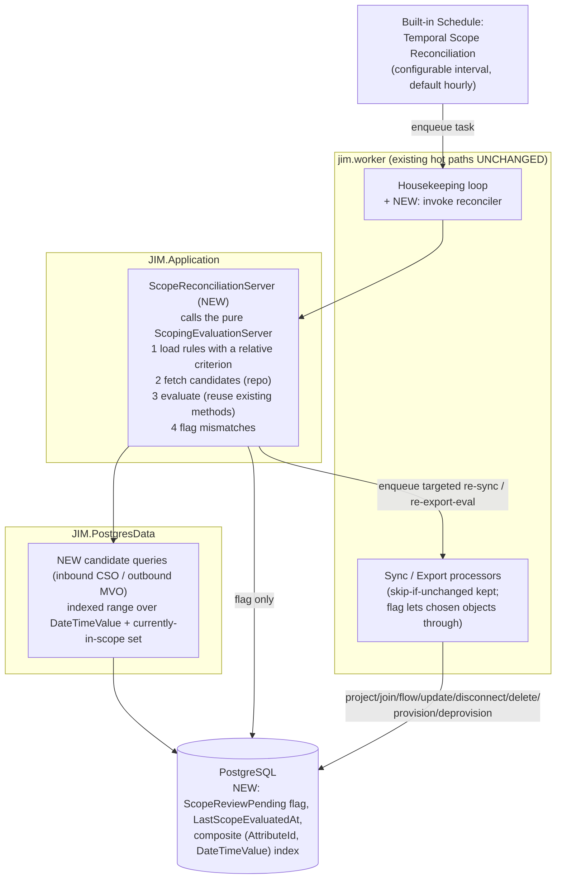
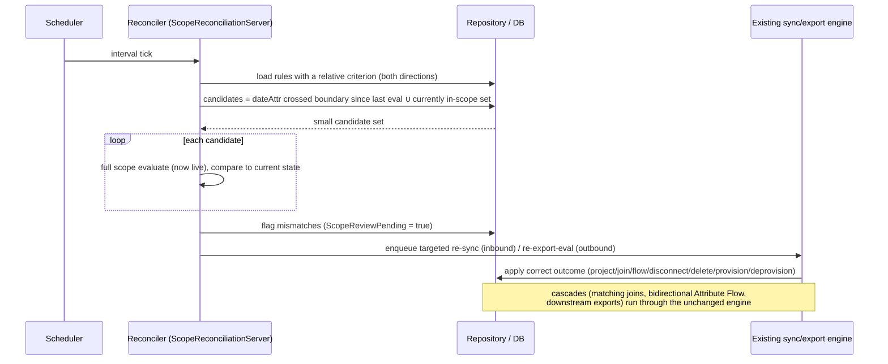

# Temporal Scope Re-evaluation: Implementation Plan

- **Status:** Doing (Phases 1-3 complete; Phase 4a trigger complete + integration-verified; Phase 4c inbound + outbound complete + integration-verified; Phase 5 not started)
- **Issue:** [#892](https://github.com/TetronIO/JIM/issues/892) (sub-task of [#85](https://github.com/TetronIO/JIM/issues/85))
- **PRD:** [`engineering/prd/PRD_RELATIVE_DATE_SEARCH_CRITERIA.md`](../../prd/PRD_RELATIVE_DATE_SEARCH_CRITERIA.md) (#85)
- **Builds on:** [`RELATIVE_DATE_SEARCH_CRITERIA.md`](../RELATIVE_DATE_SEARCH_CRITERIA.md) (the relative-date criteria, evaluator, API, UI)
- **Related:** [#891](https://github.com/TetronIO/JIM/issues/891) (Full Synchronisation watermark-skip review; independent, see Interaction below)

## Overview

PRD #85 added relative ("now ± N units") date criteria to Synchronisation Rule scope filters. The criteria, evaluator, API, PowerShell and UI all work: when an object is evaluated, the relative boundary resolves against the live clock and the in/out decision is correct.

The gap this plan closes is that a time-driven scope transition is **only ever observed when the object is otherwise processed**. Both the inbound (import sync) and outbound (export evaluation) hot paths skip objects that have not changed since the last run, *before* scoping is evaluated. So an object whose source data is static (the normal case: a leaver whose end date was set months ago, a joiner whose start date is fixed in advance) never has its relative-date scope re-evaluated as the clock crosses the boundary. It is silently left in its prior scope state.

This plan adds a scheduled **Temporal Scope Reconciler** that detects time-driven scope transitions for both directions and routes the affected objects back through the existing, unchanged sync/export engine to apply whatever the correct outcome is.

This is the mechanism MIM and similar engines provide as periodic temporal set / membership recalculation. Without it, relative-date scoping cannot deliver date-driven joiner provisioning or leaver deprovisioning on static data, which is its primary purpose.

## Business Value

- **Date-driven deprovisioning.** A leaver falls out of inbound scope when their end date passes and is deprovisioned automatically, with no source-data change and no external automation.
- **Date-driven, staged provisioning.** A joiner's identity can exist in the Metaverse early (so a line manager can prepare access) while a temporal **export** criterion holds downstream provisioning (for example to AD) until their start date is within range. Inbound and outbound temporal scope are independent levers.
- **Set-and-forget policy.** "Accounts expiring within 7 days", "hired in the last 30 days", "contracts ended more than 90 days ago" become live, self-maintaining scopes rather than values that rot the moment they are saved.

## Current State (verified)

- **Inbound skip.** `ProcessActiveConnectedSystemObjectAsync` returns early when `connectedSystemObject.IsUnchangedSinceLastSync` is true, before scoping is evaluated: [`SyncTaskProcessorBase.cs:425-426`](../../../src/JIM.Worker/Processors/SyncTaskProcessorBase.cs#L425). The flag is set from a last-sync watermark: [`ConnectedSystemRepository.cs:1026-1033`](../../../src/JIM.PostgresData/Repositories/ConnectedSystemRepository.cs#L1026). A **full** sync passes that watermark too ([`SyncFullSyncTaskProcessor.cs:137-139`](../../../src/JIM.Worker/Processors/SyncFullSyncTaskProcessor.cs#L137)), so a full sync does **not** rescue the static-object case.
- **Outbound skip.** Export evaluation is driven by changed Metaverse Objects only; `EvaluateExportRulesWithNoNetChangeDetectionAsync` takes the changed MVO plus its changed attributes and checks `IsMvoInScopeForExportRule` per rule: [`ExportEvaluationServer.cs:311-318, 358`](../../../src/JIM.Application/Servers/ExportEvaluationServer.cs#L311). An unchanged MVO is never handed to export evaluation, so a temporal export criterion never re-fires from time alone.
- **The evaluator itself is correct.** `IsCsoInScopeForImportRule` (and the MVO equivalent) resolve "now" live on every call: [`ScopingEvaluationServer.cs:150`](../../../src/JIM.Application/Servers/ScopingEvaluationServer.cs#L150). The problem is purely that the evaluator is never reached for a static object.
- **Empirical proof.** Integration test Scenario 12, step `ReEvaluatedEachRun` ("T4"): identical source data, clock advanced past the boundary, full import + full sync, zero scope changes.

## Design Principles

1. **Scope membership is a step function with a computable transition instant.** "endDate ≥ now" flips exactly when the clock crosses that object's endDate; "startDate ≤ now" flips at startDate. We never need to poll an object to learn it transitioned; we can compute *when* from its own data. Work is therefore O(objects that transition), not O(connector space).
2. **Flag-and-delegate, never bespoke apply.** The reconciler only **selects** the objects whose temporal scope flipped and **flags** them so the engine's unchanged-skip lets them through. It does **not** compute or shortcut the outcome. A temporal scope transition can produce the engine's full outcome set: project, **join to a pre-existing object found by Object Matching Rules**, Attribute Flow (inbound to the Metaverse Object and outbound to other Connected Systems, i.e. bidirectional cascading updates), attribute recall, disconnect, delete, provision, deprovision. Reproducing that in the reconciler would be wrong and unmaintainable; routing through the real engine gets all of it for free.
3. **Leave the hot path untouched.** The inbound sync and outbound export skips stay exactly as they are. The reconciler is a separate, scheduled process; the flag is simply what lets a chosen object past the existing skip. This mirrors the existing housekeeping pattern (grace-period MVO deletion) and the drift-reconciliation model.

## Proposed Architecture

A built-in, interval-driven **Temporal Scope Reconciler** with two symmetric lanes:

- **Inbound lane:** for each enabled import Synchronisation Rule carrying a relative-date scoping criterion, find candidate CSOs whose temporal scope may have flipped, evaluate the full scope (reusing the existing evaluator), and flag mismatches for re-sync.
- **Outbound lane:** the same for export Synchronisation Rules over Metaverse Objects, flagging mismatches for re-export-evaluation.

### Candidate pre-filter (performance)

The date attribute values live in typed columns on the attribute-value tables (`ConnectedSystemObjectAttributeValue.DateTimeValue`, and the Metaverse equivalent). The reconciler pushes a coarse, indexable date predicate into SQL so only objects whose temporal boundary could have crossed since the last evaluation are loaded, then runs the full (possibly compound `All`/`Any`/nested) scope evaluation in memory on that small set. The SQL pre-filter is a **superset-narrowing** filter; correctness comes from the in-memory evaluation, so compound groups that mix date and non-date criteria are handled correctly (a candidate the date predicate admits but a non-date criterion rejects is simply filtered in memory). A per-object `LastScopeEvaluatedAt` watermark bounds each sweep to the slice since it last ran.

## Implementation Phases

Both lanes (inbound and outbound) are delivered in the first implementation, per decision below. Each phase builds and tests green before the next.

### Phase 1: Model and schema ✅
- Added the staging flag and watermark (`ScopeReviewPending`, `LastScopeEvaluatedAt`) to CSO and MVO. Chosen shape: an explicit, auditable `ScopeReviewPending` bool (the recommended option over reusing the unchanged-skip) plus a per-object `LastScopeEvaluatedAt` UTC watermark. Both default to unset (`false` / null); the bool columns are metadata-only adds in PostgreSQL (no table rewrite).
- Added a composite `(AttributeId, DateTimeValue)` partial index (`DateTimeValue IS NOT NULL`) on **both** attribute-value tables, sized for the reconciler's equality-then-range candidate pre-filter. Note: the MVO table already carried a bare `[Index(DateTimeValue)]`; the plan's "none exists today" was inaccurate for MVO. The new composite is the correct shape for `AttributeId = @x AND DateTimeValue IN [lo,hi)` and supersedes the bare index for that access pattern.
- Added a `BuiltIn` bool to `Schedule` (following the established `BuiltIn` convention on `ConnectorDefinition`, `MetaverseAttribute`, `Role`, etc.). Guards (block rename/delete) land in Phase 5.
- EF migration `AddTemporalScopeReconcilerFields` (append-only). Solution builds 0/0; full suite green (1738 passed).

### Phase 2: Candidate queries (repository) ✅
- Inbound: `IConnectedSystemRepository.GetConnectedSystemObjectIdsByDateAttributeRangeAsync(attributeId, afterUtc, throughUtc)` returns the IDs of CSOs whose date attribute value is in `(afterUtc, throughUtc]`.
- Outbound: `IMetaverseRepository.GetMetaverseObjectIdsByDateAttributeRangeAsync(metaverseObjectTypeId, attributeId, afterUtc, throughUtc)` (the object-type filter is required because a Metaverse Attribute is shared across types).
- Raw Npgsql (`SqlQueryRaw<Guid>`), per the worker hot-path SQL convention, served by the Phase 1 composite `(AttributeId, DateTimeValue)` partial index (`DateTimeValue IS NOT NULL` also excludes asserted-null markers). Both build 0/0; full suite green.
- **Deviation from the drafted signature.** The drafted `GetInboundTemporalScopeCandidatesAsync(rule, sinceUtc, nowUtc)` pushed relative-date criterion semantics (offset resolution, direction) into the repository, breaking layering. The shipped methods are thin, watermark-agnostic date-range selectors that return IDs; the reconciler (Phase 3) owns the boundary math (shifting the window by each criterion's offset via `RelativeDateResolver`), the multi-criterion union, loading the objects, and the in-memory decision. This keeps the testable temporal logic in the application layer and the repository a pure indexed query.
- **The `∪ currently-in-scope set` is not a separate query.** See the resolved candidate-set-precision decision below: the transition window mathematically contains every object whose truth-value for a criterion flipped in `(afterUtc, throughUtc]`, so a separate "rescan all in-scope objects" union is unnecessary. Bootstrap (null `afterUtc`) opens the lower bound so the first sweep catches all already-transitioned objects.

### Phase 3: Reconciler (new `ScopeReconciliationServer`) ✅
- Shipped `ScopeReconciliationServer.ReconcileAsync(afterUtc, nowUtc)` (exposed as `JimApplication.ScopeReconciliation`), calling the pure `ScopingEvaluationServer`. Window math is `RelativeDateScopeWindow.Resolve` (a new pure helper beside `RelativeDateResolver`): the candidate value window is `(B(afterUtc), B(nowUtc)]`, resolving the boundary at both instants so whole-day rounding falls out correctly (empty window between midnights). Unit-tested (window math, and the criterion-enumeration traversal / direction-based attribute resolution / absolute-and-incomplete skipping).
- Supporting repository work: added the missing `ConnectedSystemAttribute` `ThenInclude` to `GetSyncRulesAsync` (a latent gap: inbound criteria's attribute nav was never hydrated); added `GetMetaverseObjectsByIdsNoTrackingAsync` (batch MVO load with attribute values for in-memory evaluation); added `MarkConnectedSystemObjectsScopeEvaluatedAsync` / `MarkMetaverseObjectsScopeEvaluatedAsync` (one raw-SQL bulk UPDATE per lane that advances `LastScopeEvaluatedAt` for the evaluated set and sets `ScopeReviewPending` true for flagged / false for the rest, so a stale flag self-clears).
- Per-object watermark `LastScopeEvaluatedAt` is set for observability; the sweep's lower bound (`afterUtc`) is a parameter, wired to a global watermark in Phase 4. A misconfigured rule (evaluator throws `InvalidOperationException`) is logged and skipped without aborting the sweep. End-to-end flag-and-delegate is integration-tested in Phase 6 (raw-SQL candidate query + bulk flag write bypass the unit mock harness, matching the Phase 2 convention).
- **Home revised (supersedes the earlier "ScopingEvaluationServer partial" decision).** Discovery during implementation: `ScopingEvaluationServer` is a deliberately pure, dependency-free evaluator (parameterless constructor, no repository) that is cheaply `new`-ed inside the sync and export hot paths (`SyncServer`, `ExportEvaluationServer`). The reconciler needs the opposite (repository access to fetch candidates, load objects, write the `ScopeReviewPending` flag), so bolting persistence onto the pure evaluator would harm it. Resolution (user-approved): a new `ScopeReconciliationServer(JimApplication)` that **calls** the pure evaluator's public `IsCsoInScopeForImportRule` / `IsMvoInScopeForExportRule`, keeping the evaluator stateless. Exposed as `JimApplication.ScopeReconciliation`.
- Load enabled Synchronisation Rules carrying a relative-date scoping criterion (both directions). `GetSyncRulesAsync` currently `.Include`s only `MetaverseAttribute` on criteria; add the `ConnectedSystemAttribute` `ThenInclude` so inbound criteria hydrate.
- For each such rule and each relative-date criterion, compute the shifted candidate window and call the Phase 2 range query; union the candidate IDs.
- Load the candidates and evaluate full scope in memory (reuse the evaluator). Flag a mismatch when fresh scope disagrees with the stored connection signal: inbound `cso.MetaverseObjectId != null`; outbound `GetConnectedSystemObjectByMetaverseObjectIdAsync(mvo.Id, rule.ConnectedSystemId) != null` (the export evaluator's own deprovision check). Set `ScopeReviewPending = true` and advance `LastScopeEvaluatedAt` on evaluated objects.
- Pure selection and flagging; no mutation of join state or exports (flag-and-delegate).
- Reconciler methods take `afterUtc`/`nowUtc` parameters for testability; the watermark source (a global "last reconciled at" that survives downtime) is wired in Phase 4.

### Phase 4a: Trigger (schedule + worker plumbing) ✅
- New `ScheduleStepType.TemporalScopeReconciliation` and a `TemporalScopeReconciliationWorkerTask` (WorkerTask TPH subclass, no per-instance columns; the migration is an empty schema change that just registers the discriminator value). `TaskingRepository`/`TaskingServer` create the task with a system-targeted Activity (`ActivityTargetType.TemporalScopeReconciliation`).
- `SchedulerServer.QueueStepAsync` queues the task for a reconciliation step; `Worker.cs` dispatches it to `ScopeReconciliation.ReconcileAsync(afterUtc, nowUtc)` and completes/fails the Activity.
- Built-in "Temporal Scope Reconciliation" Schedule seeded (`BuiltIn`, enabled, hourly cron `0 * * * *`) via `SeedingServer.SeedBuiltInSchedulesAsync`, called from `InitialiseDatabaseAsync`; idempotent (keyed on a built-in schedule owning a reconciliation step).
- **Watermark: failure-safe (resolved).** `afterUtc` is the `StartedAt` of the previous **successfully completed** execution of the built-in schedule (`GetLastCompletedScheduleExecutionAsync`), not `Schedule.LastRunTime`. `LastRunTime` advances at trigger time regardless of outcome, so reusing it would let a failed sweep advance the watermark and silently skip that window for objects with static source data (the exact case this feature exists to catch). A failed sweep never reaches `Completed`, so its window is re-covered by the next sweep. Null (bootstrap) before any prior completion.

### Phase 4c: Apply (honour the flag in the engine)
- **Decision: flag now, honour flag in engine.** The reconciler only sets `ScopeReviewPending`; the existing engine applies the real outcome (flag-and-delegate).

**Inbound ✅ (committed).** The CSO page loader (`ConnectedSystemRepository.GetConnectedSystemObjectsAsync`) treats a `ScopeReviewPending` CSO as changed so its attribute/reference values load (without this, Pass 2 Attribute Flow runs on an empty attribute set); Pass 2 (`SyncTaskProcessorBase.ProcessActiveConnectedSystemObjectAsync`) no longer skips a flagged-but-unchanged CSO; the flag is cleared in a batched UPDATE at page flush, only after the page's substantive writes persist and only for CSOs re-evaluated without error (fail-safe). New `ClearConnectedSystemObjectScopeReviewPendingAsync` on the CSO repo, exposed via `ISyncRepository`.

**Outbound ✅ implemented (commit `aa75402e`) + integration-verified (Scenario 13).** Driver: **fold into the shared sync base** (both Full and Delta), honoured on the next sync of a system. `ProcessScopeReviewPendingMetaverseObjectsAsync` runs after the CSO page loop: drains `ScopeReviewPending` MVOs in batches, gives each an RPEI (linked via `_mvoIdToRpei`), feeds them to the existing export path via `_pendingExportEvaluations` with **empty `changedAttributes`** (confirmed correct against `CreateAttributeValueChanges`: falls back to the MVO's current values for a Create/provision, Update-with-no-change yields no Pending Export, out-of-scope deprovision is scope-driven), reuses the per-page flush sequence (`EvaluatePendingExportsAsync` → `FlushPendingExportOperationsAsync` → `ResolvePendingExportReferenceSnapshotsAsync` → `FlushRpeisAsync` → `ClearChangeTracker`), then clears the flag. AsNoTracking MVOs are safe: provisioning CSOs reference the MVO by FK scalar only and persist via raw SQL. Whichever system's sync runs first handles its own export rules; a still-mismatched MVO is re-flagged by the next reconciler sweep (eventually consistent; single-system case has no ping-pong). Repo methods `GetMetaverseObjectIdsWithScopeReviewPendingAsync` / `ClearMetaverseObjectScopeReviewPendingAsync` (exposed via `ISyncRepository`), MVO loader now includes `Type`, and a partial index `IX_MetaverseObjects_ScopeReviewPending` keeps the flagged-MVO scan O(transitions).
  - **Known limitation:** flagged MVOs load scalar + Type attributes (no `ReferenceValue`, since an AsNoTracking self-referencing Include is forbidden); reference-attribute export flow for reconciler-driven MVOs is not yet covered.

**Verification status:** Phase 4a + inbound 4c are integration-verified by Scenario 12 T4 (real stack, clean reset + rebuild): the reconciler schedule runs to Completed and a subsequent sync disconnects a now-out-of-scope object with no data change. Outbound 4c is integration-verified by Scenario 13 (real stack, clean reset + rebuild): an export rule scoped on a Metaverse relative date holds a joiner's downstream provisioning, a plain sync after the boundary provisions nothing (the hot path misses the static-data transition), and after the reconciler flags the Metaverse Object the next sync provisions it downstream, all with no Metaverse Object data change. The control object is untouched throughout.

### Phase 5: API / UI (built-in protection)
- Allow enable/disable and interval change on the built-in Schedule; block rename and delete (BuiltIn guard in the application layer and UI).

### Phase 6: Tests
- Unit: candidate selection (range + currently-in-scope union), mismatch detection, watermark advance, compound-group correctness, flag-and-delegate (assert the engine, not the reconciler, produces project/join/update/disconnect/delete).
- Integration: Scenario 12 `ReEvaluatedEachRun` (T4) covers the inbound lane; Scenario 13 (`Relative-Date Outbound Scoping`) covers the outbound lane (temporal export criterion provisions on schedule with no MVO data change, with a negative control proving the hot path alone misses the transition). Both use the cache-bypassed, now-relative test path.

## Decisions (resolved)

- **A full sync does not save us (Q1).** Both inbound and outbound skip unchanged objects before scoping; a scheduled reconciler is required regardless of run-profile type. The separate "should full sync reprocess everything as a fail-safe" question is tracked in #891 and does not block this work.
- **Home:** a new `ScopeReconciliationServer` that calls the pure `ScopingEvaluationServer` (revised from the earlier "ScopingEvaluationServer partial" plan; see the Phase 3 note for why the pure evaluator is kept dependency-free).
- **Flag-and-delegate**, not a bespoke provision/deprovision action: required so matching-rule joins to pre-existing objects and bidirectional Attribute Flow cascades are handled by the proven engine.
- **Both lanes in the first implementation** (inbound CSO import scope and outbound MVO export scope).
- **Cadence configurable** via the built-in Schedule interval; default conservative (hourly), can be lowered to single-digit minutes for parity with traditional temporal-recalculation engines. **Hours-granularity criteria are retained** (the staged-provisioning use case needs sub-day precision).
- **Built-in Schedule:** admins may enable/disable and change interval, but not rename or delete.
- **Candidate pre-filter + new composite `(AttributeId, DateTimeValue)` partial index** (on both attribute-value tables) to keep cost O(transitions).

## Open Decisions (resolve during implementation)

- **Staging mechanism (RESOLVED, Phase 1):** explicit `ScopeReviewPending` flag on CSO/MVO (auditable), over reusing the unchanged-skip by bumping `LastUpdated`. Shipped.
- **Candidate-set precision (RESOLVED, Phase 2):** the **transition-window range query**. A relative criterion resolves its boundary as `B(t) = now(t) + signedOffset`; the comparison's truth-value flips for an object exactly when `now` crosses `value − signedOffset`, so every object whose value flips in `(afterUtc, throughUtc]` has its date value in `(afterUtc + signedOffset, throughUtc + signedOffset]`. The reconciler shifts the window by each criterion's `signedOffset` and issues one indexed range query per relative-date criterion, unioning the IDs. This is the "exact date-range delta" option (O(transitions) via the composite index), not the "rescan all in-scope" baseline. Over-inclusion is harmless because the in-memory full evaluation is the final gate; under-inclusion is prevented by the window identity above. Bootstrap uses a null lower bound (open window) so the first sweep catches all already-transitioned objects.
- **Apply step (RESOLVED, Phase 4a; implemented Phase 4c):** flag-and-delegate. The reconciler only sets `ScopeReviewPending`; the engine's existing hot-path skips are taught to let flagged objects through on the next scheduled sync/export, rather than the reconciler enqueuing a bespoke targeted re-sync. Keeps all project/join/Attribute Flow/deprovision behaviour in the proven engine.
- **Watermark placement (RESOLVED, Phase 4a):** a per-schedule watermark derived from execution history: the previous **successfully completed** execution's `StartedAt`. Chosen over reusing `Schedule.LastRunTime` (which advances on every trigger regardless of outcome and would skip a failed sweep's window) and over a dedicated watermark column (no new column or scheduler threading needed). The per-object `LastScopeEvaluatedAt` column remains for observability.
- **Interval configuration surface (RESOLVED, Phase 4a):** Schedule interval only (seeded hourly, admin-adjustable). No separate Service Setting for a default/floor; the Schedule is the single source of cadence.

## Risks and Mitigations

- **Performance at scale.** Mitigated by the indexed pre-filter (O(transitions)), batch caps, and reuse of the housekeeping batching pattern. No change to the sync/export hot paths.
- **Compound-group correctness.** The SQL pre-filter is a superset; the in-memory full evaluation makes the final decision, so mixed date / non-date `All`/`Any`/nested groups are correct.
- **Concurrency with an in-flight sync.** The reconciler only flags and enqueues; it never mutates join/export state directly, so it is idempotent and safe to overlap. Flags are cleared when the object is processed.
- **Interaction with #891.** Independent. If full sync is later restored to reprocess everything, the reconciler is still wanted for timeliness (it can run far more frequently than a full sync, and only touches transitioning objects).
- **Time and rounding.** All UTC; Days and coarser units round to midnight UTC, Hours is exact (already implemented in `RelativeDateResolver` and unit-tested).

## Success Criteria

- Scenario 12 `ReEvaluatedEachRun` (T4) passes: a static object falls out of (and into) scope purely because the clock advanced, and is deprovisioned / provisioned accordingly.
- An outbound temporal export criterion provisions a downstream object on schedule with no Metaverse Object data change.
- No measurable regression on the sync/export hot path (the skip is unchanged; the reconciler runs out of band).
- The built-in Schedule is interval-editable and enable/disable-able, but protected from rename and delete.
